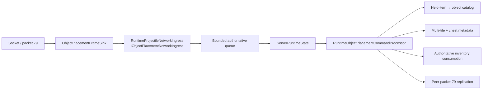
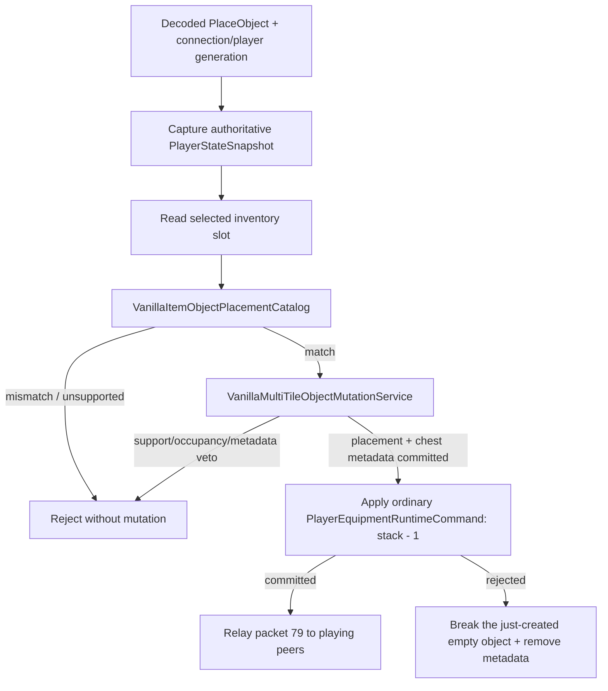

# Authoritative object placement

The packet-79 gameplay boundary is intentionally sparse. The first production transaction admits only the ordinary vanilla Chest item and the base `Containers` object. This prevents the client from turning a valid held item into an arbitrary tile/style claim.

## First admitted mapping

| Held item | Item id | Object tile | Tile id | Style | Alternate |
| --- | ---: | --- | ---: | ---: | ---: |
| Chest | 48 | Containers | 21 | 0 | 0 |

Other container styles, `Containers2`, dressers and alternate placement variants remain unsupported until their source contracts are pinned independently. Packet random/direction fields remain wire state for this slice; they cannot override the verified held-item → tile/style/alternate identity.

## Production ownership

Production keeps one gameplay ingress object for projectile, packet-17 tile and packet-79 object traffic. `ProjectileLifecycleFrameSink` composes the tile and object sinks underneath the existing chest/sign chain, so the host does not need a second command queue or a parallel connection lifecycle.

The exact loaded `WorldTileStore` is associated with its runtime chest metadata lifecycle through a weak-key runtime composition registry. Persistence creates that binding before `ServerRuntimeState` is constructed. The registry does not define a process-global current world and does not keep an otherwise dead world alive.

## Transaction

The multi-tile service owns the 2×2 geometry, placement origin, support checks, frame cells and chest metadata lifecycle. For `Containers`, packet coordinates are passed as the vanilla placement origin. The object catalog resolves that origin to the normalized top-left chest metadata anchor.

Item consumption is not performed by editing an independent shadow inventory. The processor creates the normalized packet-5-style equipment state and routes it through the ordinary authoritative `ServerRuntimeState` equipment path. This preserves player revisioning, generation checks, inventory normalization and equipment replication.

If that equipment commit does not materialize exactly the expected remaining stack, the newly created chest is still empty and unopened, so the same multi-tile lifecycle removes its metadata and all four cells before the command returns. A rollback failure is an invariant violation and faults rather than silently minting an object.

## Replication

Only a committed placement is encoded back as packet 79. The originating connection is excluded; playing peers receive the accepted request after the authoritative world and inventory transaction succeeds. Failed support checks, item mismatches and rollback paths produce no peer placement frame.

## Remaining scope

Production composition is now connected for the verified base Chest slice. Broader D5 parity still requires independently pinned item/style mappings, alternate placement origins, furniture/sign support rules, liquid rules, tile-entity metadata adapters, object-specific drops and secondary effects. Those remain fail-closed rather than being inferred from visual similarity.
