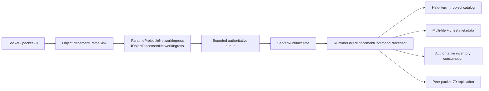
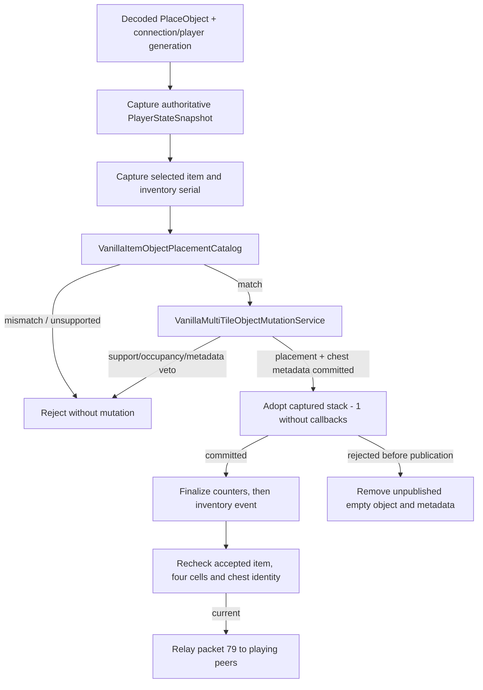

# Authoritative object placement

The packet-79 gameplay boundary is intentionally sparse. The first production transaction admits only the ordinary vanilla Chest item and the base `Containers` object. This prevents the client from turning a valid held item into an arbitrary tile/style claim.

## First admitted mapping

| Held item | Item id | Object tile | Tile id | Style | Alternate |
| --- | ---: | --- | ---: | ---: | ---: |
| Chest | 48 | Containers | 21 | 0 | 0 |

Other container styles, `Containers2`, dressers and alternate placement variants remain unsupported until their source contracts are pinned independently. Packet random/direction fields remain wire state for this slice; they cannot override the verified held-item → tile/style/alternate identity.

## Production ownership

```mermaid
flowchart LR
    Socket["Socket / packet 79"] --> Sink["ObjectPlacementFrameSink"]
    Sink --> Ingress["RuntimeProjectileNetworkIngress\nIObjectPlacementNetworkIngress"]
    Ingress --> Queue["Bounded authoritative queue"]
    Queue --> State["ServerRuntimeState"]
    State --> Processor["RuntimeObjectPlacementCommandProcessor"]
    Processor --> Catalog["Held-item → object catalog"]
    Processor --> World["Multi-tile + chest metadata"]
    Processor --> Inventory["Authoritative inventory consumption"]
    Processor --> Relay["Peer packet-79 replication"]
```

Production keeps one gameplay ingress object for projectile, packet-17 tile and packet-79 object traffic. `ProjectileLifecycleFrameSink` composes the tile and object sinks underneath the existing chest/sign chain, so the host does not need a second command queue or a parallel connection lifecycle.

The exact loaded `WorldTileStore` is associated with its runtime chest metadata lifecycle through a weak-key runtime composition registry. Persistence creates that binding before `ServerRuntimeState` is constructed. The registry does not define a process-global current world and does not keep an otherwise dead world alive.

## Transaction

```mermaid
flowchart TD
    Request["Decoded PlaceObject + connection/player generation"] --> Player["Capture authoritative PlayerStateSnapshot"]
    Player --> Item["Capture selected item and inventory serial"]
    Item --> Catalog["VanillaItemObjectPlacementCatalog"]
    Catalog -->|match| World["VanillaMultiTileObjectMutationService"]
    Catalog -->|mismatch / unsupported| Reject["Reject without mutation"]
    World -->|placement + chest metadata committed| Consume["Adopt captured stack - 1 without callbacks"]
    World -->|support/occupancy/metadata veto| Reject
    Consume -->|committed| Publish["Finalize counters, then inventory event"]
    Consume -->|rejected before publication| Rollback["Remove unpublished empty object and metadata"]
    Publish --> Current["Recheck accepted item, four cells and chest identity"]
    Current -->|current| Relay["Relay packet 79 to playing peers"]
```

The multi-tile service owns the 2×2 geometry, placement origin, support checks, frame cells and chest metadata lifecycle. For `Containers`, packet coordinates are passed as the vanilla placement origin. The object catalog resolves that origin to the normalized top-left chest metadata anchor.

The existing `PlayerAuthority` inventory owner prepares one captured canonical write before world placement. Its token retains exact connection/member, player snapshot, item phase, input revision, full inventory serial and old item. Saturated stamps and the last unusable inventory serial refuse before mutation. Adoption uses the existing atomic inventory store without callbacks. World geometry, chest metadata, inventory, accepted result and counters are ready before the first inventory event; internal consumption does not invent another incoming equipment report.

An adoption failure can remove the unpublished empty object and metadata before any inventory event. Rollback failure faults. Once published, the accepted operation is never rolled back because an observer changed stock, world or membership. A throwing observer leaves all adopted owners and accepted accounting intact. Ordinary equipment reports and default packet-17 placement keep their existing separate contracts.

Temple Key uses the same captured inventory boundary: the first ordinary key in slots `0..57` is consumed and all three source door rows gain `54` before publication. The mouse slot is excluded and the last key becomes canonical empty. The established `52`/tile-square sequence runs only while the accepted occupation, stock and complete door footprint remain current.

## Replication

Only a current committed placement is encoded back as packet 79. The originating connection is excluded. After inventory publication, exact accepted stock, all four cells and the runtime chest object identity are checked again; removal/recreation at the same coordinates cannot authorize an old frame. A custom metadata lifecycle without that identity proof can commit locally but does not authorize this delayed relay. Failed support checks, stale connections, item mismatches and pre-publication rollback produce no peer placement frame.

## Remaining scope

Production composition is now connected for the verified base Chest slice. Broader D5 parity still requires independently pinned item/style mappings, alternate placement origins, furniture/sign support rules, liquid rules, tile-entity metadata adapters, object-specific drops and secondary effects. Those remain fail-closed rather than being inferred from visual similarity.
