# Packet 79 object-placement boundary

TerraRuntime has a typed protocol-326 boundary for Terraria `PlaceObject` message 79 and now connects that boundary to the verified base-Chest authoritative transaction. The codec remains protocol-only; gameplay authorization stays above it.

## Wire layout

The protocol-326 payload is fixed at

$$
S_{79}=2+2+2+2+1+1+1=11\ \mathrm{bytes}.
$$

The fields are, in order: signed 16-bit tile X, tile Y, tile type and style; unsigned 8-bit alternate; signed 8-bit random selector; and a one-byte boolean direction flag. With Terraria's two-byte frame length and one-byte message id, a complete packet-79 frame is therefore 14 bytes.

`TerrariaPlaceObjectCodec` accepts only an exact 11-byte payload and rejects direction bytes other than `0` or `1`. It does not decide whether a tile type, style, alternate, position, or inventory item is legal. Those are authoritative gameplay decisions.

## Production ownership boundary

```mermaid
flowchart LR
    Socket["Socket / framed message"] --> Projectile["ProjectileLifecycleFrameSink"]
    Projectile --> Object["ObjectPlacementFrameSink"]
    Object --> Codec["TerrariaPlaceObjectCodec"]
    Codec --> Session["Playing-session identity"]
    Session --> Ingress["RuntimeProjectileNetworkIngress"]
    Ingress --> Queue["Bounded authoritative command queue"]
    Queue --> State["ServerRuntimeState"]
    State --> Gameplay["RuntimeObjectPlacementCommandProcessor"]
```

`ObjectPlacementFrameSink` refuses packet 79 before the player reaches `Playing`, stops on malformed payloads, and treats a full game ingress as backpressure. `RuntimeProjectileNetworkIngress` implements the object-placement ingress contract alongside its existing projectile and packet-17 responsibilities, so all three paths share the same bounded command ownership. The socket thread never mutates `WorldTileStore`, chest metadata, or inventory.

The first gameplay mapping is Chest item `48` to `Containers` tile `21`, style `0`, alternate `0`. The packet random/direction fields are preserved but cannot override that item/object identity. The authoritative thread resolves the player's selected inventory slot, validates the mapping, commits the 2×2 object plus chest metadata, consumes one item, then replicates packet 79 to peers. Any failed inventory commit rolls the fresh empty object back.

## Abuse budget

The built-in hard-abuse profile applies a one-second packet-79 ceiling of 240 frames and 32 KiB. This limit is intentionally above ordinary building cadence; it is an emergency flood ceiling rather than a gameplay rate rule.

## Evidence boundary

The field layout is cross-checked against an independent Terraria protocol implementation and the public `NetMessage.SendObjectPlacement` / `WorldGen.PlaceObject` API shape. Broader object/item semantics remain fail-closed until independently pinned for TerrariaServer 1.4.5.8.

## Current limitation

Production packet-79 composition is enabled only for the verified base Chest slice. Other object families, styles, alternates, exact furniture support rules and tile-entity/sign metadata remain separate parity work.
