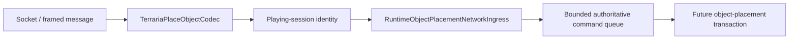

# Packet 79 object-placement boundary

TerraRuntime now has a typed, protocol-only boundary for Terraria `PlaceObject` message 79. This page deliberately describes the wire and ingress contract only. Production host composition and gameplay authorization are separate steps and are not implied by the existence of the codec.

## Wire layout

The protocol-326 payload is fixed at

$$
S_{79}=2+2+2+2+1+1+1=11\ \mathrm{bytes}.
$$

The fields are, in order: signed 16-bit tile X, tile Y, tile type and style; unsigned 8-bit alternate; signed 8-bit random selector; and a one-byte boolean direction flag. With Terraria's two-byte frame length and one-byte message id, a complete packet-79 frame is therefore 14 bytes.

`TerrariaPlaceObjectCodec` accepts only an exact 11-byte payload and rejects direction bytes other than `0` or `1`. It does not decide whether a tile type, style, alternate, position, or inventory item is legal. Those are gameplay decisions.

## Ownership boundary

`ObjectPlacementFrameSink` refuses packet 79 before the player reaches `Playing`, stops on malformed payloads, and treats a full game ingress as backpressure. The socket thread never mutates `WorldTileStore`, chest metadata, or inventory.

## Abuse budget

The built-in hard-abuse profile applies a one-second packet-79 ceiling of 240 frames and 32 KiB. This limit is intentionally above ordinary building cadence; it is an emergency flood ceiling rather than a gameplay rate rule.

## Evidence boundary

The field layout is cross-checked against an independent Terraria protocol implementation and the public `NetMessage.SendObjectPlacement` / `WorldGen.PlaceObject` API shape. TerraRuntime still keeps gameplay decisions fail-closed until the corresponding Terraria 1.4.5.8 object and item semantics are pinned separately.

## Current limitation

This slice is intentionally **not wired into the production connection sink chain yet**. That avoids accepting packet 79 before an authoritative item-to-object transaction exists. The next slice binds the decoded request to selected-item inventory authority, multi-tile mutation, chest metadata, item consumption, and peer replication.
