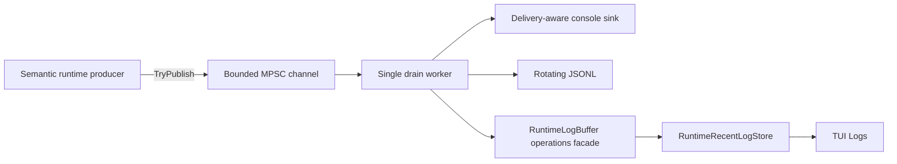

# Observability and structured runtime logging

[Русский](../ru/observability-logging.md) · [Documentation](README.md) · [Operations/TUI](operations-tui.md) · [Logging roadmap](../roadmap/runtime-logging-pipeline.md)

TerraRuntime has completed logging roadmap **L0-L3**. Live host logging is runtime-owned, bounded, non-blocking for producers, semantically identified, NativeAOT-safe, and explicitly drained by the server-host lifecycle.

## Architecture

`RuntimeLogRecord.EventId` says **what happened**. A private delivery hint says whether the host console sink should buffer the accepted record, write stdout, or write stderr. Structured sinks never infer semantics from console routing.

## Producer and queue bounds

Producer code normalizes bounded scalar text/context, assigns sequence/timestamp data, and uses `ChannelWriter.TryWrite`. Console I/O, disk I/O, JSON serialization, flush, rotation, retention and recent-store updates run on the background drain worker.

For queue capacity \(N_q\) and warning/error reserve \(N_r\), ordinary traffic may occupy at most

\[
N_{normal}=N_q-N_r.
\]

Defaults are \(N_q=2048\) and \(N_r=256\). Saturation drops instead of blocking and increments per-level counters.

## Stable event identity

| Range | Category |
| ---: | --- |
| `1000-1999` | Lifecycle |
| `2000-2999` | Network |
| `3000-3999` | Protocol |
| `4000-4999` | World |
| `5000-5999` | Persistence |
| `6000-6999` | Plugin/host integration |
| `7000-7999` | Gameplay |
| `8000-8999` | Operations |
| `9000-9999` | Security |

Stable IDs are never recycled for unrelated meanings. Operations IDs `8000-8002` belonged to the transitional L3 delivery bridge and are permanently retired. `8003` is `OperationsTerminalUiFailed`; `8004` is `OperationsReadModelMessage` for direct local operations-read-model publication.

The runtime does not allocate fake protocol/gameplay/security events merely to fill ranges. IDs are added when real semantic events exist.

## RuntimeHostLog

`RuntimeHostLog` exposes one production-facing producer method: `Log(...)`. The old `Write(...)` and `Publish(...)` compatibility APIs were removed after repository-wide search confirmed no production callers remained.

TUI activation only affects delivery routing. While the TUI owns the terminal, semantic events remain accepted by structured sinks and the recent store but compatibility console output is buffered. Once the TUI is inactive, new events may again route to stdout/stderr according to the caller's delivery intent.

The logger attaches run-scoped correlation by default, world ID after world load, and connection/player context where those verified identifiers exist. Mutable runtime objects and raw packet payloads are never retained as context.

`TerrariaServerHost.RunAsync` owns the logger with `await using`, so startup failures, early returns, normal shutdown and listener failures all execute bounded drain/disposal. A process-exit handler remains only as a final fallback.

## Recent logs and TUI

There is one retained structured store. `RuntimeLogBuffer` remains the compact `ILogOperations` facade consumed by the local TUI, but it is itself an `IRuntimeLogSink` backed by `RuntimeRecentLogStore`; it no longer owns a second ring.

Default retained capacity is \(512\) records and the hard maximum is \(8192\). The TUI projection preserves its existing source/message bounds and operations-level mapping while the underlying structured record retains event/category/context fields.

## Production configuration

Invalid or out-of-range environment values fall back to safe defaults, and the priority reserve is normalized so

\[
1\le N_r<N_q.
\]

| Variable | Default | Meaning |
| --- | --- | --- |
| `TERRARUNTIME_LOG_LEVEL` | `Debug` | minimum accepted level |
| `TERRARUNTIME_LOG_QUEUE_CAPACITY` | `2048` | bounded queue capacity |
| `TERRARUNTIME_LOG_PRIORITY_RESERVE` | `256` | Warning+ reserve |
| `TERRARUNTIME_LOG_CONSOLE` | `true` | compatibility console sink |
| `TERRARUNTIME_LOG_JSONL` | `true` | rotating JSONL sink |
| `TERRARUNTIME_LOG_DIRECTORY` | `<app>/logs` | JSONL directory |
| `TERRARUNTIME_LOG_MAX_FILE_BYTES` | `16777216` | \(16\,\mathrm{MiB}\) rotation threshold |
| `TERRARUNTIME_LOG_RETAINED_FILES` | `8` | retained files |
| `TERRARUNTIME_LOG_FLUSH_RECORDS` | `64` | periodic flush interval |
| `TERRARUNTIME_LOG_SINK_TIMEOUT_MS` | `2000` | per-sink deadline |
| `TERRARUNTIME_LOG_SHUTDOWN_TIMEOUT_MS` | `5000` | bounded shutdown drain |

Unit-test composition disables JSONL unless explicitly supplied, avoiding filesystem side effects.

## Sink isolation and NativeAOT

A repeatedly failing sink is quarantined without stopping healthy sinks. Pipeline metrics include accepted/filtered records, per-level drops, drained count, sink failures, queue depth and high-water mark.

JSONL serialization uses explicit `Utf8JsonWriter`; the logging graph has no reflection-driven serializer discovery, runtime code generation, or dynamic schema construction.

## Sensitive data

Do not log passwords, authentication tokens, private keys, secrets, raw packet bodies or arbitrary object dumps. Prefer opaque handles and detached identifiers. Length/control-character normalization is not secret redaction.

## Next milestone

Logging L3 is closed. The next roadmap stage is L4: export pipeline/recent-store health to operator metrics, expose structured sink health, add deterministic filters by level/category/event/subsystem/correlation, and add sustained overload/slow-sink/disk-failure quality gates.
