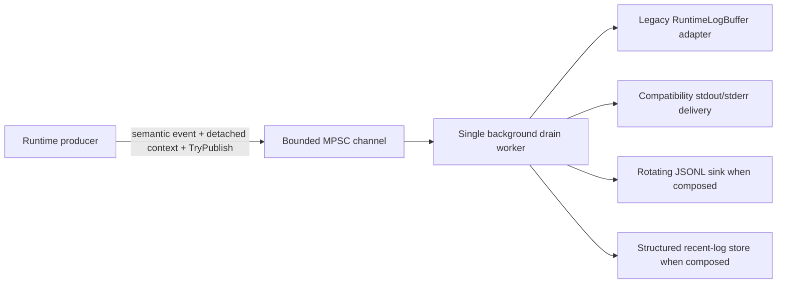

# Observability and structured runtime logging

[Русский](../ru/observability-logging.md) · [Documentation](README.md) · [Operations/TUI](operations-tui.md) · [Logging roadmap](../roadmap/runtime-logging-pipeline.md)

TerraRuntime has the **L0-L2 structured logging foundation** and a substantially adopted L3 live-host path. Startup, world loading/cache/recovery, persistence, listener/connection lifecycle, trusted host-module lifecycle, shutdown failures, and TUI failures now enter the bounded structured pipeline with semantic event IDs. The normal `TerrariaServerHost.RunAsync` lifetime explicitly disposes and drains the logger on every return path.

## Architecture

Semantic identity and local console delivery are deliberately separate. `RuntimeLogRecord.EventId` describes **what happened**. A host-local delivery hint travels beside the record inside the private pipeline envelope and tells only delivery-aware sinks whether the accepted event should be buffered, written to stdout, or written to stderr. Ordinary structured sinks receive only `RuntimeLogRecord` and therefore cannot accidentally treat console routing as event semantics.

The delivery hint is captured before enqueue, so a later TUI state transition cannot retroactively reroute an already accepted event.

## Producer bound

The producer path normalizes bounded scalar text/context, assigns sequence/timestamp data, and calls `ChannelWriter.TryWrite`. Disk I/O, console I/O, JSON encoding, flushing, rotation, retention, and sink failure handling happen outside the authoritative producer path.

With queue capacity \(N_q\) and warning/error reserve \(N_r\), normal records may occupy at most

\[
N_{normal}=N_q-N_r.
\]

The defaults remain \(N_q=2048\) and \(N_r=256\). `Warning`, `Error`, and `Critical` records may use the reserved capacity. Saturation rejects records instead of waiting and increments per-level drop counters.

## Stable record contract

`TerraRuntime.Contracts.Diagnostics.RuntimeLogRecord` contains sequence, UTC timestamp, severity, stable event ID, category, subsystem, bounded message text, detached correlation context, and bounded exception type/message fields. Context is scalar-only: logging does not retain mutable runtime entities or raw packet payloads.

### Event ID allocation

| Range | Category |
| ---: | --- |
| `1000-1999` | Lifecycle |
| `2000-2999` | Network |
| `3000-3999` | Protocol |
| `4000-4999` | World |
| `5000-5999` | Persistence |
| `6000-6999` | Plugin |
| `7000-7999` | Gameplay |
| `8000-8999` | Operations |
| `9000-9999` | Security |

The legacy bridge still reserves `8000-8002` for old `RuntimeHostLog.Write`/`Publish` callers. New live-host call sites no longer use those IDs. They use final category-specific IDs for lifecycle, network, world, persistence, plugin/host integration, and operations events. `8003` is the semantic terminal-UI failure event.

Protocol, gameplay, and security IDs are allocated only when those semantic call-site families are migrated; the runtime does not fabricate events merely to fill ranges.

## Live-host context

`RuntimeHostLog` adds a run-scoped correlation identifier to semantic events unless a narrower caller correlation is supplied. After a world is loaded, it also attaches the stable world ID. Connection lifecycle events use one connection-scoped correlation ID plus `ConnectionId`; when an authoritative player handle is available for a disconnect failure it is added as `PlayerHandle`.

Entity and packet context remain fields of the same detached contract, but they are populated only by call sites that actually own verified entity/packet identifiers. No raw packet payload or mutable runtime object is retained.

## RuntimeHostLog adoption

The following families in `TerrariaServerHost` are now structured and no longer call `Console.WriteLine`, `Console.Error.WriteLine`, or `RuntimeLogBuffer.Publish` directly:

- abandoned-save cleanup and save-template preparation;
- world source stat/read/load, runtime cache hit/miss/rebuild, checkpoint recovery, and bootstrap cache preparation;
- startup profile and listener-ready/failure events;
- trusted host-module attach/detach failures;
- connection accept/stop/failure and shutdown faults;
- TUI startup/runtime failures;
- authoritative command-drain/game-loop shutdown deadlines;
- final canonical world-save success/failure and runtime-cache invalidation failures.

`Console.CancelKeyPress` remains a control/lifecycle signal rather than a logging call and is intentionally unchanged. `TerminalUiHost` still owns interactive console rendering/input when it runs in plain-console mode; that user interface is not a runtime log sink.

`TerrariaServerHost.RunAsync` owns `RuntimeHostLog` with `await using`. Therefore early startup failures, listener failures, normal shutdown, and successful return all execute the same bounded pipeline drain/disposal path. The process-exit handler remains only a fallback for abnormal ownership loss.

## Backpressure and sink health

`RuntimeLogPipeline` exposes accepted/filtered counts, per-severity drops, drained count, sink failures, queue depth, and high-water mark. Sink failures are isolated; repeatedly failing sinks are quarantined while healthy sinks keep receiving records.

A blocked compatibility console writer cannot block the producer. Delivery-aware console routing still happens only on the drain worker.

## Built-in sinks

`RuntimeConsoleLogSink` provides structured human-readable console output. `RuntimeJsonLinesLogSink` emits NativeAOT-safe JSONL through explicit `Utf8JsonWriter` serialization, with size/day rotation and bounded retention. `RuntimeRecentLogStore` is the structured bounded ring intended to replace the transitional `RuntimeLogBuffer` adapter in the next L3 slice.

Default JSONL policy remains:

- maximum file size \(16\,\mathrm{MiB}\);
- rotate at UTC day boundary;
- retain \(8\) files;
- periodic flush every \(64\) records;
- immediate flush for `Error` and `Critical`.

## Sensitive-data rules

Do not put passwords, authentication tokens, secrets, raw packet bodies, private keys, or arbitrary object dumps into messages or context. Prefer opaque handles over personal or mutable runtime data. Free-form fields are bounded and control characters are normalized, but sanitization does not make secret material safe to log.

## NativeAOT constraints

The pipeline uses BCL channels, explicit contracts, and manual JSON writing. The host-local delivery envelope adds no dependency, reflection, runtime type discovery, dynamic serializer generation, or runtime code generation.

## Remaining L3 adoption

The remaining L3 work is narrower:

- move TUI operations consumption from the compatibility `RuntimeLogBuffer` adapter to `RuntimeRecentLogStore`;
- define runtime logging configuration for minimum level, enabled sinks, directory, capacities, retention, and timeouts;
- allocate semantic event IDs and detached entity/packet context when protocol/gameplay/security families are actually migrated;
- finish any remaining legacy `RuntimeHostLog.Write`/`Publish` callers outside the migrated `TerrariaServerHost` families, then retire bridge IDs `8000-8002`.

The detailed milestone state is tracked in [`../roadmap/runtime-logging-pipeline.md`](../roadmap/runtime-logging-pipeline.md).
