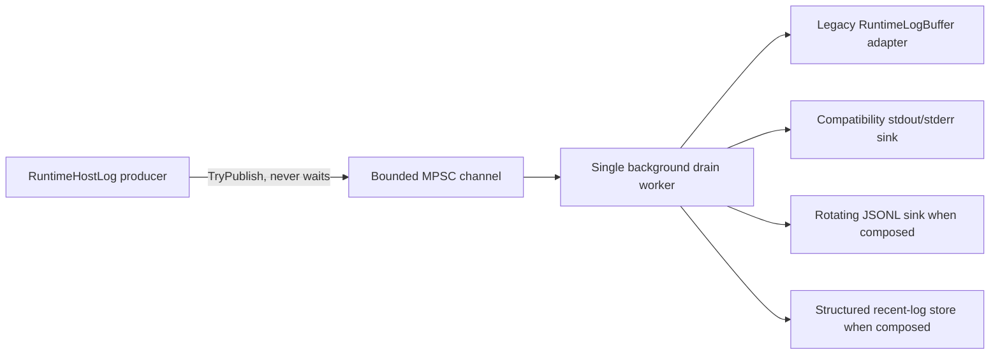

# Observability and structured runtime logging

[Русский](../ru/observability-logging.md) · [Documentation](README.md) · [Operations/TUI](operations-tui.md) · [Logging roadmap](../roadmap/runtime-logging-pipeline.md)

TerraRuntime has the **L0-L2 structured logging foundation** and the first L3 live-host adoption slice. `RuntimeHostLog` now publishes into the bounded structured pipeline; its legacy operations read model and stdout/stderr compatibility behavior are worker-owned sinks instead of synchronous producer work. Remaining direct `Console.*` startup/world-host call sites are still explicit L3 work.

## Architecture

The migrated bridge decides console routing at enqueue time. A record is tagged as buffered-only, standard-output, or standard-error before it enters the queue, so later TUI state changes cannot retroactively reroute an already accepted message.

## Producer bound

The producer path only normalizes bounded scalar text, assigns sequence/timestamp data, and calls `ChannelWriter.TryWrite`. Disk I/O, console I/O, JSON encoding, flushing, rotation, retention, and sink failure handling happen outside the authoritative producer path.

With queue capacity \(N_q\) and warning/error reserve \(N_r\), normal records may occupy at most

\[
N_{normal}=N_q-N_r.
\]

The defaults remain \(N_q=2048\) and \(N_r=256\). `Warning`, `Error`, and `Critical` records may use the reserved capacity. Saturation rejects records instead of waiting and increments per-level drop counters.

## Stable record contract

`TerraRuntime.Contracts.Diagnostics.RuntimeLogRecord` contains sequence, UTC timestamp, severity, stable event ID, category, subsystem, bounded message text, detached correlation context, and bounded exception type/message fields. Context is scalar-only: logging does not retain mutable runtime entities or raw packet payloads.

### Event ID allocation

| Range | Category |
| ---: | --- |
| `1000-1999` | Lifecycle |
| `2000-2999` | Network |
| `3000-3999` | Protocol |
| `4000-4999` | World |
| `5000-5999` | Persistence |
| `6000-6999` | Plugin |
| `7000-7999` | Gameplay |
| `8000-8999` | Operations |
| `9000-9999` | Security |

The L3 compatibility bridge reserves `8000-8002` for buffered-only, stdout, and stderr delivery. These are transitional routing IDs, not final semantic IDs for the original call sites. As direct call-site families migrate, they receive stable subsystem-specific IDs instead of reusing the bridge IDs.

## RuntimeHostLog migration

`RuntimeHostLog.Write` and `RuntimeHostLog.Publish` no longer call `TextWriter.WriteLine` or `RuntimeLogBuffer.Publish` on the caller thread. Both are sinks behind `RuntimeLogPipeline`.

The compatibility behavior remains:

- while TUI is active, normal host messages are retained but do not corrupt the terminal dashboard;
- after TUI falls back to plain console, `Publish` may again route to stdout;
- explicit stderr writes remain stderr writes;
- the existing `RuntimeLogBuffer` still feeds the current TUI/read model during the transition.

The bridge owns a bounded process-exit drain fallback and exposes `DisposeAsync` for explicit lifecycle ownership. Wiring that explicit disposal to the complete server-host shutdown path remains open L3 work; the fallback prevents ordinary process exit from abandoning the worker without a bounded drain attempt.

## Backpressure and sink health

`RuntimeLogPipeline` exposes accepted/filtered counts, per-severity drops, drained count, sink failures, queue depth, and high-water mark. Sink failures are isolated; repeatedly failing sinks are quarantined while healthy sinks keep receiving records.

A blocked compatibility console writer no longer blocks the caller that produced the runtime event. Tests hold the writer deliberately and verify that the producer completes before the worker is released.

## Built-in sinks

`RuntimeConsoleLogSink` provides structured human-readable console output. `RuntimeJsonLinesLogSink` emits NativeAOT-safe JSONL through explicit `Utf8JsonWriter` serialization, with size/day rotation and bounded retention. `RuntimeRecentLogStore` is the structured bounded ring intended to replace the transitional `RuntimeLogBuffer` adapter in a later L3/L4 slice.

Default JSONL policy remains:

- maximum file size \(16\,\mathrm{MiB}\);
- rotate at UTC day boundary;
- retain \(8\) files;
- periodic flush every \(64\) records;
- immediate flush for `Error` and `Critical`.

## Sensitive-data rules

Do not put passwords, authentication tokens, secrets, raw packet bodies, private keys, or arbitrary object dumps into messages or context. Prefer opaque handles over personal or mutable runtime data. Free-form fields are bounded and control characters are normalized, but sanitization does not make secret material safe to log.

## NativeAOT constraints

The pipeline uses BCL channels, explicit contracts, and manual JSON writing. There is no runtime type discovery, dynamic serializer generation, or reflection-driven log schema.

## Remaining L3 adoption

The next live-host slice must:

- replace remaining direct `Console.*` startup/world-host output with structured events;
- allocate final semantic IDs for lifecycle, world, persistence, network, protocol, gameplay, plugin, and security call-site families;
- propagate detached correlation/world/connection/player/entity/packet context;
- move TUI operations consumption from the compatibility `RuntimeLogBuffer` adapter to `RuntimeRecentLogStore`;
- define runtime logging configuration for minimum level, enabled sinks, directory, capacities, retention, and timeouts;
- make explicit logging disposal part of the normal server-host shutdown sequence rather than relying on the process-exit fallback.

The detailed milestone state is tracked in [`../roadmap/runtime-logging-pipeline.md`](../roadmap/runtime-logging-pipeline.md).
