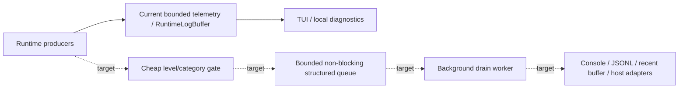
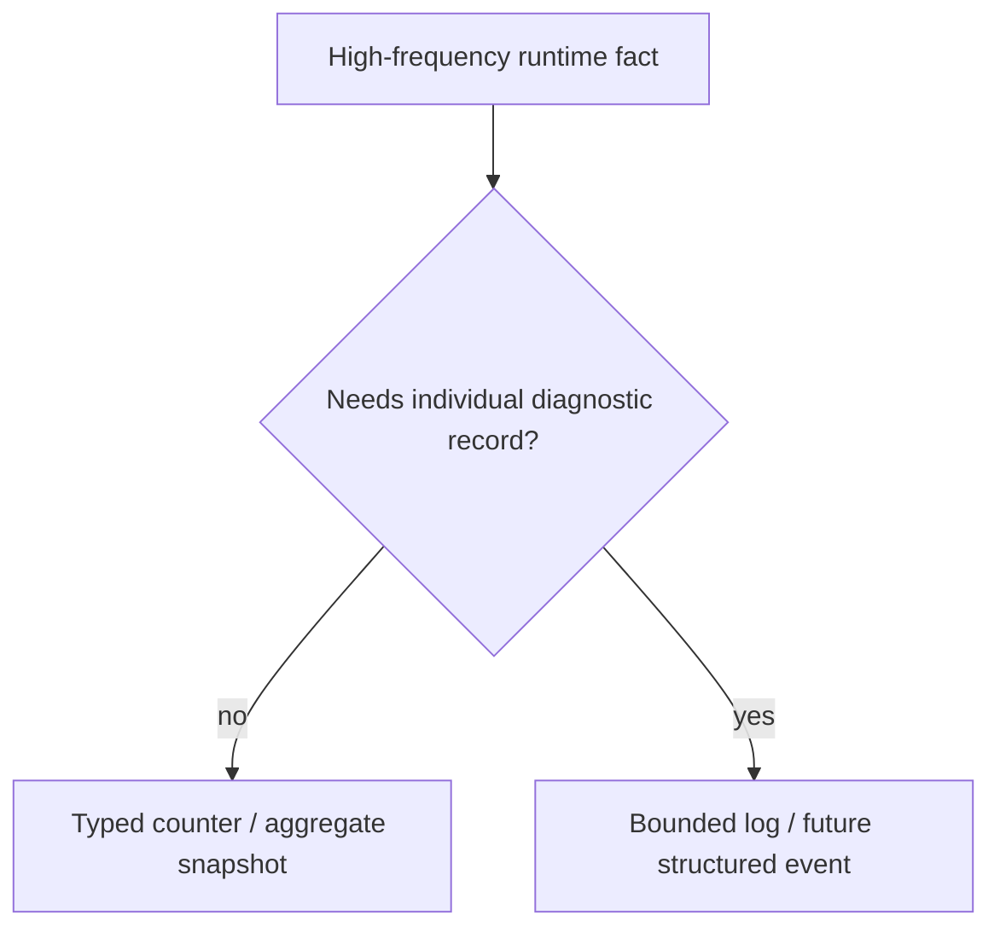
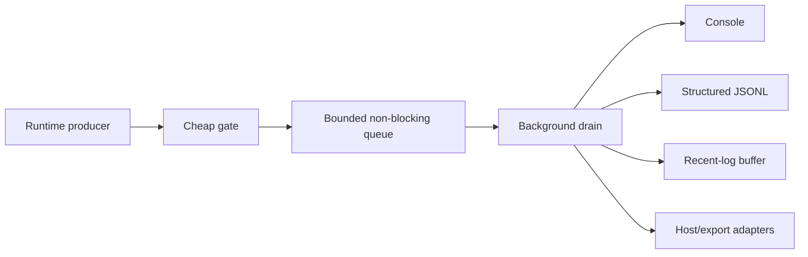

# Observability and logging

[Русский](../ru/observability-logging.md) · [Documentation](README.md) · [Operations/TUI](operations-tui.md) · [Logging roadmap](../roadmap/runtime-logging-pipeline.md)

## 1. Current status

TerraRuntime already has bounded operations telemetry, a bounded recent-log read model and TUI consumption. The full runtime-owned asynchronous structured logging pipeline is **not complete yet**.

Solid arrows describe the current foundation. Dashed target path remains roadmap work.

## 2. Ownership boundary

Observability never becomes owner of simulation state. High-frequency owners publish bounded counters, immutable snapshots or bounded log records; TUI/exporters consume detached data instead of scanning mutable runtime stores.

## 3. Current recent-log limits

`RuntimeLogBuffer` is a bounded operations read model, not the final public logging API.

| Limit | Current value |
|---|---:|
| Default retained entries | `$512$` entries |
| Maximum retained entries | `$8\,192$` entries |
| Maximum source length | `$64$` characters |
| Maximum message length | `$2\,048$` characters |

When full, the ring overwrites the oldest retained entry and increments an overwrite counter. Control characters are normalized, empty source falls back to `Runtime`, and retained history cannot grow by attaching arbitrary object graphs or packet payloads.

## 4. Current record shape

The current operations record contains `Sequence`, `TimestampUtc`, `Level`, `Source` and `Message`, with levels `Debug`, `Information`, `Warning` and `Error`.

Snapshots also expose published/overwritten counts, minimum level and capture time.

This is intentionally smaller than the future structured record model.

## 5. Reads and filtering

Consumers can request a bounded snapshot by minimum level, optional exact source and maximum entry count. The newest matching records are returned in chronological order. A bounded sorted source list supports UI filtering.

## 6. Chat is not logging

The read-only `Chat` source projects separate bounded public-chat telemetry into the operator log view. Chat routing remains its own subsystem and does not become generic logging ownership just because operators can inspect it.

## 7. Current host-log behavior

`RuntimeHostLog` bridges runtime messages to the bounded recent-log buffer and local console behavior.

When TUI is active, normal console writes are suppressed to avoid corrupting the dashboard. After fallback to plain console, output may return to stdout/stderr as appropriate.

The current bridge is still synchronous at the call site. Sink formatting/I/O must move off hot runtime paths in the future structured pipeline.

## 8. Telemetry versus logs

High-frequency facts belong in counters/snapshots rather than one text line per occurrence. Examples include connection/admission counts, inbound/outbound frame/byte totals, queue depth/high-water marks, rate rejects, typed stop reasons, normalized frame rejections and entity replication counters.

## 9. Connection rejection telemetry

Network telemetry keeps malformed protocol, rate limit, invalid state, gameplay rejection and backpressure separate. Terminal stop categories also remain typed, including protocol failure, invalid handshake, unsupported protocol, slow client, handshake/join/idle timeout and application stop.

Flattening these into `connection failed` would discard useful operational evidence.

## 10. TUI consumption

The TUI reads operations snapshots on its UI thread approximately every

$$
T_{\mathrm{refresh}}\approx500\,\mathrm{ms}.
$$

The log view consumes `ILogOperations` / `RuntimeLogBuffer` snapshots and does not block runtime publishers. Future tail/follow behavior should remain sequence-based and bounded so a slow consumer reports a gap instead of forcing unbounded retention.

## 11. Target structured event model

The logging roadmap proposes immutable machine-readable records with fields such as `Sequence`, `TimestampUtc`, `Level`, `EventId`, `Category`, `Subsystem`, message template/key, exception, correlation IDs, world/connection/player/entity context, packet direction/ID and bounded properties.

This is **target architecture**, not the current public record shape.

## 12. Target queue and backpressure

Expected pressure policy is preferential: Debug/Trace drop first, Information may sample/coalesce/drop, Warning/Error receive stronger retention, and Critical requires a bounded emergency fallback rather than an unbounded synchronous path.

Exact queue sizes remain measurement work.

## 13. Sink failure isolation target

A future sink failure must not stop simulation or disable every other sink. The roadmap calls for one long-lived drain worker initially, batching where useful, independent sink exception isolation, bounded health telemetry, graceful shutdown drain/flush and separate bounded buffering for future network exporters.

The existing ring buffer alone does not prove those guarantees.

## 14. File logging status

The durable target is newline-delimited structured JSON (`.jsonl`) with rotation/retention and explicit flush semantics from the background logging worker. That complete file-sink pipeline is not yet implemented.

Do not close the gap with synchronous JSON/file output from gameplay or network hot paths.

## 15. Host/Vega boundary

TerraRuntime owns runtime/network/gameplay/world diagnostics. Vega owns Vega/application/plugin policy logs. Future integration may consume immutable TerraRuntime records through an adapter, but TerraRuntime must not reference Vega assemblies or hand out mutable runtime objects.

Arbitrary external `ILogger` providers must not execute synchronously on the authoritative game-loop thread.

## 16. Performance rule

Observability changes on hot paths require before/after measurement. No log sink, file flush, terminal rendering or exporter may become required progress for the authoritative simulation tick.

## 17. Evidence and limitations

Current tests cover recent-log buffer behavior, host-log behavior, chat projection and operations/network telemetry mappings.

Still incomplete are the bounded async structured producer/drain pipeline, universal stable event IDs/categories, JSONL rotation/retention, Vega/MEL adapter contract, broad saturation/drop-policy/sink-failure tests and full subsystem telemetry coverage.

## 18. Change checklist

An observability/logging change is incomplete unless hot-path work stays bounded/non-blocking, retained data stays bounded, counters are preferred for high-frequency facts, consumers receive immutable data, sink failure cannot become gameplay failure, current versus target architecture is explicit, diagrams use Mermaid, dimensional quantities use LaTeX, and this page changes together with `docs/ru/observability-logging.md`.
