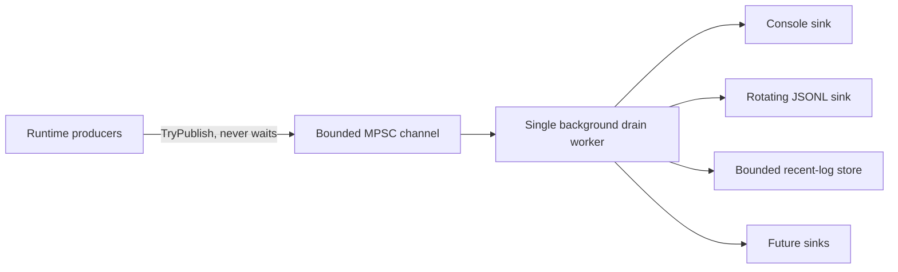

# Observability and structured runtime logging

TerraRuntime now has the **L0-L2 structured logging foundation**: stable diagnostic contracts, a bounded non-blocking runtime pipeline, and background sinks. The live host still uses the legacy `RuntimeHostLog` path until the L3 adoption milestone converts call sites. This separation is deliberate: the new pipeline is complete and testable without changing authoritative runtime behavior in the same commit.

## Architecture

The producer path only builds a compact immutable `RuntimeLogRecord`, bounds free-form scalar text, assigns sequence/timestamp data, and calls `ChannelWriter.TryWrite`. Disk I/O, console I/O, JSON encoding, flushing, rotation, retention, and sink failure handling happen on the drain worker.

With queue capacity \(N_{q}\) and warning/error reserve \(N_{r}\), normal records may occupy at most

\[
N_{normal}=N_q-N_r.
\]

The defaults are \(N_q=2048\) and \(N_r=256\). `Warning`, `Error`, and `Critical` records may use the reserved capacity. The producer never blocks when the queue is saturated; rejection is counted per severity.

## Stable record contract

`TerraRuntime.Contracts.Diagnostics.RuntimeLogRecord` contains:

- monotonically increasing process-local sequence;
- UTC timestamp;
- severity;
- stable numeric event ID;
- top-level category;
- subsystem;
- bounded message text;
- detached correlation context;
- bounded exception type/message fields.

The detached context deliberately contains scalar handles only: correlation, world, connection, player, entity, packet direction, and packet ID. Runtime entities and raw packet payloads are not held by log records.

### Event ID allocation

Event IDs are stable machine identifiers. Message text may change without changing the event ID. The reserved ranges are:

| Range | Category |
| ---: | --- |
| `1000-1999` | Lifecycle |
| `2000-2999` | Network |
| `3000-3999` | Protocol |
| `4000-4999` | World |
| `5000-5999` | Persistence |
| `6000-6999` | Plugin |
| `7000-7999` | Gameplay |
| `8000-8999` | Operations |
| `9000-9999` | Security |

New events must be allocated inside the owning range and must not recycle an old ID for unrelated meaning.

## Backpressure and metrics

`RuntimeLogPipeline` exposes a snapshot with accepted/filtered counts, per-severity drops, drained count, sink failures, current queue depth, and queue high-water mark. Sink health is tracked independently so one failed destination cannot silently poison the rest of the pipeline.

On shutdown the pipeline stops accepting new records, completes the writer, and drains accepted records within a bounded shutdown window. A stuck sink is bounded by its per-operation timeout. Repeated failures quarantine only that sink; healthy sinks continue receiving records.

## Built-in sinks

### Console

`RuntimeConsoleLogSink` writes one compact human-readable line per record. It is invoked only by the drain worker, never by the authoritative producer path.

### Rotating JSONL

`RuntimeJsonLinesLogSink` emits one structured JSON object per line. Serialization uses `Utf8JsonWriter` directly, so the sink does not depend on reflection-based serialization and stays compatible with NativeAOT.

Defaults:

- maximum file size: \(16\,\mathrm{MiB}\);
- day-boundary rotation in UTC;
- retained files: \(8\);
- periodic flush every \(64\) records;
- immediate flush for `Error` and `Critical`.

Rotation and retention run on the background sink path. File names include UTC time, process ID, and an ordinal to avoid collisions.

### Recent-log store

`RuntimeRecentLogStore` is an in-memory bounded ring used for future TUI/API retrieval. It stores at most \(512\) records by default, supports level/category filtering, and counts overwritten records. Its hard capacity limit is \(8192\).

## Sensitive-data rules

The structured contract is intentionally narrow. Do not put passwords, authentication tokens, secrets, raw packet bodies, private keys, or arbitrary object dumps into `Message` or context fields. Prefer opaque handles over personal or mutable runtime data. Operational identifiers should be included only when required for diagnosis and should already be scrubbed at the call site.

Free-form fields are bounded and control characters are normalized before enqueueing. This prevents log amplification and basic terminal/line-injection abuse, but it does not make secret material safe to log.

## NativeAOT constraints

The foundation adds no runtime NuGet dependency. It uses BCL channels, explicit contracts, and manual JSON writing. There is no runtime type discovery, dynamic serializer generation, or reflection-driven log schema.

## Remaining adoption work

L3 and later milestones still need to:

- replace live `RuntimeHostLog`/direct console call sites with stable event IDs and structured context;
- propagate correlation context across connection, world, gameplay, persistence, plugin, and command paths;
- export pipeline/drop/sink-health metrics through the runtime observability surface;
- add benchmark/load gates and Linux/Windows NativeAOT smoke coverage for the adopted pipeline;
- expose bounded recent logs through the TUI/API and add optional external sinks.

The detailed milestone state is tracked in [`../roadmap/runtime-logging-pipeline.md`](../roadmap/runtime-logging-pipeline.md).
