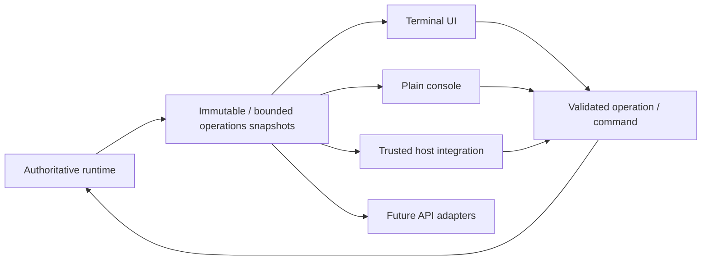
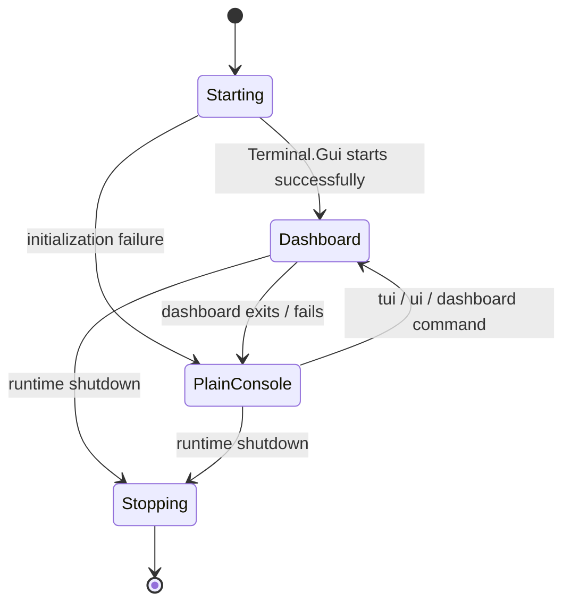
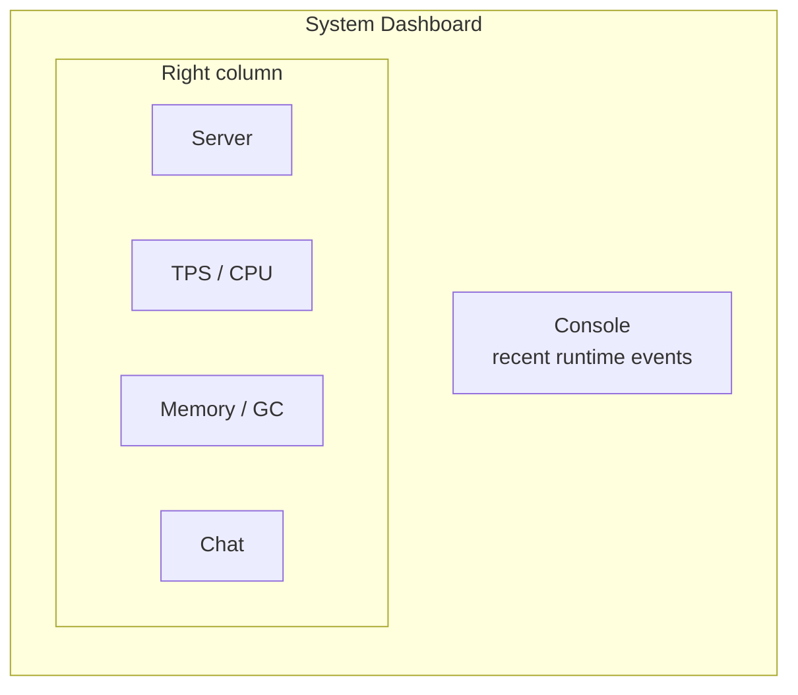
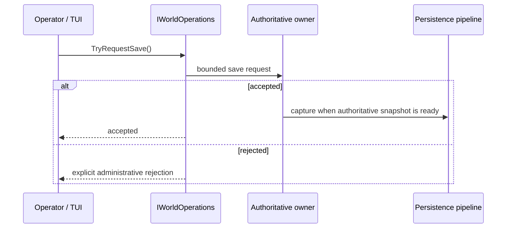
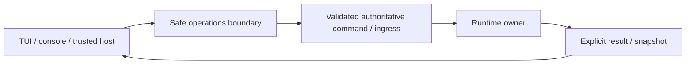

# Operations, startup and Terminal UI

[Русский](../ru/operations-tui.md) · [Documentation](README.md) · [Architecture](architecture.md) · [Host interfaces](host-interfaces.md)

## 1. Purpose

The operations layer exposes bounded read models and safe control surfaces without letting UI code traverse or mutate authoritative runtime collections directly.



Terminal.Gui v2 is the current local UI implementation, but the boundary is toolkit-independent.

## 2. Startup without arguments

Normal startup without `--world` creates required runtime directories and scans canonical `Worlds/` through the local selector. The selected `.wld` becomes the effective `--world` value. Cancelling selection exits cleanly.

The interactive list intentionally renders only world display names. Absolute filesystem paths are not repeated beside every world; an explicit path can still be supplied through `P` or `--world`.

The standalone directory layout remains literal filesystem structure:

```text
Worlds/
config/
data/
logs/
```

## 3. Main server options

```text
--world <path.wld>
--port <1..65535>
--max-players <1..255>
--interest-management
--tui
--no-tui
```

Defaults are `port = 7777`, `max players = 8`, TUI enabled, interest management disabled. These are configuration values/identifiers rather than dimensional measurements, so they remain code literals.

`--tui` is accepted explicitly although the TUI is already default-on. `--no-tui` disables it.

Special startup paths include `--help`, `--list-world-generators`, CI smoke modes and `--save-wld`.

## 4. TUI lifecycle



The UI runs on its own background thread `TerraRuntime Terminal UI`, not on the authoritative game-loop thread. `TerminalUiHost` owns linked cancellation and waits only a bounded interval during disposal.

On Windows, TerraRuntime deliberately selects Terminal.Gui's cross-platform `dotnet` driver instead of forcing the native `windows` driver. This is a compatibility policy for Windows 10/conhost-class rendering failures where Terminal.Gui 2.4.x can leave the content area blank/black while menu chrome remains visible. Linux and other platforms keep Terminal.Gui's normal platform selection.

The production TUI also installs an explicit high-contrast TerraRuntime scheme after Terminal.Gui initialization. Base, Menu, Dialog, Accent and Error roles use opaque near-black backgrounds with green foreground/accent colors instead of inheriting `Color.None` terminal defaults.

## 5. Refresh model

The dashboard refreshes from the Terminal.Gui application iteration callback at approximately

$$
T_{\mathrm{refresh}}\approx500\,\mathrm{ms}.
$$

The UI reads operations snapshots rather than walking mutable player/NPC/projectile/world collections.

## 6. Tiled System Dashboard

The default System Dashboard is a tiled operational workspace inspired by the Vega operations view while remaining runtime-owned. The left side is a large **Console** tile. The right column contains **Server**, **TPS / CPU**, **Memory / GC**, and **Chat** tiles.



The Console tile includes current tick/process/command pressure followed by recent runtime events. The performance and memory tiles maintain short in-memory histories only for rendering local sparklines; those histories are UI-owned and are never authoritative telemetry.

Double-clicking a tile toggles it between the tiled layout and full-workspace view. This is a presentation-only operation. Existing Details screens for Players, NPCs, Projectiles, Items, Network, World and Logs remain available and keep their existing bounded read-model contracts. External trusted-host dashboards remain separate roots.

The System Dashboard shows lifecycle/world state, player and connection counts, interest-management state, current/target TPS, tick wall/CPU timing, slowest phase, missed deadlines, process CPU, managed heap, working set, allocation/GC state, command pressure, recent log events and public chat.

The World detail screen also surfaces section-cache pipeline health from `RuntimeWorldSnapshot`: in-flight/submitted/rejected rebuilds, stale results, encode failures, publish rejections and accumulated encode time. Its on-demand row shows requests, unique/deduplicated requests, pending work versus bounded capacity, rejected requests and completed/timed-out waits.

## 7. Save telemetry and manual checkpoint

World-save status is exposed through detached operations state: persistence acceptance, tile-shadow readiness, remaining bootstrap/dirty sections, requested state, active/pending writes and accepted/started/completed/coalesced/failed counters.

**Actions → Save world checkpoint** calls `IWorldOperations.TryRequestSave()` and crosses persistence ingress rather than receiving the save service or mutable tile shadow.



The ANSI TUI smoke exercises the real menu path and verifies pending-save state; unit tests cover accepted and rejected requests.

## 8. Network telemetry

`INetworkOperations` exposes bounded network state without transferring connection ownership to the UI. It includes active/registered connections, admission totals/rejections, inbound one-second and lifetime totals, per-connection inbound details, outbound current/capacity/high-water/rejection state, slow clients, player lifecycle and replication counters, unsupported replication commits, typed terminal stop categories and normalized frame-rejection categories.

TUI projections consume subsystem-owned counters; they do not parse log text or add packet-hot-path counters of their own.

## 9. Logs

The TUI consumes bounded log state and is not a logging backend. UI failure must not lose authoritative state, log rendering must not block the game loop, and retained history remains bounded.

See [Observability and logging](observability-logging.md) and the logging roadmap.

## 10. Plain console fallback

Fallback commands remain literal commands:

```text
tui | ui | dashboard   reopen the dashboard
clear                  clear the console when supported
help                   show fallback-console commands
```

When TUI is disabled with `--no-tui`, fails to initialize, or is closed by the operator, public chat is projected to stdout as `[chat] #<slot>: <text>`. The projection uses a bounded queue and a background writer; authoritative chat relay never waits for terminal I/O.

Structured console events have an independent sink threshold. The default is `Error`, which means error/critical-class events plus chat are visible in a quiet plain console while detailed `Debug`/`Information` records continue to remain available to other enabled sinks. Set `TERRARUNTIME_LOG_CONSOLE_LEVEL` to `Trace`, `Debug`, `Information`, `Warning`, `Error`, or `Critical` to change only the console threshold. `TERRARUNTIME_LOG_LEVEL` remains the global pipeline acceptance threshold and therefore cannot be bypassed by a more verbose console setting.

`TERRARUNTIME_LOG_CONSOLE=off` disables structured stdout/stderr delivery; public-chat projection remains independent so a headless server does not become completely silent about player conversation.

Unknown commands are reported rather than interpreted as runtime mutations. Closed/redirected stdin waits rather than busy-looping.

## 11. Trusted host dashboards

CoreCLR trusted hosts can register complete dashboards via `ITerraRuntimeTerminalDashboardRegistry`.

A provider supplies stable `Id`, display `Title`, `CreateDashboard()` and `Refresh(View rootView)` on the Terminal.Gui UI thread. It contributes its own root view and does not inject arbitrary controls into the built-in TerraRuntime dashboard.

Registration is metadata/factory-oriented and grants no mutable runtime state.

## 12. UI-thread ownership

Terminal.Gui views remain UI-thread objects. A dashboard provider may update its view from `Refresh`, while gameplay/runtime work is requested through safe contracts. A `View` must not become a synchronization primitive for authoritative state.

## 13. Administrative mutation rule



Implemented examples include interest-management enable/disable through authoritative command ingress and manual checkpoint requests through `IWorldOperations.TryRequestSave()`.

Running in the same process does not grant the TUI a direct-mutation shortcut.

## 14. Headless and extensible profiles

Disabling TUI does not disable the server. NativeAOT and CoreCLR profiles remain functional without a successful graphical terminal session.

CoreCLR may load trusted host modules such as Vega behind `TerraRuntime.HostContracts`; ordinary Vega plugins remain behind Vega's own plugin SDK. NativeAOT does not perform arbitrary managed DLL loading.

## 15. Current limitations

Still evolving are final dashboard layout/UX, future remote/web adapters, richer safe administrative actions and panel-specific documentation. The tiled dashboard intentionally uses compact local histories rather than pretending that UI sparklines are a metrics time-series store.

## 16. Change checklist

An operations/TUI change is incomplete unless UI work stays off the authoritative thread, read models stay immutable/bounded, mutations return through safe operations, UI failure degrades without killing the server, terminal input cannot busy-loop, host dashboards receive no mutable implementation state, diagrams use Mermaid, dimensional timings use LaTeX, and this page changes together with `docs/ru/operations-tui.md`.
