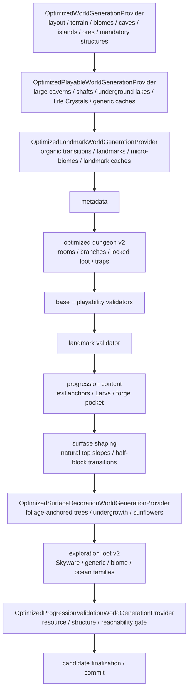

# Optimized world generation

`terraruntime:optimized` is TerraRuntime's production-oriented custom world generator. It intentionally does **not**
promise seed-identical Terraria world generation. Its contract is different: the same TerraRuntime version and seed
must reproduce the same candidate, mandatory world roles must fit, official-client content IDs must remain valid, and
the result must be visually coherent and playable without importing a second world.

`terraruntime:vanilla` remains the source/reference-parity profile. Optimized generation does not replace it.

## Source layout

Built-in generator implementations are separated by profile:

```text
src/TerraRuntime.World/Generation/
├── Flat/
├── Optimized/
├── Skyblock/
└── Vanilla/
```

The optimized profile is layered instead of growing one monolithic provider:



All optimized passes use `WorldGenerationRngMode.IsolatedDeterministic`. Adding an unrelated later pass therefore does
not silently shift the random stream of an existing pass.

## Current generated world

The optimized profile currently produces and validates:

- a protected central spawn and starting Guide;
- both oceans and beaches with validated continuous basin floors;
- forest, snow, desert, jungle, corruption/crimson and underground mushroom regions;
- an Underworld band with Lava, Hellstone and a Hellforge;
- small correlated caves plus large warped caverns, vertical shafts and inland underground lakes;
- multiple floating islands;
- a connected dungeon room/branch graph with a readable entrance, locked dungeon loot, Golden Keys, spikes and wired dart traps;
- a jungle hive, Jungle Temple and Aether/Shimmer pocket;
- pre-Hardmode ore tiers;
- a world-area-scaled Life Crystal budget;
- persistent surface, underground and cavern exploration caches with source-backed primary loot families;
- persistent sky houses whose caches are normalized to source-backed Skyware primary roles;
- dedicated source-backed Snow/Ice, Jungle, Underground Desert and left/right Ocean exploration caches;
- explicit Floating Lakes on other islands;
- deterministic desert pyramids with internal chambers and persistent caches;
- hollow Living Wood trees with roots, underground rooms and persistent caches;
- bounded Underworld houses connected by undulating platform bridges;
- granite, marble and spider/cobweb micro-biomes;
- domain-warped material tongues at snow, desert, jungle and world-evil boundaries;
- deterministic ordinary forest, jungle and snow trees plus grass/jungle undergrowth and sunflower patches, all placed after landmarks so progression objects and caches are protected;
- a deterministic surface-finishing pass that converts clean one-tile natural height transitions into persisted walkable slopes/half-blocks and publishes vanilla-format tree foliage anchors.

The landmark layer uses tile/wall identities already source-backed by the repository's TerrariaServer `1.4.5.8`
world-generation work. Exploration loot now uses pinned source primary families, while pyramid, Living Tree and
Underworld landmark-cache contents remain intentionally custom roles rather than claims of exact vanilla chest tables.

## Organic transitions

The base generator still owns the large biome layout. The landmark pass does not reshuffle biome positions after major
structures have been reserved. Instead it measures the existing material band, finds each edge and grows deterministic
noise-shaped tongues into adjacent natural terrain. Only natural terrain families are eligible for replacement, so ores,
frame-important objects and mandatory structures are not treated as paintable transition material.

This removes the most obvious straight vertical material boundaries while preserving the bounded layout contract.

## Floating-island roles

Sky terrain is scanned as separate horizontal masses. The landmark pass assigns two distinct roles:

- **sky house**: Sunplate shell, Disc Wall interior and a persistent sky cache;
- **Floating Lake**: a carved bounded water basin reinforced inside the existing island mass.

Both roles have explicit minimum budgets. A pass that cannot place the requested house/lake counts fails generation
rather than silently returning a visually incomplete world.

The final exploration-loot pass replaces each sky-cache side table with a deterministic primary from the pinned
TerrariaServer `1.4.5.8` Skyware family: Shiny Red Balloon, Starfury, Lucky Horseshoe or Celestial Magnet. The optimized
placement schedule remains custom and deterministic; this is source-backed role coverage, not seed-identical Skyware
chest generation.

## Exploration loot v2

The final quality overlay runs `terraruntime:optimized/exploration-loot-v2` after surface decoration and before final
progression validation. It updates only runtime-owned generated chest side tables for existing generic/sky caches, so
coordinates, dense chest slot identity, names and tile geometry remain unchanged. Replacement items pass through the
same vanilla item/prefix validation used when generated chests are first registered.

Primary families are pinned to TerrariaServer `1.4.5.8` world-generation branches: Skyware, ordinary Surface,
Underground, Ice/Snow, Jungle, Underground Desert and Underwater/Ocean. Generic caches are localized to Ice, Jungle or
Desert families when nearby material proves that role; explicit Snow, Jungle and Desert caches plus one cache in each
ocean guarantee those exploration families even when generic placement misses a biome. Utility filler is restricted to
source-backed chest items such as Rope, Recall Potions, Torches and a bounded potion family.

Desert caches use the source-backed `Containers2` family. The world validator therefore accepts a complete chest
footprint when all four cells consistently use either vanilla container tile `21` or `467`; mixed or malformed
footprints still fail closed.

## Dungeon v2

The final optimized profile rebuilds only the already-reserved Blue Dungeon footprint. It creates a deterministic chain
of traversable main rooms, alternating side branches and a surface-connected entrance while preserving any pre-existing
persistent chest footprints that happen to overlap the reservation. The pass then places an unlocked entrance cache with
enough Golden Keys for the generated locked chests, source-backed dungeon primary loot, bounded spike fields and paired
pressure-plate/dart-trap mechanisms connected by red wire.

The implementation is intentionally custom rather than seed-identical to Terraria. Source-backed 1.4.5.8 identities are
used for locked chest style/framing, Golden Keys, Muramasa, Cobalt Shield, Aqua Scepter, Blue Moon, Magic Missile, Valor,
Handgun, pressure plates and dart traps. Generation fails closed if room connectivity, locked-chest counts, key balance,
trap budgets, spike budgets, chest framing or the readable entrance contract are incomplete.

## Surface and underground landmarks

### Pyramids

Desert surface spans are detected from generated material rather than hard-coded X coordinates. The generator derives a
world-width-scaled pyramid budget, builds a solid sandstone-brick mass, then carves a surface opening, internal shaft
and chamber before persisting a cache inside the chamber.

### Living trees

Forest surface candidates are selected away from the protected spawn envelope. Each generated tree has a Living Wood
trunk, Leaf Block crown, roots, a hollow vertical core, a Living Wood underground room and a persistent cache.

### Underworld settlements

The Underworld receives a bounded number of Ash houses. Open doorways and platform bridges keep the structures usable
without requiring guessed furniture/door frame metadata. Later work can replace the conservative shell with richer
vanilla-inspired furniture sets after those content contracts are source-backed.

## Micro-biomes

The landmark pass adds bounded granite and marble lenses plus spider grottoes. Spider grottoes carve an underground
chamber, apply the source-backed unsafe spider wall and seed Cobweb tiles. Placement rejects areas near frame-important,
hive, temple, dungeon, chest, Honey or Shimmer content.

These are visual/exploration roles, not claims of exact vanilla placement algorithms.

## Guaranteed progression content

After landmark validation, `terraruntime:optimized` now adds world-size-budgeted 2x2 Shadow Orbs or Crimson Hearts
using the pinned 1.4.5.8 frame contract (`+36` frame-X for Crimson), dry 3x3 Larva anchors inside the Hive, one persistent
Jungle Progression Cache containing source-backed Jungle Spores/Stingers/Vines, and a dry Underworld forge pocket with
reachable Obsidian plus exposed Hellstone. The final topology validator treats all four roles as mandatory route targets.

Larva placement proves the worldgen anchor only. Queen Bee activation/destruction semantics remain owned by gameplay
runtime work and are not falsely counted as complete here.

## Validation

Generation remains fail-closed. The validators require exact landmark budgets, persistent chest side-table entries,
source-backed exploration-loot family budgets, minimum generated material/wall counts, a readable dungeon entrance, the
Dungeon v2 room/loot/trap contracts, and final progression topology. The final
`OptimizedProgressionValidationWorldGenerationProvider` enforces area-scaled minimum quantities for Copper, Iron,
Silver, Gold and Hellstone; verifies complete progression-object footprints; requires non-trivial connected dungeon,
hive and Jungle Temple interiors; and builds a bounded excavation-aware reachability graph from spawn to required
surface/deep-world targets. This is a structural topology gate, not a claim of pixel-exact Terraria player movement or
tool progression.

## Compatibility and non-goals

The same seed is **not** expected to create the Terraria world for that seed. Use `terraruntime:vanilla` for
source/reference parity.

Optimized worlds still target official-client-compatible tile, wall, liquid, object and `.wld` finalization contracts.
Loading an existing vanilla `.wld` remains independent of which generator is used for new worlds.

## Remaining work

The optimized profile is not yet production-complete. Important remaining items include:

- multiple hives and stronger Queen Bee space on larger worlds;
- glowing-mushroom and additional decorative micro-biomes;
- Hardmode-ready mutation anchors;
- richer source-backed Underworld settlement furniture/loot/resource families;
- Small/Medium/Large generation-time and peak-memory measurements;
- deterministic map/screenshot visual-regression fixtures;
- pinned TerrariaServer `1.4.5.8` acceptance plus official-client join smoke.

See [`../roadmap/optimized-worldgen.md`](../roadmap/optimized-worldgen.md) for the implementation checklist.