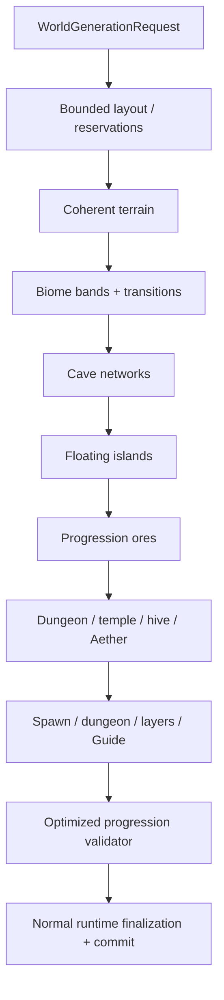

# Optimized world generation

`terraruntime:optimized` is TerraRuntime's production-oriented custom world generator. It is intentionally **not**
seed-identical to Terraria world generation. Its contract is stronger in a different direction: every published world
must be deterministic for the same TerraRuntime version and seed, fit all mandatory regions inside the requested map,
remain compatible with the official client content space, and contain the geography and structures required for a
normal playthrough.

`terraruntime:vanilla` remains the source-parity profile. The optimized profile does not replace it.

## Design goals

The optimized generator is built around four rules:

1. **Plan before drawing.** Large structures and progression regions receive bounded reservations before terrain is
   mutated.
2. **Organic geometry may use custom mathematics.** Terrain, caves and floating islands may use deterministic value
   noise, fractal combinations, random walks, signed-distance-style masks or later measured alternatives. They do not
   need to reproduce Re-Logic's historical implementation.
3. **Gameplay requirements are hard requirements.** A required dungeon, temple, ocean or progression resource is not
   an RNG suggestion. If it cannot fit or disappears, generation fails before commit.
4. **Validation is part of generation.** A candidate is not publishable merely because all passes returned.

All current passes use `WorldGenerationRngMode.IsolatedDeterministic`. Unrelated future passes therefore do not shift
the RNG stream of already existing passes.

## Current implementation slice

The first implementation reserves and generates:

- a safe central spawn region and starting Guide;
- left and right oceans with bounded beaches;
- forest terrain plus snow, desert, jungle, world-evil and underground mushroom regions;
- an underworld band with lava and Hellstone;
- deterministic organic cave networks;
- multiple floating islands placed inside reserved sky regions;
- a dungeon region on the side opposite the jungle;
- a jungle hive with Honey;
- a bounded Jungle Temple containing Lihzahrd brick and a Lihzahrd Altar;
- an Aether pocket containing Shimmer;
- a world-evil Demon Altar and an underworld Hellforge;
- the initial four pre-hardmode ore tiers.

The final optimized validation pass explicitly checks the required regions and materials above. Failure discards the
candidate through the existing world-generation pipeline.

## Layout guarantees

The layout pass treats major structures as rectangles with explicit bounds and collision checks. The current minimum
candidate size is `512x240`; smaller requests fail before terrain generation because TerraRuntime cannot guarantee a
sensible complete layout there.

Biome bands are allowed to contain structures by design. Structure reservations, however, must not collide with other
major structure reservations. Floating islands are kept above the ordinary terrain envelope and inside the ocean
margins.

This is the key difference from "try N random positions and quietly give up": mandatory content has a place before the
expensive passes begin.

## Visual quality

The surface heightfield combines several deterministic one-dimensional noise octaves at different scales. The spawn
area is blended toward a gentler profile rather than flattened with a hard rectangle. Cave paths use correlated random
walks with varying radius. Floating islands use an ellipse/SDF-like arch with low-frequency perturbation instead of
rectangular blobs.

These algorithms are intentionally replaceable. A visual improvement is acceptable when it preserves deterministic
output for the new generator version, bounded work, official-client content IDs and all validation guarantees.

## Compatibility and non-goals

The same textual or numeric seed is **not expected** to produce the Terraria world for that seed. Use
`terraruntime:vanilla` when source/reference parity is the goal.

The optimized profile still targets official-client-compatible tiles, walls, liquids, metadata and `.wld`
finalization. Loading existing vanilla worlds remains independent of which generator created new worlds.

## Remaining progression and quality work

The first slice establishes mandatory geography and major progression anchors, but it is not the final content pass.
Before the optimized profile is called production-complete, the roadmap requires:

- richer dungeon room graphs, locked/dungeon loot and structure variety;
- guaranteed Floating Island house/loot variants and Floating Lakes;
- life-crystal and chest distribution with progression-aware loot tables;
- full Underworld houses/resource distribution;
- pyramids, living trees and representative micro-biomes with bounded minimum/maximum counts;
- stronger jungle/temple traversal guarantees and hive/Queen Bee support;
- vegetation, decoration and transition passes that preserve readable biome silhouettes;
- reachability/progression checks beyond simple presence, including spawn safety and critical structure access;
- generation-time, allocation and output-quality measurements on Small/Medium/Large worlds;
- official-client/server acceptance for generated `.wld` files and deterministic replay artifacts.

Until those gates are complete, `terraruntime:optimized` is an actively developed built-in profile rather than a
claim of complete Terraria world-content parity.

See [`../roadmap/optimized-worldgen.md`](../roadmap/optimized-worldgen.md) for the implementation checklist.
