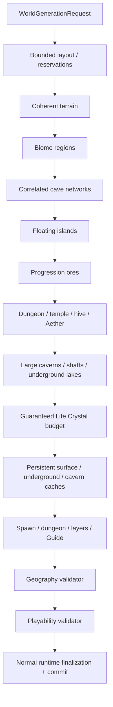

# Optimized world generation

`terraruntime:optimized` is TerraRuntime's production-oriented custom world generator. It is intentionally **not**
seed-identical to Terraria world generation. Its contract is stronger in a different direction: every published world
must be deterministic for the same TerraRuntime version and seed, fit all mandatory regions inside the requested map,
remain compatible with the official client content space, and contain the geography and progression resources required
for a normal playthrough.

`terraruntime:vanilla` remains the source-parity profile. The optimized profile does not replace it.

## Source layout

Built-in generator implementations live below `src/TerraRuntime.World/Generation/` and are separated by profile:

```text
Generation/
├── Flat/
├── Optimized/
├── Skyblock/
└── Vanilla/
```

The runtime registry only performs explicit registration. Generator implementation does not live inside the registry.

## Design goals

The optimized generator is built around four rules:

1. **Plan before drawing.** Large structures and progression regions receive bounded reservations before terrain is
   mutated.
2. **Organic geometry may use custom mathematics.** Terrain, caves and floating islands may use deterministic value
   noise, fractal combinations, random walks, signed-distance-style masks, connected cavern graphs and later measured
   alternatives. They do not need to reproduce Re-Logic's historical implementation.
3. **Gameplay requirements are hard requirements.** A required dungeon, temple, ocean, Life Crystal budget or other
   progression resource is not an RNG suggestion. If it cannot fit or disappears, generation fails before commit.
4. **Validation is part of generation.** A candidate is not publishable merely because all passes returned.



All optimized passes use `WorldGenerationRngMode.IsolatedDeterministic`. Adding one unrelated pass therefore does not
shift the RNG stream of existing passes.

## Current implementation slice

The current implementation reserves or generates:

- a safe central spawn region and starting Guide;
- left and right oceans with bounded beaches;
- forest terrain plus snow, desert, jungle, world-evil and underground mushroom regions;
- an underworld band with Lava and Hellstone;
- deterministic correlated cave walkers;
- large noise-warped cavern landmarks connected by meandering tunnels;
- natural vertical shafts and guaranteed inland underground lakes;
- multiple floating islands placed inside reserved sky regions;
- a dungeon region on the side opposite the jungle;
- a jungle hive with Honey;
- a bounded Jungle Temple containing Lihzahrd brick and a Lihzahrd Altar;
- an Aether pocket containing Shimmer;
- a world-evil Demon Altar and an underworld Hellforge;
- the initial four pre-hardmode ore tiers;
- a deterministic minimum Life Crystal budget scaled by world area;
- persistent surface, underground and cavern exploration-cache budgets.

The cache loot is intentionally custom and currently conservative. It uses only item identities already source-backed
by the repository. This proves persistent non-empty exploration loot without pretending the current cache tables are a
complete vanilla chest-loot replacement.

## Organic underground geometry

The baseline correlated cave walkers provide local tunnels. The playability overlay adds larger landmarks using a
warped signed-distance field, then connects accepted caverns with deterministic meandering tunnels. A subset of those
caverns receives bounded water basins, and one or more natural shafts connect vertical layers away from the protected
spawn envelope.

Feature carving treats frame-important objects, dungeon material, hive/temple content, Honey and Shimmer as protected
content. The original geography validator still runs after the overlay, so a visual feature cannot silently erase a
mandatory structure and still publish the candidate.

The objective is not maximum empty space. Small tunnels, large rooms, water landmarks and vertical breaks should form a
readable exploration rhythm instead of one uniform random-walk texture.

## Progression budgets

Life Crystals use the source-backed Terraria `1.4.5.8` tile identity already exercised by the vanilla post-settle
world-generation implementation. The optimized profile derives a bounded target from map area, tries organic cave-floor
placement first, and then uses deterministic safe fallback niches if random placement cannot satisfy the target. The
pass fails if the complete budget cannot be placed.

Surface, underground and cavern chests have separate world-width-scaled budgets. Chest tiles and the persistent chest
side table are committed together through `IWorldGenerationChestWorkspace`. A tile-only chest is not counted as a
successful generated cache.

## Playability validation

The original optimized validator still checks the major geography. A second fail-closed validator now also checks:

- every required Life Crystal object remains present;
- the complete generated-chest budget is persisted and every chest has a valid tile anchor;
- the large-cavern, underground-lake and vertical-shaft minimums were satisfied;
- the spawn area retains a bounded set of dry, two-tile-high walkable starter columns.

These checks are deliberately stronger than checking one representative tile. A generator pass that quietly gives up
cannot mark the candidate complete.

## Layout guarantees

The layout pass treats major structures as rectangles with explicit bounds and collision checks. The current minimum
candidate size is `512x240`; smaller requests fail before terrain generation because TerraRuntime cannot guarantee a
sensible complete layout there.

Biome regions may contain structures by design. Structure reservations, however, must not collide with other major
structure reservations. Floating islands are kept above the ordinary terrain envelope and inside the ocean margins.

This is the key difference from "try N random positions and quietly give up": mandatory content has a place before the
expensive passes begin, and post-layout resource budgets have fail-closed placement fallbacks.

## Visual quality

The surface heightfield combines several deterministic one-dimensional noise octaves at different scales. The spawn
area is blended toward a gentler profile rather than flattened with a hard rectangle. Small caves use correlated random
walks with varying radius, large caverns use a two-dimensional fractal-noise warp, and floating islands use an
ellipse/SDF-like arch with low-frequency perturbation instead of rectangular blobs.

These algorithms are intentionally replaceable. A visual improvement is acceptable when it preserves deterministic
output for the new generator version, bounded work, official-client content IDs and all validation guarantees.

## Compatibility and non-goals

The same textual or numeric seed is **not expected** to produce the Terraria world for that seed. Use
`terraruntime:vanilla` when source/reference parity is the goal.

The optimized profile still targets official-client-compatible tiles, walls, liquids, metadata and `.wld`
finalization. Loading existing vanilla worlds remains independent of which generator created new worlds.

## Remaining progression and quality work

The current slice is substantially more playable, but it is not the final content pass. Before the optimized profile is
called production-complete, the roadmap still requires:

- richer dungeon room graphs, locked/dungeon loot and structure variety;
- guaranteed Floating Island house/loot variants and explicit Floating Lakes;
- full biome-aware chest loot families instead of the current conservative custom caches;
- Shadow Orb / Crimson Heart progression anchors;
- full Underworld houses/resource distribution;
- pyramids, living trees and representative granite/marble/spider/mushroom micro-biomes with bounded counts;
- stronger jungle/temple traversal guarantees and multiple-hive/Queen Bee support on larger worlds;
- vegetation, decoration and domain-warped biome transition passes that preserve readable silhouettes;
- path/reachability checks from spawn to critical entrances rather than starter-area safety alone;
- minimum ore/resource quantity gates and hardmode-ready anchor validation;
- generation-time, allocation and output-quality measurements on Small/Medium/Large worlds;
- official-client/server acceptance for generated `.wld` files and deterministic visual-regression artifacts.

Until those gates are complete, `terraruntime:optimized` is an actively developed built-in profile rather than a claim
of complete Terraria world-content parity.

See [`../roadmap/optimized-worldgen.md`](../roadmap/optimized-worldgen.md) for the implementation checklist.
