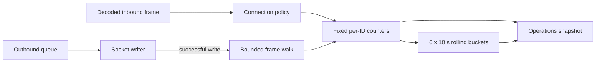

# Per-message packet telemetry

TerraRuntime records bounded process-lifetime Terraria wire traffic statistics by message ID and direction. The implementation lives at the network boundary so the counters describe bytes that actually enter the policy pipeline and bytes successfully written to the socket.

## Data model

For every observed message ID in each direction, the snapshot exposes:

- lifetime frame count;
- lifetime wire-byte count, including the two-byte length prefix and one-byte message ID;
- frame and byte counts in the current rolling window;
- whether the ID belongs to the verified protocol-326 `TerrariaMessageId` catalog.

The process totals separately expose inbound/outbound frames and bytes, unknown IDs, and malformed inbound/outbound observations. Unknown does not mean malformed: the wire ID is one byte and a syntactically valid frame may contain an ID that has not yet been added to the verified catalog.

Existing `TerrariaFrameRejectionTelemetry` remains the rejection taxonomy for malformed protocol, rate limiting, invalid connection state, gameplay rejection, and backpressure. Malformed protocol rejections also increment the inbound malformed-message counter, so operations snapshots expose both the normalized cause and packet-traffic view without duplicating classification logic.

## Hot-path behavior

Per-packet accounting uses fixed arrays and `Interlocked` updates. It performs no string formatting, LINQ, dictionary insertion, or per-message allocation. Rolling diagnostics use six ten-second buckets by default, giving a \(60\,\mathrm{s}\) window. Bucket replacement is bounded and occurs only when traffic enters a new time bucket.

Snapshot construction may allocate bounded projection arrays because it is an operations/read path, not the packet hot path. The complete active lifetime table is bounded by

\[
2 \times 256 = 512
\]

direction/message-ID slots. The operations surface additionally keeps only the top eight rolling-window entries for compact diagnostics.

## Inbound semantics

A decoded frame is counted before rate/state/gameplay policy decisions. This intentionally includes traffic that is subsequently rejected, because it reached the server as a valid framed packet and consumed network/policy work. Framing/protocol failures that cannot produce a valid message ID are counted as malformed instead.

## Outbound semantics

Outbound frames are counted only after `Stream.WriteAsync` succeeds. When the writer batches several already encoded frames into one socket write, telemetry walks the successful write buffer using the Terraria `[u16 length][u8 message id][payload]` framing and accounts each frame separately. A malformed internally generated buffer is bounded by the remaining span, increments the outbound malformed counter, and stops inspection rather than reading past the buffer.

## Operations surface

`RuntimeNetworkSnapshot` exposes aggregate message traffic, unknown/malformed counters, the configured rolling-window duration, the bounded per-ID table, and top rolling traffic. This keeps the read model immutable and prevents TUI/future API code from traversing mutable connection state.

## Verification

Focused tests cover direction/message-ID totals, unknown IDs, batched outbound parsing, malformed buffers, rolling-window expiry while lifetime totals remain intact, and bounded top-message ordering.
