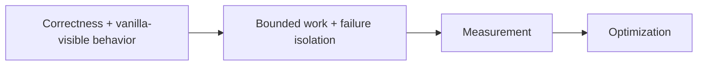
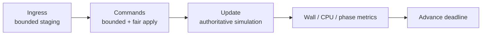
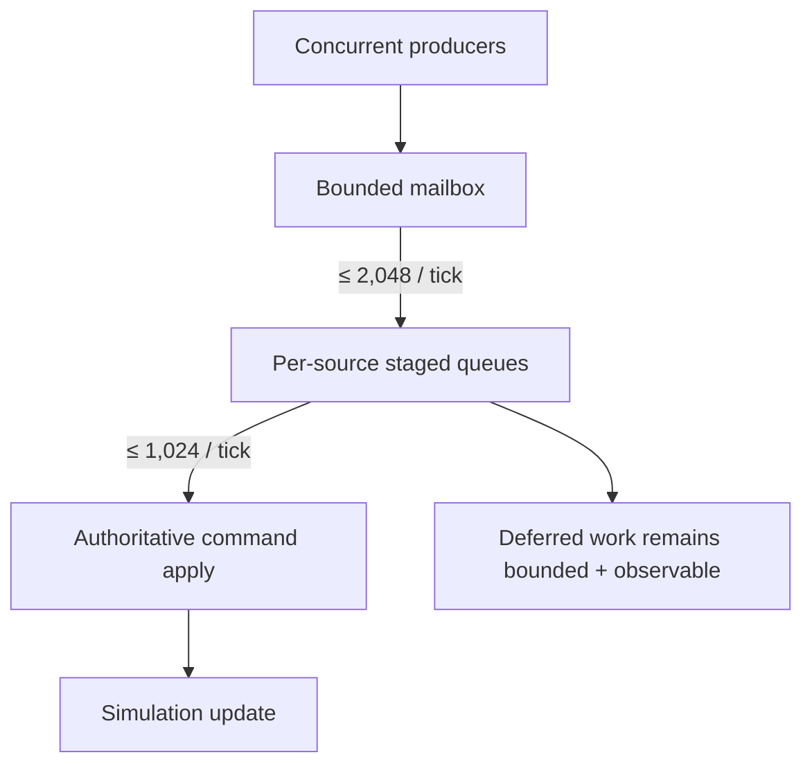
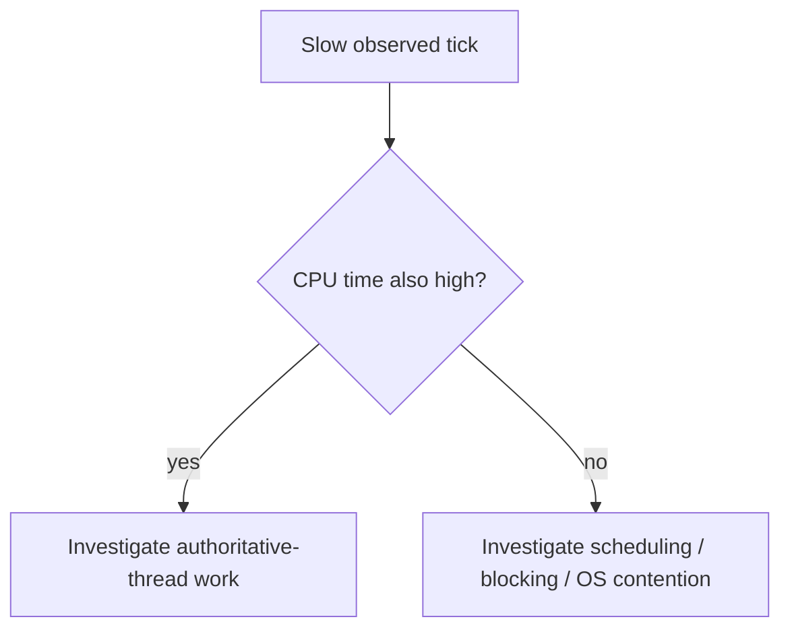
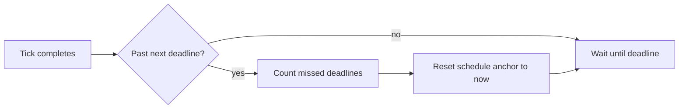
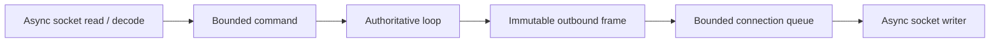
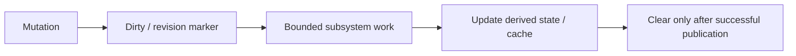

# Performance, tick scheduling and work budgets

[Русский](../ru/performance-runtime.md) · [Documentation](README.md) · [Architecture](architecture.md) · [Performance roadmap](../roadmap/performance-tick-stability.md)

## 1. Performance model

TerraRuntime treats performance as a correctness constraint around bounded work.

Optimization without measurement is a hypothesis, not a completed performance change.

## 2. Tick rate

The Terraria runtime baseline is `$60\,\mathrm{Hz}$`:

$$
T_{\mathrm{tick}}=\frac{1}{60}\,\mathrm{s}\approx16.67\,\mathrm{ms}.
$$

The generic loop accepts configured rates up to `$1000\,\mathrm{Hz}$`, but a higher generic frequency does not imply vanilla-correct gameplay at that rate.

## 3. Authoritative thread and phases

`AuthoritativeGameLoop<TState,TCommand>` owns mutable simulation state on the dedicated `TerraRuntime Game Loop` thread.

## 4. Default command budgets

| Budget | Default |
|---|---:|
| `CommandCapacity` | `$8\,192$` commands |
| `MaxCommandIngressPerTick` | `$2\,048\,\text{commands/tick}$` |
| `MaxCommandsPerTick` | `$1\,024\,\text{commands/tick}$` |
| `MaxCommandsPerSourcePerTick` | `$128\,\text{commands/source/tick}$` |
| `MaxPendingCommandsPerSource` | `$1\,024\,\text{commands/source}$` |

These are hard bounded defaults, not final measurement-derived values for every workload.

Per-source pending and per-tick quotas prevent one connection from occupying the entire shared capacity or monopolizing command application.

## 5. Optional CPU budget

`MaxCommandCpuMillisecondsPerTick` can impose an optional authoritative-thread CPU-time ceiling for command application. Operation-count limits remain active when thread CPU timing is unavailable.

No default CPU-time value is guessed; production values must be measurement-derived.

## 6. CPU versus wall time

Wall and CPU time answer different questions and must remain distinct.

## 7. Missed-tick policy

TerraRuntime does not run burst catch-up ticks.

This prevents one slow tick from causing a burst of immediate catch-up ticks and a backlog spiral.

## 8. Backlog observability

The loop tracks pending/deferred count, rejected commands, command-budget exhaustion, missed deadlines and oldest pending-command age. Stable queue depth with increasing oldest age is still starvation and must not be mistaken for healthy scheduling.

## 9. Asynchronous networking and workers

Slow TCP peers do not block simulation. CPU-heavy/blocking workers consume immutable snapshots or isolated buffers and return explicit completion data; unbounded `Task.Run` fan-out is not an architecture.

## 10. Saving

Disk serialization/write is detached from the authoritative hot path. Tile-save shadow synchronization advances at `$4\,\text{sections/tick}$` by default instead of copying the entire tile array in one pause.

## 11. Join/bootstrap performance

The current final pre-`packet 49` bootstrap contract is compact:

$$
F_{\mathrm{pre49,max}}=65,
\qquad
F_{\mathrm{probe}}=96.
$$

For default $P=8$, structural connection sizing gives

$$
F_{\mathrm{queue}}(8)=4\,077\ \text{frames},
$$

so

$$
65 < 96 < 4\,077.
$$

Runtime entity/global baselines are outside the final packet-10-to-packet-49 contract. Join section generation/compression still requires global subsystem budgets rather than per-player multiplication.

## 12. Synchronization scaling

Broad player movement fanout trends toward

$$
W(P)=\Theta(P^2),
$$

where $P$ is active players. Interest-management infrastructure exists, but production suppression remains passthrough until visibility transitions/resync are proven.

## 13. Dirty/revision-driven work

Dirty world sections, replication registries and prepared startup state should replace full scans where correctness permits. A fast stale cache is still a bug.

## 14. Allocation and GC discipline

Spans, owned/pooled buffers, immutable frame sharing and compact values are preferred where measured. `unsafe`, custom allocators and broad pooling require evidence of material benefit and memory-cost checks.

NativeAOT core cannot depend on JIT-specific performance assumptions. CoreCLR may use its runtime features without weakening the NativeAOT production gate.

## 15. Performance telemetry

Useful telemetry includes tick wall/CPU time, phase timing, command processed/deferred/rejected counts, budget exhaustion, oldest pending age, queue depth/high-water marks, slow-client events, entity counts, save state, startup/cache timing and safe allocation/GC metrics.

Telemetry itself must remain bounded and low-allocation.

## 16. Benchmark matrix

Useful scale checkpoints are

$$
P\in\{1,8,24,64,128,255\}.
$$

`$24$` players is the first meaningful realistic optimization baseline; `$255$` connections is a stress/scalability target. Idle, normal-play, join-burst, slow-reader and save workloads expose different bottlenecks.

## 17. Before/after rule

For target metric $M$, report both $M_{\mathrm{before}}$ and $M_{\mathrm{after}}$ on the same hardware/environment, world and workload. A percentage detached from underlying measurements is weak evidence.

Complexity that fails to materially improve its intended metric or harms memory/latency/correctness should be reverted.

## 18. Current limitations

Active work includes final measurement-derived queue limits, complete subsystem budgets, real production interest-management suppression/resync, complete packet allocation/throughput baselines, broad `$24$`-player / `$255$`-connection soak coverage, large-world startup/save/GC profiling and final section-cache/dirty synchronization tuning.

## 19. Change checklist

A performance/scheduler change is incomplete unless ownership remains explicit, work/fairness remain bounded, missed-tick behavior is tested, CPU and wall timing remain distinct, performance claims have before/after evidence, NativeAOT remains valid, diagrams use Mermaid, dimensional values/formulas use LaTeX, and this page changes together with `docs/ru/performance-runtime.md`.
