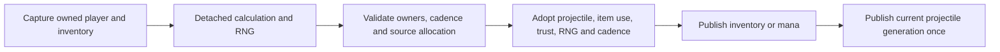

# Owned player item use 1.4.5.8

## Current remote phase — 2026-10-09

`ServerRuntimeState.Tick` now runs the bounded ordinary remote phase through `PlayerAuthority.TickRemotePlayerPhase`. It captures the full active census, plans physical slots `0`–`254` in ascending order on one retained `UpdatePlayers` cursor, and checks every captured member, inventory, indexed buff table, tile section and RNG before callback-free adoption. Slot `255` remains outside the source update loop. Typed world and projectile owners establish environment/grappling facts; optional callbacks cannot substitute different facts. An accepted phase replaces the separate health/animation tick for those players, avoiding a second regeneration or clock decrement. Remote drinking keeps source semantics: no second inventory debit and no invented health, mana, item-animation or buff report.

The admitted profile covers empty selection and eight ordinary potions with neutral represented equipment/environment. Living phases own mana regeneration/heat, selected-item clocks/release, potion delays, ordinary physics and projected current life. Dead, ghost and outside early returns preserve or reset only their source-selected fields. Source packet `12`/Spawn evidence preserves jump, Honey/Shimmer contacts and gravity where required while resetting Wet/Lava contacts. Constructor release-jump is false; ordinary packet `13` carries its actual gravity flag. Living no-wing updates retain `WingTime = 0`; explicit early-return imports retain their prior wing time. Both horizontal controls follow the source velocity branch.

An unsupported actor refuses the entire prepared census. The actual tick then retires shared RNG custody and all item/physics phase provenance: later packets `5`/`42`/`50`, reconnecting or rebinding the same RNG cannot recover unobserved source history. An empty pre-join tick preserves the seed/cursor without requiring world facts. Unsupported equipment, consumables, grappling and wider player phases remain outside this lane; it does not establish full `Main` scheduling or client RNG parity.

Release warnings-as-errors and 2,579 focused checks pass. The initial unfiltered run recorded 1,563,033 passed out of 1,563,035, one obsolete vitals assertion and one existing skip, with zero runner errors in $579.954\,\mathrm{s}$. The context-0 Revive fixture expected a dead player despite source-fresh projected life100 and reported life0; its expectation was corrected without changing production. Updated vitals/ownership checks pass11/11; final fast checks pass24,741/24,742 with one existing skip and no failures/errors. The old dead-state omission control fails as intended. All17 shipping DLLs are identical to those exercised by the initial full run, Native and live checks, so no second exhaustive run was performed.

Fresh shipping Windows NativeAOT/five smokes and Release/Native packet82/49 socket probes pass. The typed Native harness covers14 cases and38 actual `State.Tick` calls with zero errors; it excludes outside, slot255 and raw-cursor checks. Genuine Linux NativeAOT remains locally unverified. Results: `.cache/remote-player-phase-final-status.json`, `.cache/remote-player-phase-final-fast-tests/result.json`, `.cache/remote-player-phase-final-shipping-comparison.json`, `.cache/remote-player-phase-native-smoke/manifest.json` and `.cache/remote-player-phase-live-v1/results.json`.

Independent source comparisons include28 direct and28 actual `State.Tick` census passes,12 configured early returns, five actual packet13 velocity rows and three explicit wing-time early profiles over four passes. Seven focused Facts and eight meaningful omission controls pass after restoration, with zero runner errors. Exact scope/hashes: `.cache/remote-item-phase-tests/final-v8-freeze-manifest.json`; source census: `.cache/remote-item-phase-app-source-proof/manifest.json`; Spawn/vitals controls: `.cache/player-spawn-command-controls/status.json` and `.cache/player-vitals-spawn-controls/status.json`. Earlier tiny/non-solid scenes remain configured component evidence. The next phase is source-owned remote ItemCheck clocks for the eight bullet weapons and neutral buffs93/112; broader player/client-RNG compatibility remains open.

## Foundation history — 2026-10-08

Checkpoint validation: 772 focused checks and the unfiltered full suite pass (1,563,025 passed; one existing skip; no failures/errors). Fresh Windows NativeAOT and all five smoke paths pass; Release and Native socket probes retain packet82/49 ordering and two-client relay. Linux NativeAOT remains locally unverified. Explicit unknown/changed compact buff imports cannot inherit stale full slots. The combined player phase remains unscheduled; stored clocks are not yet continuously simulated.

Selected-consumable foundation checkpoint (2026-10-08): source-backed component planners cover eight ordinary healing/mana potions, the empty selected item, item clocks/release gating, mana heat and remote mana regeneration. The buff owner preserves all 44 indexed types and durations, source potion-sickness insertion and mana-sickness accumulation capped at 600. Actual source constructors remain distinct from configured warm inputs. Packet42 changes reported mana/base maximum without manufacturing missing clocks; packet41 updates only the reported animation. World transfers retain known item phase state and clone exact buff slots; imported payloads without phase state remain unknown.

Loaded world composition binds a separate persistent UpdatePlayers RNG using the exact saved seed text and actual world dimensions/surface/mode. Seed ownership does not establish the cursor after unrepresented updates. A source-world ordinary physics overload includes sky gravity and borders; Remix/Skyblock death producers remain outside that proposal. The combined Player.Update phase is not yet connected to the production tick. These components therefore do not establish complete remote item-use, inventory/ammunition authority or player scheduling parity. Existing runtime health/animation scheduling is retained pending verified atomic integration.

Independent component evidence includes source consumable/mana/lifecycle captures, actual AddBuff comparisons and 12 fully initialized world-physics profiles over three ticks. Earlier configured consumable captures used a tiny scene and incomplete solid-tile initialization: they remain phase-component evidence, not ordinary floor or full-world acceptance. Separate corrected Main.UpdateWorld_Players captures verify shared ascending census RNG ordering, but the new atomic runtime planner is preserved outside this checkpoint until tested.

## Existing ranged ownership

The ordinary bullet launch slice covers Minishark (`98`), Phoenix Blaster (`219`), Megashark (`533`), Chain Gun (`1929`), Boomstick (`964`), Shotgun (`534`), Tactical Shotgun (`679`) and Quad-Barrel Shotgun (`4703`). Minishark and Megashark consume their source spread offers; Chain Gun retains both early aim jitter and late velocity jitter. Shotgun and Boomstick retain their source count offers; Tactical emits six children and Quad-Barrel eight with the source nonlinear rotation. Item-specific prefix validity includes the source stat-rounding rules. Conservation offers execute once per use, including all applicable later offers after an earlier success or with endless ammunition.

For multiple children, the first packet `27` prepares a bounded proposal on a detached RNG cursor. Later source reports supply their exact keys in order. One proposal per player holds at most eight reports for one weapon-use cadence window. Duplicate identical reports are idempotent; conflicting reports, stale player/inventory/equipment/buffs, changed RNG or expiry refuse the proposal without adopting a partial volley. Before adoption, every reported full key is rechecked: a key occupied while the proposal was pending rejects the volley and preserves its existing projectile. This is the existing strict server-RNG policy: recovery of bounded aim intent does not establish ownership of the client's original `MouseWorld` or `Main.rand`. Honest shots outside that represented cursor remain outside strict combat trust; complete client RNG reconciliation remains open.

The complete use adopts all source-ordered allocations, one ammunition debit, trust, RNG, cadence and final wire baselines before outward callbacks. Every immutable accepted birth is published, including intermediate generations replaced in the same physical slot. Replacement does not invent packet `29`; a joining peer receives only the final live baselines in physical slots `0`–`999`. The retained source overflow slot `1000` is representable with capacity `1001` and publishes its birth to connected peers, but source `MessageBuffer` case `8` excludes it from initial join replay. It also stays outside ordinary projectile update and PvE/PvP hit loops. Smaller capacities keep their bounded allocation refusal. A callback that replaces accepted state preserves the newer actor and identity; accepted ammo and RNG are not rewound.

[Русский](../ru/player-item-use-1458.md) · [Combat calculation](combat-damage.md)

Additional functional accessory slots use the same source usability rules in the common combat calculation. Armor index `8` (packet-5 slot `67`) requires the retained Demon Heart flag and effective Expert mode; index `9` (slot `68`) requires effective Master mode independently of Demon Heart. Good World increases effective difficulty before these checks. Locked slots contribute no item or prefix effects. Unknown Demon Heart ownership refuses a selected Expert slot rather than inferring an unlock. Human and server-player equipment use the destination runtime's mode and the current player's appearance.

An empty active functional slot can inherit its first favorited item from the three inactive loadouts in source order. An incompatible first favorite ends the search; a later loadout cannot replace it. Actual active equipment, vanity duplicates, wing/incompatibility groups and first favorites in earlier empty accessory slots participate in selection. Locked active slots can still block another slot's inherited choice, although they grant no benefits. Selected admitted items retain their own prefixes and ordinary armor-set effects without moving or consuming the inactive item. Human and server-player combat consumers use the same selection. The dedicated host binds the constructor-empty vanity armor of source-local slot `255`, which its shared player slot pool reserves; isolated contexts must explicitly own those three identities for inherited armor. Source armor compatibility reads `Main.LocalPlayer`, while accessory compatibility reads the actual actor. Unknown selected metadata or required local armor remains untrusted. Real packet-5 loadout changes invalidate existing prepared item uses through the retained player/profile guards.

Projectile item-use preparation retains the player's revision alongside inventory, equipment and buffs. A changed packet-4 profile advances that revision and invalidates the prepared use before ammo, mana, projectile generation or RNG adoption.

Ordinary projectile and explosion hits recheck the attacker after damage-roll callbacks before applying PvE or PvP damage. Direct PvP item hits also recheck the selected inventory and target revision. A refused stale hit does not change target health, penetration or immunity. Supplied external random callbacks retain their own draw state; these checks do not rewind an arbitrary external `Random`. Server-player projectile damage uses the same equipment calculation and refuses unsupported gear instead of applying baseline bonuses.

The common equipment calculator admits all eight ordinary metal armor sets and their Ancient Iron/Gold helmet alternatives: 26 pieces and ten complete-set combinations. Complete defense is 6/7/9/11/13/15/16/20 for Copper/Tin/Iron/Lead/Silver/Tungsten/Gold/Platinum. Mixed pieces retain individual defense. PvE, PvP and server players use the same existing combat snapshot. Wrong slots, armor prefixes, unknown equipment and unowned complete endgame sets retain their gates; vanity grants no combat effects, while compatible inherited functional items follow the selection above.

Strict projectile item use captures the exact connection/player, inventory serial, equipment and buffs before calculation. Conservation is prepared on a clone of the existing shared `UnifiedRandom`: Celebration Mk2 (`3930`, `Next(2)`) precedes the applicable Magic Quiver, Ammo Box and Ammo Reservation offers; the selected Minishark, Megashark or Chain Gun offer follows them. Endless ammo still performs applicable draws. Only the first accepted Celebration volley child owns conservation and consumption. An ordinary bullet volley likewise owns one conservation decision and ammunition debit for the whole use. Earlier unsupported compatible ammo is never skipped.

Preparation does not advance a generation or invoke sinks. Rejected stale owners, allocation, cadence or RNG preserve the item-use state. The successful adoption tail has no external callbacks; inventory/mana, combat trust, projectile, RNG and cadence are complete before publication. Subsequent deliberate callback mutations are not overwritten. Projectile publication is single-use and refuses a generation retired or replaced by a callback. Public ordinary spawning retains the existing source full-pool replacement/overflow behavior. The transaction also protects already admitted standalone thrown and channeled magic sources.

Source births own empty buff slots. Known Ammo Box (`93`) and Ammo Reservation (`112`) contribute their source conservation offers. The exact order is Celebration `Next(2)`, applicable Quiver `Next(5)`, Box `Next(5)`, Potion `Next(5)`, then the selected weapon offer: Minishark `Next(3) == 0`, Megashark `Next(2) == 0`, or Chain Gun `Next(3) != 0`. An earlier successful offer never skips later draws, including for endless ammunition. Weapon count and spread offers follow conservation on the same detached cursor. Duplicate buff slots produce one effect flag and one offer. Packet 50 retains duration 60; the dedicated server does not locally decrease remote player buff time. Death clears the nonpersistent slots; effect fields become clear at the following reset/buff phase. Missing imported buff ownership remains unknown and cannot gain strict ranged combat trust.

Tungsten Bullet (`4915`) uses existing projectile `14`: damage 9, knockback 4, ammo speed 4.5 and consumable semantics. The admitted neutral bullet subset is Musket Ball, Silver Bullet, Tungsten Bullet and Endless Musket Pouch. This adds no inferred special projectile or status behavior. Independent dedicated-server captures cover 32 ammo uses and four lifecycle snapshots; compact tests compare consumption, next RNG, retained slots and Tungsten gun launch math. Copied controls detect omitted Box/Potion draws, wrong ordering, early conservation return, skipped endless draws and the missing Tungsten entry.

Conservation armor, cycling, animation-dependent families, other ammo transforms, potion/bag use, complete item-use parity and complete player-update RNG phase ordering remain separate work. No new item-use packet is introduced. Source `StatusNPC` effects for already-admitted Fire Arrow (`2`) and other status-producing projectiles remain a separate NPC-hit boundary; this ammo extension does not claim their complete NPC status parity.

Independent original armor defaults/grants/set effects and `Player.PickAmmo` captures accompany compact regression tests and failing controls. Command tests cover stale inventory/equipment/player/RNG, connection reuse, capacity, cadence, first-callback state, callback mutation retention, endless ammo, Celebration children and adjacent mana/standalone use.

Previous armor/atomic checkpoint: full 1562839/1562840, focused 98/98, fast tier, zero failures/errors and one existing liquid skip; Windows NativeAOT/five smokes and all local gates pass. Linux NativeAOT remains locally unverified.

Ammo conservation checkpoint: full 1562851/1562852, focused 110/110, fast 24558/24559; zero failures/errors, one existing liquid skip. Fresh Windows NativeAOT/five smokes and local gates pass. Genuine Linux NativeAOT remains locally unverified.
