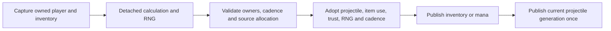

# Owned player item use 1.4.5.8

## Ordinary bows and incoming combat — 2026-10-10, accepted local checkpoint

The accepted combined block extends the existing remote style5 phase to nine ordinary bows: `39`, `99`, `3480`, `3486`, `3492`, `3498`, `3504`, `3510`, `3516`. Their source manual-release clocks share the gun implementation; HasAmmo selects the existing arrow family across inventory slots `0`–`57`. This phase does not shoot or debit arrows. Selected raw crit uses the same source-valid prefix gate, with explicit Linux/Windows arithmetic. Wooden Bow is `39`; item `5` is Mushroom.

Human world incoming mitigation is connected to the retained whole combat projection. Target capture occurs before hit randomness and is checked again before mutation. Missing or retired phase custody refuses a hit; current equipment does not reconstruct it. A trusted standalone component policy remains explicit. Unsupported actors still retire the entire shared human phase census. Local acceptance passes within these limits; the accepted checkpoint below is historical.

## Derived combat fields and defensive accessories — 2026-10-09, accepted local checkpoint

The owned item phase now retains the existing nullable combat projection. It covers source defense, armor penetration, NoKnockback and class crit, with the represented final mana heat/Mana Sickness magic-damage writer. Selected-item and equipment reports do not recompute these fields. Constructor/Ghost reset and dead/outside preservation match independent whole-field source observations; unknown imports remain unknown. Projectile NPC combat consumes the retained projection. Incoming player mitigation, direct melee and PvP still use their existing equipment projections and are not included in this acceptance claim.

Whole remote-phase equipment admission is pinned to the existing neutral metal family plus Cobalt Shield `156` and Shark Tooth Necklace `3212`, with prefixes `0`, `62`–`65`, `67`–`68`. The common equipment calculator continues to own slot gates, the captured Demon Heart flag and inherited/favorite selection. Arcane `66`, Ankh Shield `1613` and unrepresented effect writers remain excluded. An unsupported active actor still retires the shared player stream and the entire human phase census. Independent source comparisons and local validation pass within these limits; earlier checkpoints below remain dated history.

Independent repeated original captures cover58 platform profiles/696 updates (648 admitted runtime comparisons,48 excluded reference updates), all20 combat fields and full56 RNG arrays/cursor,44 buffs and existing life/mana/motion/clocks. Four Facts and eight meaningful omission controls pass after restoration; malformed transfer refuses inventory/profile writes. Fresh potion110 affects magic damage from its newly offered94 on the following phase. Duration94 over1200 falls outside this nonnegative magic-damage representation.

Release warnings-as-errors/focused357 pass. The one unfiltered full passes 1563075/1563076, zero failures/errors and one known canonical-liquid skip in $472.563\,\mathrm{s}$; it includes the mandatory fast tier and all affected matrices. Fresh shipping WindowsNativeAOT/five smokes and a separate typed Native648 actual State.Tick updates/four exclusions/25,802 checks pass. Native checks whole fields and typed refusal-cursor equality; private full56/cursor differential remains managed-only. All32 references match the exact exercised shipping snapshot. Fresh Release/Native live82/49 pass with15 sections/client,312 frames before49, confirmed129/relay/chat82 and clean stop. CI-tool/documentation/graph/domain/diff gates pass; no new dependency/project edge. Genuine LinuxNativeAOT remains locally unverified; GitHub CI is not awaited.

## Expanded authoritative bullet prefixes - 2026-10-09, accepted local checkpoint

The eight represented ordinary bullet weapons now plan all 256 source-valid weapon/prefix identities. The explicit Linux/CoreCLR and Windows CLR4/x86 arithmetic profiles preserve Item.Prefix damage rounding and the source Chain Gun/Quad Barrel speed calculations. Packet27 carries no platform discriminator, so admission retains at most two complete candidates from the same captured player, inventory and detached RNG cursor. Each accepted volley uses one whole surviving candidate, one ammunition decision and one cursor adoption; child reports cannot independently select different candidate fields. When both complete profiles remain indistinguishable within the established report interval, the shorter represented use period wins; this identifies no client platform. Cadence retains the accepted use period across later weapon selection rather than recomputing it from the incoming weapon.

Independent repeated original Shoot captures cover 512 profiles. Four Game Facts compare resolved item stats, raw selected crit, ordered source velocity bits, ammunition and the full RNG state; nine omission controls detect regressions. Inverse aim recovery and network admission retain their existing float representation bounds; these do not identify the client's hardware or establish ownership of its MouseWorld or Main.rand. Combined local acceptance is recorded below. Proofs `.cache/bullet-prefix-launch-next-proof/manifest.json`, `.cache/bullet-prefix-direct-memory-bits-proof/manifest.json`, `.cache/windows-quad-xna-stage-proof/manifest.json` and `.cache/bullet-prefix-game-work/final-freeze-manifest.json`.

## Retained selected-item crit — 2026-10-09, accepted local checkpoint

The selected phase retains the source melee, ranged and magic crit fields together. A selected-item report does not refresh these fields; an admitted living player phase does. Projectile NPC combat consumes the retained class value instead of combining a former selected bonus with current equipment. Constructor and Ghost reset values are `4/4/4`; dead and outside updates preserve prior values. Unknown imported values remain unknown until a source-owned overwrite, and transfer rejects negative represented values before membership or inventory writes. Equipment-only direct-melee and PvP projections remain separate.

Four phase/transfer Facts compare 18 configured original phase traces and three early-return histories with 12 player updates. Four hit Facts additionally compare 18 source-born Blue Slime and four source-born Demon Eye hits, including literal packet28 frames, life and all56 RNG entries. These use independently seeded player, launch and hit components: remote player updates precede configured local-owner Shoot/private-hit calls. They establish neither complete dedicated Projectile.Update nor client RNG ownership. Nine copied App omission controls detect regressions with zero runner errors and restored positives, including mutation of retained crit from the actual lethal-loot provider after the initial owner capture. Two existing State.Tick fixtures now bind a separate known empty-selected player phase, preserving their NPC/Projectile goldens; adjacent checks pass18/18. Combined local acceptance is recorded below.

Retiring an unsupported player phase also retires its crit provenance. Unrepresented equipment cannot supply a guessed baseline4; independently owned derived-equipment crit for broader gear remains open. Proofs: `.cache/selected-prefix-crit-next-proof/manifest.json`, `.cache/selected-crit-early-next-proof/manifest.json`, `.cache/selected-prefix-crit-born-next-proof/manifest.json`, `.cache/selected-prefix-crit-demon-eye-born-next-proof/manifest.json` and `.cache/selected-item-crit-tests/consumer-final-freeze-manifest.json`. Earlier accepted checkpoints remain history.

## Combined local validation — 2026-10-09

Release warnings-as-errors/focused353 pass. The one unfiltered full executed1,563,072 tests:1,563,070 passed, one obsolete physical-sentinel fixture failed, zero runner errors and one known canonical-liquid skip, runner $579.385\,\mathrm{s}$. The rejected run is preserved. Test-only repair supplies a separately owned neutral player phase and accepted interior movement/collision poses; the attached-world bounds had rejected the old100/100 reports. Original physical999/1000 expectations remain. Corrected sentinel2/2 and adjacent positive/restored5/5 pass; the copied old-pose control fails one assertion with zero errors. Final mandatory fast passes 24778/24779, zero failures/errors, one known skip. No second exhaustive run: all32 production DLLs, the other1,018 test PDB source documents and all318 embedded resources match the binaries exercised by the original full run.

Fresh shipping WindowsNativeAOT/five smokes, separate typed Native512 launch profiles/1,880 children/29,501 checks plus crit/hit/guard scenarios, and fresh Release/Native live82/49 pass. Each live client receives15 sections/312 frames before49; packet129, relay and chat82 are confirmed and processes stop cleanly. No new production dependency or project edge. Genuine LinuxNativeAOT remains locally unverified; GitHub CI is not awaited. Configured source components do not establish complete Main scheduling or arbitrary client RNG ownership.

The current next slice is retained derived combat fields and defensive accessories156/3212. Broader item, equipment, shared-player-stream and client RNG compatibility remain open.

## Accepted remote style1 and expanded gun-prefix clocks — 2026-10-09

The accepted combined block extends the retained remote phase to the verified 80 mining tools and 21 wood/metal broadswords, and to 256 valid gun/prefix combinations from 288 independent original requests. Clock admission remains separate from the authoritative launch/combat prefix mask. Independent Linux and genuine Windows Framework captures cover 128 style1 histories and 256 gun-prefix histories per platform; carried-clock supplements cover fresh use, renewal, empty selection and dead/ghost/outside returns. These are source-scoped player updates, without remote picking, melee hits, Shoot, inventory debit or complete client RNG ownership.

`ToolTime` and `AttackCD` are nullable fields of the existing retained item phase, with explicit constructor zeroes and preserved transfer provenance. The common source phase ages attack cooldown after the outside return and before dead/ghost handling. Genuine StartActualUse resets attack cooldown for tools, swords, guns and potions; mining starts set tool time to one. Style1 auto-reuse can perform a fresh start after clearing animation1, whereas remote style5 renewal extends animation directly. Unknown clocks remain unknown. Independent source captures preserve 200 remote melee cooldown entries and item-location observations; the runtime does not model or assert those fields.

Projectile-use capture now includes exact retained item-phase equality. Pending child delivery can refresh only from an exact owned pose/item-phase pair, with unchanged input stamp, member, inventory and profiles. Real phase retirement clears that proof. The direct `TickRemotePlayerPhase` regression isolates retirement without a new input epoch; the full `State.Tick` regression also checks proof clearing, while its fallback can advance the input epoch. Combined local acceptance passes. Independent source evidence resides in `.cache/remote-style1-next-proof/manifest.json`, `.cache/remote-all-ranged-prefix-next-proof/manifest.json`, `.cache/remote-crossfamily-clock-next-proof/manifest.json` and `.cache/remote-style1-early-clock-next-proof/manifest.json`; pending-owner controls are in `.cache/pending-retained-item-tests/status-v2.json`. Earlier accepted equipment/prefix evidence remains below.

Six isolated Facts compare 49,252 actual runtime player phases: 128×64 style1 and 256×64 gun-prefix profiles on each platform, plus 88 cross-family and 12 early-return phases. They also test all 32 source-rejected prefix requests and real detach/attach preservation of constructor, carried and unknown clocks; negative transfers refuse before membership or inventory mutation. Eight Game, five App and three retained-pending omission controls detect regressions with zero runner errors and restored positives. Evidence: `.cache/remote-style1-game-controls/final-freeze-manifest.json`, `.cache/style1-app-controls/status.json` and `.cache/remote-style1-prefix-app-tests/final-freeze-manifest.json`. The known unsupported Muramasa identity replaces the now-admitted Iron Pickaxe in two historical refusal fixtures, with actual inventory assertions; independent two-class migration checks pass15/15 without changing goldens.

Release warnings-as-errors and coherent focused335/335 pass. The single unfiltered full run passes 1,563,054/1,563,055 with zero failures/runner errors and one known skip. Five fresh shipping Windows Native smokes and Release/Native packet82/49 live probes pass; all32 compared DLLs match the frozen snapshot exercised by typed Native555 profiles/26,766 ticks. Results: `.cache/remote-style1-prefix-phase-v3-status.json`, `.cache/remote-style1-allprefix-native-smoke/manifest-v2.json` and `.cache/remote-style1-prefix-phase-live-v3/results.json`. Independent runtime comparisons cover49,252 player phases;16 meaningful omission controls and the old15-test fixture migration pass after restoration. Genuine Linux NativeAOT remains locally unverified; GitHub CI was not awaited. The next source-owned slice is authoritative admission of the172 additional launch-prefix profiles and current selected-weapon critical-chance custody. Broader inventory, combat/buffs, events and complete client RNG ownership remain open.

## Accepted neutral metal equipment and prefixed remote clocks — 2026-10-09, 0ce969b6

The remote player phase now admits the proven 26 metal armor pieces, ten complete-set profiles and matching metal vanity positions. It reuses the common equipment calculator, pins the admitted identities, and requires a baseline combat profile apart from defense. Inherited functional armor is limited to those pieces and the source first-favorite sharing branch, with an owned empty local-player vanity context. A known inactive Copper Broadsword can stop that search without becoming equipped armor; other unrepresented equipment remains fenced.

The eight admitted bullet weapons also retain the represented ranged prefix clocks. An immutable world fact selects the original Linux single-precision or Windows Framework arithmetic; four Quad-Barrel Shotgun prefix profiles differ by one animation tick. This does not add remote shooting, ammunition debit, reports or arbitrary client RNG ownership.

Six isolated Facts compare 12,408 actual runtime player phases with independent original captures: 80 armor profiles, 84 Linux and 84 Windows prefix profiles, six admitted inherited profiles, ten blocker profiles and 31 vanity profiles. The nonempty local-player vanity reference is retained as an unsupported-context refusal. The final armor corpus uses actual packet 5 ingress plus original localization initialization: the missing-initialization capture cleared items during source relay and remains preserved as rejected evidence. No source names or localization assets are included. Complete RNG snapshots, inventory, life/mana, movement and retained clocks are checked; the Windows corpus compares its captured fields only.

Source evidence: `.cache/neutral-metal-player-phase-next-proof/manifest.json`, `.cache/remote-prefixed-bullet-next-proof/manifest.json`, its `windows-framework/manifest.json`, and the inherited/blocker/vanity whole-player proof directories. Targeted results are in `.cache/remote-equipment-phase-tests/positive-v5.xml`; five meaningful prefix controls are recorded in `.cache/remote-item-phase-work/prefix-final-freeze-manifest.json`. Two App controls each produce two assertion failures, with zero runner errors and restored 6/6 results, in `.cache/neutral-equipment-app-controls/status.json`. A separate typed Windows NativeAOT harness using the same shipping DLLs covers 237 profiles and 7,524 actual State.Tick calls with zero errors in `.cache/remote-prefix-metal-native-smoke/manifest-v1.json`. Combined acceptance passes: Release warnings-as-errors/focused 327/327; unfiltered full 1,563,046/1,563,047 with zero failures/errors and one known skip; fresh shipping Windows NativeAOT/five smokes and Release/Native packet82/49 live checks. Results `.cache/remote-equipment-phase-v1-status.json` and `.cache/remote-equipment-phase-live-v1/results.json`; these comparisons establish the bounded remote phase, not full `Main` scheduling or complete equipment compatibility. The preceding accepted checkpoint remains history below.

## Current remote bullet phase — 2026-10-09, accepted local results

The actual `ServerRuntimeState.Tick` remote phase now adds ItemCheck clocks and presentation for eight bullet weapons (98, 219, 533, 1929, 964, 534, 679, 4703), with represented neutral buffs 93/112 and the source Cursed-use gate. It preserves release, auto-reuse, animation/time, item rotation and `PendingItemReuse` across actual packets 13/41 and potion-to-gun selection. Remote ItemCheck neither calls Shoot/PickAmmo nor debits ammunition or invents reports. The existing full ascending census, typed environment, single UpdatePlayers stream, no-double-health/clocks and unknown-cursor retirement boundaries remain in force.

Pending Shotgun child delivery can cross a verified owned remote phase at one or two ticks. Reconciliation uses the exact phase watermark while retaining the same member, input stamp, inventory, equipment/appearance and buff provenance, then performs a fresh strict commit check. It does not relax global snapshot currentness. Five accepted children consume one ammo (20→19) and the retained source RNG once; nine negative scenarios preserve refusal. Unknown phase history or changed input/owners cannot use this exception. Evidence: `.cache/pending-bullet-phase-tests/status.json` and `.cache/pending-volley-interior-source-proof/manifest.json`; the latter is one original Shoot profile with a translated interior pose, not general client-RNG reconciliation.

Independent source comparisons cover 41×64 bullet phases plus two common pending-reuse profiles×64: 2,752 actual State.Tick comparisons with full RNG checkpoints, unchanged inventory and no remote projectile/report emission. Ammo readiness adds 12 profiles×12 original updates (144 calls); all 6,195 positive item IDs are classified against the actual source, including the exact 16-item bullet set. Source paths: `.cache/remote-bullet-item-phase-next-proof/manifest.json`, `.cache/remote-common-pending-next-proof/manifest.json`, `.cache/remote-check-ammo-boundaries-proof/manifest.json` and `.cache/source-bullet-classification-audit/manifest.json`.

The seven accepted remote-phase Facts remain adjacent coverage. Their obsolete weapon-98 refusal expectation was migrated to an actually unsupported item; the original census now compares all 32 direct and 32 actual Tick passes, with all three historical golden files unchanged. New four Facts and adjacent 11/11 pass. Six Game, two App and one common-Pending omission controls each fail meaningfully and pass after restoration with zero runner errors. Two pending-delivery controls also detect old strict refusal and an unsafe watermark. Exact own hashes/results: `.cache/remote-bullet-item-phase-tests/final-freeze-manifest.json`, `.cache/remote-item-phase-work/bullet-game-controls/status.json` and `.cache/remote-item-phase-work/common-pending-controls-v3/status.json`.

Release warnings-as-errors and coherent focused 272/272 pass. The unfiltered full suite passes 1,563,040/1,563,041 with zero failures/runner errors and one known skip in $538.669\,\mathrm{s}$. Fresh shipping Windows NativeAOT/five smokes, typed Native 26 cases/680 actual State.Tick calls and Release/Native packet82/49 live checks pass. The typed Native harness excludes outside, slot255 and raw player-cursor comparisons; genuine Linux NativeAOT remains locally unverified. CI tools/documentation/production graph/domain/diff gates and source-unchanged checks pass. Results: `.cache/remote-bullet-phase-v1-status.json`, `.cache/remote-bullet-phase-native-smoke/manifest.json` and `.cache/remote-bullet-phase-live-v1/results.json`. Source/test SHA256 `240b972893dc2a128034333d937244bbcb490344b828992d5bc4b91586169f35`; shipping Native SHA256 `4ed00c44319b04893f6e0bba2d83f698ae7e50a822d2c216e455b542868e6224`.

Next source work is bounded neutral armor admission (26 metal pieces and 10 full-set arrangements, including two ancient helmets) and prefixed eight-gun clock effects. Existing combat facts alone do not admit those whole player phases. Full Main scheduling, complete equipment/consumable behavior and arbitrary client RNG ownership remain open. Earlier accepted checkpoints remain dated history below.

## Accepted remote phase history — 2026-10-09, 66ca811b

`ServerRuntimeState.Tick` now runs the bounded ordinary remote phase through `PlayerAuthority.TickRemotePlayerPhase`. It captures the full active census, plans physical slots `0`–`254` in ascending order on one retained `UpdatePlayers` cursor, and checks every captured member, inventory, indexed buff table, tile section and RNG before callback-free adoption. Slot `255` remains outside the source update loop. Typed world and projectile owners establish environment/grappling facts; optional callbacks cannot substitute different facts. An accepted phase replaces the separate health/animation tick for those players, avoiding a second regeneration or clock decrement. Remote drinking keeps source semantics: no second inventory debit and no invented health, mana, item-animation or buff report.

The admitted profile covers empty selection and eight ordinary potions with neutral represented equipment/environment. Living phases own mana regeneration/heat, selected-item clocks/release, potion delays, ordinary physics and projected current life. Dead, ghost and outside early returns preserve or reset only their source-selected fields. Source packet `12`/Spawn evidence preserves jump, Honey/Shimmer contacts and gravity where required while resetting Wet/Lava contacts. Constructor release-jump is false; ordinary packet `13` carries its actual gravity flag. Living no-wing updates retain `WingTime = 0`; explicit early-return imports retain their prior wing time. Both horizontal controls follow the source velocity branch.

An unsupported actor refuses the entire prepared census. The actual tick then retires shared RNG custody and all item/physics phase provenance: later packets `5`/`42`/`50`, reconnecting or rebinding the same RNG cannot recover unobserved source history. An empty pre-join tick preserves the seed/cursor without requiring world facts. Unsupported equipment, consumables, grappling and wider player phases remain outside this lane; it does not establish full `Main` scheduling or client RNG parity.

Release warnings-as-errors and 2,579 focused checks pass. The initial unfiltered run recorded 1,563,033 passed out of 1,563,035, one obsolete vitals assertion and one existing skip, with zero runner errors in $579.954\,\mathrm{s}$. The context-0 Revive fixture expected a dead player despite source-fresh projected life100 and reported life0; its expectation was corrected without changing production. Updated vitals/ownership checks pass11/11; final fast checks pass24,741/24,742 with one existing skip and no failures/errors. The old dead-state omission control fails as intended. All17 shipping DLLs are identical to those exercised by the initial full run, Native and live checks, so no second exhaustive run was performed.

Fresh shipping Windows NativeAOT/five smokes and Release/Native packet82/49 socket probes pass. The typed Native harness covers14 cases and38 actual `State.Tick` calls with zero errors; it excludes outside, slot255 and raw-cursor checks. Genuine Linux NativeAOT remains locally unverified. Results: `.cache/remote-player-phase-final-status.json`, `.cache/remote-player-phase-final-fast-tests/result.json`, `.cache/remote-player-phase-final-shipping-comparison.json`, `.cache/remote-player-phase-native-smoke/manifest.json` and `.cache/remote-player-phase-live-v1/results.json`.

Independent source comparisons include28 direct and28 actual `State.Tick` census passes,12 configured early returns, five actual packet13 velocity rows and three explicit wing-time early profiles over four passes. Seven focused Facts and eight meaningful omission controls pass after restoration, with zero runner errors. Exact scope/hashes: `.cache/remote-item-phase-tests/final-v8-freeze-manifest.json`; source census: `.cache/remote-item-phase-app-source-proof/manifest.json`; Spawn/vitals controls: `.cache/player-spawn-command-controls/status.json` and `.cache/player-vitals-spawn-controls/status.json`. Earlier tiny/non-solid scenes remain configured component evidence. The next phase is source-owned remote ItemCheck clocks for the eight bullet weapons and neutral buffs93/112; broader player/client-RNG compatibility remains open.

## Foundation history — 2026-10-08

Checkpoint validation: 772 focused checks and the unfiltered full suite pass (1,563,025 passed; one existing skip; no failures/errors). Fresh Windows NativeAOT and all five smoke paths pass; Release and Native socket probes retain packet82/49 ordering and two-client relay. Linux NativeAOT remains locally unverified. Explicit unknown/changed compact buff imports cannot inherit stale full slots. The combined player phase remains unscheduled; stored clocks are not yet continuously simulated.

Selected-consumable foundation checkpoint (2026-10-08): source-backed component planners cover eight ordinary healing/mana potions, the empty selected item, item clocks/release gating, mana heat and remote mana regeneration. The buff owner preserves all 44 indexed types and durations, source potion-sickness insertion and mana-sickness accumulation capped at 600. Actual source constructors remain distinct from configured warm inputs. Packet42 changes reported mana/base maximum without manufacturing missing clocks; packet41 updates only the reported animation. World transfers retain known item phase state and clone exact buff slots; imported payloads without phase state remain unknown.

Loaded world composition binds a separate persistent UpdatePlayers RNG using the exact saved seed text and actual world dimensions/surface/mode. Seed ownership does not establish the cursor after unrepresented updates. A source-world ordinary physics overload includes sky gravity and borders; Remix/Skyblock death producers remain outside that proposal. The combined Player.Update phase is not yet connected to the production tick. These components therefore do not establish complete remote item-use, inventory/ammunition authority or player scheduling parity. Existing runtime health/animation scheduling is retained pending verified atomic integration.

Independent component evidence includes source consumable/mana/lifecycle captures, actual AddBuff comparisons and 12 fully initialized world-physics profiles over three ticks. Earlier configured consumable captures used a tiny scene and incomplete solid-tile initialization: they remain phase-component evidence, not ordinary floor or full-world acceptance. Separate corrected Main.UpdateWorld_Players captures verify shared ascending census RNG ordering, but the new atomic runtime planner is preserved outside this checkpoint until tested.

## Existing ranged ownership

The ordinary bullet launch slice covers Minishark (`98`), Phoenix Blaster (`219`), Megashark (`533`), Chain Gun (`1929`), Boomstick (`964`), Shotgun (`534`), Tactical Shotgun (`679`) and Quad-Barrel Shotgun (`4703`). Minishark and Megashark consume their source spread offers; Chain Gun retains both early aim jitter and late velocity jitter. Shotgun and Boomstick retain their source count offers; Tactical emits six children and Quad-Barrel eight with the source nonlinear rotation. Item-specific prefix validity includes the source stat-rounding rules. Conservation offers execute once per use, including all applicable later offers after an earlier success or with endless ammunition.

For multiple children, the first packet `27` prepares a bounded proposal on a detached RNG cursor. Later source reports supply their exact keys in order. One proposal per player holds at most eight reports for one weapon-use cadence window. Duplicate identical reports are idempotent; conflicting reports, stale player/inventory/equipment/buffs, changed RNG or expiry refuse the proposal without adopting a partial volley. Before adoption, every reported full key is rechecked: a key occupied while the proposal was pending rejects the volley and preserves its existing projectile. This is the existing strict server-RNG policy: recovery of bounded aim intent does not establish ownership of the client's original `MouseWorld` or `Main.rand`. Honest shots outside that represented cursor remain outside strict combat trust; complete client RNG reconciliation remains open.

The complete use adopts all source-ordered allocations, one ammunition debit, trust, RNG, cadence and final wire baselines before outward callbacks. Every immutable accepted birth is published, including intermediate generations replaced in the same physical slot. Replacement does not invent packet `29`; a joining peer receives only the final live baselines in physical slots `0`–`999`. The retained source overflow slot `1000` is representable with capacity `1001` and publishes its birth to connected peers, but source `MessageBuffer` case `8` excludes it from initial join replay. It also stays outside ordinary projectile update and PvE/PvP hit loops. Smaller capacities keep their bounded allocation refusal. A callback that replaces accepted state preserves the newer actor and identity; accepted ammo and RNG are not rewound.

[Русский](../ru/player-item-use-1458.md) · [Combat calculation](combat-damage.md)

Additional functional accessory slots use the same source usability rules in the common combat calculation. Armor index `8` (packet-5 slot `67`) requires the retained Demon Heart flag and effective Expert mode; index `9` (slot `68`) requires effective Master mode independently of Demon Heart. Good World increases effective difficulty before these checks. Locked slots contribute no item or prefix effects. Unknown Demon Heart ownership refuses a selected Expert slot rather than inferring an unlock. Human and server-player equipment use the destination runtime's mode and the current player's appearance.

An empty active functional slot can inherit its first favorited item from the three inactive loadouts in source order. An incompatible first favorite ends the search; a later loadout cannot replace it. Actual active equipment, vanity duplicates, wing/incompatibility groups and first favorites in earlier empty accessory slots participate in selection. Locked active slots can still block another slot's inherited choice, although they grant no benefits. Selected admitted items retain their own prefixes and ordinary armor-set effects without moving or consuming the inactive item. Human and server-player combat consumers use the same selection. The dedicated host binds the constructor-empty vanity armor of source-local slot `255`, which its shared player slot pool reserves; isolated contexts must explicitly own those three identities for inherited armor. Source armor compatibility reads `Main.LocalPlayer`, while accessory compatibility reads the actual actor. Unknown selected metadata or required local armor remains untrusted. Real packet-5 loadout changes invalidate existing prepared item uses through the retained player/profile guards.

Projectile item-use preparation retains the player's revision alongside inventory, equipment and buffs. A changed packet-4 profile advances that revision and invalidates the prepared use before ammo, mana, projectile generation or RNG adoption.

Ordinary projectile and explosion hits recheck the attacker after damage-roll callbacks before applying PvE or PvP damage. Direct PvP item hits also recheck the selected inventory and target revision. A refused stale hit does not change target health, penetration or immunity. Supplied external random callbacks retain their own draw state; these checks do not rewind an arbitrary external `Random`. Server-player projectile damage uses the same equipment calculation and refuses unsupported gear instead of applying baseline bonuses.

The common equipment calculator admits all eight ordinary metal armor sets and their Ancient Iron/Gold helmet alternatives: 26 pieces and ten complete-set combinations. Complete defense is 6/7/9/11/13/15/16/20 for Copper/Tin/Iron/Lead/Silver/Tungsten/Gold/Platinum. Mixed pieces retain individual defense. PvE, PvP and server players use the same existing combat snapshot. Wrong slots, armor prefixes, unknown equipment and unowned complete endgame sets retain their gates; vanity grants no combat effects, while compatible inherited functional items follow the selection above.

Strict projectile item use captures the exact connection/player, inventory serial, equipment and buffs before calculation. Conservation is prepared on a clone of the existing shared `UnifiedRandom`: Celebration Mk2 (`3930`, `Next(2)`) precedes the applicable Magic Quiver, Ammo Box and Ammo Reservation offers; the selected Minishark, Megashark or Chain Gun offer follows them. Endless ammo still performs applicable draws. Only the first accepted Celebration volley child owns conservation and consumption. An ordinary bullet volley likewise owns one conservation decision and ammunition debit for the whole use. Earlier unsupported compatible ammo is never skipped.

Preparation does not advance a generation or invoke sinks. Rejected stale owners, allocation, cadence or RNG preserve the item-use state. The successful adoption tail has no external callbacks; inventory/mana, combat trust, projectile, RNG and cadence are complete before publication. Subsequent deliberate callback mutations are not overwritten. Projectile publication is single-use and refuses a generation retired or replaced by a callback. Public ordinary spawning retains the existing source full-pool replacement/overflow behavior. The transaction also protects already admitted standalone thrown and channeled magic sources.

Source births own empty buff slots. Known Ammo Box (`93`) and Ammo Reservation (`112`) contribute their source conservation offers. The exact order is Celebration `Next(2)`, applicable Quiver `Next(5)`, Box `Next(5)`, Potion `Next(5)`, then the selected weapon offer: Minishark `Next(3) == 0`, Megashark `Next(2) == 0`, or Chain Gun `Next(3) != 0`. An earlier successful offer never skips later draws, including for endless ammunition. Weapon count and spread offers follow conservation on the same detached cursor. Duplicate buff slots produce one effect flag and one offer. Packet 50 retains duration 60; the dedicated server does not locally decrease remote player buff time. Death clears the nonpersistent slots; effect fields become clear at the following reset/buff phase. Missing imported buff ownership remains unknown and cannot gain strict ranged combat trust.

Tungsten Bullet (`4915`) uses existing projectile `14`: damage 9, knockback 4, ammo speed 4.5 and consumable semantics. The admitted neutral bullet subset is Musket Ball, Silver Bullet, Tungsten Bullet and Endless Musket Pouch. This adds no inferred special projectile or status behavior. Independent dedicated-server captures cover 32 ammo uses and four lifecycle snapshots; compact tests compare consumption, next RNG, retained slots and Tungsten gun launch math. Copied controls detect omitted Box/Potion draws, wrong ordering, early conservation return, skipped endless draws and the missing Tungsten entry.

Conservation armor, cycling, animation-dependent families, other ammo transforms, potion/bag use, complete item-use parity and complete player-update RNG phase ordering remain separate work. No new item-use packet is introduced. Source `StatusNPC` effects for already-admitted Fire Arrow (`2`) and other status-producing projectiles remain a separate NPC-hit boundary; this ammo extension does not claim their complete NPC status parity.

Independent original armor defaults/grants/set effects and `Player.PickAmmo` captures accompany compact regression tests and failing controls. Command tests cover stale inventory/equipment/player/RNG, connection reuse, capacity, cadence, first-callback state, callback mutation retention, endless ammo, Celebration children and adjacent mana/standalone use.

Previous armor/atomic checkpoint: full 1562839/1562840, focused 98/98, fast tier, zero failures/errors and one existing liquid skip; Windows NativeAOT/five smokes and all local gates pass. Linux NativeAOT remains locally unverified.

Ammo conservation checkpoint: full 1562851/1562852, focused 110/110, fast 24558/24559; zero failures/errors, one existing liquid skip. Fresh Windows NativeAOT/five smokes and local gates pass. Genuine Linux NativeAOT remains locally unverified.
