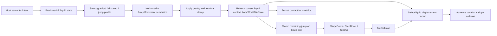

# Authoritative player physics

[Русский](../ru/player-physics.md) · [Documentation](README.md) · [Host interfaces](host-interfaces.md) · [Architecture](architecture.md)

This page documents the currently verified ordinary, unmounted, normal-gravity server-player physics path in TerraRuntime. The reference is the pinned official `TerrariaServer 1.4.5.8` build used by the repository reference probes.

## Ownership

TerraRuntime owns final player position, velocity, collision response, jump counter/release gate and liquid-contact history. A trusted host supplies semantic horizontal and jump intent only. It does not supply liquid state or final motion vectors.

The one-tick distinction between the **previous** and **current** liquid state is intentional. In vanilla `Player.Update`, gravity/jump parameters are selected before `JumpMovement()`, while wet/honey/shimmer contact is refreshed later, before collision dispatch. Entry into liquid therefore uses the previous dry gravity/jump profile for that tick but already uses liquid collision displacement. The refreshed state becomes the profile input for the next authoritative tick.

## Base geometry

The currently verified base player hitbox is:

\[
W = 20\ \text{px},\qquad H = 42\ \text{px}.
\]

Tiles use the vanilla runtime size:

\[
T = 16\ \text{px}.
\]

Liquid contact is derived from `WorldTileStore` through `VanillaWorldCollision.GetLiquidContacts`; hosts do not set `Wet`, `Lava`, `Honey` or `Shimmer` flags directly.

## Motion profiles

After selecting the medium-specific `maxFallSpeed`, Terraria adds \(0.01\) before ordinary movement. TerraRuntime mirrors that value rather than rounding it back to the nominal baseline.

| Previous-tick state | Gravity | Effective max fall speed | Jump speed | Jump height |
| --- | ---: | ---: | ---: | ---: |
| dry | \(0.4\) | \(10.01\) | \(5.01\) | \(15\) ticks |
| water / lava | \(0.2\) | \(5.01\) | \(6.01\) | \(30\) ticks |
| honey | \(0.1\) | \(3.01\) | \(5.01\) | \(15\) ticks |
| shimmer contact | \(0.15\) | \(10.01\) | \(5.51\) | \(23\) ticks |

Shimmer has priority over the other wet flags for the ordinary profile. Honey keeps the base jump profile while changing gravity and terminal fall speed. Lava uses the ordinary water movement profile in this slice; lava damage/debuff semantics are separate gameplay work.

## Jump state and liquid transitions

`ServerPlayerJumpIntent.Held` and `Released` remain button-level semantics. TerraRuntime owns the vanilla jump counter and release gate.

When an active jump remains held, `JumpMovement` reasserts the jump speed selected from the previous-tick medium and decrements the remaining jump counter. A newly started grounded jump uses that medium's jump height. Releasing jump clears the remaining counter and rearms the release gate.

When the refreshed current contact changes from wet to dry, vanilla limits the remaining jump counter to one fifth of the active medium's jump height:

\[
J_{next}=\min\left(J_{remaining},\left\lfloor\frac{J_{height}}{5}\right\rfloor\right).
\]

For ordinary water this produces a maximum remaining counter of \(6\) ticks, honey \(3\), and shimmer \(4\).

## Collision displacement

Current liquid contact selects the position-advance factor after `TileCollision`:

| Current contact | Position factor |
| --- | ---: |
| dry | \(1\) |
| water / lava | \(0.5\) |
| honey | \(0.25\) |
| shimmer | \(0.375\) |

The factor scales position advance, not persisted collision velocity. If tile collision changes one velocity axis, the clamped axis advances by the collision result without applying the liquid factor again. This mirrors vanilla `Player.WetCollision` behavior.

## Generation safety

Previous liquid state is stored in a fixed player-slot-indexed table owned by the authoritative physics stepper. Every entry also stores the full `PlayerHandle`. If a slot is reused with a new generation, the handle no longer matches and the replacement player starts from dry previous-tick state. Stale liquid history therefore cannot cross a player generation, while storage remains bounded by the 256 runtime player slots.

## Explicitly outside the verified slice

The following are not claimed complete by this page: mounts, reversed gravity, grapples, wings, extra jumps, auto-jump, flipper swimming, `ShouldFloatInWater`, merman/trident movement, shimmer transformation, lava damage/debuffs, drowning, water-walking equipment and accessory-specific movement modifiers.

The G6-D roadmap item for complete source-backed movement/collision/gravity/jump/liquid semantics remains open until the required ordinary semantics and supported exclusions are fully proven by executable tests/CI.
