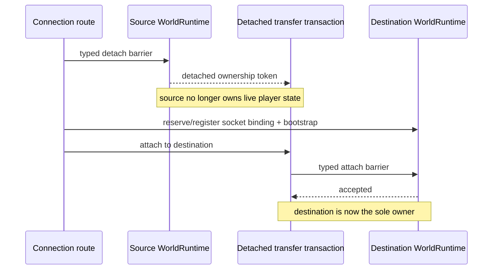

# Player runtime ownership

[Русский](../ru/player-runtime-ownership.md) · [Architecture](architecture.md)

## Ownership rule

A connected player's mutable gameplay state is owned by exactly one `WorldRuntime` authoritative loop at a time. Socket routing, operator commands and sandbox control code do not receive player stores or mutable transfer payloads.

Normal packet handling enters the owning runtime through typed authoritative commands. Cross-runtime movement uses the same rule rather than temporarily making connection code a second state owner.

## Layer ownership

Player data now follows the same dependency direction as the rest of the runtime:

- `TerraRuntime.Contracts.Runtime` owns detached player commit DTOs such as `PlayerAppearanceCommitRequest`, `PlayerMovementCommitRequest`, `PlayerSpawnCommitRequest`, equipment and vitals requests;
- `TerraRuntime.Gameplay.Players` owns source-backed vanilla normalization and validation that does not retain mutable runtime state;
- `TerraRuntime.Core` owns the authoritative ingress contracts and shared execution mechanics;
- `TerraRuntime.Core.Players` owns server-player slot identities and mutable server-player state stores, keeping player-specific mechanics out of the flat Core namespace;
- application composition owns connection admission, anti-cheat/history policy and the concrete authoritative command routing; its world-owned `ServerPlayerAuthority` is the sole application-level owner that combines server-player lifecycle, semantic control intents, physics progression and replication events.

Packet-5 signed net-id compatibility conversion is owned by the application ingress boundary in `PlayerEquipmentPacket5Normalizer`. Core receives canonical positive item identities and validates server-owned inventory state directly; Gameplay remains free of wire compatibility arithmetic.

## Cross-runtime transfer

A Level 1 transfer has three distinct ownership phases:

`RuntimePlayerTransferTransaction` keeps the detached `RuntimePlayerTransferState` private. `RuntimeConnectionRoute` can read only the small routing projection it needs, such as the player name, and can request one of three terminal actions:

- attach the player to a destination `WorldRuntime`;
- restore the exact detached state to the source runtime after a failed move;
- discard the detached state during an intentional disconnect.

The transaction is single-use. After attach, restore or discard, another terminal action is rejected. This makes accidental double ownership and reuse of a detached payload explicit failures instead of implicit shared-state behavior.

## Failure semantics

Destination slot reservation happens before the source detach barrier where possible. Once the source has detached the player, any later routing/bootstrap/attach failure must restore the source authoritative state before normal play resumes.

The route never reaches into another runtime's player dictionary, inventory store or transfer-profile store. All mutable-state transitions cross `RuntimePlayerTransferIngress`, so the destination game loop remains the only code allowed to install transferred state.

World-space position is not portable player state across different worlds. A successful cross-runtime transfer always installs the destination world's floor-tile spawn; the authoritative top-left position follows Terraria 1.4.5.8: `X = spawnX * 16 + 8 - playerWidth / 2`, `Y = spawnY * 16 - playerHeight`. The previous coordinates are retained only for rollback into the same source runtime when a transfer fails. This is independent of `forceRespawn`: an ordinary drag/move into a sandbox also arrives at that world's spawn. Initial join still ends its bootstrap with packet 49, but a live cross-world transfer is already in vanilla connection state 10, where packet 49 does not invoke `Player.Spawn`; replacement-world bootstrap therefore ends with an explicit packet 12 `PlayerSpawn` carrying the destination `SpawnX/SpawnY`. Packet 12 is the final world-handoff frame inside the atomic bootstrap batch; post-attach global baselines such as packet 82 may follow it but carry no world/position state.

Same-runtime respawn uses the same detach/attach transaction. That keeps respawn and sandbox movement on one ownership model instead of maintaining a second mutation path. Once an inbound client packet 12 is accepted as a respawn, it is relayed to other playing connections but is not echoed back to the originating connection: that client already performed its spawn transition, and replaying the same spawn can retrigger the local transition and form a feedback loop. Respawn also clears pre-death transient movement flags and invalidates the retained packet-13 baseline; teleport invalidates that baseline for the same reason. A later AOI resync therefore cannot replay a pre-respawn/pre-teleport position before the next fresh movement packet arrives.

Client-owned appearance, equipment, movement and health replication retains exact-generation baselines. If a later update encodes to the same bytes, it is not fanned out again to peers; movement duplicates are suppressed only while the interest/visibility membership is unchanged. Duplicate packet-16 health updates are also coalesced for peers, while an authoritative owner health correction deliberately bypasses that suppression for the owner itself. Authoritative NPC packet-23 and projectile packet-27 updates use the same generation-safe exact-wire coalescing: runtime-only revision/timer changes that do not alter the encoded state do not produce another broadcast, while spawn/despawn and any changed wire state still relay immediately. This is exact-state coalescing rather than timer-based throttling.

## Runtime GodMode ownership

GodMode is an authoritative, generation-scoped runtime flag that mirrors vanilla `CreativePowers.GodmodePower`. It is set only through the typed trusted-host/TUI administration boundary, travels with the detached Level-1 transfer state for the same live connection, and is discarded on disconnect. It is not persisted. Server→client synchronization uses vanilla net-module packet 82 (`SyncOnePlayer` on changes and `SyncEveryone` as a baseline). An inbound client packet 82 is not authority and cannot enable GodMode by itself.

When the flag is enabled, authoritative PvP, NPC contact and admitted hostile NPC-projectile damage return before HP/immunity mutation, while the vanilla client itself avoids the normal `Player.Hurt` path, so Hurt-based sources produce neither HP loss nor knockback. The old packet-16 heal-back, owner-health repair, movement-correction epoch and GodMode-specific packet-13 suppression have been removed completely; there is no fallback path. The `MISS` combat text remains presentation-only. Terraria 1.4.5.8 drowning is a separate edge because it decrements `statLife` directly rather than going through normal `Player.Hurt`; TerraRuntime intentionally does not reintroduce a hidden heal-back to mask that vanilla behavior.
