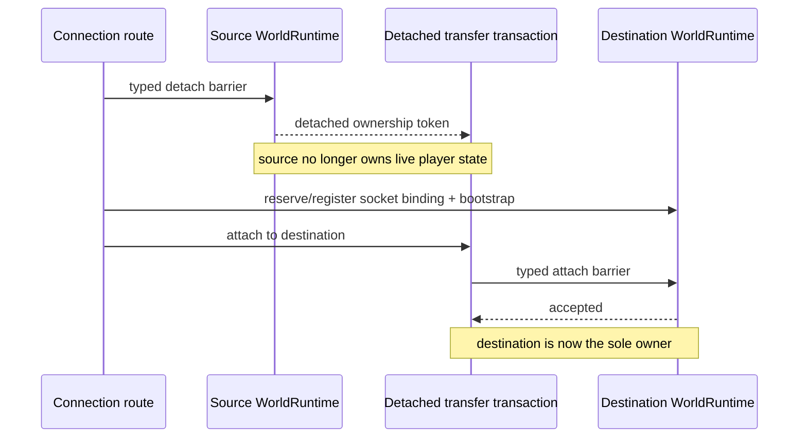

# Player runtime ownership

[Русский](../ru/player-runtime-ownership.md) · [Architecture](architecture.md)

## Ownership rule

A connected player's mutable gameplay state is owned by exactly one `WorldRuntime` authoritative loop at a time. Socket routing, operator commands and sandbox control code do not receive player stores or mutable transfer payloads.

Normal packet handling enters the owning runtime through typed authoritative commands. Cross-runtime movement uses the same rule rather than temporarily making connection code a second state owner.

## Layer ownership

Player data now follows the same dependency direction as the rest of the runtime:

- `TerraRuntime.Contracts.Runtime` owns detached player commit DTOs such as `PlayerAppearanceCommitRequest`, `PlayerMovementCommitRequest`, `PlayerSpawnCommitRequest`, equipment and vitals requests;
- `TerraRuntime.Gameplay.Players` owns source-backed vanilla normalization and validation that does not retain mutable runtime state;
- `TerraRuntime.Core` owns the authoritative ingress contracts and shared execution mechanics;
- `TerraRuntime.Core.Players` owns server-player slot identities and mutable server-player state stores, keeping player-specific mechanics out of the flat Core namespace;
- application composition owns connection admission, anti-cheat/history policy and the concrete authoritative command routing; its world-owned `ServerPlayerAuthority` is the sole application-level owner that combines server-player lifecycle, semantic control intents, physics progression and replication events.

Packet-5 signed net-id compatibility conversion is owned by the application ingress boundary in `PlayerEquipmentPacket5Normalizer`. Core receives canonical positive item identities and validates server-owned inventory state directly; Gameplay remains free of wire compatibility arithmetic.

## Cross-runtime transfer

A Level 1 transfer has three distinct ownership phases:

`RuntimePlayerTransferTransaction` keeps the detached `RuntimePlayerTransferState` private. `RuntimeConnectionRoute` can read only the small routing projection it needs, such as the player name, and can request one of three terminal actions:

- attach the player to a destination `WorldRuntime`;
- restore the exact detached state to the source runtime after a failed move;
- discard the detached state during an intentional disconnect.

The transaction is single-use. After attach, restore or discard, another terminal action is rejected. This makes accidental double ownership and reuse of a detached payload explicit failures instead of implicit shared-state behavior.

## Failure semantics

Destination slot reservation happens before the source detach barrier where possible. Once the source has detached the player, any later routing/bootstrap/attach failure must restore the source authoritative state before normal play resumes.

The route never reaches into another runtime's player dictionary, inventory store or transfer-profile store. All mutable-state transitions cross `RuntimePlayerTransferIngress`, so the destination game loop remains the only code allowed to install transferred state.

Same-runtime respawn uses the same detach/attach transaction. That keeps respawn and sandbox movement on one ownership model instead of maintaining a second mutation path.
