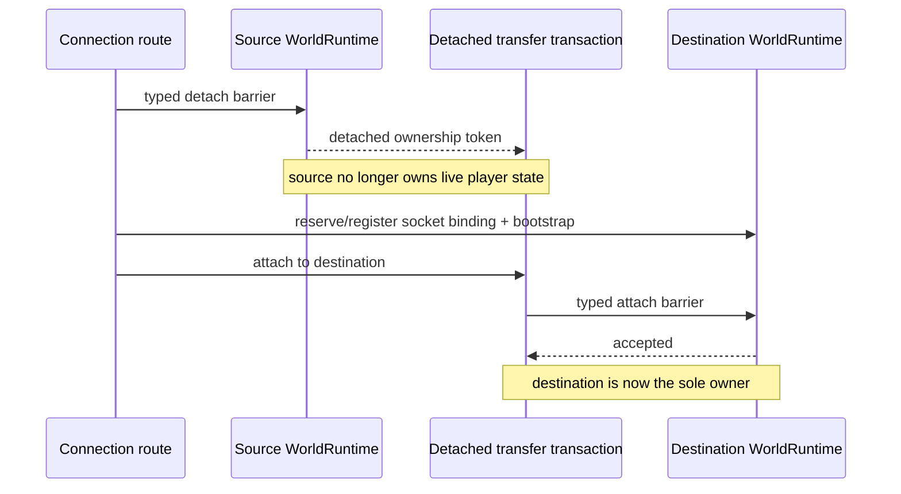

# Player runtime ownership

Eleventh integrated local acceptance: 1553881/1553882 tests, zero failures/errors, one existing worldgen skip; clean Release rebuild, Windows NativeAOT/five smokes and local gates. See [NPC parity checkpoint](../roadmap/npc-ai-parity.md). Earlier candidate/pending notes below are historical for their respective checkpoints. Full gameplay/NPC parity remains open.

Tenth integrated local acceptance: 1474709/1474710 tests, zero failures/errors, one existing worldgen skip; clean Release rebuild, Windows NativeAOT/five smokes and local gates. See [NPC parity checkpoint](../roadmap/npc-ai-parity.md). Earlier candidate/pending notes below are historical for their respective checkpoints. Broad parity remains open.

2026-10-05: human and server-owned player lifetimes now attach/reset the NPC raw-slot view through their real membership transitions. Generation and membership serials reject disconnect/rejoin ABA; slot255 retains its source constructor state. Server-owned health retains constructor base maximum100 and generation-owned debuff flags, commits derived maximum and flags together, and exposes held inventory slots to town topics. NPC heart eligibility consumes the current derived maximum; live unknown health selectively rejects a selected heart offer. Item eligibility retains whole-player captures and an inventory mutation serial, including misses and restored inventory values. These changes add no persistent world-file fields. Dynamic Skyblock lowTiles and an open Void Bag with incomplete imported storage remain unknown and selectively fence Zombie Sickle offers.

`PlayerStateSnapshot.HasMount` represents activation separately from the mount identity. Producers must set it for every active mount, including type zero; setting only `MountType` does not activate a mount. Movement commands obtain it from the normalized packet-presence bit. Snapshot replication, NPC geometry and preserved-position transfers consume it; respawn and destination spawn placement clear it. This is transient player state and adds no world-file field.

[Русский](../ru/player-runtime-ownership.md) · [Architecture](architecture.md)

## Ownership rule

A connected player's mutable gameplay state is owned by exactly one `WorldRuntime` authoritative loop at a time. Socket routing, operator commands and sandbox control code do not receive player stores or mutable transfer payloads.

Normal packet handling enters the owning runtime through typed authoritative commands. Cross-runtime movement uses the same rule rather than temporarily making connection code a second state owner.

## Layer ownership

Player data now follows the same dependency direction as the rest of the runtime:

- `TerraRuntime.Contracts.Runtime` owns detached player commit DTOs such as `PlayerAppearanceCommitRequest`, `PlayerMovementCommitRequest`, `PlayerSpawnCommitRequest`, equipment and vitals requests;
- `TerraRuntime.Gameplay.Players` owns source-backed vanilla normalization and validation that does not retain mutable runtime state;
- `TerraRuntime.Core` owns the authoritative ingress contracts and shared execution mechanics;
- `TerraRuntime.Core.Players` owns server-player slot identities and mutable server-player state stores, keeping player-specific mechanics out of the flat Core namespace;
- application composition owns connection admission, anti-cheat/history policy and the concrete authoritative command routing; its world-owned `ServerPlayerAuthority` is the sole application-level owner that combines server-player lifecycle, semantic control intents, physics progression and replication events.

Packet-5 signed net-id compatibility conversion is owned by the application ingress boundary in `PlayerEquipmentPacket5Normalizer`. Core receives canonical positive item identities and validates server-owned inventory state directly; Gameplay remains free of wire compatibility arithmetic.

## Cross-runtime transfer

A Level 1 transfer has three distinct ownership phases:

```mermaid
sequenceDiagram
    participant Route as Connection route
    participant Source as Source WorldRuntime
    participant Tx as Detached transfer transaction
    participant Destination as Destination WorldRuntime

    Route->>Source: typed detach barrier
    Source-->>Tx: detached ownership token
    Note over Source,Tx: source no longer owns live player state
    Route->>Destination: reserve/register socket binding + bootstrap
    Route->>Tx: attach to destination
    Tx->>Destination: typed attach barrier
    Destination-->>Tx: accepted
    Note over Tx,Destination: destination is now the sole owner
```

`RuntimePlayerTransferTransaction` keeps the detached `RuntimePlayerTransferState` private. `RuntimeConnectionRoute` can read only the small routing projection it needs, such as the player name, and can request one of three terminal actions:

- attach the player to a destination `WorldRuntime`;
- restore the exact detached state to the source runtime after a failed move;
- discard the detached state during an intentional disconnect.

The transaction is single-use. After attach, restore or discard, another terminal action is rejected. This makes accidental double ownership and reuse of a detached payload explicit failures instead of implicit shared-state behavior.

## Failure semantics

Destination slot reservation happens before the source detach barrier where possible. Once the source has detached the player, any later routing/bootstrap/attach failure must restore the source authoritative state before normal play resumes.

The route never reaches into another runtime's player dictionary, inventory store or transfer-profile store. All mutable-state transitions cross `RuntimePlayerTransferIngress`, so the destination game loop remains the only code allowed to install transferred state.

World-space position is not portable player state across different worlds. A successful cross-runtime transfer always installs the destination world's floor-tile spawn; the authoritative top-left position follows Terraria 1.4.5.8: `X = spawnX * 16 + 8 - playerWidth / 2`, `Y = spawnY * 16 - playerHeight`. The previous coordinates are retained only for rollback into the same source runtime when a transfer fails. This is independent of `forceRespawn`: an ordinary drag/move into a sandbox also arrives at that world's spawn. Initial join still ends its bootstrap with packet 49, but a live cross-world transfer is already in vanilla connection state 10, where packet 49 does not invoke `Player.Spawn`; replacement-world bootstrap therefore ends with an explicit packet 12 `PlayerSpawn` carrying the destination `SpawnX/SpawnY`. Packet 12 is the final world-handoff frame inside the atomic bootstrap batch; post-attach global baselines such as packet 82 may follow it but carry no world/position state.

Terraria 1.4.5.8 `Player.Spawn(SpawningIntoWorld)` can set the client's personal `SpawnX/SpawnY` to `-1/-1` when `FindSpawn`/`CheckSpawn` does not find a valid personal spawn, and the multiplayer client then sends packet 12 back. During an active replacement-world landing gate TerraRuntime consumes that immediate `SpawningIntoWorld` packet as the synthetic handoff echo instead of treating it as another authoritative respawn. The destination attach therefore remains at the destination world spawn and the echo cannot overwrite the movement-correction target with upper-left coordinates. Ordinary post-join respawn packet 12 handling is unchanged.

Vanilla inventory slot `58` is `Main.mouseItem`, so it is not copied blindly across a live world handoff. Before detach, an occupied cursor slot is moved exactly once into an empty main-inventory slot `0..49` and slot 58 is cleared in the detached image. If no empty main slot exists, transfer aborts before detach and leaves the source state unchanged. The destination explicitly publishes the cleared cursor before the normalized inventory, and packet-5 echoes received while the replacement-world landing gate is active cannot restore the stale cursor item. Repeated primary/sandbox transfers therefore preserve the item total without duplicating or losing the cursor stack.

The live handoff prepends packet-23 despawns for active NPCs from the source runtime before replacement `WorldData`, so source-world entities cannot remain as client-side ghosts in the destination. After the batch is admitted, a landing gate rejects and corrects delayed packet-13 coordinates from the source world until the client reports a position near the destination spawn. Normal movement is also checked at both the connection boundary and the authoritative world writer against the Terraria 1.4.5.8 `Player.BordersMovement` `$640\,\mathrm{px}$` edge band. Out-of-bounds samples never become authoritative or drive section streaming; the connection receives the last accepted position instead. Synthetic test worlds too small to contain both edge bands use body-inside-world bounds only.

Same-runtime respawn uses the same detach/attach transaction. That keeps respawn and sandbox movement on one ownership model instead of maintaining a second mutation path. Once an inbound client packet 12 is accepted as a respawn, it is relayed to other playing connections but is not echoed back to the originating connection: that client already performed its spawn transition, and replaying the same spawn can retrigger the local transition and form a feedback loop. Respawn also clears pre-death transient movement flags and invalidates the retained packet-13 baseline; teleport invalidates that baseline for the same reason. A later AOI resync therefore cannot replay a pre-respawn/pre-teleport position before the next fresh movement packet arrives.

Client-owned appearance, equipment, movement and health replication retains exact-generation baselines. If a later update encodes to the same bytes, it is not fanned out again to peers; movement duplicates are suppressed only while the interest/visibility membership is unchanged. Duplicate packet-16 health updates are also coalesced for peers, while an authoritative owner health correction deliberately bypasses that suppression for the owner itself. Authoritative NPC packet-23 and projectile packet-27 updates use the same generation-safe exact-wire coalescing: runtime-only revision/timer changes that do not alter the encoded state do not produce another broadcast, while spawn/despawn and any changed wire state still relay immediately. This is exact-state coalescing rather than timer-based throttling.

## Runtime GodMode ownership

GodMode is an authoritative, generation-scoped runtime flag that mirrors vanilla `CreativePowers.GodmodePower`. It is set only through the typed trusted-host/TUI administration boundary, travels with the detached Level-1 transfer state for the same live connection, and is discarded on disconnect. It is not persisted. Server→client synchronization uses vanilla net-module packet 82 (`SyncOnePlayer` on changes and `SyncEveryone` as a baseline). An inbound client packet 82 is not authority and cannot enable GodMode by itself.

When the flag is enabled, authoritative PvP, NPC contact and admitted hostile NPC-projectile damage return before HP/immunity mutation, while the vanilla client itself avoids the normal `Player.Hurt` path, so Hurt-based sources produce neither HP loss nor knockback. The old packet-16 heal-back, owner-health repair, movement-correction epoch and GodMode-specific packet-13 suppression have been removed completely; there is no fallback path. The `MISS` combat text remains presentation-only. Terraria 1.4.5.8 drowning is a separate edge because it decrements `statLife` directly rather than going through normal `Player.Hurt`; TerraRuntime intentionally does not reintroduce a hidden heal-back to mask that vanilla behavior.

## Remote stealth ownership (packet 84)

`RuntimePlayerMember.Stealth` defaults to `1`, matching the original `Player` constructor. Packet 84 enters the bound world's typed command queue with the authenticated connection slot and generation; its claimed player byte never selects another member. Finite values in `[0,1]` are admitted, while malformed frames and non-finite/out-of-range values are rejected before mutation. This range restriction is an ingress policy stricter than the original raw `ReadSingle`.

The world owns this value until disconnect. Same-generation respawn preserves it because original `Player.Spawn` does not assign stealth. A detached transfer carries nullable `PlayerStateSnapshot.Stealth`: an owned zero remains zero, while an absent projection (including a default struct) initializes the destination to one. Invalid projections reject before inventory or membership admission. Accepted authoritative PvE/PvP `Hurt` commits reset stealth to one and emit the peer update; GodMode, immunity and other rejected hits leave it unchanged. Client packet-16 health snapshots do not imply a `Hurt`.

Packet 84 relays accepted updates to playing peers excluding the sender. `NetMessage.SyncOnePlayer` sends no packet 84, so joining peers receive no invented stealth baseline. Generation ownership is retained in world member state, not a socket-side cache. This scope carries remote visibility for NPC conversation; it does not simulate Shroomite/Vortex equipment updates, local item-use stealth resets or stealth damage modifiers.

`PlayerStealth1458Tests` covers original executable wire vectors, authenticated ingress, bounds, generation rejection, nullable transfer, respawn and accepted/rejected damage. Original `TerrariaServer 1.4.5.8` `NetMessage.SendData(84)` emitted `080054070000803E` for slot 7 / 0.25; original server `MessageBuffer.GetData` rewrote forged slot 199 to sender 7, preserving slot 199. Original `Player.Hurt` returned zero and retained 0.25 under immunity, and returned ten damage with stealth one on acceptance.

Packet 41 now has a connection-owned item-animation clock and finite item rotation. The client slot claim is discarded; stale connections and player generations cannot mutate the current member. Nullable snapshot fields preserve the distinction between an absent projection and an observed zero. Valid transfers that retain the world position preserve the live clock. Accepted death and the dead-player tick clear animation; packet-12 Spawn itself preserves animation and rotation even for a representable dead state, as verified by the original binary. The custom transfer policy resets animation when it resets position or transfers a dead state; this is not attributed to vanilla Spawn. Before NPC simulation, ordinary ItemCheck decrements the clock once; a released Revolver decrements twice. Frozen, Webbed, Stoned and Shimmer buff snapshots clear the clock through the source CCed gate. These observations serve NPC visibility only; they do not authorize item attacks, channel effects, damage, or combat modifiers. Server-owned item-use presentation sets the same owned clock and reads its own selected inventory for the Revolver rule.

NPC target candidates now receive the owned packet-41 animation and packet-84 stealth. Packet-13 MiscFlags2 bit 6 remains lastItemUseAttemptSuccess and cannot substitute for an animation. Dead players and accepted respawns also clear TalkNPC and the shop session before town NPC scheduling. Independent original-binary probes verified packet bytes, authenticated slot replacement, the ordinary 9 to 8 clock, released Revolver 9 to 7, and frozen/webbed/stoned 9 to 0.

Packet `134` retains eight client-reported luck components only for the authenticated connection generation. `RuntimePlayerMember.Luck` defaults to the genuine constructor value zero; optional components distinguish absence from a represented all-zero packet. Recalculation combines these components with the retained packet-4 Galaxy Pearl flag, loaded Lantern Night fact and owned packet-50 Stinky presence. Missing Lantern ownership leaves new factor updates unadmitted. Alive remote players age ladybug time and positive coin luck at the admitted ordinary day rate; dead players return before this update. Same-generation spawn preserves the components, replacement starts empty, and custom transfer retains them and recalculates against destination world facts. Nonfinite components or a nonfinite result reject before revision/relay. The source peer relay excludes its sender and adds no invented join baseline. Dynamic Lantern orchestration, accelerated luck timers and server reconstruction of client equipment/torch factors remain open.

## Remote biome context (packet36)

Authenticated packet36 now owns all five raw zone bytes and the source byte townNPCs for the exact connection/player generation. The claimed wire slot is discarded before command admission; malformed lengths stop before queueing, while mailbox pressure drops this replaceable observation. Accepted game-thread commits advance the member revision once and relay to playing peers excluding the sender. Every source byte value is preserved without deriving zones from terrain or clamping town count. These observations do not authorize NPC spawns or change natural-spawn trust.

The original Player constructor proves known-clear zones/town count for new membership. Twenty-four original Spawn cases across all four contexts, alive/dead and byte0/1/255 preserve all five zones and town count197. Same-generation respawn and transfer retain observations; a missing imported nullable projection remains unknown. Replacement membership starts from genuine source constructor values, and retired commands cannot write it. No source-absent packet36 join/transfer replay is synthesized; source clients send on changes and every900 network ticks.

The source false→true zone5 Shimmer edge invokes SpawnFaelings. An already active physical NPC677 makes its first AnyNPCs check return with no RNG; that path is admitted. Without it, the entire update is rejected before zones/revision/relay/RNG until the genuine producer owns scope/selected-item/dual-dungeon/spawn facts. Repeated true and falling updates need no producer. This explicit admission boundary leaves first-entry Faelings open.

Town social selection captures connected and server-owned physical player identities, generation/revision, death state and actual mounted bounds. A nearer server-owned actor with unknown zones is considered rather than ignored; selected surface-biome topics reject its missing projection. The [town evidence](town-npc-housing-shops.md#owned-remote-biome-topics) records independent original bytes, lifecycle, biome priority and real world ticks. Zones remain transient and add no player/world-file persistence.
## Derived remote maximum health

The ordinary pre-NPC player phase now retains nullable `PlayerStateSnapshot.DerivedLifeMax` separately from packet16 base maximum. The actual dedicated remote `ResetEffects` resets `statLifeMax2` to base maximum, then each positive Lifeforce113 slot adds `base / 5 / 20 * 20` using integer arithmetic. Duplicate slots are processed individually; remote buff durations do not count down. Out-of-range players skip ResetEffects but still apply represented buffs to the prior derived value. Ghosts return after ResetEffects and before buff application; dead players retain the prior derived value and clear nonpersistent buff slots in place. The source eight death-persistent identities remain in their original slots; a later authoritative buff uses the first free hole.

Accepted packet16 and packet50 updates do not eagerly derive health. Same-generation Spawn retains the previous derived value until the next player phase; transfer preserves nullable known/unknown state, and replacement membership starts with source constructor base/derived100. Base provenance is retained independently of synchronized current life. Imported missing base/buff/derived projections remain unknown. Invalid projections and revision exhaustion cannot partly mutate state. The server-owned player store has the same nullable snapshot field and a generation/revision-checked setter; its pre-NPC health phase uses only its represented buff owners.

Actual original remote `Player.Update` for animated Life Crystal29 and Life Fruit1291 never executes their owner-only use code at dedicated `Main.myPlayer=255`, so those observations do not invalidate remote derived health or consume inventory. The original320-case item matrix verifies base/derived health, clock and stack. This is remote context ownership, not authoritative local consumable use.

`PlayerDerivedHealth1458Tests` compares288 continuous Player.Update cases,864 complete Main player-phase cases,401 death-buff metadata entries,64 integer healing-topic boundaries,40 Spawn contexts and320 real animated-use cases. Town integration also checks648 original separately retained `Main.SwapRandom("UpdatePlayers")` and `Main.SwapRandom("UpdateNPCs")` phases. Player manaHeat/ItemCheck draws belong to the former stream and never advance the latter. Derived health is transient; no player/world-file format is invented.

## NPC-facing current-life provenance

The earlier independent 480-case continuous original matrix established why a retained packet16 report cannot represent current life indefinitely. Actual constructor/GetData16/50/Spawn/UpdateWorld_Players at `Main.myPlayer=255` showed that Poison20 lowers constructor life100 to99 at tick30 and80 at600; Fire24 reaches98 and60. Lifeforce113 raises derived120, while positive regeneration raises current100 to102 by600. Remote CursedInferno can reduce life below zero because the local death call is separately gated. This evidence remains the historical reason for retiring unsupported observations; neither maximum field substitutes for a current-life writer.

`PlayerNpcHealthState1458` now retains NPC-facing integer life and nullable persistent regeneration count/time. Genuine membership starts with source constructor life100 and zero clocks. Current-generation packet16 replaces life without resetting those clocks; missing imported clocks remain unknown after another report. The pre-NPC phase advances admitted ordinary remote regeneration and represented Regeneration, Poison, OnFire, CursedInferno and Lifeforce states. Outside and ghost branches preserve the previous state; the in-world dead branch sets life0 while preserving clocks. Long-running regeneration follows the source thresholds, movement and Expert rules, including negative remote DoT life. `NpcLifeCurrent` and `NpcLife` expose this bounded current observation to NPC consumers. Reported `HasHealth/Life` remain with the existing combat owner, and saturated revisions expose no current observation.

Ordinary transfer preserves the exact clocks and provenance; custom forced respawn leaves them unavailable. Admitted ordinary source Spawn preserves clocks and applies its represented life transition. Accepted owned Hurt resets regeneration time while preserving count only when the projected life agrees with the pre-hit report; divergence retires the projection. Fatal PvP retires the unowned `pvpDeath` Spawn policy. Unsupported equipment, buffs/unlocks, item animation, furniture, body/environment writers or world provenance retire continuous ownership before NPC scheduling. Unknown actor-owned projectile context also fences a selected moving-regeneration hook dependency; foreign projectiles do not invent that dependency. Member/profile/inventory and affected world-section guards prevent callback reentry from adopting stale life or clocks.

The current independent original evidence uses 16 genuine continuous sequences containing 18,080 player phases, including stationary and moving Expert sequences through 4,000 ticks; 24 actual Spawn cases; and 176 actual `NPC.NPCLoot_DropHeals` checks coupled to those phases. The healing checks distinguish 173 selected Heart offers from three full-life omissions and compare the next NPC RNG value. Selected heart drops and town Items decisions consume the projected life and source integer maximum thresholds, rejecting unavailable selected facts. Equipment/environment regeneration beyond the admitted states remains open; no packet44 handler, combat-authority expansion or new player/world-file fields are claimed. See [owned NPC health and physical producers](npc-owned-health-and-producers-1458.md) for the coupled checkpoint scope.
