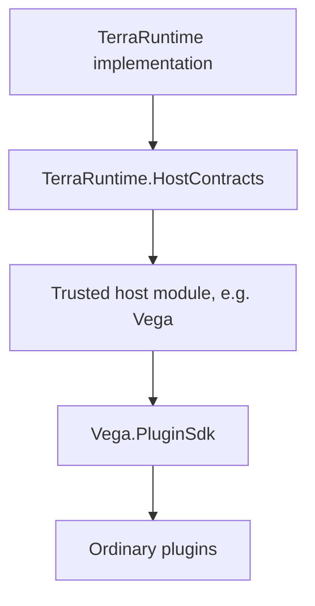
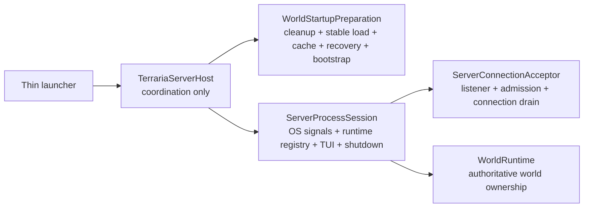
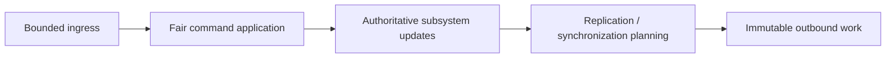
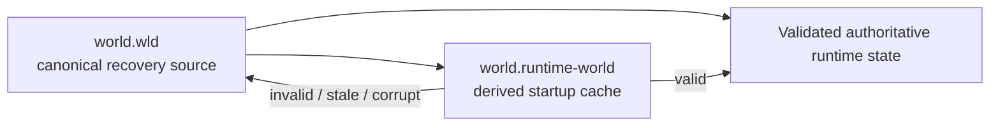
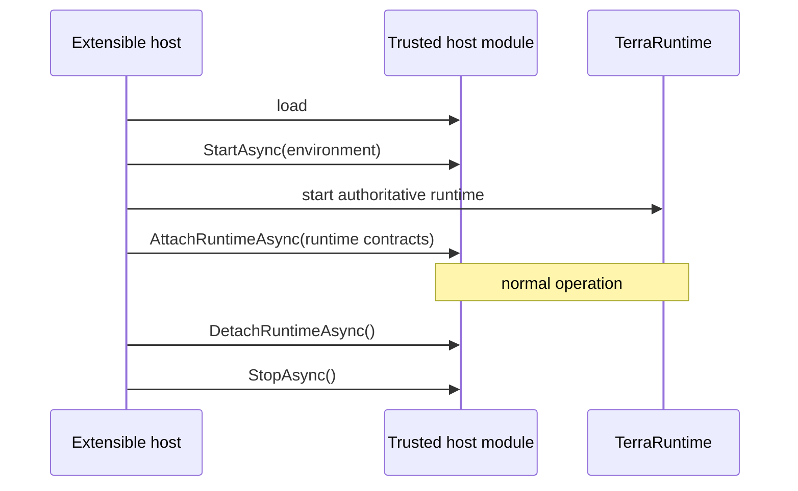
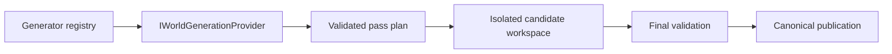
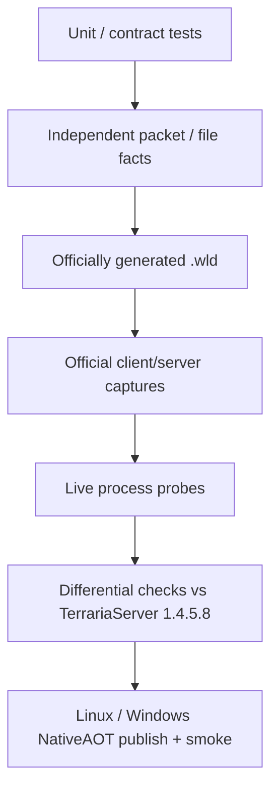

# TerraRuntime project guide

[Русский](../ru/project-guide.md) · [Documentation](README.md) · [Architecture](architecture.md) · [Host interfaces](host-interfaces.md) · [Roadmap](../roadmap.md)

## 1. What TerraRuntime is

TerraRuntime is a clean-room Terraria server runtime for .NET 11. It targets observable parity with the official TerrariaServer 1.4.5.8 while using a different internal architecture based on explicit state ownership, bounded work, testable boundaries and gameplay code that is independent from socket transport details.

> Preserve vanilla-visible behavior; internal implementation may differ when the observable contract remains intact.

TerraRuntime is not a fork of TerrariaServer and does not host TerrariaServer runtime objects. The official server is the behavioral/differential reference. Protocol 326 is represented through Multiplicity behind TerraRuntime's own protocol boundary.

## 2. Shipping profiles

### Standalone NativeAOT

`TerraRuntime.Server` is the thin standalone NativeAOT executable. It delegates startup to the shared AOT-compatible `TerraRuntime.Application` composition assembly. Runtime core remains NativeAOT-compatible and Linux x64 / Windows x64 publish-and-smoke paths are shipping gates. Arbitrary managed DLL plugins are not loaded in this profile.

### Extensible CoreCLR

`TerraRuntime.Extensible.Server` is a thin self-contained CoreCLR launcher. Shared server startup lives in `TerraRuntime.Application`; CoreCLR-only trusted host-module loading lives in `TerraRuntime.Extensibility`, so dynamic loading does not enter the NativeAOT graph.



Ordinary plugins do not receive TerraRuntime implementation objects.

The shared application startup is intentionally split by lifecycle ownership:



`WorldStartupPreparation` finishes all canonical `.wld`/derived-cache work before a live runtime is admitted. `ServerConnectionAcceptor` owns public TCP acceptance and connection-task draining, while `ServerProcessSession` owns the process-scoped lifecycle around those collaborators. This keeps `TerrariaServerHost.RunAsync` as orchestration rather than a second simulation or networking owner.

## 3. Repository map

| Path | Responsibility |
|---|---|
| `build/` | solution and shipping publish entry point |
| `src/TerraRuntime` | thin standalone NativeAOT launcher |
| `src/TerraRuntime.Application` | shared AOT-compatible startup, world/server composition and TUI |
| `src/TerraRuntime.ExtensibleHost` | thin CoreCLR extensible launcher |
| `src/TerraRuntime.Extensibility` | CoreCLR-only trusted host-module loading and scoped host runtime |
| `src/TerraRuntime.HostContracts` | narrow privileged host-module contracts |
| `src/TerraRuntime.Contracts` | stable snapshots, IDs and runtime/gameplay control contracts |
| `src/TerraRuntime.Gameplay` | protocol-neutral gameplay rules and source-backed content catalogs |
| `src/TerraRuntime.Core` | authoritative state, commands, entity systems and scheduling |
| `src/TerraRuntime.Network` | connection pipeline, ingress/egress and bounded queues |
| `src/TerraRuntime.Protocol` | protocol boundary and shared framing/codec concepts |
| `src/TerraRuntime.Protocol.Multiplicity` | Multiplicity adapter |
| `src/TerraRuntime.World` | `.wld`, tiles, sections, collision, liquids, cache and persistence helpers |
| `tests/TerraRuntime.Tests` | unit/integration/contract tests |
| `tests/TerraRuntime.HostModuleFixture` | extensible-host boundary fixture |
| `tools/` | reference probes, world verification and CI tooling |
| `docs/roadmap/` | detailed subsystem roadmaps |

## 4. Build

The SDK is pinned by `global.json`; the main solution is `build/TerraRuntime.slnx`.

Run normal restore/build/test commands from the repository root:

```bash
dotnet restore build/TerraRuntime.slnx
dotnet build build/TerraRuntime.slnx -c Release
dotnet test build/TerraRuntime.slnx -c Release --no-build
```

To produce both shipping deployments for the current host OS in the repository `artifacts/` tree, use:

```powershell
pwsh build/publish.ps1
```

Use `-Profile native-aot` or `-Profile coreclr` to publish only one profile. `-RuntimeIdentifier` may be used to state the host RID explicitly; shipping NativeAOT/ReadyToRun publication is intentionally rejected when the requested RID does not match the current OS.

A normal build is not a complete shipping proof. Runtime-core work must preserve exercised Linux/Windows NativeAOT publication paths.

## 5. Runtime layout

Standalone deployment uses a literal filesystem layout:

```text
TerraRuntime.Server[.exe]
Worlds/
config/
data/
logs/
```

The CoreCLR extensible deployment additionally contains trusted host/plugin locations such as `runtime/`, `HostModules/` and `ServerPlugins/`. `Worlds/` is the canonical interactive-selection directory; explicit `--world <path.wld>` may point elsewhere.

## 6. Client connection path

```mermaid
flowchart LR
    TCP["TCP socket"] --> Read["Connection read loop"]
    Read --> Frame["Bounded frame decoder"]
    Frame --> Proto["Protocol validation / decode"]
    Proto --> Command["Owned semantic command"]
    Command --> Queue["Authoritative game-loop queue"]
    Queue --> Validate["Gameplay / state validation"]
    Validate --> Mutate["Authoritative mutation"]
    Mutate --> Projection["Immutable event / snapshot"]
    Projection --> Recipients["Recipient / synchronization planning"]
    Recipients --> Encode["Protocol encode"]
    Encode --> OutQ["Bounded per-client outbound queue"]
    OutQ --> Writer["Socket writer"]
```



Network callbacks never mutate world/player/NPC/projectile/item state directly. Client input passes bounded framing/size checks, session legality and subsystem validation before mutation.

## 7. Authoritative game loop

Mutable simulation state belongs to one dedicated game-loop thread. The Terraria baseline runs at

$$
f_{\mathrm{tick}}=60\,\mathrm{Hz},
\qquad
T_{\mathrm{tick}}\approx16.67\,\mathrm{ms}.
$$

Command work is bounded globally and per source; deferred work is observable rather than drained without limit.



Blocking disk/network I/O is not part of authoritative tick progress.

## 8. Join and initial synchronization

Join follows verified protocol state/order. TerraRuntime owns the player slot, advances legal handshake/join state, transfers required world/section state and enters normal gameplay only after the client bootstrap contract is satisfied.

Current pre-`packet 49` structural ceiling is

$$
F_{\mathrm{pre49,max}}=65\ \text{frames},
\qquad
F_{\mathrm{probe}}=96\ \text{frames}.
$$

Live official-world probes provide independent ordering evidence beyond self-round-trip tests.

## 9. Canonical world and runtime cache

Terraria `.wld` remains canonical persistent state. `.runtime-world` is a disposable derived startup image.



Cache corruption must never become canonical-world corruption.

## 10. Saving

Live persistence captures mutable state only at the authoritative boundary and performs serialization/I/O from detached data.

```mermaid
flowchart LR
    State["Authoritative state"] --> Capture["Bounded snapshot / shadow capture"]
    Capture --> Detached["Detached immutable save image"]
    Detached --> Writer["Background serialization"]
    Writer --> Temp["Same-directory temporary file"]
    Temp --> Flush["Durable file flush"]
    Flush --> Publish["Atomic replace / move"]
    Publish --> Fsync["Linux parent-directory fsync"]
    Fsync --> Canonical["Complete canonical .wld"]
```



Save requests are bounded/coalesced. The TUI can request and observe saves but never owns mutable persistence state.

## 11. Gameplay architecture

Gameplay is implemented subsystem by subsystem. Packet IDs stay at the protocol boundary; version-pinned content IDs become domain concepts; runtime entity identity is generation-safe and separate from content type; AI/physics/combat do not encode packets directly; replication derives from authoritative state/events.

Current substantial foundations include players, world items, tiles, chests, signs, projectiles and NPC lifecycle slices. Broad vanilla coverage remains incomplete for many NPC AI families, bosses, events, housing, loot, wiring/liquids/growth, progression and vanilla WorldGen. See [Gameplay](gameplay.md).

## 12. Interest management

Interest management is runtime-owned. External hosts receive only enable/disable control. Spatial indexing, hysteresis, enter/leave semantics, resync policy and recipient selection remain internal.

Suppression is not enabled merely because a spatial index exists; correctness must be proven first and uncertain state fails open toward broad vanilla-like routing.

## 13. Operations and TUI

The terminal UI consumes bounded immutable operations snapshots and sends administrative mutations back through safe operation/command boundaries.

UI failure degrades to plain console rather than becoming a server failure. Trusted CoreCLR hosts may register complete independent dashboards but cannot inject arbitrary controls into the built-in dashboard.

## 14. Trusted host-module lifecycle



`ITerraRuntimeHostEnvironment` exposes deployment paths and registration surfaces usable before a live world exists. `ITerraRuntimeHostRuntime` is attached later and exposes narrow snapshots/operations, not mutable implementation state.

## 15. World generation



The built-in `terraruntime:flat` generator is an infrastructure baseline, not vanilla WorldGen parity. Vanilla generation remains large, RNG-order-sensitive work.

## 16. Errors and security

Normal hostile/malformed input is contained to the smallest practical scope. Client-controlled data cannot choose unbounded allocation/backlog, bypass connection/gameplay legality, block authoritative progress with unbudgeted work or mutate state from network callbacks.

Malformed protocol, rate limit, invalid state, gameplay rejection, backpressure and typed terminal-stop categories remain distinguishable.

## 17. Compatibility evidence



Evidence strength must match claim strength. A green self-round-trip is not enough for wire/gameplay parity.

## 18. Documentation rule

RU and EN documentation changes are part of the same implementation work. Architecture/process diagrams use Mermaid rather than ASCII pseudo-diagrams. Measured quantities, rates, sizes and formulas use LaTeX where appropriate; packet IDs, API names, versions, CLI syntax and literal layouts remain code literals.

## 19. Change mapping

| Change | Documentation |
|---|---|
| public host/runtime contract | `host-interfaces.md` and, when needed, `architecture.md` |
| lifecycle/ownership/threading | `architecture.md` + `project-guide.md` |
| CLI/deployment/startup | `project-guide.md` + `operations-tui.md` |
| persistence/cache/world format | `world-persistence.md` + overview pages |
| gameplay subsystem boundary | `gameplay.md` + `architecture.md` + roadmap |
| networking/synchronization/security | matching subsystem guide(s) |
| new limitation/divergence | user-facing guide + roadmap |

Documentation describes implemented behavior and explicitly separates it from target design.
