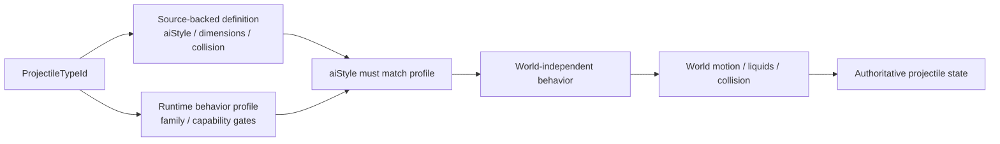
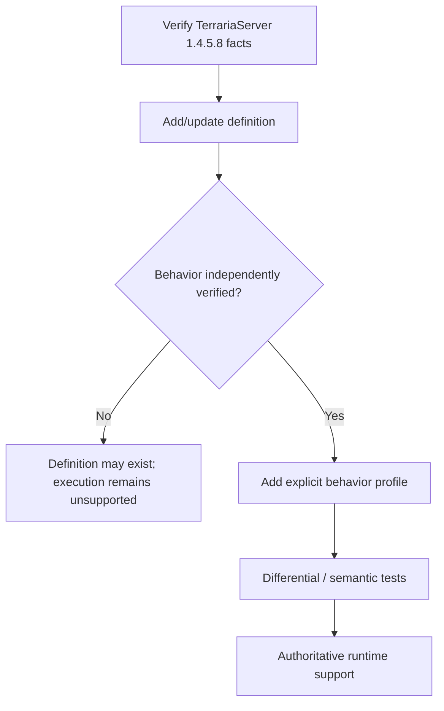
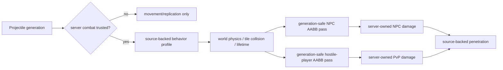

# Projectile behavior profiles

TerraRuntime does not treat a Terraria projectile `aiStyle` as sufficient evidence that every projectile carrying that numeric style can safely reuse the same authoritative implementation.

The source-backed definition catalog and the runtime-owned behavior catalog answer different questions:

Projectile runtime ownership now follows the foundation dependency layers. Stable projectile identities and detached DTOs stay in `TerraRuntime.Contracts`; source-backed protocol-neutral simulation semantics such as definitions, `Projectile.SetDefaults` lifecycle facts, hostility, owner sentinels, extra-update counts and NPC reflection math live in `TerraRuntime.Gameplay.Projectiles`; generation-safe mutable stores, lifecycle mutation, execution and commit boundaries stay in `TerraRuntime.Core`. The existing world-only `CutTilesAt` predicate is intentionally not moved upward: `TerraRuntime.World` remains a sibling foundation layer that depends only on Contracts, so that boundary needs a separate redesign rather than a new World-to-Gameplay project reference.

- `VanillaProjectileDefinitionCatalog` stores verified TerrariaServer 1.4.5.8 facts such as dimensions, collision shape, `aiStyle`, water behavior and tile-collision flags;
- `VanillaProjectileBehaviorProfileCatalog` explicitly opts a projectile type into a TerraRuntime behavior implementation and records runtime capability exceptions.

## Why `aiStyle` is not the dispatcher

`aiStyle` is vanilla/version data. `VanillaProjectileBehaviorFamily` is an implementation strategy owned by TerraRuntime.

Those identities intentionally remain separate. A future source-backed projectile may share `aiStyle = 1` with the current basic-arrow slice while still having extra `AI_001` branches, owner-gated state, RNG effects or lifecycle mutations that TerraRuntime has not modeled. Merely adding its definition therefore does not make its behavior executable.

The runtime fails closed unless both conditions hold:

1. the projectile type has an explicit behavior profile;
2. the profile's `ExpectedAiStyle` equals the source-backed definition's `AiStyle`.

## Current profiles

| Family | Current status | Important gates |
|---|---|---|
| `BasicArrow` | implemented | requires default `ai[2]`; selected types only |
| `Thrown` | implemented | explicit source-backed type membership |
| `Boomerang` | source-backed type-6 runtime implemented | outbound timer, owner-targeted return, return-phase tile-collision disable and verified pre-AI world-bounds exception |
| `Bomb` | launcher types 133..144 implemented | aiStyle-16 grenade/mine physics, straight-rocket impact fuse, source-backed explosion damage shape; presentation and destructive world side effects stay separate |
| `ControlledMagicMissile` | Magic Missile 16 / Flamelash 34 / Rainbow Rod 79 implemented | aiStyle-9 steering is server-simulated; trusted packet 27 contributes bounded cursor intent only, while position/velocity/damage remain authoritative; release follows server-owned `controlUseItem`/held-item state |
| `HostileStraightArrow` | server-owned 83/84/100/259 implemented | explicit AI_001 no-gravity/no-ai0 path; source ai1 first-step latch preserved |
| `PlanteraSeed` | server-owned 275/276 implemented | delayed 0.025 gravity; Expert homing, minimum speed 14, tile-collision disable and 180-tick lifetime cap |
| `GolemFireball` | server-owned 258 implemented | aiStyle-8 no-gravity flight; collision-owned ai0, four full bounces and fifth-impact termination |

Green Laser is deliberately not hidden in the generic basic-arrow path. Its profile sets `RejectServerOwned` because the dedicated-server owner branch mutates gameplay state that the current authoritative model does not yet represent.

## World-boundary ownership

Pre-AI world-bound behavior is also profile metadata. `VanillaProjectileWorldStateStepper` no longer checks `AiStyle` directly to decide whether the ordinary world-bound kill rule applies.

World dimensions still use the verified Terraria tile scale:

$$
1\ \text{tile}=16\ \mathrm{px}.
$$

The profile only decides whether the pre-AI world-bound rule applies; `VanillaProjectileWorldMotionResolver` still owns tile queries, liquids, collision and integration.

## Extension rule

Adding a new projectile follows this sequence:

Do not infer a behavior profile solely from `AiStyle`. This is intentional duplication of *evidence boundaries*, not duplication of gameplay logic.

## Verification

`VanillaProjectileBehaviorProfileCatalogTests` verifies:

- explicit classification of the currently supported basic-arrow and thrown types;
- the Green Laser owner-gated exception;
- the source-backed Enchanted Boomerang outbound/return profile, including owner-targeted return and return-phase tile-collision disable;
- explicit hostile boss/NPC families for straight beams, Plantera seeds and Golem fireball, including their non-generic gravity/collision rules;
- the player-owned modern aiStyle-9 controlled-magic profile for Magic Missile/Flamelash/Rainbow Rod, including its server-only ownership gate;
- agreement between every profiled type and its source-backed definition `aiStyle`;
- fail-closed behavior when definition and runtime profile disagree;
- no behavior inference for an unprofiled projectile.

Existing projectile behavior/world tests continue to exercise the actual velocity, timer, collision and lifecycle paths through the same production steppers.

## Combat handoff and runtime integrity

Projectile simulation and NPC combat now have an executable post-simulation handoff for a deliberately small trusted slice:

Combat trust is generation-scoped. Server-created generations may be trusted directly, while a client packet-27 generation crosses the same boundary only when strict source-backed provenance succeeds. The admitted client paths currently cover ordinary early bows/arrows, basic guns with Musket Ball/Silver Bullet, Grenade Launcher/Rocket Launcher/Proximity Mine Launcher with Rocket I-IV, selected-stack Shuriken/Bone/Throwing Knife/Poisoned Knife/Rotten Egg/Star Anise/Bone Dagger, and prefix-free Magic Missile/Flamelash/Rainbow Rod channeled magic. The rocket-ammo path reproduces vanilla's base-projectile-plus-ammo-offset transform instead of accepting the packet projectile type as truth. Provenance validates selected weapon, first compatible ammo where applicable, projectile transform/type, server-calculated damage/knockback, launch-speed magnitude, admitted initial `ai[]`, spawn distance and source-backed use cadence; ammo/throwable consumption and admitted magic mana consumption are committed server-side. Unsupported sources remain compatibility state and cannot damage authoritative entities. Once an ordinary generation is trusted, owner packet 27/29 traffic can neither rewrite position/velocity/AI or identity/damage fields nor terminate it early. Magic Missile/Flamelash/Rainbow Rod are the deliberate exception for **intent, not state**: packet 27 may update only `ai[0]/ai[1]` as the requested cursor target after generation/type/damage ownership checks; the server clamps that point through the source-backed 1920x1200 player-reachable view rectangle and ignores client position/velocity. Packet-13 `controlUseItem` plus the authoritative selected item releases the projectile. The server then performs the source-backed 800-pixel nearest-NPC line-of-sight lookup in physical slot order for the currently modeled chaseable candidate set and re-steers toward the authoritative NPC center; without a target it normalizes toward the 32 px/tick released speed. Rainbow Rod additionally keeps its channelled tile-collision 10% component damping instead of being killed by that contact.

For combat-trusted player projectiles, the current hit passes admit only behavior profiles whose source-backed collision/penetration semantics are represented. NPC hits select live generation-safe targets by source-backed AABB geometry, use the ordinary shared owner/NPC immunity baseline for admitted multi-hit families, use permanent projectile-local NPC immunity for grenade variants 133/136/139/142, and use Flamelash/Rainbow Rod's source-backed 12-tick projectile-local NPC cooldown. They resolve damage variance/crit/armor penetration from server-owned combat state, commit through the existing NPC pipeline, and consume penetration only after a committed hit. A separate generation-safe PvP pass selects hostile legal players, rejects same-team targets, resolves PvP damage without packet 117, applies the vanilla 40-tick projectile/player immunity baseline, and consumes the same source-backed penetration state. Positive penetration counts down, the final hit despawns the exact generation, and infinite penetration remains active.

World motion already owns tile collision, liquid contact, world bounds and source-backed lifetime. The server-owned hostile simulation slice additionally executes the source-backed straight AI_001 beams used by Wall of Flesh, Probe, Retinazer and Golem (83/84/100/259), Plantera Seed/Poison Seed (275/276) including Expert-mode homing and lifetime/tile-collision overrides, Plantera Thorn Ball (277) aiStyle-14 gravity/Expert steering/90% rebound, Golem Fireball (258) with its aiStyle-8 collision counter and four-bounce/fifth-impact termination, Skeletron Prime Bomb (102) with its zero-flight-damage/128x128 on-kill explosion, Spazmatism Cursed Flame/Eye Fire (96/101), Phantasmal Eye (452), Phantasmal Sphere (454), Phantasmal Deathray (455), Phantasmal Bolt (462), Hallow Boss Rainbow Streak (873), Fairy Queen Lance (919), Fairy Queen Sun Dance (923), Cultist fireballs (467/468), Ancient Doom projectile (593), and Queen Slime gel (926). Runtime lifecycle now owns vanilla `Projectile.localAI[0..2]`, so Phantasmal Eye phase timers, Moon Lord deathray lifetime/beam length and Empress warm-up/lifetime gates cannot be forged through packet 27. Released Phantasmal Sphere also switches to the source dynamic `extraUpdates = 1` path. Phantasmal Deathray is anchored to its generation-safe Moon Lord head/free-eye source, skips ordinary position integration like aiStyle 84 in 1.4.5.8, derives its scale/lifetime from `localAI[0]`, and derives `localAI[1]` from the source three-sample tile `LaserScan`; hostile collision uses that exact beam line and 20-update warm-up. Hallow Boss Rainbow Streak now follows its source AI_171 drift and player-homing phases. Lance and Sun Dance player hits use their source line hitboxes instead of their tiny storage AABBs, including the `localAI[0] <= 60` damage gate. Cultist fireballs retain the physical player-slot target, line-of-sight acquisition and source-backed `AngleLerp` rates; Queen Slime gel uses the verified early-fall counter. Presentation-only dust/sound/lighting is not promoted into authoritative gameplay state. For launcher types 133..144 it also owns source-backed aiStyle-16 bounce/arming behavior. When a trusted launcher projectile reaches vanilla-style Kill(), the generation-safe termination commit preserves its trusted owner and final snapshot after removal; a bounded same-tick handoff then applies the 128x128 (I/II) or 200x200 (III/IV) PrepareBombToBlow damage AABB to NPC/PvP passes. The handoff also substitutes the source-backed explosion knockback fact in the detached projectile snapshot. This keeps explosion damage authoritative even though the live generation has already left the projectile store.

The runtime still fails closed on the important missing pieces: full weapon/ammo/provenance coverage beyond the admitted families (including later rocket-ammo variants), other controlled/channeled families such as the legacy Flying Knife aiStyle-9 path, yoyos and holdouts, localNPCImmunity-aware post-hit controlled-magic target reacquisition and exact transient NPC `friendly/chaseable/immortal` flag parity, complete authoritative mana-cost modifiers/refill validation, multishot and special spawn parameters, full vanilla projectile AI families, remaining local/static NPC immunity variants, remaining exceptional hitboxes/target rules, explosive self-hurt/owner-hit semantics, Rocket II/IV world or tile-destruction side effects, projectile-applied buffs/debuffs, child/on-hit projectile spawn ordering and type-specific on-hit/on-kill effects. The Moon Lord NPC-side transition that releases already-spawned Phantasmal Spheres (`ai[0] = -1`) is still outside the projectile step itself and remains an explicit cross-entity side-effect gap. Client packet-27 generations outside the strict source-backed catalog therefore remain synchronization/diagnostic state rather than authoritative combat sources.

`ProjectileNpcHitIntentBuilder` remains the provenance boundary for player-owned projectile hits: the owner byte resolves through `IRuntimePlayerSlotSnapshotLookup` to the current `PlayerHandle`, so slot reuse cannot transfer provenance to a replacement player. Server/NPC-origin generations now retain the exact originating `NpcHandle` in the projectile store. Only those generation-safe server-hostile projectiles with an implemented source-backed definition/profile enter the authoritative player-hit pass. NPC contact and admitted hostile projectile hits resolve server-owned damage/immunity/knockback and HP; unsupported hostile projectile families continue to fail closed.

Runtime GodMode returns before HP/immunity mutation for these PvE paths. TerraRuntime emits protocol-326 packet 119 world combat text (`MISS`/bounded joke variants) at the victim hit area instead of chat. Terraria 1.4.5.8 handles packet 119 with `CombatText.NewText`: the text starts with vertical velocity `-7` and then applies the vanilla `0.92` Y-velocity damping each update, so it rises, slows and fades without repeated network packets.
