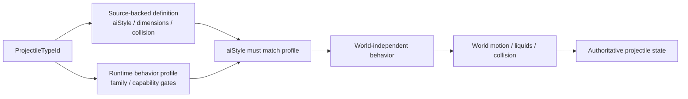
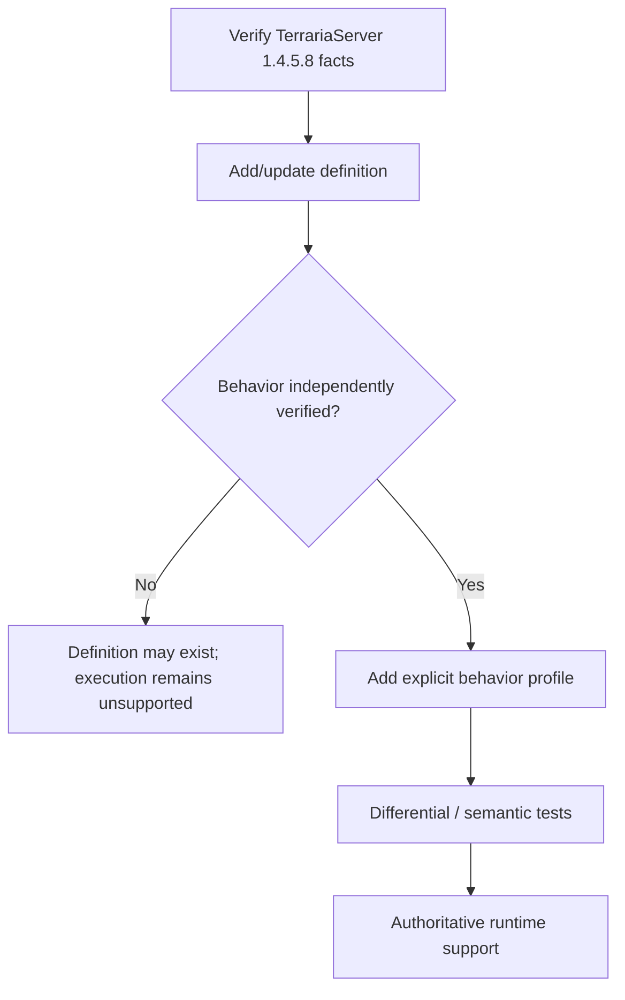
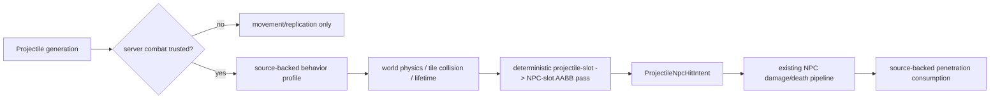

# Projectile behavior profiles

TerraRuntime does not treat a Terraria projectile `aiStyle` as sufficient evidence that every projectile carrying that numeric style can safely reuse the same authoritative implementation.

The source-backed definition catalog and the runtime-owned behavior catalog answer different questions:

Projectile runtime ownership now follows the foundation dependency layers. Stable projectile identities and detached DTOs stay in `TerraRuntime.Contracts`; source-backed protocol-neutral simulation semantics such as definitions, `Projectile.SetDefaults` lifecycle facts, hostility, owner sentinels, extra-update counts and NPC reflection math live in `TerraRuntime.Gameplay.Projectiles`; generation-safe mutable stores, lifecycle mutation, execution and commit boundaries stay in `TerraRuntime.Core`. The existing world-only `CutTilesAt` predicate is intentionally not moved upward: `TerraRuntime.World` remains a sibling foundation layer that depends only on Contracts, so that boundary needs a separate redesign rather than a new World-to-Gameplay project reference.

- `VanillaProjectileDefinitionCatalog` stores verified TerrariaServer 1.4.5.8 facts such as dimensions, collision shape, `aiStyle`, water behavior and tile-collision flags;
- `VanillaProjectileBehaviorProfileCatalog` explicitly opts a projectile type into a TerraRuntime behavior implementation and records runtime capability exceptions.

## Why `aiStyle` is not the dispatcher

`aiStyle` is vanilla/version data. `VanillaProjectileBehaviorFamily` is an implementation strategy owned by TerraRuntime.

Those identities intentionally remain separate. A future source-backed projectile may share `aiStyle = 1` with the current basic-arrow slice while still having extra `AI_001` branches, owner-gated state, RNG effects or lifecycle mutations that TerraRuntime has not modeled. Merely adding its definition therefore does not make its behavior executable.

The runtime fails closed unless both conditions hold:

1. the projectile type has an explicit behavior profile;
2. the profile's `ExpectedAiStyle` equals the source-backed definition's `AiStyle`.

## Current profiles

| Family | Current status | Important gates |
|---|---|---|
| `BasicArrow` | implemented | requires default `ai[2]`; selected types only |
| `Thrown` | implemented | explicit source-backed type membership |
| `Boomerang` | source-backed type-6 runtime implemented | outbound timer, owner-targeted return, return-phase tile-collision disable and verified pre-AI world-bounds exception |

Green Laser is deliberately not hidden in the generic basic-arrow path. Its profile sets `RejectServerOwned` because the dedicated-server owner branch mutates gameplay state that the current authoritative model does not yet represent.

## World-boundary ownership

Pre-AI world-bound behavior is also profile metadata. `VanillaProjectileWorldStateStepper` no longer checks `AiStyle` directly to decide whether the ordinary world-bound kill rule applies.

World dimensions still use the verified Terraria tile scale:

$$
1\ \text{tile}=16\ \mathrm{px}.
$$

The profile only decides whether the pre-AI world-bound rule applies; `VanillaProjectileWorldMotionResolver` still owns tile queries, liquids, collision and integration.

## Extension rule

Adding a new projectile follows this sequence:

Do not infer a behavior profile solely from `AiStyle`. This is intentional duplication of *evidence boundaries*, not duplication of gameplay logic.

## Verification

`VanillaProjectileBehaviorProfileCatalogTests` verifies:

- explicit classification of the currently supported basic-arrow and thrown types;
- the Green Laser owner-gated exception;
- the source-backed Enchanted Boomerang outbound/return profile, including owner-targeted return and return-phase tile-collision disable;
- agreement between every profiled type and its source-backed definition `aiStyle`;
- fail-closed behavior when definition and runtime profile disagree;
- no behavior inference for an unprofiled projectile.

Existing projectile behavior/world tests continue to exercise the actual velocity, timer, collision and lifecycle paths through the same production steppers.

## Combat handoff and runtime integrity

Projectile simulation and NPC combat now have an executable post-simulation handoff for a deliberately small trusted slice:

Runtime-only combat trust is generation-scoped. A projectile created through the server runtime command path is eligible to be promoted as combat-trusted; a new client packet-27 generation is **not** trusted merely because its owner byte matches the connection. Once a generation is combat-trusted, owner packet 27/29 traffic can neither rewrite its position/velocity/AI or identity/damage fields nor terminate it early. Untrusted compatibility generations still accept their bounded owner updates but cannot enter authoritative NPC combat. This prevents the new server-side NPC hit pass from turning an unverified client projectile claim into authoritative world damage.

For combat-trusted player projectiles, the current hit pass admits only behavior profiles whose source-backed collision/penetration semantics are implemented. The first slice covers selected `BasicArrow`/`Thrown` projectiles plus the source-backed Enchanted Boomerang, selects live generation-safe NPC targets by source-backed AABB geometry, applies a bounded baseline per-projectile/NPC cooldown, commits damage/death through the existing NPC combat pipeline, and only after a committed hit consumes source-backed penetration. Positive penetration counts down; the last hit despawns the exact generation; infinite penetration remains active. Ordering is deterministic by physical projectile slot and then physical NPC slot.

World motion already owns tile collision, liquid contact, world bounds and source-backed lifetime. The new pass adds entity collision and ordinary NPC damage side effects without moving those responsibilities back into packet handling.

The runtime still fails closed on the important missing pieces: legitimate client projectile weapon/ammo source promotion, full vanilla projectile AI families, exceptional local/static NPC immunity, player/PvP collision, projectile-applied buffs/debuffs, child/on-hit projectile spawn ordering, and type-specific on-hit effects. In particular, client packet-27 projectiles remain synchronization state rather than an authoritative NPC-damage source until their weapon/ammo mapping is independently verified.

`ProjectileNpcHitIntentBuilder` remains the provenance boundary: player-owned projectile hits resolve the owner byte through `IRuntimePlayerSlotSnapshotLookup` to the current `PlayerHandle`, so slot reuse cannot transfer provenance to a replacement player. Server/NPC-origin projectile provenance remains fail-closed until the originating `NpcHandle` is retained explicitly.
