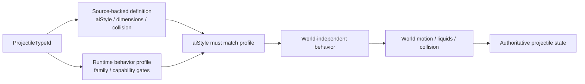
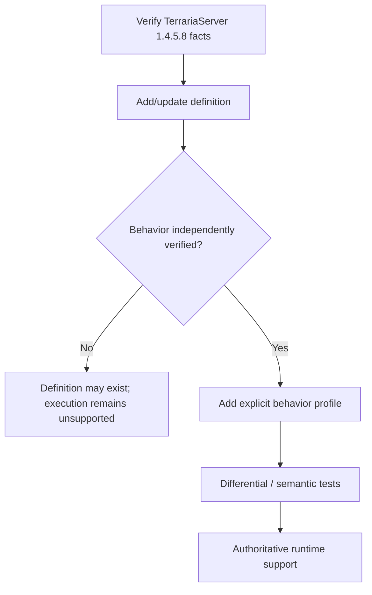
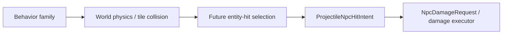

# Projectile behavior profiles

TerraRuntime does not treat a Terraria projectile `aiStyle` as sufficient evidence that every projectile carrying that numeric style can safely reuse the same authoritative implementation.

The source-backed definition catalog and the runtime-owned behavior catalog answer different questions:

- `VanillaProjectileDefinitionCatalog` stores verified TerrariaServer 1.4.5.8 facts such as dimensions, collision shape, `aiStyle`, water behavior and tile-collision flags;
- `VanillaProjectileBehaviorProfileCatalog` explicitly opts a projectile type into a TerraRuntime behavior implementation and records runtime capability exceptions.

## Why `aiStyle` is not the dispatcher

`aiStyle` is vanilla/version data. `VanillaProjectileBehaviorFamily` is an implementation strategy owned by TerraRuntime.

Those identities intentionally remain separate. A future source-backed projectile may share `aiStyle = 1` with the current basic-arrow slice while still having extra `AI_001` branches, owner-gated state, RNG effects or lifecycle mutations that TerraRuntime has not modeled. Merely adding its definition therefore does not make its behavior executable.

The runtime fails closed unless both conditions hold:

1. the projectile type has an explicit behavior profile;
2. the profile's `ExpectedAiStyle` equals the source-backed definition's `AiStyle`.

## Current profiles

| Family | Current status | Important gates |
|---|---|---|
| `BasicArrow` | implemented | requires default `ai[2]`; selected types only |
| `Thrown` | implemented | explicit source-backed type membership |
| `Boomerang` | known, not implemented | preserves the verified pre-AI world-bounds exception |

Green Laser is deliberately not hidden in the generic basic-arrow path. Its profile sets `RejectServerOwned` because the dedicated-server owner branch mutates gameplay state that the current authoritative model does not yet represent.

## World-boundary ownership

Pre-AI world-bound behavior is also profile metadata. `VanillaProjectileWorldStateStepper` no longer checks `AiStyle` directly to decide whether the ordinary world-bound kill rule applies.

World dimensions still use the verified Terraria tile scale:

$$
1\ \text{tile}=16\ \mathrm{px}.
$$

The profile only decides whether the pre-AI world-bound rule applies; `VanillaProjectileWorldMotionResolver` still owns tile queries, liquids, collision and integration.

## Extension rule

Adding a new projectile follows this sequence:

Do not infer a behavior profile solely from `AiStyle`. This is intentional duplication of *evidence boundaries*, not duplication of gameplay logic.

## Verification

`VanillaProjectileBehaviorProfileCatalogTests` verifies:

- explicit classification of the currently supported basic-arrow and thrown types;
- the Green Laser owner-gated exception;
- the known-but-unimplemented boomerang profile;
- agreement between every profiled type and its source-backed definition `aiStyle`;
- fail-closed behavior when definition and runtime profile disagree;
- no behavior inference for an unprofiled projectile.

Existing projectile behavior/world tests continue to exercise the actual velocity, timer, collision and lifecycle paths through the same production steppers.

## Combat handoff

Projectile simulation and combat mutation now have an explicit handoff instead of sharing packet fields or a monolithic update method:

`RuntimeProjectileCombatIntentFactory` accepts a selected generation-safe `NpcHandle` plus the source-resolved hit direction and converts a live player-owned projectile into a mutation-free `ProjectileNpcHitIntent`. Its byte owner is resolved through `IRuntimePlayerSlotSnapshotLookup` to the current `PlayerHandle`; a reused or mismatched slot cannot acquire provenance from the replacement player. The factory deliberately does not guess direction from NPC movement or projectile velocity because vanilla has projectile-type branches that derive it differently.

Server-owned projectiles fail closed because the current projectile state does not retain an originating `NpcHandle`. The boundary is intentionally not wired to simulation yet: entity hitbox selection, trusted projectile damage/direction derivation, immunity, penetration, crit/variation and kill effects still require independent source-backed work. Once a validated request exists, the NPC executor now applies the ordinary source-backed knockback slice. Tile collision remains owned by world motion and cannot directly apply combat damage.
