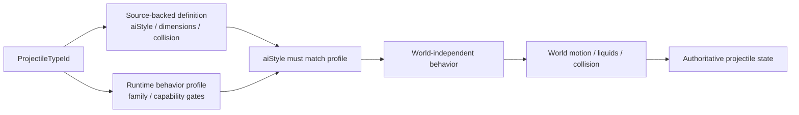
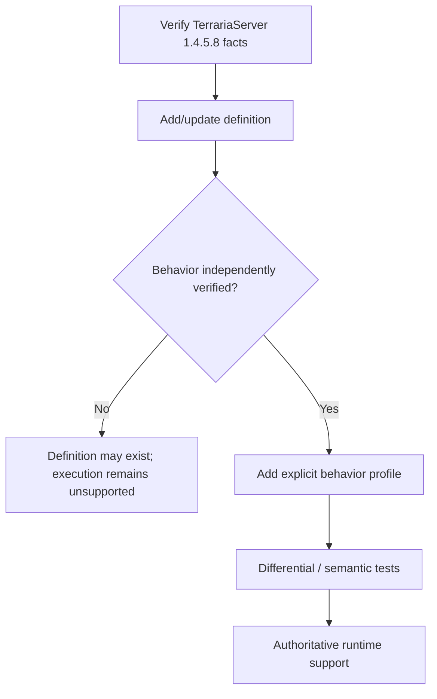
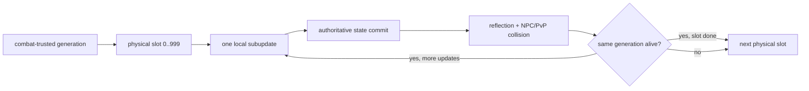

# Projectile behavior profiles

TerraRuntime does not treat a Terraria projectile `aiStyle` as sufficient evidence that every projectile carrying that numeric style can safely reuse the same authoritative implementation.

The source-backed definition catalog and the runtime-owned behavior catalog answer different questions:

Projectile runtime ownership now follows the foundation dependency layers. Stable projectile identities and detached DTOs stay in `TerraRuntime.Contracts`; source-backed protocol-neutral simulation semantics such as definitions, `Projectile.SetDefaults` lifecycle facts, hostility, owner sentinels, extra-update counts and NPC reflection math live in `TerraRuntime.Gameplay.Projectiles`; generation-safe mutable stores, lifecycle mutation, execution and commit boundaries stay in `TerraRuntime.Core`. The existing world-only `CutTilesAt` predicate is intentionally not moved upward: `TerraRuntime.World` remains a sibling foundation layer that depends only on Contracts, so that boundary needs a separate redesign rather than a new World-to-Gameplay project reference.

- `VanillaProjectileDefinitionCatalog` stores verified TerrariaServer 1.4.5.8 facts such as dimensions, collision shape, `aiStyle`, water behavior and tile-collision flags;
- `VanillaProjectileBehaviorProfileCatalog` explicitly opts a projectile type into a TerraRuntime behavior implementation and records runtime capability exceptions.

## Why `aiStyle` is not the dispatcher

`aiStyle` is vanilla/version data. `VanillaProjectileBehaviorFamily` is an implementation strategy owned by TerraRuntime.

Those identities intentionally remain separate. A future source-backed projectile may share `aiStyle = 1` with the current basic-arrow slice while still having extra `AI_001` branches, owner-gated state, RNG effects or lifecycle mutations that TerraRuntime has not modeled. Merely adding its definition therefore does not make its behavior executable.

The runtime fails closed unless both conditions hold:

1. the projectile type has an explicit behavior profile;
2. the profile's `ExpectedAiStyle` equals the source-backed definition's `AiStyle`.

## Current profiles

| Family | Current status | Important gates |
|---|---|---|
| `BasicArrow` | implemented | requires default `ai[2]`; selected types only |
| `Thrown` | implemented | explicit source-backed type membership |
| `Boomerang` | source-backed type-6 runtime implemented | outbound timer, owner-targeted return, return-phase tile-collision disable and verified pre-AI world-bounds exception |
| `SkeletronSkull` / Deerclops families | implemented source-backed gameplay slices | explicit boss-projectile membership; no generic `aiStyle` promotion |
| `FallingStar` | Star Cannon Star type `955` implemented | gameplay-relevant `aiStyle 5` state only; natural Falling Star type `12` is not profile-admitted |
| `SuperStar` | type `728` implemented | source-backed `AI_151` gameplay motion and child type `729` spawn |
| `SuperStarSlash` | type `729` implemented and combat-admitted | `extraUpdates=2`; collision/damage is interleaved after every local subupdate |

Green Laser is deliberately not hidden in the generic basic-arrow path. Its profile sets `RejectServerOwned` because the dedicated-server owner branch mutates gameplay state that the current authoritative model does not yet represent.

## World-boundary ownership

Pre-AI world-bound behavior is also profile metadata. `VanillaProjectileWorldStateStepper` no longer checks `AiStyle` directly to decide whether the ordinary world-bound kill rule applies.

World dimensions still use the verified Terraria tile scale:

$$
1\ \text{tile}=16\ \mathrm{px}.
$$

The profile only decides whether the pre-AI world-bound rule applies; `VanillaProjectileWorldMotionResolver` still owns tile queries, liquids, collision and integration.

## Extension rule

Adding a new projectile follows this sequence:

Do not infer a behavior profile solely from `AiStyle`. This is intentional duplication of *evidence boundaries*, not duplication of gameplay logic.

## Verification

`VanillaProjectileBehaviorProfileCatalogTests` verifies:

- explicit classification of the currently supported basic-arrow and thrown types;
- the Green Laser owner-gated exception;
- the source-backed Enchanted Boomerang outbound/return profile, including owner-targeted return and return-phase tile-collision disable;
- agreement between every profiled type and its source-backed definition `aiStyle`;
- fail-closed behavior when definition and runtime profile disagree;
- no behavior inference for an unprofiled projectile.

Existing projectile behavior/world tests continue to exercise the actual velocity, timer, collision and lifecycle paths through the same production steppers.

## Combat handoff and runtime integrity

Projectile simulation, reflection and entity combat are interleaved on the authoritative owner. The pinned TerrariaServer 1.4.5.8 `Projectile.Update` loop executes `Damage()` inside every local update, so TerraRuntime must not defer combat until all `extraUpdates` have finished:

Positive intermediate subupdates are committed to the generation-safe store so reflection, penetration, velocity changes or despawn are visible before the next local update. They are deliberately silent to ordinary packet-27 replication. Ordinary `timeLeft` expiration is finalized after the interaction boundary because vanilla calls `Damage()` before its `timeLeft--`/`Kill()` tail; tile/world/behavior terminations remain pre-damage and do not gain a synthetic hit. The final surviving local state publishes one normal projectile update, while terminal removal/despawn still publishes immediately. This preserves source ordering without multiplying ordinary network replication by `extraUpdates + 1`.

Runtime-only combat trust remains generation-scoped. A trusted generation rejects owner packet 27/29 rewrites and early termination. Client-origin generations cross that boundary only for source-backed weapon/ammo combinations whose projectile type, damage, knockback, launch-speed magnitude, cadence and spawn parameters have been validated from server-owned state. Unsupported combinations remain compatibility/synchronization state and cannot mutate authoritative NPC/player health.

The admitted friendly player-projectile slice now includes the verified `BasicArrow`, `Thrown`, Enchanted Boomerang, Super Star `728`, and Super Star Slash `729` families. NPC collision uses source-backed definition geometry plus the modeled immunity family. Super Star `728` uses generation-local one-hit-per-NPC immunity and creates type `729` after the committed parent hit. Super Star Slash uses infinite penetration and shared-by-type NPC immunity for $10\,\text{ticks}$. Because type `729` has `extraUpdates=2`, its three local movement states can each collide in source order during one global tick; the shared static immunity clock prevents repeated damage to the same NPC while still allowing the slash path to reach a different NPC on a later subupdate.

The PvP pass runs at the same subupdate boundary. Type `729` is treated as ranged for the source-backed Frost/status branch, keeps the normal exact-projectile player immunity behavior, and intentionally skips `Projectile.TryDoingOnHitEffects`, matching the pinned type-specific exclusion. Packet 117 is not used as projectile damage authority.

World motion continues to own tile collision, liquid contact, world bounds and source-backed lifetime. Remaining fail-closed work includes broader weapon/ammo provenance and special spawn geometry, unsupported projectile AI/collision hooks, owner-hit exceptions, remaining status/buff side effects, kill/on-kill child families, and full slot-pressure/oldest-projectile replacement parity. Natural Falling Star type `12` also remains outside the admitted behavior profile until authoritative day/remix-world state owns its gameplay kill gate.

`ProjectileNpcHitIntentBuilder` remains a provenance boundary for paths that build explicit NPC hit intents: player owner bytes resolve through `IRuntimePlayerSlotSnapshotLookup` to the current `PlayerHandle`, so slot reuse cannot transfer provenance to a replacement player. Server/NPC-origin projectile provenance remains fail-closed until the originating `NpcHandle` is retained explicitly.
