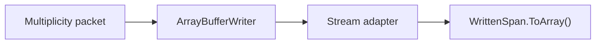
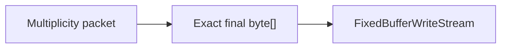

# Protocol hot-path performance evidence

[Русский](../ru/protocol-hotpath-performance.md) · [Performance](performance-runtime.md) · [Protocol 326 boundary](protocol-326-typed-boundary.md)

## Scope

`tools/TerraRuntime.ProtocolBench` provides reproducible before/after evidence for the protocol serialization materialization change. The benchmark intentionally keeps a benchmark-only copy of the previous growable-buffer path:



and compares it with the production exact-size path:



The benchmark-only legacy implementation is not production code and must not be reused by runtime paths.

## Cases

The suite currently covers four representative operations:

| Case | Purpose |
| --- | --- |
| `frame-32-byte` | generic Terraria framing: caller-owned exact span versus growable writer plus final copy |
| `packet14-player-active` | very small high-frequency lifecycle packet |
| `packet5-equipment` | fixed-size player inventory/equipment state |
| `packet13-movement-minimal` | high-frequency authoritative movement serialization |

Before measurement, current and legacy output must be byte-for-byte identical for every case. A mismatch aborts the run before performance numbers can be accepted.

## Measurement contract

Both implementations receive equal warmup before measured samples begin. Measured sample order alternates between current-first and legacy-first so tiered PGO, CPU-frequency changes, cache temperature and shared-runner drift do not systematically favor the implementation measured second. The report uses the median of an odd number of samples for:

$$
A = \frac{\text{allocated bytes}}{\text{operations}},
$$

and

$$
T = \frac{\text{elapsed nanoseconds}}{\text{operations}}.
$$

Allocation is measured with `GC.GetAllocatedBytesForCurrentThread()` on a synchronous single-threaded loop. Throughput is derived as

$$
R = \frac{10^9}{T}\ \mathrm{operations/s}.
$$

The benchmark records runtime description, OS, process architecture, processor count, commit SHA, iteration count, sample count, warmup count and whether alternating order was enabled in JSON.

## CI gate

`.github/workflows/protocol-hotpath-performance.yml` runs both implementations in one process on the same runner. The gate requires for every case:

1. current allocation per operation is strictly lower than the preserved legacy path;
2. current median time per operation is no worse than `$1.50\times$` the legacy median.

The throughput tolerance is deliberately loose because shared CI CPU scheduling is noisy. Allocation is the hard deterministic claim; throughput protects against replacing a removed copy with an unexpectedly expensive implementation.

The exact-size stream keeps the successful write path minimal: one capacity check and one copy. An invalid over-write marks the candidate failed without wasting time copying a partial prefix that can never be published.

The JSON report is uploaded as `protocol-hotpath-<commit>` for 14 days. This is evidence for the serializer/framing materialization change only; it does not substitute for the `$24/64/128/255$` connection workload matrix or end-to-end tick profiling.

## Local command

```bash
dotnet run \
  --project tools/TerraRuntime.ProtocolBench/TerraRuntime.ProtocolBench.csproj \
  -c Release \
  -- \
  --gate \
  --iterations 200000 \
  --samples 5 \
  --json artifacts/performance/protocol-hotpath.json
```

Do not publish a performance claim from one isolated `ns/op` number. Keep the JSON artifact, compare allocation and throughput together, and preserve wire equality plus ordinary protocol tests.
