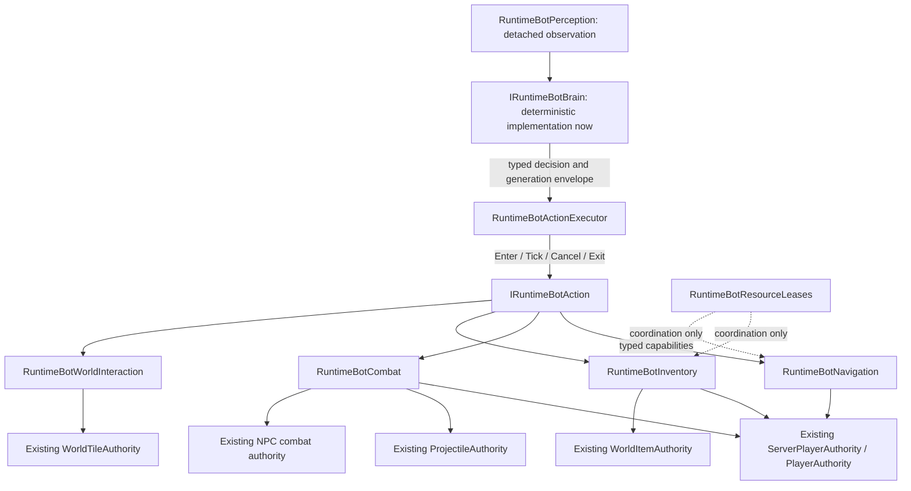
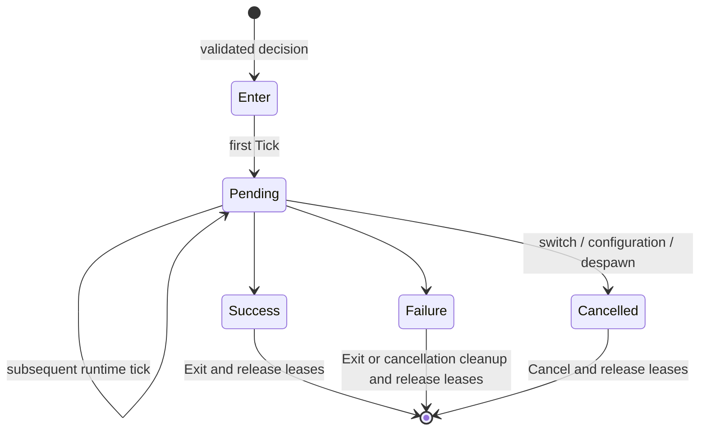

# PlayerBot task and action architecture

PlayerBot remains a normal server-owned player. `Application/Bots` selects and schedules behavior; it does not own another player, projectile, inventory, damage or tile simulation. Hostile operator NpcBot remains removed; ordinary NPC actors and shops are independent.

## Ownership

`RuntimeBotAuthority` creates, configures and despawns bots, composes collaborators, detects lost player generations, ticks controllers and publishes detached telemetry. It no longer implements attack, pickup, consumable, target-selection or navigation loops. `BotState` retains bot policy state only; authoritative actor state remains elsewhere. `BotPolicy` names tactical thresholds and action watchdogs, not a second gameplay catalog.

`RuntimeBotController` schedules invariant instantaneous pickup/healing/mana, then captures the post-maintenance observation and invokes the replaceable brain and one long-lived goal executor. Maintenance is not a competing goal and cannot be switched off. Combat buffs retain their original ordering inside Guard. The existing server-player physics and subsequent combat passes retain their runtime tick order.

`RuntimeBotPerception` performs bounded current-player, protected-player, guard-candidate and useful-item queries. It retains existing target-lock/squad scoring policy, without writing world state. The first snapshot is deliberately reduced: self, configuration, live protected player, selected guard candidate, useful item, inventory counts/capabilities, underground hint, recovery requirement, current action and recent result. It is not a whole-world scanner, route map or full inventory export. All fields are detached value snapshots; no mutable arrays, dictionaries or actor references are exposed.

## Identity and validation

Observations contain `WorldRuntimeIdentity` (logical runtime plus activation session), exact `PlayerHandle` for the bot, local bot ID, monotonic observation revision, goal generation and tick. Production composition passes the owning `WorldRuntime.Identity`; standalone `ServerRuntimeState` owns its own activation identity. Reconfiguration and loss of an exact followed-player generation advance the goal generation. Reconnecting into the same slot cannot inherit an old goal.

`RuntimeBotDecisionEnvelope.Validate` rejects a different bot/world/session/goal/revision and mismatched explicit player/NPC/item handles. Invalid submissions do not replace the current action. After admission, the executor allows observations to advance but rejects changed bound generations before ticking. Explicit NPC and item intents retain exact entity generations, not just physical slots. Operation adapters additionally reject stale observation scope before performing snapshot-driven work. An action context contains only typed navigation, combat, inventory and world-interaction capabilities, never `RuntimeBotAuthority` or mutable stores.

This is an internal, synchronous execution contract, not a public plugin SDK or asynchronous planner implementation. `IRuntimeBotBrain` is substitutable through composition. A brain is not an authority. An action is not an authority. Neither may bypass normal player semantics. A resource lease is not permission to mutate an entity.

## Lifecycle and actions

`Enter` runs once, `Tick` runs at most once per runtime tick, and terminal actions are never ticked again. `Exit` releases successful/failed action presentation or movement; `Cancel` handles interrupted actions, including Mirror cancellation. Results use `Pending`, `Success`, `Failure`, `Cancelled` and typed failure codes. No string is machine-readable action semantics.

An executor cannot be rebound to another bot or activation. Regressing observation revisions are rejected even when newer than the initial decision. Cancellation uses the original bot's capabilities if the incoming context belongs to a different generation/world. Stop, Mirror cleanup, configuration and despawn revalidate the actor mapping, so reusing a `ServerPlayerId` cannot modify a replacement generation. Callback invariant exceptions remain visible to the runtime; executor ownership and leases are still cleared.

Continuous Idle/Follow/Guard have no arbitrary global position watchdog. Existing source-backed Mirror presentation remains a separate recovery action. Its runtime watchdog is $120\,\text{ticks}$; the item still uses its original $90\,\text{ticks}$ with midpoint recall. Attack has a $180\,\text{tick}$ watchdog. Collect and autonomous Mining have a $1800\,\text{tick}$ deadline and $300\,\text{tick}$ stagnation window. `BotPolicy` owns these runtime policies. Each action supplies its progress metric: collection uses distance to its exact item; mining combines approach distance and committed corridor breaks. Stationary semantic progress is valid; there is no generic “not moving means broken” rule.

Actions cover Idle, Follow, Guard, Attack, PickupUsefulItem, UseConsumable, RecoverToTarget, Mining, Collect and ReturnToPlayer. Movement is a typed navigation primitive rather than a duplicate physics action. Existing weapon selection, prediction, LOS/trajectory admission, ammo transaction, melee commit, potion ordering, flight, local cave detours and safe recall checks were extracted, not replaced. The bounded local search in `BotTraversal` is unchanged; no new global A* was introduced.

## Operator modes

The settings window offers `Mining ore`: Copper, Tin, Iron, Lead, Silver, Tungsten, Gold or Platinum. Mining no longer needs a player target or recent human digging. Existing Follow/Guard underground assistance remains separate and retains its cadence/presentation regression.

| Mode | Admitted behavior |
| --- | --- |
| Idle | Stop, retain automatic pickup and consumables. |
| Follow | Existing separated escort, cave traversal, mining assistance and Mirror recovery. |
| Guard | Existing target locks, squad positioning, weapons and authoritative combat while protecting the selected player. |
| Mining | Find the selected ordinary ore underground, lease it, approach and excavate a body-sized Dirt/Stone corridor with the existing Vortex Pickaxe, then use normal world-item pickup. No player target required. |
| Collect | Approach an available useful item within the existing bounded search radius, lease its exact generation, then use the same conservative pickup operation. Unsupported items are ignored. |
| ReturnToPlayer | Return to the selected player, stop within $96\,\mathrm{px}$ instead of matching coordinates, retain normal Mirror recovery. |

Follow, Guard and ReturnToPlayer require a current player handle. Mining on the surface reports `PermissionDenied`; missing verified layer facts report `UnsupportedAction`. Build, crafting, chopping, chest access and other unimplemented gameplay are not presented as working modes. TUI displays current action and typed recent result; existing numeric/network and bot status fields remain.

`RuntimeBotMining` owns a resumable local search, not another tile authority: a $65\times65\,\text{tile}$ square, at most $256\,\text{cells/bot/tick}$, retry after $60\,\text{ticks}$. Candidates are stable scan-order, not nearest-path scored. Observation carries the tile coordinate/type and section revision. Changed sections (including remove/replace ABA) invalidate the swing; only the bot's own committed excavation refreshes its retained target revision. Leases prevent competing target claims and are released on every terminal/cancel/despawn path. Dirt drops do not interrupt an active ore approach; automatic pickup remains enabled. The task checks inventory space before producing ore loot.

Every swing uses `WorldTileAuthority`'s shared server-player pick transaction: live actor, underground/reach/pick/cadence checks, reserved item capacity, tile mutation, world drop and held-tool replication. No direct inventory reward or tile-store write is allowed. Current material admission is eight ordinary ores plus Dirt/Stone for access, without walls, liquids, wiring or neighbouring special structures. Other ores, special seeds, chest handling, global exploration and arbitrary cave routes remain unsupported. This is bounded autonomous mining, not completed mining/building/crafting parity.

## Coordination

An addressed `PickupUsefulItem` action passes the exact observed item handle into the existing inventory adapter. A reused slot/generation or another nearby item cannot satisfy that action. Automatic maintenance retains its existing bounded useful-item scan.

`RuntimeBotResourceLeases` is single-writer and per runtime. Keys include world/session and either an exact `WorldItemHandle` or tile coordinate; owners include bot ID and exact player generation. The store is bounded to $1024\,\text{leases}$, default TTL $180\,\text{ticks}$, maximum TTL $3600\,\text{ticks}$. It rejects competing acquisition, expires leases and releases ownership on terminal actions, cancellation, reconfiguration and despawn. Pickup also releases its short transaction lease immediately. Collect queries exclude another bot's live claim. Existing Guard soft assignments remain non-exclusive, so one boss can still be attacked by the whole squad. General area/NPC/chest reservation policies are future extensions, not completed features.

## External planner contract and future work

```mermaid
flowchart LR
    Snapshot[RuntimeBotObservationSnapshot] --> Reduced[Reduced semantic serialization outside runtime]
    Reduced --> Planner[External Vega / script / scenario / LLM planner]
    Planner --> Parse[Parse and schema validation]
    Parse --> Intent[Typed intent validation]
    Intent --> Permission[Permission validation]
    Permission --> Generation[World / bot / goal / revision validation]
    Generation --> Action[Admitted runtime action]
```

No LLM, HTTP client, prompts, provider packages, model routing, dynamic loading or reflection registration were added. No raw model JSON may be executed. A future external planner must implement all the gates above and submit typed decisions through the world command boundary; the present exact-revision contract deliberately rejects stale replies. Async response delivery and a public SDK remain future work.

Future action queue: Mine extensions (other ores and routes beyond the present local search), Chop, Build, Explore, OpenChest, Loot, Craft, ReturnToPlayer extensions and ProtectArea. Each requires verified existing authority capabilities; unsupported execution must return `Failure(UnsupportedAction)`, not approximate game semantics.

## Verification

See `RuntimeBotActionExecutorTests` for lifecycle, switching, deadlines, action-defined stationary progress, generations and leases; `RuntimeBotAuthorityTests` for real mode/inventory/lease/observation integration; existing `RuntimeBotNetworkAcceptanceTests` and `BotTraversalTests` retain packet, combat, pickup, death, Mirror and cave regressions. UI interaction tests check modes and results. Current validation and remaining external gates are recorded in [work state](../agent-memory/work-state.md); source facts remain in [verified vanilla](../agent-memory/verified-vanilla.md). No official-client playthrough or full vanilla parity is implied by this architecture change.
