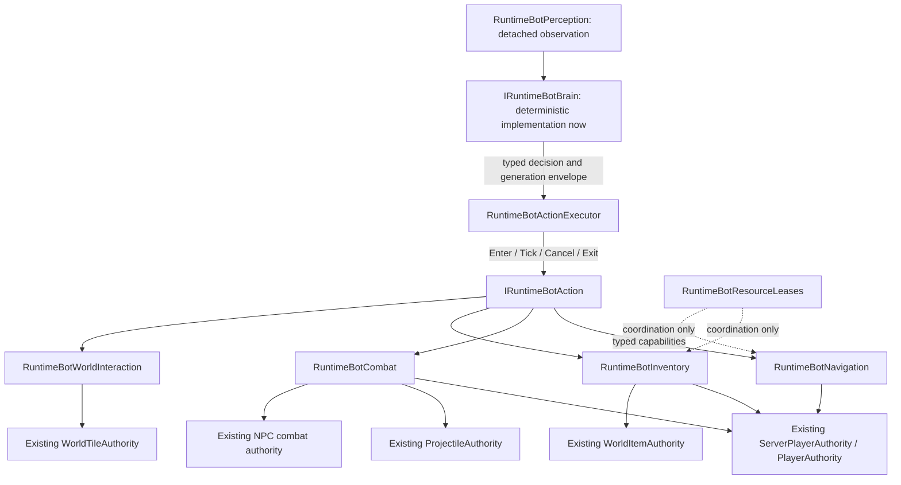
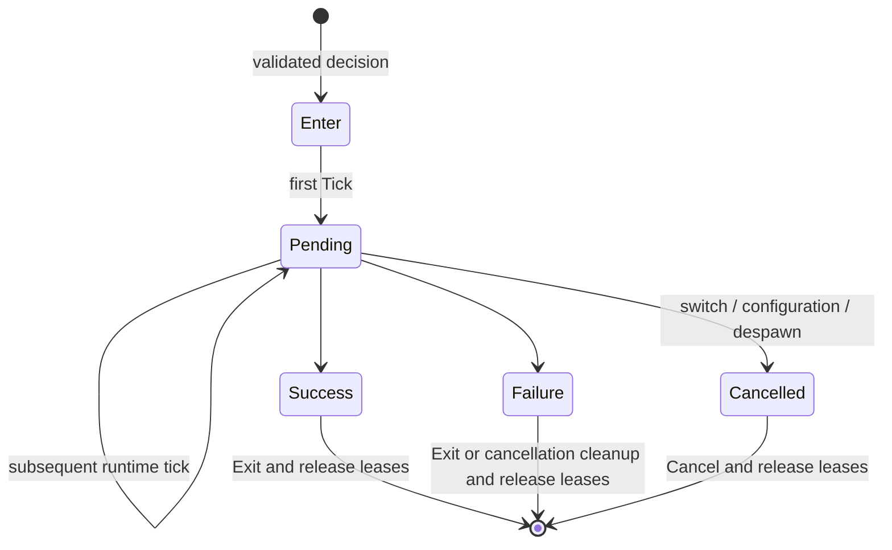

# PlayerBot task and action architecture

## Prepared melee and combat buffs

Prepared ordinary nonlethal Bot melee adopts NPC HP, actual player item-use presentation, shared accepted cadence and Bot clocks before observers. Preparation uses current NPC geometry and the complete held-item census; an owned refusal cannot fall back. Still-current notifications drain after an exception, then propagate the first failure. Presentation-only use introduces no fake item mutation or packet5. Potentially lethal, boss, town and shared-life paths retain their existing handling; source melee RNG and selected-prefix crit remain open.

The remote phase retains Ironskin5, Endurance114, Rage115 and Brain321 in indexed order, including outside compounding and existing early branches. Selected raw item crit is added once to buff-owned class crit. Endurance remains finite/nonnegative without a1 clamp across phase, transfer and common mitigation; values >=1 yield minimum1 damage (immune0). These four buffs and the already represented Archery16/Wrath117 enter the existing prepared projectile-hit and ordinary4/5 continuation boundaries without new intrinsic status effects. Brain accessory dodge and Inferno are not added. Independent component source probes and typed runtime reports remain distinct from natural-client and whole Main support.

Local acceptance passes: Release, focused 18495/18495, one full run 1563144/1563145 with one known skip, shipping Windows NativeAOT/five smokes and Release/Native live 82/49. Typed managed/Native proofs pass 558 melee, 586331 human phase/hit/arrow and 338 Endurance checks each. Managed State.Tick/private RNG/literal-wire assertions and separate typed Native public-state checks retain distinct scopes. Linux NativeAOT remains locally unverified. FullVanillaAiParity remains false.

PlayerBot remains a normal server-owned player. `Application/Bots` selects and schedules behavior; it does not own another player, projectile, inventory, damage or tile simulation. Hostile operator NpcBot remains removed; ordinary NPC actors and shops are independent.

## Retained ranged weapon and human combat buffs

Bot ranged use checks the actual weapon identity in its configured policy slot and derives represented prefix launch stats before the existing complete inventory preparation. Neutral catalog presets remain supported. Newer callback inventory survives accepted publication. Positive stack and exact configured identity are bounded Bot policy, while source stack0 and alternate selected weapons retain their separate reference scope. Prefix hit crit and Bot buff hit projection remain open.

Neutral Bot melee now requires its configured positive-stack sword with PrefixNone in the actual policy slot before random variation or presentation. Empty slots, Stone and other identities refuse. The existing NPC strike/death/status path remains in use; melee callback adoption, selected-prefix crit and source RNG ordering remain open.

The human candidate retains Archery and MinionDamage in the existing phase snapshot. Source-ordered indexed Archery/Wrath effects preserve living reset, outside compounding, dead carry and ghost reset. With a bound UpdatePlayers stream, represented bow/bullet reports use its owned phase projection for damage and Archery speed; missing or retired ownership rejects before generic fallback. Never-bound component runtimes retain the existing equipment-only projection, including quiver and inherited accessory modifiers. Indexed buff duration, complete census and shared RNG guards remain authoritative. Original phase/local Shoot/configured speed-cap references are distinct from runtime geometry translation and broader client behavior. Combined Release, focused18488 and one unfiltered full1563137 passes/one known skip are accepted. Fresh shipping WindowsNativeAOT/five smokes and Release/Native live82/49 pass. Exact typed held-weapon managed/Native verification passes645 checks each; separate human owned-phase verification passes437433 checks each. Actual durable State.Tick/full56/full44 and separate typed direct-phase/public RNG scopes remain distinct. LinuxNativeAOT remains locally unverified. Broader combat/inventory and full NPC AI remain open.

## Bot ranged-use custody and Arcane mana

Trusted Bot ranged use prepares and adopts ammo, held controls, animation, combat-trusted projectile birth and item-use cadence before observers. Attack recaptures the same exact known-living actor after earlier same-tick navigation/self-care, using the current aim and retaining strict prepared snapshot equality. Allocation refusal has no item or presentation side effects; callbacks cannot trigger rollback over newer state or a second accepted shot. The notification tail checks component contents and actor/projectile generations and attempts remaining valid notifications after a throw. The existing birth journal seals exact endpoint/playing-occupation recipients after providers and before writes: provider-time newcomers receive one birth, observer-time newcomers receive the adopted baseline once; stale replacement/restarted occupations are skipped. Existing deterministic one-projectile/one-ammo Bot policy remains; original Minishark conservation and Shoot RNG are separate work.

The bounded remote equipment phase derives Arcane66 mana through the existing effective-slot selector on156/3212, with20 per effective contributor and a400 cap before regeneration. Known None-prefix156/3212 vanity13..19 only block matching inherited favorites. Base mana and regeneration count/delay remain owned by their existing phases. Independent configured original53 profiles across both original platforms support phase arithmetic and selection, not captured inventory transport or broader equipment. Combined Release, focused18482, one unfiltered full1563131 passes/one known skip, shipping WindowsNativeAOT five smokes and Release/Native live82/49 acceptance pass. Exact typed Bot custody passes5786 checks on managed/Native. Arcane separate typed owned-phase verification passes956618 checks on each; durable managed State.Tick/full56/full44 integration retains its separate scope. Full human inventory/ammo and broader combat/equipment remain open.

## Trusted Bot partial pickup

Trusted Bot pickup accepts available capacity across a bounded unique-slot journal and leaves a same-generation world residual. One prepared player revision adopts all slots before observers. Required ammo visits54..57 then1..49; other useful items visit1..49, matching stacks before empty slots, with held slot0 protected. This restricted policy differs from original GetItem favorite/hotbar/ammo ordering. Incoming stacks above9999 refuse before import. The existing world allocation owner preserves partial body/generation and advances revision, or retains ordinary full-removal semantics. Per-slot notifications preserve newer callback contents; the bounded tail attempts other valid notifications after a throw and propagates the first exception. World publication runs independently in finally, suppressing replaced body/generation. Existing consumable single-item behavior remains. Original28 identities/168 configured calls establish capacity/conservation references, not whole pickup or human inventory authority.

Two grouped durable Facts cover59 actual pickup cases and direct bounded batch contracts, including capacity/fanout, maximum53 journal, protected0, explicit matching-before-empty policy, malformed10000 refusal, first-observer all-owner adoption, newer slot/actor/world state, throws/reentry and provider/lease/Bot currentness. Exact typed positive/restored runs pass2/2. Nine copied typed omissions cause2/2/1/1/1/1/1/1/1 assertion failures, zero runner errors. A separate cache-only managed private-state diagnostic passes1/1; accepted-content alias and world-saturation omissions each cause one assertion failure, zero runner errors. Private reflection is absent from the durable two Facts and Native. Initial fixture/scaffold and unreachable-code duplicate-control compilation failures are retained as diagnostics, excluded from meaningful omission results. Final source copies are restored. Original168 numeric rows preserve full56/public-Next as source-reference equality; they do not establish full runtime GetItem or human pickup authority.

Release Rebuild has zero warnings/errors; focused 18477/18477 passes. ONE unfiltered full passes 1563126/1563127, zero failures/errors, one known canonical-liquid skip; runner $552.801\,\mathrm{s}$. Fresh shipping WindowsNativeAOT and five smokes pass. Typed managed/fresh WindowsNative each pass5039 checks against exact32 references, executing both exact promoted Fact methods/assertions and embedded fixture with no exclusions; source168 capacity references and59 pickup cases remain scoped as above. AMD64 PE has zero CLR directory. Release/Native live82/49 pass:15 sections/client,312 frames before49,129/relay/chat82 and clean stop. CI-tools/docs/graph/domain/diff pass. No dependency/project edge or performance improvement is claimed. LinuxNativeAOT remains locally unverified; GitHub CI is not awaited. Source/test SHA256 `3bc74a252d640676b87be51d0fde2c0c52d28fc342f405e29f0339fe7ddab0cf`; production SHA256 `17d95adf456518b66e9d87657a058300b6aed1a37a907343b5b79ead41d383d1`.

Evidence: `.cache/bot-partial-pickup-block-v1-status.json`, `.cache/bot-partial-pickup-block-v1-full-tests/result.json`, `.cache/bot-partial-pickup-shipping-bin-v1/shipping-freeze.json`, `.cache/bot-partial-pickup-native-preparation/freeze-manifest.json`, `.cache/bot-partial-pickup-block-live-v1/results.json`, `.cache/getitem-storage-next-proof/manifest.json`, `.cache/bot-partial-pickup-next-witness/manifest.json`, `.cache/bot-partial-pickup-prototype-v1/final-candidate-freeze-v3.json`, `.cache/bot-partial-pickup-independent-tests/freeze-manifest.json`, `.cache/bot-partial-pickup-independent-tests/promotion-manifest.json`, `.cache/bot-partial-pickup-independent-review/freeze-manifest.json`.

## Trusted Bot consumable custody

Healing, mana and admitted Archery/Wrath consumption prepare inventory and effect together. A known living actor and exact player/Bot command scope are required. The prepared player owner applies item and optional normalized vitals in one revision; staged potion delay/buff expiry is accepted before observers. Independent item/vitals publication guards preserve newer callback state and consume offers before throws/reentry. A changed actor/configuration/goal/observation/tick prevents remaining mana or buff-slot consumption. Pickup retains its preceding strict owner guard. Expiry overflow and normalized death transitions refuse before consumption. Existing selection and conservation stay unchanged; original ManaV2=true full-mana consumption differs from Bot conservation. Three healing/four mana/two combat buffs are admitted;14 source identities and42 plus seven clamp references do not establish full Quick* semantics, sickness21/94, void inventory, animations or complete player buff slots.

Two grouped durable Facts cover callback custody, component publication, continuation mutations and independent source numeric evidence. Exact promoted gzip positive/restored runs pass both Facts; six production omissions cause 2/1/1/2/1/1 assertion failures with zero runner errors. The first five detect producer regressions; the sixth checks the new internal known-health preparation contract. The public observation scope already rejected unknown health. An initial byte-identical old-producer control and initial public-only unknown-health control are preserved as diagnostics, excluded from meaningful omission results. Independent original evidence comprises 42 repeated configured Quick* profiles and seven additive clamp calls, covering 14 catalog identities. These configured component calls do not establish natural client, whole Main or inventory-wire chronology. Existing three healing/four mana/two combat buff admissions and conservation policy remain unchanged; ManaV2 full-mana consumption is an explicit source-policy difference.

Release Rebuild has zero warnings/errors; focused 18475/18475 passes. ONE unfiltered full passes 1563124/1563125, zero failures/errors, one known canonical-liquid skip; runner $534.048\,\mathrm{s}$. Fresh shipping WindowsNativeAOT and five smokes pass. Typed managed/fresh WindowsNative each pass 1224 checks against exact32 references, including the two exact promoted Facts, 14 catalog rows, seven policy-compatible actual Bot clamp cases, four source ordering references and one full-mana policy reference. AMD64 PE has zero CLR directory. Release/Native live82/49 pass:15 sections/client,312 frames before49,129/relay/chat82 and clean stop. CI-tools/docs/graph/domain/diff pass. No dependency/project edge or performance improvement is claimed. LinuxNativeAOT remains locally unverified; GitHub CI is not awaited. Source/test SHA256 `5f1826fa04cba376765bf464c3b3a97135b58d4e621a60c119b5ec3fc1efd9ed`; production SHA256 `b082573a13a384b7f3ed332d8924e03098365e191e82d590ef78a59d26738416`.

Evidence: `.cache/bot-consumable-block-v1-status.json`, `.cache/bot-consumable-block-v1-full-tests/result.json`, `.cache/bot-consumable-shipping-bin-v1/shipping-freeze.json`, `.cache/bot-consumable-native-preparation/freeze-manifest.json`, `.cache/bot-consumable-block-live-v1/results.json`, `.cache/bot-consumable-callback-next-proof/manifest.json`, `.cache/bot-quick-consumable-original-next-proof-v3/manifest.json`, `.cache/bot-quick-consumable-smallmax-next-proof/manifest.json`, `.cache/bot-consumable-atomic-next-prototype/promoted-final-freeze.json`, `.cache/bot-consumable-independent-durable-v2/promotion-manifest.json`, `.cache/bot-consumable-independent-durable-v2/promoted-gzip-controls-final.json`.

## Atomic trusted pickup

Trusted Bot pickup stages the complete next bounded inventory dictionary and reuses the world-item allocation preview. It adopts inventory and world removal before observers. Final actor/revision/item-generation and bot configuration/goal/observation/tick guards refuse stale proposals. An inventory callback may change another item or throw: accepted state remains, and world removal independently publishes once if its generation is still current. A replacement world generation suppresses stale removal. Leases release on every exit; failed preparation writes neither owner. This preserves the conservative useful-item, slot-order and full-stack policy. Human client-reported151 remains a removal report followed by later5/138 inventory reports; it does not receive an extra grant. Full vanilla GetItem parity and allocation/performance improvements are not claimed. Independent original SetDefaults evidence covers6196 requested identities;328 original GetData5 calls repeat identically. The server slice admits152 literal peer-frame/canonical tuple/full56/public-Next rows;12 negative-stack prior-policy and164 no-relay client rows remain separate references. Game positive/restored19534 checks and omissions yield96/364/10 assertion failures, zero runner errors. App positive/restored39159 checks preserve old168/194/2800 references; both omissions yield one assertion failure with zero runner errors. One grouped durable Fact additionally checks all6196 independent numeric identities/idempotence/bounds and profile/currentness/unbound behavior; no extra theory matrix was added. Two grouped Bot Facts detect old notification order, player ABA, bot configuration and provider lease-owner replacement: omission failures2/1/1/1, zero runner errors. All positive/restored runs pass. Initial Native harness scaffolding failures (missing implicit imports and an anonymous JSON AOT contract) are preserved; corrected typed scaffolding retains assertions. Human pickup chronology is six repeated original calls: full151 or partial21 precedes later5/138, without server inventory mutation from151/21. This does not establish full human inventory custody or source GetItem parity.

Release Rebuild has zero warnings/errors; focused 18473/18473 passes. ONE unfiltered full passes 1563122/1563123, zero failures/errors and one known canonical-liquid skip, runner $625.014\,\mathrm{s}$. Fresh shipping WindowsNativeAOT/five smokes and typed managed/fresh Native31267 checks each pass against exact32 references; AMD64 PE has zero CLR directory. Native covers typed canonical inventory/public seeded-next and five Bot custody scenarios; private full56/literal source relay comparisons and lease/null-dictionary extras remain managed evidence. Release/Native live82/49 pass:15 sections/client,312 frames before49,129/relay/chat82 and clean stop. CI-tools/docs/graph/domain/diff pass. No dependency/project edge added. Genuine LinuxNativeAOT remains locally unverified; GitHub CI is not awaited. Source/test SHA256 `531e486fe015fc20573854707df3233f3bb6cdfbb7f30f8e6fa11eeb0ee2ba10`; production SHA256 `798b571ed3835fe48648170a92f2f3f37e01ed7333a7ec9a3f8a127cc2b7b048`.

Evidence: `.cache/identity-bot-block-v1-status.json`, `.cache/identity-bot-block-v1-full-tests/result.json`, `.cache/identity-bot-shipping-bin-v1/shipping-freeze.json`, `.cache/packet5-identity-bot-native-preparation/freeze-manifest.json`, `.cache/identity-bot-block-live-v1/results.json`, `.cache/packet5-retained-identity-game-work/freeze-manifest.json`, `.cache/packet5-retained-identity-game-work/promotion/promotion-manifest.json`, `.cache/packet5-retained-identity-app-next-work/freeze-manifest-v2.json`, `.cache/bot-pickup-atomic-lease-v4/promoted-final-freeze.json`, `.cache/packet5-retained-identity-next-proof/manifest.json`, `.cache/inventory-stack-metadata-next-proof/manifest.json`, `.cache/world-item-pickup-chronology-next-proof/manifest.json`.

## Ownership

```mermaid
flowchart TD
    Observation[RuntimeBotPerception: detached observation] --> Brain[IRuntimeBotBrain: deterministic implementation now]
    Brain -->|typed decision and generation envelope| Executor[RuntimeBotActionExecutor]
    Executor -->|Enter / Tick / Cancel / Exit| Action[IRuntimeBotAction]
    Action -->|typed capabilities| Navigation[RuntimeBotNavigation]
    Action --> Combat[RuntimeBotCombat]
    Action --> Inventory[RuntimeBotInventory]
    Action --> Interaction[RuntimeBotWorldInteraction]
    Navigation --> Player[Existing ServerPlayerAuthority / PlayerAuthority]
    Combat --> Player
    Combat --> Projectile[Existing ProjectileAuthority]
    Combat --> NPC[Existing NPC combat authority]
    Inventory --> Player
    Inventory --> Item[Existing WorldItemAuthority]
    Interaction --> Tile[Existing WorldTileAuthority]
    Leases[RuntimeBotResourceLeases] -. coordination only .-> Inventory
    Leases -. coordination only .-> Navigation
```

`RuntimeBotAuthority` creates, configures and despawns bots, composes collaborators, detects lost player generations, ticks controllers and publishes detached telemetry. It no longer implements attack, pickup, consumable, target-selection or navigation loops. `BotState` retains bot policy state only; authoritative actor state remains elsewhere. `BotPolicy` names tactical thresholds and action watchdogs, not a second gameplay catalog.

`RuntimeBotController` schedules invariant instantaneous pickup/healing/mana, then captures the post-maintenance observation and invokes the replaceable brain and one long-lived goal executor. Maintenance is not a competing goal and cannot be switched off. Combat buffs retain their original ordering inside Guard. The existing server-player physics and subsequent combat passes retain their runtime tick order.

`RuntimeBotPerception` performs bounded current-player, protected-player, guard-candidate and useful-item queries. It retains existing target-lock/squad scoring policy, without writing world state. The first snapshot is deliberately reduced: self, configuration, live protected player, selected guard candidate, useful item, inventory counts/capabilities, underground hint, recovery requirement, current action and recent result. It is not a whole-world scanner, route map or full inventory export. All fields are detached value snapshots; no mutable arrays, dictionaries or actor references are exposed.

## Identity and validation

Observations contain `WorldRuntimeIdentity` (logical runtime plus activation session), exact `PlayerHandle` for the bot, local bot ID, monotonic observation revision, goal generation and tick. Production composition passes the owning `WorldRuntime.Identity`; standalone `ServerRuntimeState` owns its own activation identity. Reconfiguration and loss of an exact followed-player generation advance the goal generation. Reconnecting into the same slot cannot inherit an old goal.

`RuntimeBotDecisionEnvelope.Validate` rejects a different bot/world/session/goal/revision and mismatched explicit player/NPC/item handles. Invalid submissions do not replace the current action. After admission, the executor allows observations to advance but rejects changed bound generations before ticking. Explicit NPC and item intents retain exact entity generations, not just physical slots. Operation adapters additionally reject stale observation scope before performing snapshot-driven work. An action context contains only typed navigation, combat, inventory and world-interaction capabilities, never `RuntimeBotAuthority` or mutable stores.

This is an internal, synchronous execution contract, not a public plugin SDK or asynchronous planner implementation. `IRuntimeBotBrain` is substitutable through composition. A brain is not an authority. An action is not an authority. Neither may bypass normal player semantics. A resource lease is not permission to mutate an entity.

## Lifecycle and actions

```mermaid
stateDiagram-v2
    [*] --> Enter: validated decision
    Enter --> Pending: first Tick
    Pending --> Pending: subsequent runtime tick
    Pending --> Success
    Pending --> Failure
    Pending --> Cancelled: switch / configuration / despawn
    Success --> [*]: Exit and release leases
    Failure --> [*]: Exit or cancellation cleanup and release leases
    Cancelled --> [*]: Cancel and release leases
```

`Enter` runs once, `Tick` runs at most once per runtime tick, and terminal actions are never ticked again. `Exit` releases successful/failed action presentation or movement; `Cancel` handles interrupted actions, including Mirror cancellation. Results use `Pending`, `Success`, `Failure`, `Cancelled` and typed failure codes. No string is machine-readable action semantics.

An executor cannot be rebound to another bot or activation. Regressing observation revisions are rejected even when newer than the initial decision. Cancellation uses the original bot's capabilities if the incoming context belongs to a different generation/world. Stop, Mirror cleanup, configuration and despawn revalidate the actor mapping, so reusing a `ServerPlayerId` cannot modify a replacement generation. Callback invariant exceptions remain visible to the runtime; executor ownership and leases are still cleared.

Continuous Idle/Follow/Guard have no arbitrary global position watchdog. Existing source-backed Mirror presentation remains a separate recovery action. Its runtime watchdog is $120\,\text{ticks}$; the item still uses its original $90\,\text{ticks}$ with midpoint recall. Attack has a $180\,\text{tick}$ watchdog. Collect and autonomous Mining have a $1800\,\text{tick}$ deadline and $300\,\text{tick}$ stagnation window. `BotPolicy` owns these runtime policies. Each action supplies its progress metric: collection uses distance to its exact item; mining combines approach distance and committed corridor breaks. Stationary semantic progress is valid; there is no generic “not moving means broken” rule.

Actions cover Idle, Follow, Guard, Attack, PickupUsefulItem, UseConsumable, RecoverToTarget, Mining, Collect and ReturnToPlayer. Movement is a typed navigation primitive rather than a duplicate physics action. Existing weapon selection, prediction, LOS/trajectory admission, ammo transaction, melee commit, potion ordering, flight, local cave detours and safe recall checks were extracted, not replaced. The bounded local search in `BotTraversal` is unchanged; no new global A* was introduced.

## Operator modes

The settings window offers `Mining ore`: Copper, Tin, Iron, Lead, Silver, Tungsten, Gold or Platinum. Mining no longer needs a player target or recent human digging. Existing Follow/Guard underground assistance remains separate and retains its cadence/presentation regression.

| Mode | Admitted behavior |
| --- | --- |
| Idle | Stop, retain automatic pickup and consumables. |
| Follow | Existing separated escort, cave traversal, mining assistance and Mirror recovery. |
| Guard | Existing target locks, squad positioning, weapons and authoritative combat while protecting the selected player. |
| Mining | Find the selected ordinary ore underground, lease it, approach and excavate a body-sized Dirt/Stone corridor with the existing Vortex Pickaxe, then use normal world-item pickup. No player target required. |
| Collect | Approach an available useful item within the existing bounded search radius, lease its exact generation, then use the same conservative pickup operation. Unsupported items are ignored. |
| ReturnToPlayer | Return to the selected player, stop within $96\,\mathrm{px}$ instead of matching coordinates, retain normal Mirror recovery. |

Follow, Guard and ReturnToPlayer require a current player handle. Mining on the surface reports `PermissionDenied`; missing verified layer facts report `UnsupportedAction`. Build, crafting, chopping, chest access and other unimplemented gameplay are not presented as working modes. TUI displays current action and typed recent result; existing numeric/network and bot status fields remain.

`RuntimeBotMining` owns a resumable local search, not another tile authority: a $65\times65\,\text{tile}$ square, at most $256\,\text{cells/bot/tick}$, retry after $60\,\text{ticks}$. Candidates are stable scan-order, not nearest-path scored. Observation carries the tile coordinate/type and section revision. Changed sections (including remove/replace ABA) invalidate the swing; only the bot's own committed excavation refreshes its retained target revision. Leases prevent competing target claims and are released on every terminal/cancel/despawn path. Dirt drops do not interrupt an active ore approach; automatic pickup remains enabled. The task checks inventory space before producing ore loot.

Every swing uses `WorldTileAuthority`'s shared server-player pick transaction: live actor, underground/reach/pick/cadence checks, reserved item capacity, tile mutation, world drop and held-tool replication. No direct inventory reward or tile-store write is allowed. Current material admission is eight ordinary ores plus Dirt/Stone for access, without walls, liquids, wiring or neighbouring special structures. Other ores, special seeds, chest handling, global exploration and arbitrary cave routes remain unsupported. This is bounded autonomous mining, not completed mining/building/crafting parity.

## Coordination

An addressed `PickupUsefulItem` action passes the exact observed item handle into the existing inventory adapter. A reused slot/generation or another nearby item cannot satisfy that action. Automatic maintenance retains its existing bounded useful-item scan.

`RuntimeBotResourceLeases` is single-writer and per runtime. Keys include world/session and either an exact `WorldItemHandle` or tile coordinate; owners include bot ID and exact player generation. The store is bounded to $1024\,\text{leases}$, default TTL $180\,\text{ticks}$, maximum TTL $3600\,\text{ticks}$. It rejects competing acquisition, expires leases and releases ownership on terminal actions, cancellation, reconfiguration and despawn. Pickup also releases its short transaction lease immediately. Collect queries exclude another bot's live claim. Existing Guard soft assignments remain non-exclusive, so one boss can still be attacked by the whole squad. General area/NPC/chest reservation policies are future extensions, not completed features.

## External planner contract and future work

```mermaid
flowchart LR
    Snapshot[RuntimeBotObservationSnapshot] --> Reduced[Reduced semantic serialization outside runtime]
    Reduced --> Planner[External Vega / script / scenario / LLM planner]
    Planner --> Parse[Parse and schema validation]
    Parse --> Intent[Typed intent validation]
    Intent --> Permission[Permission validation]
    Permission --> Generation[World / bot / goal / revision validation]
    Generation --> Action[Admitted runtime action]
```

No LLM, HTTP client, prompts, provider packages, model routing, dynamic loading or reflection registration were added. No raw model JSON may be executed. A future external planner must implement all the gates above and submit typed decisions through the world command boundary; the present exact-revision contract deliberately rejects stale replies. Async response delivery and a public SDK remain future work.

Future action queue: Mine extensions (other ores and routes beyond the present local search), Chop, Build, Explore, OpenChest, Loot, Craft, ReturnToPlayer extensions and ProtectArea. Each requires verified existing authority capabilities; unsupported execution must return `Failure(UnsupportedAction)`, not approximate game semantics.

## Verification

See `RuntimeBotActionExecutorTests` for lifecycle, switching, deadlines, action-defined stationary progress, generations and leases; `RuntimeBotAuthorityTests` for real mode/inventory/lease/observation integration; existing `RuntimeBotNetworkAcceptanceTests` and `BotTraversalTests` retain packet, combat, pickup, death, Mirror and cave regressions. UI interaction tests check modes and results. Current validation and remaining external gates are recorded in [work state](../agent-memory/work-state.md); source facts remain in [verified vanilla](../agent-memory/verified-vanilla.md). No official-client playthrough or full vanilla parity is implied by this architecture change.
