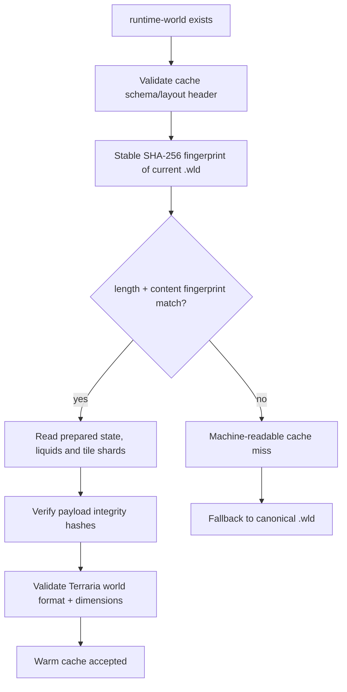

# Runtime-world cache validity contract

[Русский](../ru/runtime-world-cache-validity.md) · [Runtime rebuild](runtime-world-save-rebuild.md) · [World persistence](world-persistence.md) · [Roadmap](../roadmap.md)

## Rule

`.wld` remains the canonical source of truth. A `.runtime-world` image is accepted only when it proves that it belongs to the current canonical bytes and to the current TerraRuntime cache layout. File timestamps are useful for detecting a changing source during reads, but timestamps alone never authorize a cache hit.

## Header contract

The fixed 128-byte runtime-cache header carries:

- runtime-image schema version;
- runtime layout version;
- the Terraria world format version;
- canonical source length and write timestamp;
- a 128-bit content fingerprint derived from SHA-256 of the canonical `.wld`;
- the existing XxHash3 digest of the embedded canonical payload;
- tile record/shard layout metadata.

The 128-bit fingerprint uses the first 16 bytes of SHA-256. The cache is disposable local data, but source identity must not be inferred from length or timestamps. A practical or accidental collision is therefore made negligible without expanding the already fixed cache header.

Older images whose previously reserved header bytes contain no current schema/layout contract intentionally miss and are rebuilt from `.wld`; runtime-cache migration is unnecessary.

## Warm-start validation

The canonical fingerprint is captured from a stable file generation. Metadata is checked before and after hashing so a concurrent canonical replacement is not silently treated as a valid fingerprint capture.

## Layout and integrity

`CurrentLayoutVersion` is the explicit invalidation knob for critical compiled/runtime representation changes. Acceptance also requires the native little-endian `WorldTile` record layout expected by the cache plus the fixed tile and shard record sizes encoded in the header.

Integrity remains layered:

- embedded canonical bytes: XxHash3;
- every tile shard: independent XxHash3;
- liquid queue payload: XxHash3;
- prepared runtime-state payload: XxHash3.

These fast hashes protect disposable cache contents against corruption. The SHA-256-derived source fingerprint solves a different problem: binding the cache to the actual current `.wld` generation.

## Failure semantics

Schema mismatch, layout mismatch, source fingerprint failure/mismatch, Terraria world-format mismatch and payload corruption are distinct `RuntimeWorldSnapshotLoadResult` values. None damages or rewrites `.wld`. Startup records the miss reason and falls back to the canonical loader, which can rebuild a fresh image afterward.

## Verification

Regression tests prove that a matching canonical source is accepted, a same-length `.wld` mutation with its original timestamp restored is rejected, schema/layout/world-format mismatches remain machine-readable, and tile-shard corruption is detected after the canonical fingerprint itself has passed.
