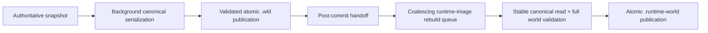

# Runtime-world rebuild after canonical save

[Русский](../ru/runtime-world-save-rebuild.md) · [World persistence](world-persistence.md) · [Roadmap](../roadmap.md)

## Contract

The Terraria-compatible `.wld` is always the authoritative persistence checkpoint. The `.runtime-world` file is a disposable startup image and is rebuilt only after the canonical save has been published successfully.

A runtime-image failure never rolls back or changes a successful `.wld` commit. Cache rebuild diagnostics are therefore tracked separately from canonical save failures.

## Coalescing

Canonical saves and runtime-image rebuilds use independent bounded coalescing schedulers. At most one cache rebuild is active. If several canonical checkpoints commit while a rebuild is active, redundant pending rebuild requests collapse to the newest generation instead of creating an unbounded disk-I/O backlog.

The rebuild worker reads the canonical file only after publication. It captures source metadata before and after the read, validates the complete supported `.wld`, writes the runtime image atomically, then re-stats the source. If the canonical source changes during this window, the known-stale derived image is removed and the worker retries against the newer generation.

## Shutdown

Graceful shutdown stops the authoritative owner, queues the final canonical snapshot and drains the canonical save coordinator first. The successful final `.wld` commit queues a runtime-image rebuild. Shutdown then drains the cache-rebuild scheduler before returning from persistence completion.

The old shutdown behavior deleted `world.runtime-world` after the final save. That invalidation is no longer correct once the final runtime image is rebuilt and drained. The bootstrap packet cache remains independently invalidated because this block does not rebuild it.

## Failure semantics

A rebuild may report source unavailable, source changed during rebuild, invalid canonical world, cache-write failure or I/O failure. These results do not retroactively mark a successfully published `.wld` as failed. Startup continues to treat the derived image as optional and falls back to canonical `.wld` loading whenever the runtime image is missing, stale or invalid.

## Verification

Tests cover the post-commit callback boundary, stable canonical-to-runtime-image rebuild, refusal to overwrite an existing cache from an invalid canonical file, and the complete final-save path where shutdown completion leaves a loadable runtime image matching the newly committed canonical checkpoint.
