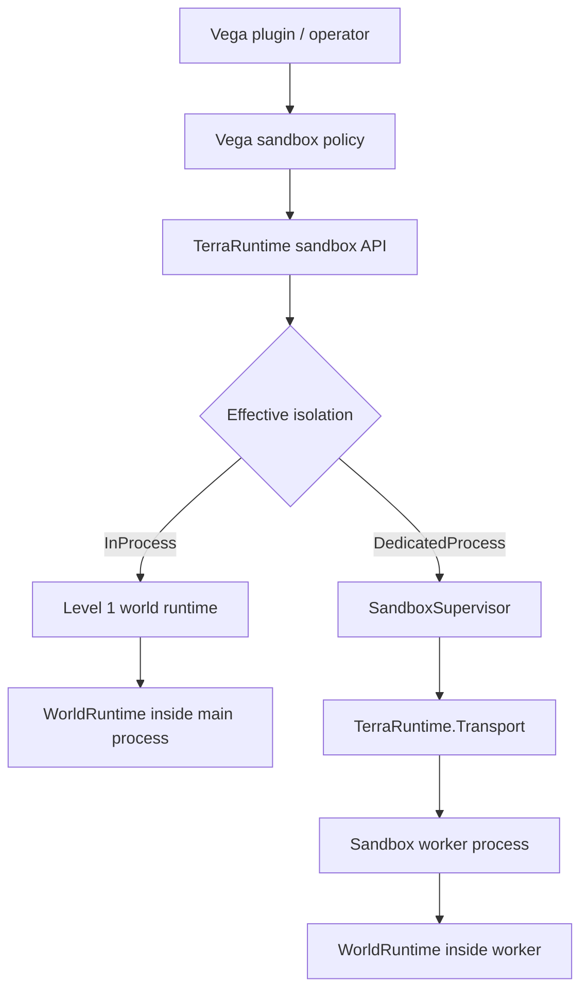
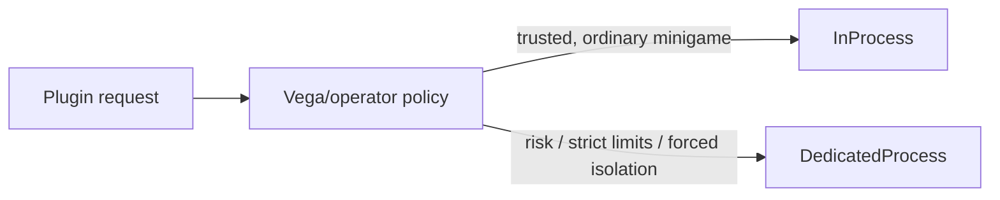

# Sandbox runtime architecture

[Русский](../../ru/sandbox/README.md) · [Roadmap](../../roadmap/sandbox/README.md)

This directory is the canonical architecture specification for TerraRuntime sandbox worlds.

A sandbox is not a second game engine and not a replacement for Dimensions. Both isolation levels run the same `WorldRuntime` model. The difference is where that runtime and its sandbox-local logic live.

## Architecture at a glance



Vega requests sandbox semantics. TerraRuntime owns authoritative world state and process/socket lifecycle. `TerraRuntime.Transport` remains the common control/server boundary, but local Level 2 gameplay traffic uses direct client-to-worker TCP after socket handoff.

## Documents

- [Level 1: in-process sandbox](level-1.md) — multiple isolated world runtimes in one process.
- [Level 2: dedicated-process sandbox](level-2.md) — worker lifecycle, placement, plugin/module loading and fault isolation.
- [TCP socket handoff](socket-handoff.md) — main -> worker -> main ownership transfer without client reconnect.
- [Transport and control plane](transport.md) — what Transport carries and what it deliberately does not carry.
- [Vega integration](vega-integration.md) — sandbox creation, isolation policy, hooks, commands and sandbox-local plugins.

## Core invariants

1. One live `WorldRuntime` has exactly one authoritative simulation owner.
2. A client belongs to at most one active `WorldSessionId` at a time.
3. A Level 2 transferred client socket has exactly one application-level process owner at a time.
4. `.wld` identity is not live runtime identity. `WorldRuntimeId` and `WorldSessionId` identify runtime/session lifetime.
5. Level 1 does not route ordinary gameplay through IPC.
6. Level 2 uses Transport for lifecycle/state/control, then hands the accepted TCP socket to the worker for direct gameplay.
7. A world/plugin scope must be retired as a unit. Hooks, commands, timers and retained runtime references may not outlive the scope.
8. Vega policy may strengthen requested isolation but must not silently weaken a dedicated-process requirement.

## Isolation selection

Conceptually Vega can request:

```text
Auto
InProcess
DedicatedProcess
```

`Auto` delegates the choice to policy. `InProcess` expresses a performance preference, but policy may strengthen it to `DedicatedProcess`. `DedicatedProcess` is a minimum isolation requirement and must not be silently downgraded.



## World sources

No separate mandatory "template" subsystem is required. A sandbox may be created from one of the actual sources TerraRuntime can support:

- an existing `.wld`;
- validated generated world state;
- a snapshot/clone source.

A future named-template catalog may be layered above these sources if operators need it, but the runtime architecture does not depend on inventing a new template file format.
