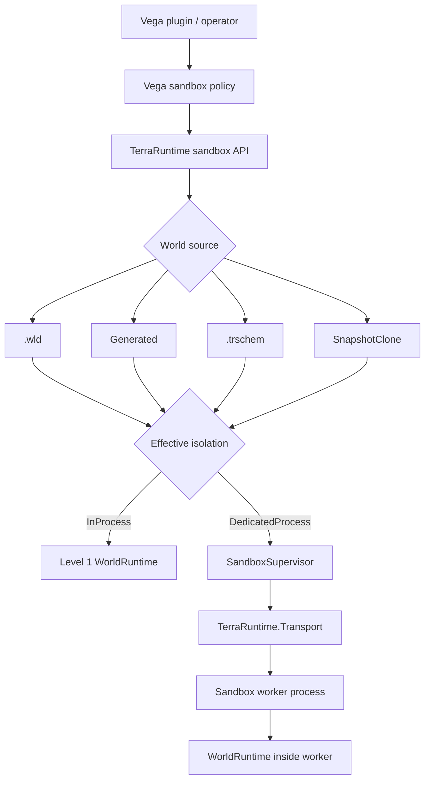

# Sandbox runtime architecture

[Русский](../../ru/sandbox/README.md) · [Roadmap](../../roadmap/sandbox/README.md)

This directory is the canonical architecture specification for TerraRuntime sandbox worlds.

Sandbox is not a second gameplay engine and not a Dimensions replacement. Both isolation levels use the same `WorldRuntime` model. Even the primary world is an ordinary `WorldRuntime` that Vega/the host selects as the primary target. What changes is lifecycle/policy and, for Level 2, the process boundary.

## Overall architecture



Vega requests sandbox semantics. TerraRuntime owns authoritative world state and process/socket lifecycle. `TerraRuntime.Transport` remains the common control/server boundary, while local Level 2 gameplay flows directly client-to-worker after socket handoff.

## Current Level 1 baseline

The server now admits its normal persistent world as an ordinary primary `WorldRuntime` and can run bounded additional Level 1 runtimes in the same process. Every admitted runtime owns a dedicated authoritative loop plus its own world, entity, player-membership, replication, cache and persistence state.

The terminal UI and its plain-console fallback expose these implemented commands:

```text
sandbox list
sandbox status <name>
sandbox create <name> l1 gen <generator-id> [seed <number|random>] [size <width>x<height>]
sandbox create <name> l1 file <relative-world-path>
sandbox regen <name> [seed <number|random>]
sandbox destroy <name>
sandbox jobs
sandbox job <id>
sandbox cancel <id>
```

Generated and `.wld` sources are materialized and validated on a bounded dedicated background queue before runtime admission. `--max-world-runtimes` controls live-world admission (default `8`), and `--sandbox-materialization-concurrency` controls materialization workers (default `1`). File commands accept only relative `.wld` paths below the primary world's directory.

Player `move`/`respawn`, `.trschem` live materialization, per-sandbox game-mode scope, and regeneration with attached players remain later slices. Until the transfer/bootstrap slice lands, `regen` fails safely when players are attached and leaves the active session unchanged.

## Documents

- [Level 1: in-process sandbox](level-1.md) — complete independent `WorldRuntime` in the shared process, plugin compatibility and shared chat.
- [Level 2: dedicated-process sandbox](level-2.md) — worker lifecycle, placement, selected game-mode/plugin loading and fault isolation.
- [World sources and TerraRuntime Schematic](world-sources-schematics.md) — `.wld`, generated worlds, `.trschem`, chests, tile entities, NPCs, markers and materialization.
- [TCP socket handoff](socket-handoff.md) — ownership main -> worker -> main without client reconnect.
- [Transport and control plane](transport.md) — what Transport carries and what intentionally does not flow through it.
- [Vega integration](vega-integration.md) — sandbox creation, isolation selection, hooks, commands and sandbox-local logic.

## Core invariants

1. One live `WorldRuntime` has exactly one authoritative simulation owner.
2. The primary world is not a special simulation class; it is a host-selected ordinary `WorldRuntime`.
3. Complete mutable gameplay state is runtime-local: players, NPCs, bosses/AI, projectiles, items, tiles, chests/signs/tile entities, liquids, wiring, events, time/weather, progression, RNG, replication and persistence.
4. A client belongs to at most one active `WorldSessionId` at a time.
5. A Level 2 transferred client socket has exactly one application-level process owner at a time.
6. `.wld`/`.trschem` identity is not live runtime identity. Lifetime is defined by `WorldRuntimeId` and `WorldSessionId`.
7. Level 1 does not route ordinary gameplay through IPC.
8. Level 2 uses Transport for lifecycle/state/control and then hands the accepted TCP socket to the worker for direct gameplay.
9. Legacy Vega plugins remain attached only to the selected primary runtime by default; sandbox-aware logic receives a separate `SandboxContext`.
10. A shared Vega chat router is allowed for Level 1, but messages preserve `WorldRuntimeIdentity` and explicit visibility policy.
11. Vega policy may strengthen requested isolation but must not silently weaken a dedicated-process requirement.

## Isolation selection

Conceptually Vega may request:

```text
Auto
InProcess
DedicatedProcess
```

`Auto` delegates selection to policy. `InProcess` expresses a performance preference, but policy may strengthen it to `DedicatedProcess`. `DedicatedProcess` is a minimum requirement and must not be silently downgraded.


## World sources

Level 1 and Level 2 use one `SandboxWorldSource`:

- an existing `.wld`;
- a `Generated` request through TerraRuntime world generators;
- native TerraRuntime schematic `.trschem`;
- snapshot/clone source after the corresponding runtime snapshot contract is implemented.

`.trschem` is the shared TerraRuntime/Vega/WorldEdit format, not a WorldEdit dependency. It is designed for reusable scenes/arenas and may contain tiles, liquids/wiring, chests with contents, signs, typed tile entities, NPC placements, world items and named markers/regions.

The same map must be launchable as Level 1 or Level 2 without changing its asset format.
