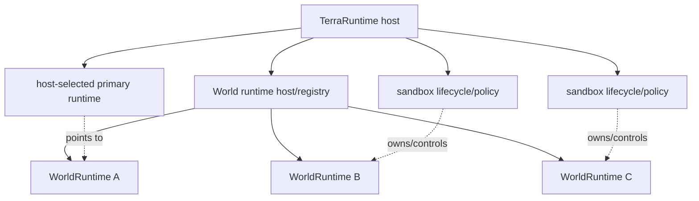
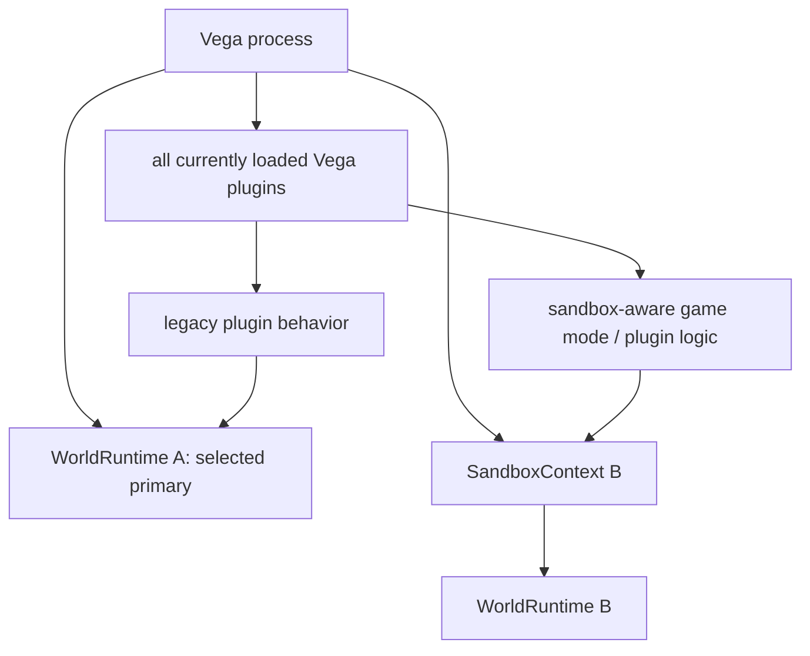
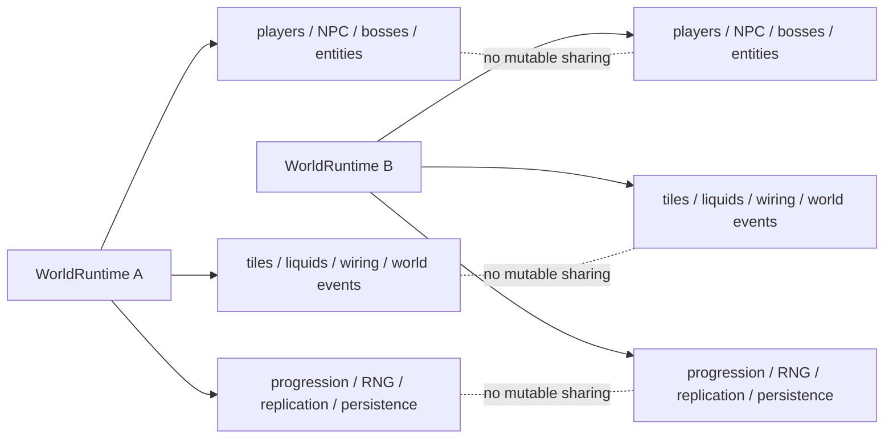
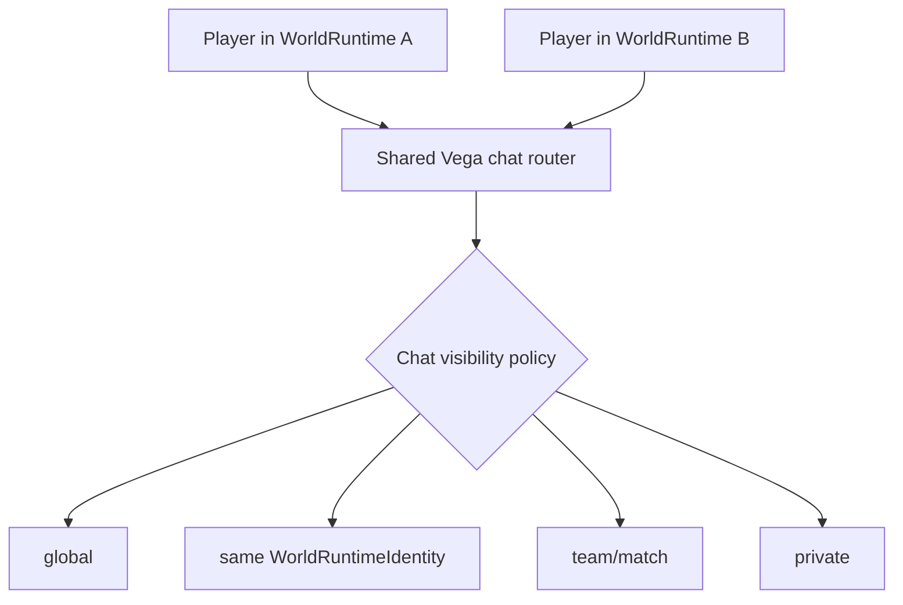
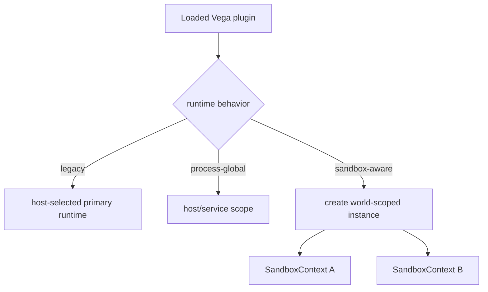
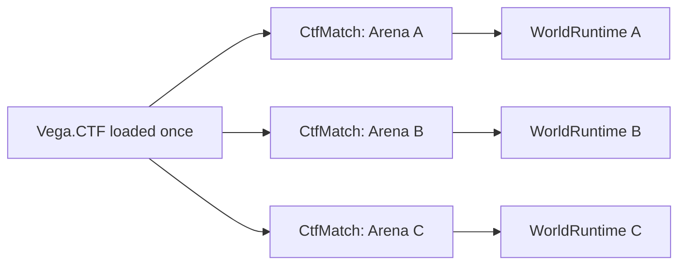
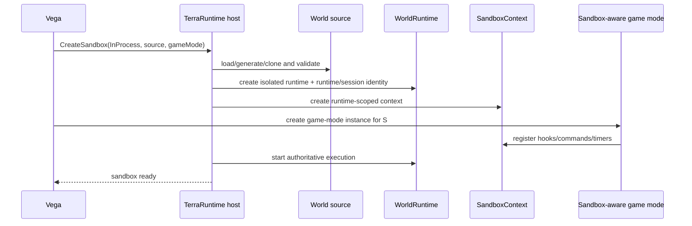
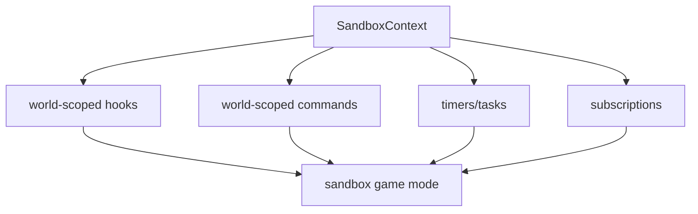
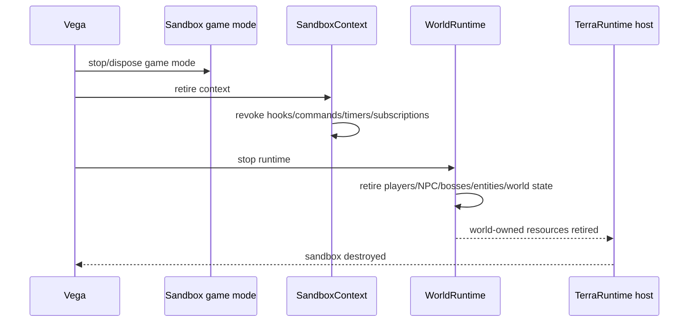

# Level 1: in-process sandbox

[Overview](README.md) · [Русский](../../ru/sandbox/level-1.md)

Level 1 runs a sandbox as another independent `WorldRuntime` inside the same TerraRuntime process. Its goal is cheap isolation of the **complete gameplay world and world-scoped plugin state** without another OS process.

## Normative model

There is no special `PrimaryWorldRuntime` type. The primary world and a Level 1 sandbox are the same runtime abstraction.



`WorldRuntime` does not need to know whether an operator currently treats it as the primary world, an arena, a tutorial or another host-owned purpose. Those are host/Vega lifecycle and policy concerns, not simulation kinds.

The primary designation provides defaults such as initial player admission target, legacy-plugin compatibility target and usually persistent lifetime. A Level 1 sandbox is simply another `WorldRuntime` with sandbox lifecycle/policy around it.

Level 1 does not create another Vega process, reload assemblies or build a second DLL set. All currently loaded Vega plugins remain loaded once in the main process.

A sandbox does **not** automatically inherit world-scoped behavior from every loaded plugin. A legacy plugin written under a single-world assumption is attached only to the host-selected primary runtime by compatibility policy. Only explicitly sandbox/multi-world-aware logic receives a `SandboxContext` for another runtime.



This preserves compatibility: enabling Level 1 must not suddenly make old `/home`, economy, protection or gameplay plugins receive events from a temporary arena.

## Complete gameplay isolation

`WorldRuntime` is the boundary for all mutable gameplay state, not merely players and chests.

Each runtime must independently own:

- players and their world membership/state;
- NPCs and town NPCs;
- bosses, boss AI, boss lifecycle and interaction/loot credit;
- projectiles, dropped items and runtime entity registries/IDs;
- tiles, walls, objects, chests, signs and tile entities;
- liquids;
- wiring, mechanisms and world-interaction state;
- world clock, day/night, weather and environment state;
- invasions, world events and event-local counters;
- progression and boss/event completion flags;
- spawn state, spawn pools and world-local gameplay coordinators;
- RNG streams and deterministic world randomness;
- player/NPC/projectile/item replication state;
- section visibility/cache/bootstrap state;
- persistence/autosave state according to runtime persistence policy;
- world-scoped extension/plugin/game-mode mutable state;
- hooks, commands, timers and subscriptions attached to that runtime.



For example, killing a boss inside an arena must not set a progression flag in the primary-selected runtime. Blood Moon, invasion, rain, NPC housing, chest contents or wiring state from one runtime must not appear in another through shared globals.

## What may be shared

Only explicitly process-global infrastructure services that are not mutable state of one world may be shared.

For the Level 1 baseline, the shared **Vega chat router** is explicitly allowed. A message originating from a world context must carry `WorldRuntimeIdentity` so policy can choose global/world/team/private visibility.



Shared chat does not imply shared world hooks or shared mutable gameplay state. Other cross-world services are added only as explicit host-level contracts, not merely because two runtimes happen to share one process.

## Plugin compatibility policy

Level 1 uses three behaviors without requiring a public enum in the first implementation:

1. **Legacy / primary-only** — the existing plugin remains loaded, but receives world-scoped callbacks only for the runtime selected by Vega as primary.
2. **Process-global infrastructure** — code is not attached to one `WorldRuntime` and does not mutate gameplay state directly.
3. **Sandbox-aware / multi-world-aware** — the plugin or game mode explicitly creates separate world-scoped state through `SandboxContext` for every runtime in which it participates.



No plugin assembly needs to be unloaded or loaded again for Level 1. Isolation comes from separate runtime/context/state, not a separate `AssemblyLoadContext`.

## Minimal game-mode model

The baseline does not require an arbitrary `Modules = [...]` dependency graph for Level 1. A sandbox selects one game mode/owner logic; helper services remain ordinary implementation code or Vega/TerraRuntime APIs.

Conceptually:

```text
Sandbox
  WorldRuntime
  SandboxContext
  SandboxGameMode instance
```

One loaded game-mode plugin may create multiple independent instances:



Mutable match state belongs to the arena instance and does not live in accidental process-global singletons.

## Creation lifecycle



A sandbox is not `Ready` until its world runtime and required sandbox-aware logic are ready. Legacy plugins do not receive another scope.

## Hooks, commands and timers

All sandbox registrations belong to `SandboxContext` and must be revocable.



A `/team` command, player-death handler or arena timer does not become global merely because its plugin assembly is globally loaded in Vega.

## Teardown



An ephemeral runtime leaves no world state, registrations or retained runtime references after teardown. A persistent runtime follows its explicit persistence policy.

## What Level 1 does not provide

Level 1 provides complete world-state/lifecycle isolation, not hostile-code security isolation. Plugin code still shares one OS process. `Environment.FailFast`, unsafe/native crashes or process-wide OOM can terminate the process. Level 2 is used when plugin code and the world runtime must be isolated from the main process.
