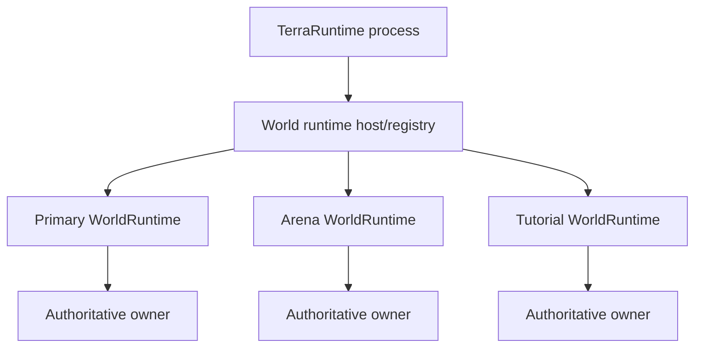
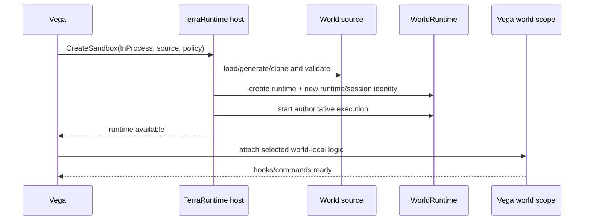
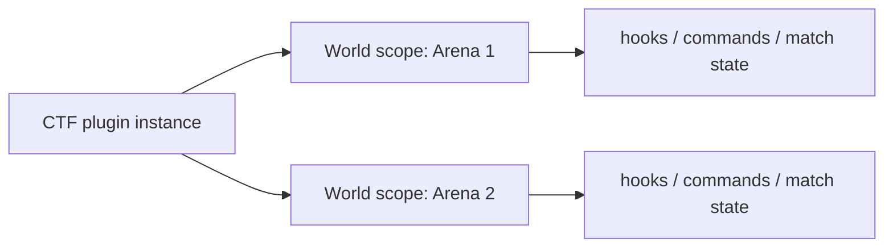
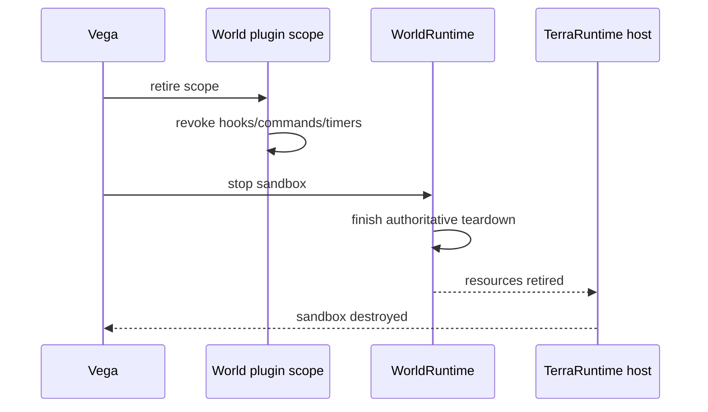

# Level 1: in-process sandbox

[Overview](README.md) · [Русский](../../ru/sandbox/level-1.md)

Level 1 runs a sandbox as another independent `WorldRuntime` inside the same TerraRuntime process.

## Ownership model

The process may own several worlds, but mutable simulation ownership remains per runtime. A runtime owns its players, NPCs, projectiles, items, world clock/progression, RNG streams, extension state, replication state and persistence policy.

No world may mutate another world through shared global state.

## Creation lifecycle

A real implementation may attach host logic before admitting players, but it must not expose a sandbox as ready until the required world/plugin scope is usable.

## Plugin and command scope

Level 1 does not need another Vega process. The currently loaded Vega plugin can receive a separate scope for each world it participates in.

Registrations must be world-scoped and revocable. A plugin must not add a global `/team` command or global player-death handler merely because one arena needs it.

## Teardown

Ephemeral state must disappear with the runtime. Persistent worlds follow their explicit persistence policy.

## What Level 1 does not provide

Level 1 provides state/lifecycle isolation, not hostile-code security. A crash, `Environment.FailFast`, unsafe native failure or process-wide OOM in in-process code can still terminate the whole server process. Use Level 2 when a real process boundary is required.
