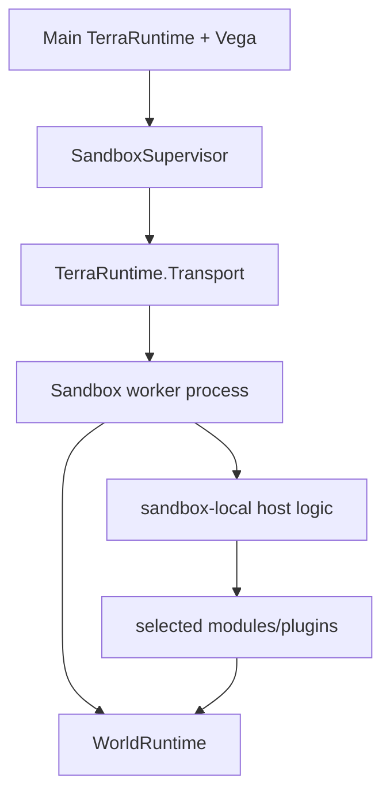
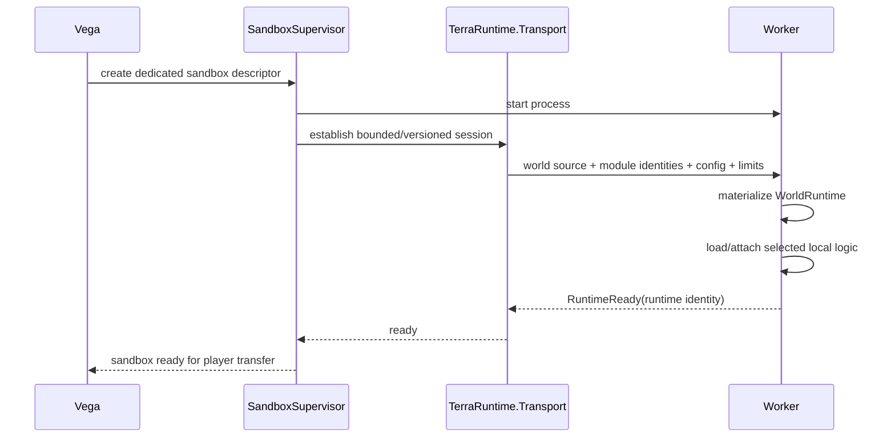
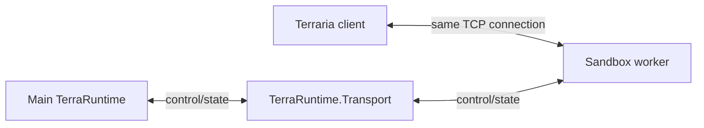
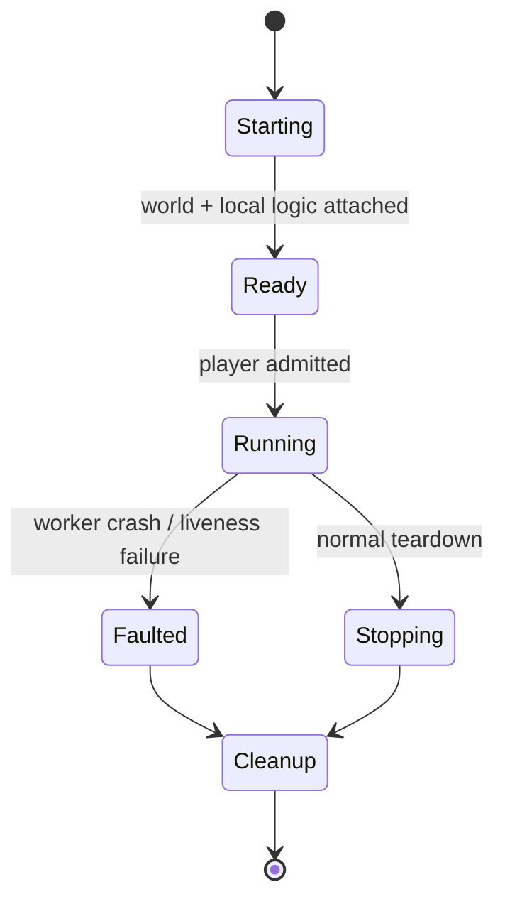

# Level 2: dedicated-process sandbox

[Overview](README.md) · [Socket handoff](socket-handoff.md) · [Русский](../../ru/sandbox/level-2.md)

Level 2 runs one sandbox world in a separate worker process for fault and resource isolation.

## Worker composition

The first implementation should use one sandbox world per worker. Multiple worlds per worker are an optimization only after measurement.

## What Vega supplies

Creation is declarative. Conceptually the request contains:

- isolation requirement;
- world source (`.wld`, validated generated state or clone/snapshot);
- selected sandbox-side modules/plugins;
- plugin/module configuration;
- player/resource limits;
- lifecycle policy such as ephemeral vs persistent.

The worker must not be marked `RuntimeReady` until required world data and required local logic have loaded successfully.

## Dynamic plugin loading profile

A worker that dynamically loads selected managed Vega/plugin assemblies requires the CoreCLR extensible profile because arbitrary managed DLL loading is not part of the NativeAOT runtime-only contract.

A worker with no dynamic managed module requirement may use a NativeAOT runtime-only profile. Do not weaken NativeAOT constraints across the core graph merely to simplify Level 2 plugin loading.

## Startup sequence

## Data plane decision

Once a player's accepted TCP connection is handed to the worker, Terraria gameplay traffic goes directly between client and worker.

This avoids decoding/encoding or proxying every movement/combat packet through the main process.

## Fault model

A worker crash may terminate sandbox-local gameplay, but it must not directly terminate the main TerraRuntime process. `SandboxSupervisor` owns detection, cleanup and deterministic handling of affected connections.

If worker ownership of a transferred socket is lost in a way that cannot prove a safe handback, disconnect is safer than guessing which process still owns the connection.
