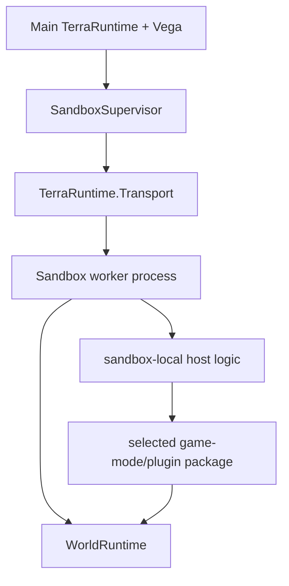
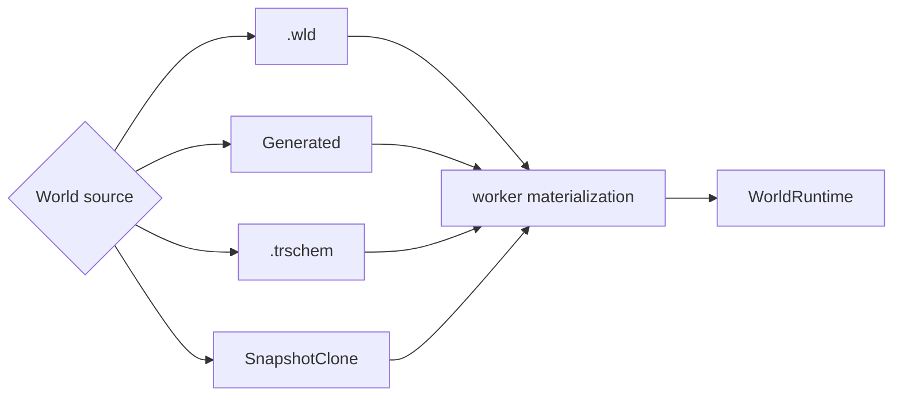
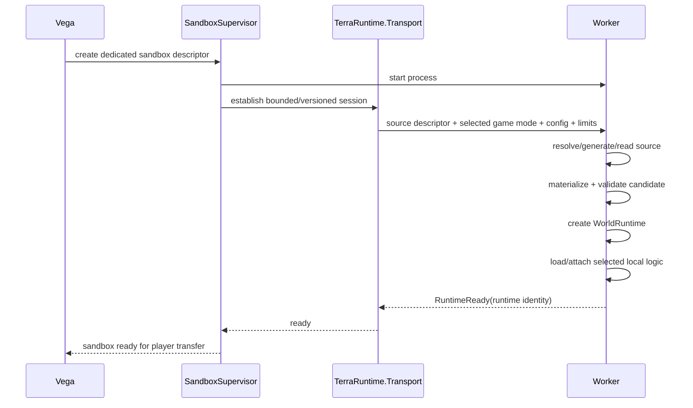
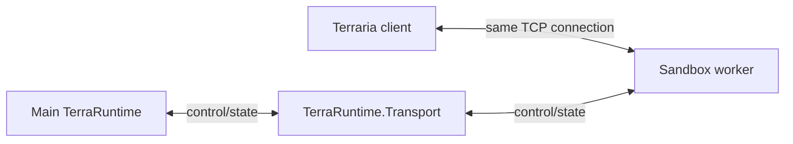
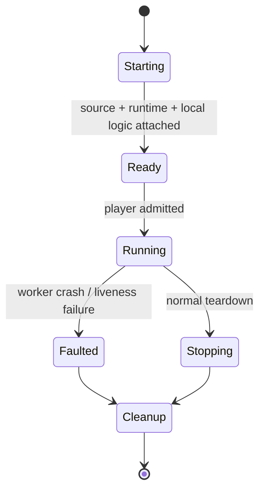

# Level 2: dedicated-process sandbox

[Overview](README.md) · [World sources and schematic](world-sources-schematics.md) · [Socket handoff](socket-handoff.md) · [Русский](../../ru/sandbox/level-2.md)

Level 2 runs one sandbox world in a separate worker process for fault/resource isolation. The worker uses the same `WorldRuntime` model as Level 1 and the host-selected primary runtime.

## Implemented runtime-only foundation

`SandboxSupervisor` owns one hidden application child and one ephemeral `WorldRuntime` per lease. Private `--sandbox-worker <pipe-id>` startup never opens a public Terraria listener. It reuses the existing materializer and authoritative game-loop owner; IPC does not mutate simulation state. This is a tested lifecycle foundation, **not playable Level 2**: host/Vega admission, local game-mode logic, resource enforcement, player transfer and bidirectional socket handoff remain open. The diagrams below describe the target architecture, not implemented player admission.

The asynchronous local pipe uses BCL `CurrentUserOnly` ([platform contract](https://learn.microsoft.com/en-us/dotnet/api/system.io.pipes.pipeoptions?view=net-10.0)). Mutual HMAC-SHA256 challenge/confirmation binds a per-child bootstrap secret, fresh challenge, exact launched PID and process-instance GUID. The secret enters through the child's environment, is removed there before startup, never enters command arguments/control payloads, and its owned byte buffer is zeroed. This does not protect against an attacker able to inspect the supervisor's memory/account.

The existing versioned `TRPC` header bounds payloads to $8\,\mathrm{KiB}$ before allocation. Source-generated JSON rejects unknown/missing constructor fields. Only authentication, create, heartbeat/snapshot and stop are admitted, with one serialized in-flight request per lease. Unknown operations, flags, correlations, identities and module/source declarations fail closed. Startup is bounded by $180\,\mathrm{s}$, requests by $10\,\mathrm{s}$, heartbeat interval is $2\,\mathrm{s}$ and worker control inactivity by $15\,\mathrm{s}$. Early child exit interrupts startup; interrupted exchanges retire the pipe instead of reusing partial framing.

Admitted sources: built-in `Generated`, and absolute `.wld` references with mandatory SHA-256. The shared Level1/worker file materializer caps input at $128\,\mathrm{MiB}$ before allocation and verifies the exact buffer subsequently decoded. Level1 does not acquire a mandatory digest. Generation/read/validation happen before runtime startup, off its game thread. `Running` requires validated bootstrap and the first tick at $60\,\mathrm{Hz}$. Stop does not save; failed/canceled control retires only the owned child. No automatic restart, socket recovery or permanent gameplay proxy exists.

`TerraRuntime.Server --sandbox-worker-smoke` exercises two real application executables, authentication, tick progress, one-child crash isolation and graceful stop. It requires the application executable, not `dotnet <dll>`. Tests also cover repeated teardown, heartbeat, cancellation, invalid descriptors/framing, file integrity and materialization failure. `.trschem`, snapshots, dynamic modules and OS CPU/memory quotas remain unsupported by this slice.

## Worker composition

The first implementation should use one sandbox world per worker. Multiple worlds in one worker are a future optimization only after measurement.

## World source

Level 2 uses the same `SandboxWorldSource` as Level 1:

- existing `.wld`;
- `Generated(generatorId, seed, size, options)`;
- TerraRuntime Schematic `.trschem` plus canvas/materialization policy;
- snapshot/clone source after the snapshot contract is implemented.

`Generated` may execute directly inside the worker through the existing world-generation provider/plan contract. For `.wld` and `.trschem`, a local worker normally receives a stable source reference plus integrity hash from a controlled store rather than repeatedly moving the complete asset through control messages.

`.trschem` may contain tiles/walls/liquids/wiring, chests and item contents, signs, typed tile entities, fresh NPC placements, world items and named markers/regions. The worker materializes these into an isolated candidate, validates it and only then creates the live runtime.

## What Vega supplies

Creation is declarative. Conceptually the descriptor contains:

- isolation requirement;
- one common world source descriptor;
- selected sandbox-side game-mode/plugin package;
- configuration;
- player/resource limits;
- lifecycle/persistence policy.

The worker must not report `RuntimeReady` until the world source is materialized/validated and required local logic is loaded.

## Profile for dynamic plugin loading

A worker that dynamically loads the selected managed Vega/plugin assembly requires the CoreCLR extensible profile because arbitrary managed DLL loading is outside the NativeAOT runtime-only contract.

A worker without dynamic managed modules may use the NativeAOT runtime-only profile. Core NativeAOT constraints must not be weakened merely to simplify Level 2 plugin loading.

## Startup sequence

TCP socket transfer starts **after** `RuntimeReady`; world-source preparation must not occur in the middle of connection handoff.

## Data-plane decision

After the accepted TCP connection is handed to the worker, ordinary Terraria gameplay traffic flows directly between client and worker.

This avoids decoding/encoding or proxying every movement/combat packet through the main process.

## Fault model

A worker crash may destroy sandbox-local gameplay, but it must not directly terminate the main TerraRuntime process. `SandboxSupervisor` owns detection, cleanup and deterministic handling of affected connections.

If socket ownership is lost such that safe handback cannot be proven, disconnecting is safer than guessing which process still owns the connection.
