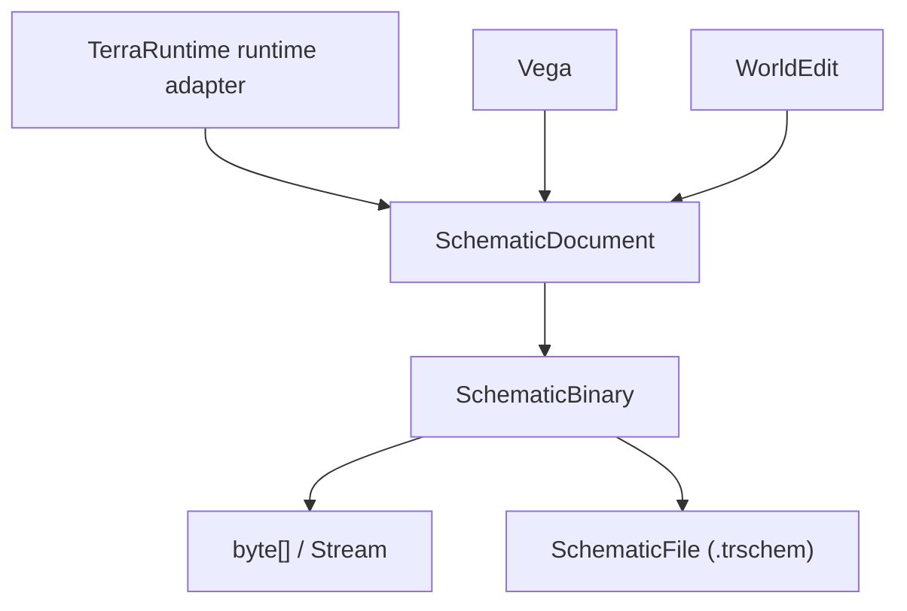

# TerraRuntime Schematic API

[Sandbox overview](README.md) · [Русский](../../ru/sandbox/schematic-api.md) · [Source and format design](world-sources-schematics.md)

`TerraRuntime.Schematics` is the shared NativeAOT-safe `.trschem` model and binary-codec package. It has no dependency on `TerraRuntime.Core`, `TerraRuntime.World`, Vega, or WorldEdit. TerraRuntime, Vega, and WorldEdit are expected to consume this package directly rather than carrying format adapters.

## Current implemented surface

The first implementation provides four independent surfaces:

1. `SchematicDocument` and typed schematic records;
2. `SchematicBinary` for deterministic bounded binary serialization;
3. `SchematicFile` for direct filesystem load/save;
4. `ISchematicCaptureSource` / `ISchematicRestoreTarget` as neutral capture and restore contracts.

Runtime-owned capture/materialization implementations are deliberately not part of this first slice. A live TerraRuntime implementation must still enter mutations through the authoritative world ownership/command boundary.

## Binary API

WorldEdit, Vega, tests, or other tooling can work directly with binary data:

```csharp
byte[] bytes = SchematicBinary.Serialize(document);
SchematicDocument loaded = SchematicBinary.Deserialize(bytes);
```

Stream operations are available without requiring a filesystem path:

```csharp
SchematicBinary.Write(stream, document);
SchematicDocument loaded = SchematicBinary.Read(stream);

await SchematicBinary.WriteAsync(stream, document, cancellationToken);
SchematicDocument loadedAsync = await SchematicBinary.ReadAsync(stream, cancellationToken);
```

The reader validates magic/version, dimensions, section-directory bounds, section overlap, section sizes, CRC-32 integrity, required/unknown sections, record counts, coordinates and UTF-8 limits before accepting the document. `.trschem` v1 deliberately does not enable compression yet, so stored and decoded section sizes must match.

## File API

The common file extension is `.trschem`:

```csharp
SchematicFile.Save("arena.trschem", document);
SchematicDocument loaded = SchematicFile.Load("arena.trschem");

await SchematicFile.SaveAsync("arena.trschem", document, cancellationToken);
SchematicDocument loadedAsync = await SchematicFile.LoadAsync("arena.trschem", cancellationToken);
```

Save uses a same-directory temporary file followed by replacement of the destination path. Loading enforces the global file-size ceiling before reading a seekable file.

## Capture and restore contracts

The format package does not know how a specific runtime/editor stores its world state. Instead it defines neutral boundaries:

```csharp
public interface ISchematicCaptureSource
{
    SchematicDocument Capture(in SchematicBounds bounds);
}

public interface ISchematicRestoreTarget
{
    void Restore(SchematicDocument schematic, in SchematicPlacement placement);
}
```

`SchematicBounds` describes the region to capture. `SchematicPlacement` describes the destination tile origin. WorldEdit can implement these contracts over its editing surface; TerraRuntime will implement them over authoritative runtime operations in the materialization phase.

## v1 records

The model currently represents:

- tile/wall/frame/paint/coating-compatible flags, liquid and wiring state;
- chests with bounded names and up to `40` item slots;
- signs;
- typed tile entities: training dummy, item frame, logic sensor, display doll, weapons rack, hat rack, food platter and teleportation pylon;
- fresh NPC placements, including optional town-home/name/life fields but no runtime slots or raw AI arrays;
- dropped/world items;
- named point/region markers;
- bounded string metadata.

NPC and boss entries remain **fresh placement records**. The runtime materializer will allocate destination-local identities and canonical AI state instead of restoring source-world slot/target/`ai[]` references.

## Format boundary



The package is a data-format boundary, not another world engine. `.wld` loading/saving remains owned by `TerraRuntime.World`.
