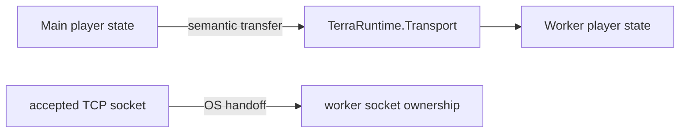
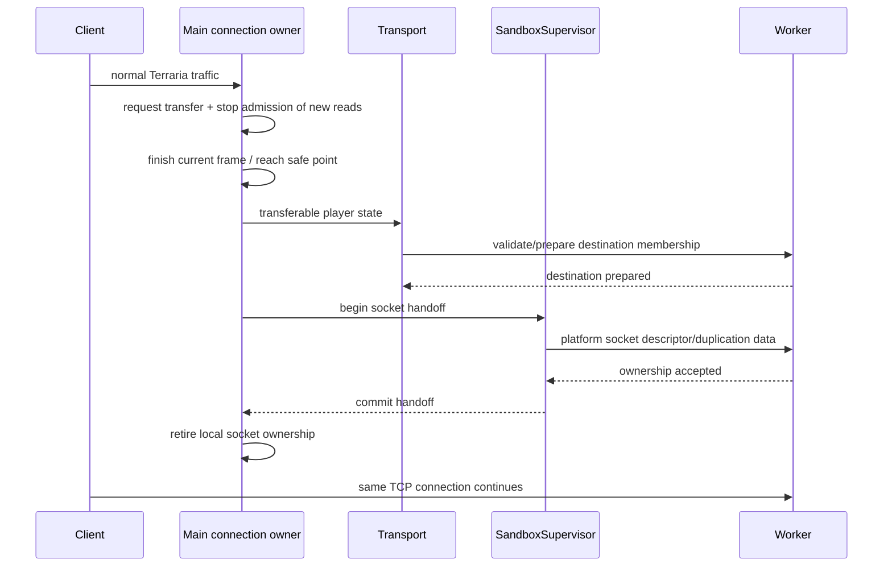
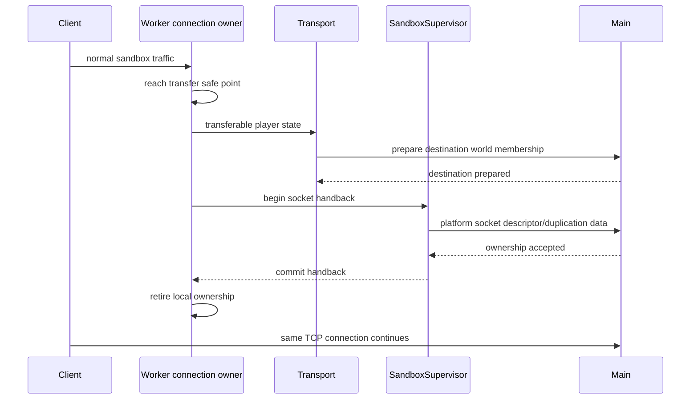
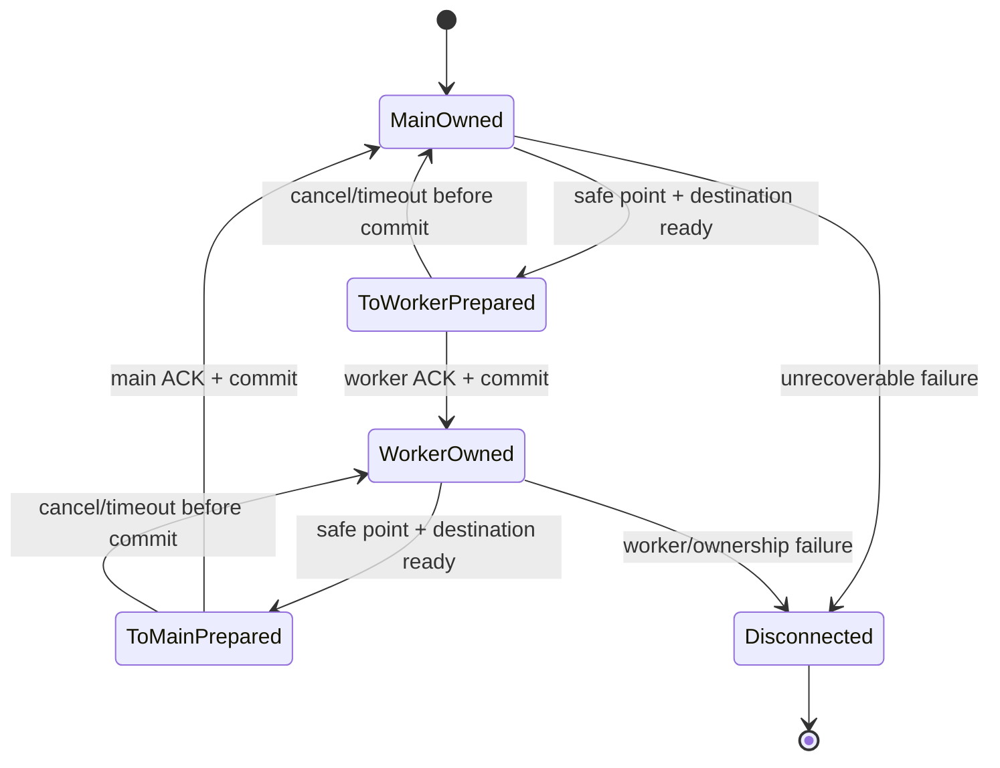

# Level 2 TCP socket handoff

[Overview](README.md) · [Level 2](level-2.md) · [Русский](../../ru/sandbox/socket-handoff.md)

The Level 2 local-host design preserves the player's existing Terraria TCP connection while moving connection ownership between the main process and the sandbox worker.

## Separation of state and socket ownership

Two things move during transfer:

1. **semantic player/runtime state** through bounded, versioned `TerraRuntime.Transport` messages;
2. **the live accepted socket/descriptor** through an OS-specific socket-handoff mechanism.

The socket is not serialized into a Transport payload.

## Safe-point requirement

Kernel receive/send queues move with the socket ownership mechanism, but process-local bytes do not. If a process has already consumed bytes into a frame decoder, `PipeReader`, `SequenceReader` backing buffer or another local queue, those bytes cannot magically appear in the destination process.

Therefore ownership may commit only at a safe point with:

- no partial Terraria frame in the source decoder;
- no untransferred process-local receive bytes;
- no concurrently executing read callback;
- pending writes flushed, completed or explicitly retired according to the connection pipeline contract;
- a prepared transferable player-state snapshot/command set;
- destination runtime ready to accept the connection.

## Entering the sandbox

The source must not resume reads after the ownership commit.

## Returning to main

## Ownership state machine

There is no `BothOwned` state.

## Platform paths

### Windows

Use verified Winsock socket duplication/handoff semantics, such as `WSADuplicateSocket` plus the supported .NET reconstruction path. The exact implementation must be validated on the shipping .NET 11/Windows target before the roadmap item can be checked.

### Unix/Linux

Use file-descriptor passing over a local Unix-domain control channel with `SCM_RIGHTS` or another verified equivalent. Descriptor passing is an ancillary-data operation, not normal serialized Transport payload data.

## Failure rule

If ownership cannot be proven after a process crash or ambiguous platform failure, fail closed. Disconnecting one sandbox player is preferable to two processes concurrently consuming one TCP byte stream or corrupting protocol state.
