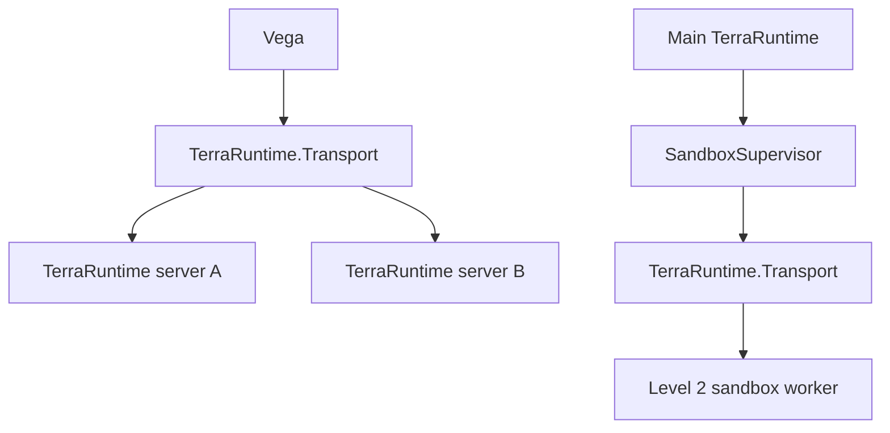
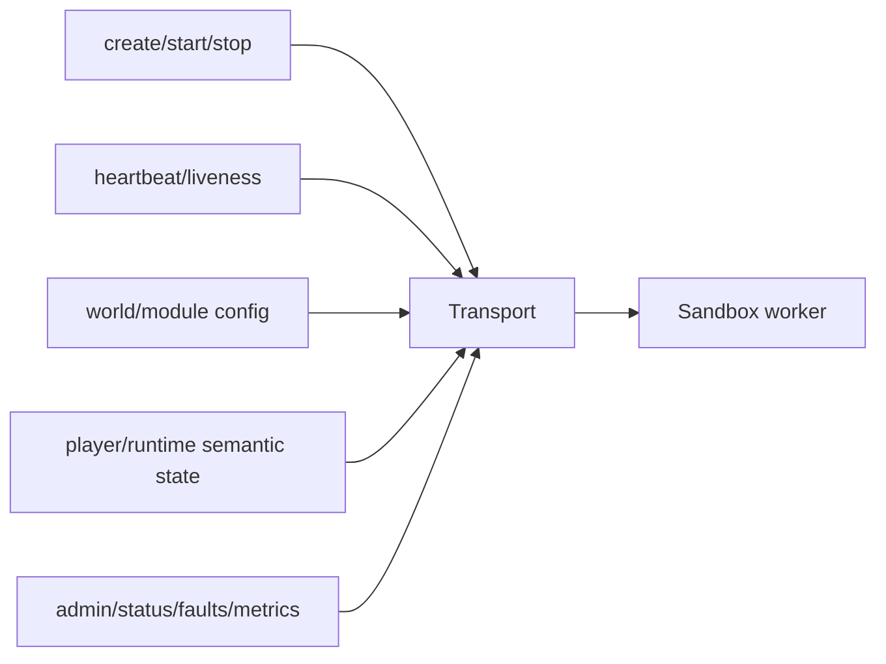
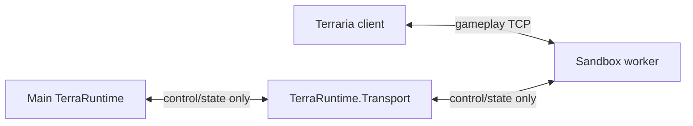
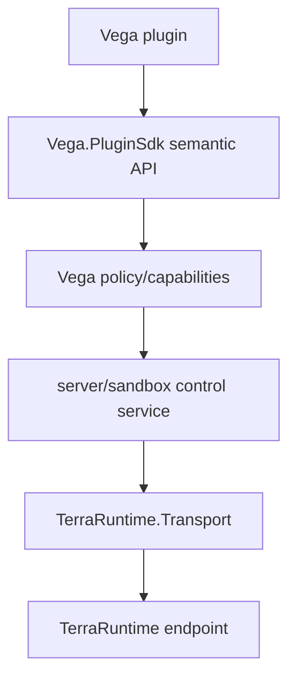

# Transport and sandbox control plane

[Overview](README.md) · [Русский](../../ru/sandbox/transport.md)

`TerraRuntime.Transport` is retained as a first-class boundary. Sandbox support gives it two explicit uses rather than turning it into a generic gameplay bus.

## Two topologies

The first topology supports Vega communication with multiple TerraRuntime servers. The second supports local sandbox worker supervision and semantic transfer.

## What Transport carries for Level 2

Transport should carry bounded semantic messages such as:

- worker handshake/capabilities;
- sandbox creation descriptor;
- runtime ready/faulted/stopping status;
- heartbeat and liveness information;
- bounded player-state transfer payloads;
- administrative lifecycle operations;
- logs/metrics summaries where appropriate.

## What Transport does not carry

For a local Level 2 sandbox, after socket handoff it does **not** permanently carry every Terraria movement/combat/world packet between client and worker.

It also does not own Vega plugin permissions, gameplay mutation semantics, world business logic or a universal RPC object model.

## Service layering

Ordinary plugins should not receive unrestricted raw Transport sessions merely because they need a cross-server or sandbox operation.

## Bounds and versioning

Every message family must have explicit size/count limits. Pending request counts, timeouts, queue depths and heartbeat state are bounded. Service versions/capabilities are negotiated rather than inferred from process version strings or socket addresses.

Socket handoff metadata is platform-specific and may be coordinated through the Transport session, but the live kernel socket itself is transferred through the verified platform mechanism described in [socket-handoff.md](socket-handoff.md).
