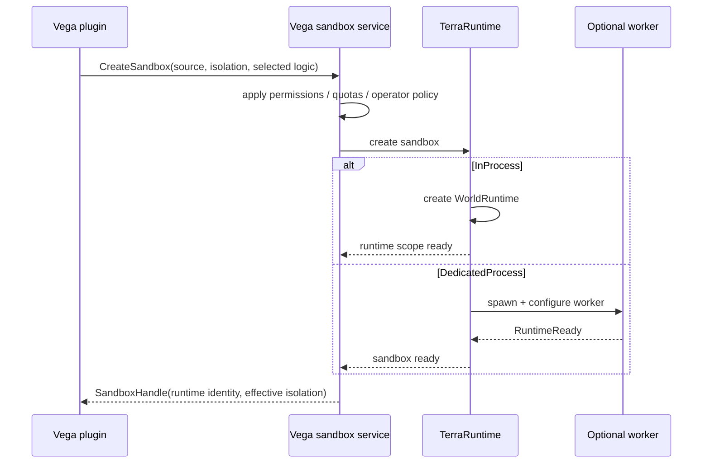
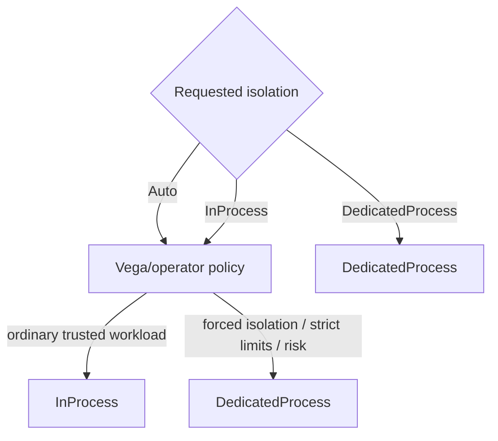
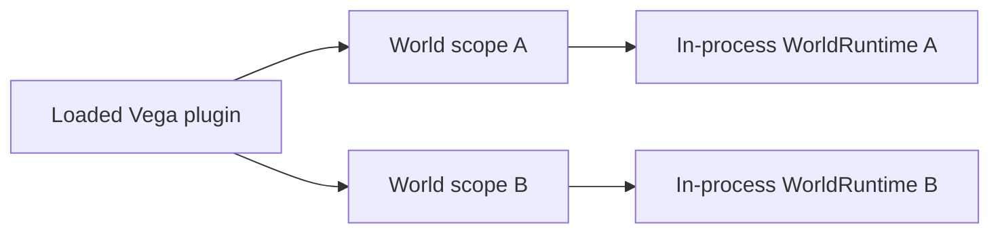
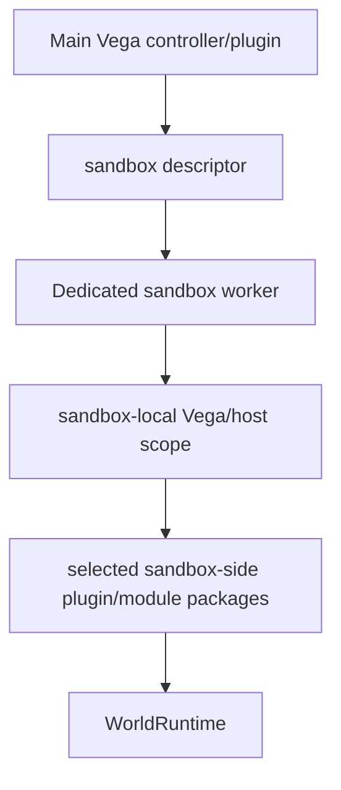
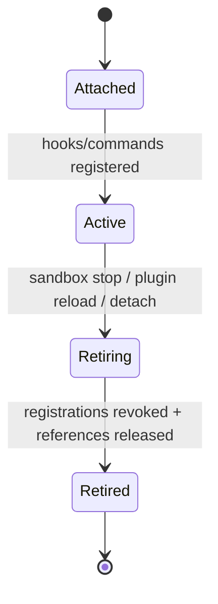

# Vega integration with sandbox worlds

[Overview](README.md) · [Русский](../../ru/sandbox/vega-integration.md)

Vega should expose one semantic sandbox API to plugins. Plugin code requests a world, source and isolation requirement; Vega/operator policy determines the effective isolation subject to the rule that required isolation is never silently weakened.

## Creation flow



The concrete public types are not fixed yet. The important contract is semantic: the plugin does not spawn processes, duplicate sockets or talk raw Transport itself.

## Isolation policy



`DedicatedProcess` is a minimum. Policy may strengthen `InProcess` to `DedicatedProcess`; it must not silently downgrade a dedicated requirement.

## Hooks and commands

A sandbox needs its own world/plugin scope. Hooks, commands, timers and match state are attached to a specific `WorldRuntimeIdentity`.

### Level 1



One plugin assembly/instance may serve several scopes if its state model supports that, but per-match mutable state must not accidentally become global.

### Level 2



Hot-path hooks and world-local commands execute inside the worker that owns the world and client socket. They are not RPC callbacks into the main Vega process.

Global/operator commands remain in main Vega and use semantic control operations when they need to inspect or stop a sandbox.

## Plugin/package selection for Level 2

Vega should describe selected worker-side logic by stable package/module identity, version and integrity metadata rather than serializing live plugin objects.

Conceptually a creation descriptor may identify:

```text
plugin/module id
version
content hash
configuration
required capabilities
```

A local worker may load from a controlled plugin/package store. Repeatedly copying arbitrary DLL bytes through Transport for every match is not the baseline design.

## Registration lifetime

World-scoped registrations must be revocable. The exact type name is not fixed, but the lifecycle must behave like a lease:



A stale delegate or command registration must not keep an unloaded plugin context or dead `WorldRuntime` reachable.

## Current TerraRuntime limitation

The current trusted-host loader has a single-runtime attachment model. Multi-world support must evolve that lifecycle to maintain independent runtime scopes keyed by `WorldRuntimeIdentity` rather than a single global attached flag. Existing per-world activation policy can be reused rather than introducing a second activation system.
