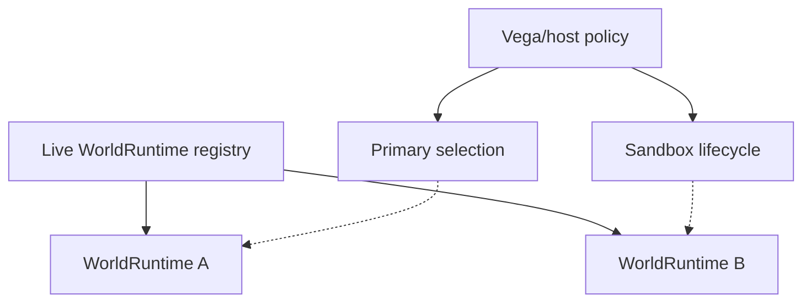
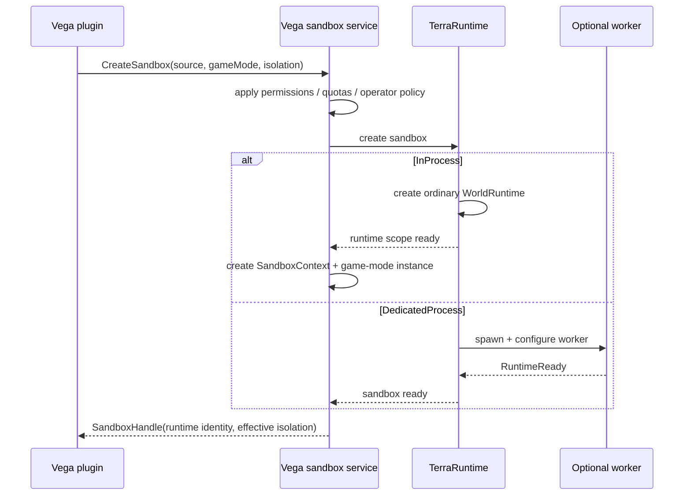
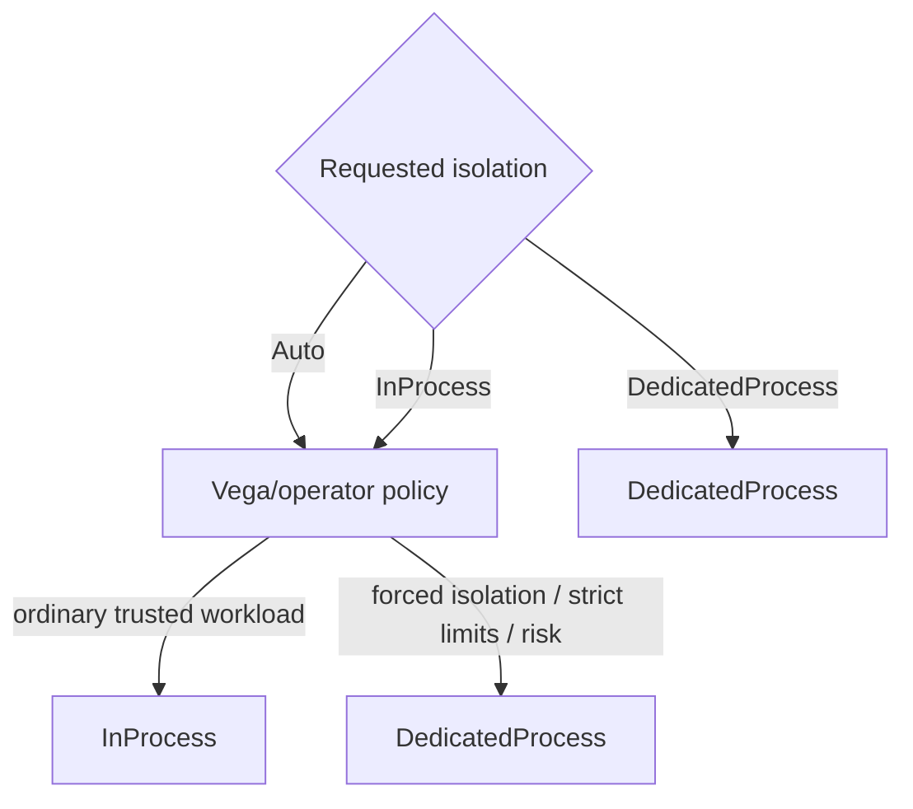
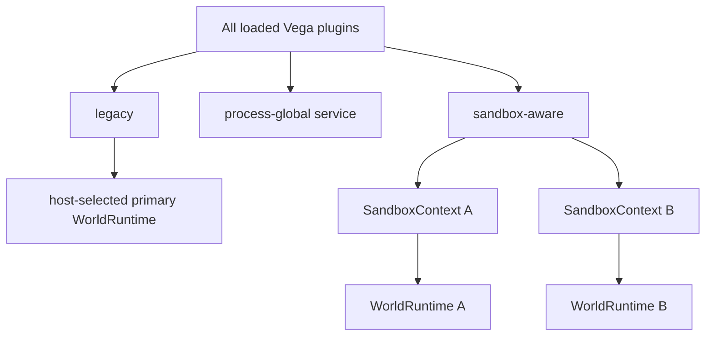
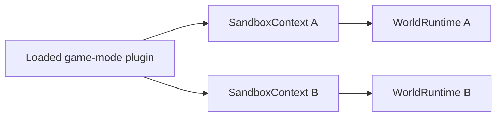
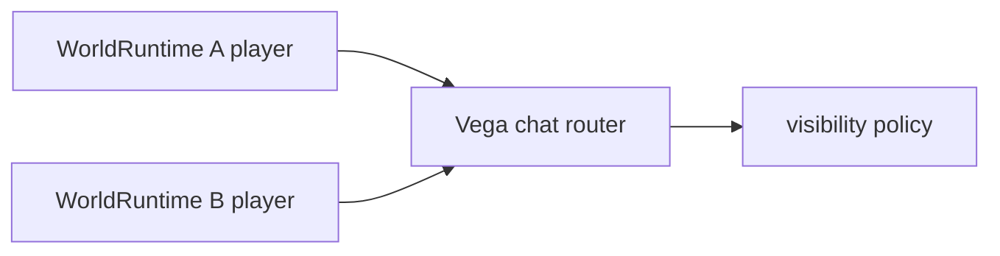
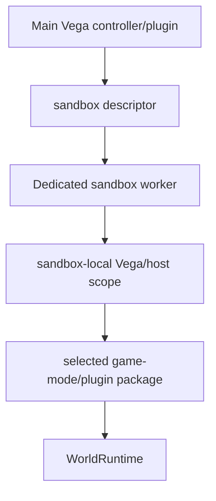
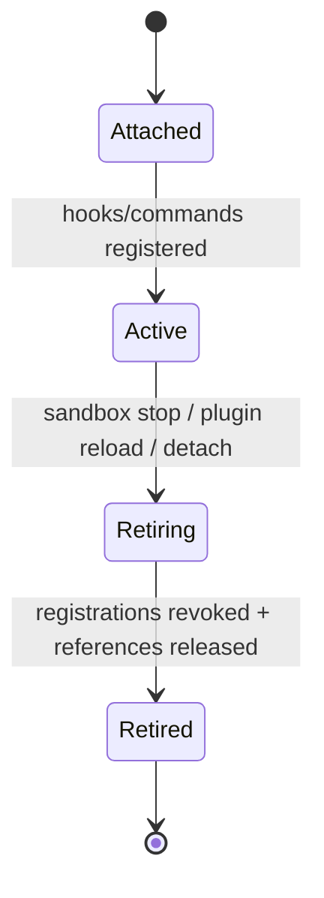

# Vega integration with sandbox worlds

[Overview](README.md) · [Русский](../../ru/sandbox/vega-integration.md)

Vega should expose one semantic sandbox API to plugins. Plugin code requests a world source, game mode and isolation requirement; Vega/operator policy determines the effective isolation subject to the rule that required isolation is never silently weakened.

## The primary runtime is not a different world type

Vega/the host selects one ordinary `WorldRuntime` as the primary target for normal player admission and legacy-plugin compatibility. `WorldRuntime` itself does not need a separate primary/sandbox simulation class.



## Creation flow



The concrete public types are not fixed yet. The important contract is semantic: the plugin does not spawn processes, duplicate sockets or talk raw Transport itself.

## Isolation policy



`DedicatedProcess` is a minimum. Policy may strengthen `InProcess` to `DedicatedProcess`; it must not silently downgrade a dedicated requirement.

## Level 1: all plugins stay loaded, but not all attach to every world

Level 1 does not create another plugin host. All current Vega plugin assemblies remain loaded once in the main process.

That does **not** mean every plugin automatically receives hooks/events for every `WorldRuntime`.

Compatibility policy:

- legacy/single-world plugins receive world-scoped callbacks only for the runtime selected by Vega as primary;
- process-global infrastructure may remain shared when it does not own mutable gameplay state for one world;
- sandbox/multi-world-aware plugins or game modes explicitly receive a separate `SandboxContext` for a particular runtime;
- sandbox-aware mutable state is created independently for each arena/session.



The Level 1 baseline does not require `Modules = [...]`. Sandbox creation selects one game mode/owner logic. Teams/score/spawn helper parts stay ordinary implementation code inside that game mode or host APIs. An arbitrary dependency graph is added only when a real requirement appears.

## Hooks, commands and timers

A sandbox receives its own runtime context. Hooks, commands, timers and match state are attached to a specific `WorldRuntimeIdentity` and are retired with its `SandboxContext`.



One plugin assembly is loaded once, while per-match mutable state is not a global singleton.

## Shared chat in Level 1

A shared Vega chat router is an allowed process-global service. It may serve players from different runtimes, but a message must preserve the source `WorldRuntimeIdentity` so Vega can implement global/world/team/private visibility.



Shared chat does not make NPCs, bosses, progression, hooks or other gameplay systems shared.

## Level 2



For Level 2 the worker loads only the required sandbox-side game-mode/plugin package and its necessary runtime dependencies, not the complete main Vega plugin set.

Hot-path hooks and world-local commands execute inside the worker that owns the world and client socket. They are not RPC callbacks into the main Vega process.

Global/operator commands remain in main Vega and use semantic control operations when they need to inspect or stop a sandbox.

## Package selection for Level 2

Vega describes selected worker-side logic by stable package identity, version and integrity metadata rather than serializing live plugin objects.

Conceptually a creation descriptor may identify:

```text
plugin/game-mode package id
version
content hash
configuration
required capabilities
```

A local worker may load the package from a controlled plugin/package store. Repeatedly copying arbitrary DLL bytes through Transport for every match is not the baseline design.

## Registration lifetime

World-scoped registrations must be revocable. The exact type name is not fixed, but the lifecycle must behave like a lease:



A stale delegate or command registration must not keep an unloaded plugin context or dead `WorldRuntime` reachable.

## Current TerraRuntime limitation

The current trusted-host loader has a single-runtime attachment model. Multi-world support must evolve that lifecycle to maintain independent runtime scopes keyed by `WorldRuntimeIdentity` rather than a single global attached flag. Existing per-world activation policy can be reused rather than introducing a second activation system.
