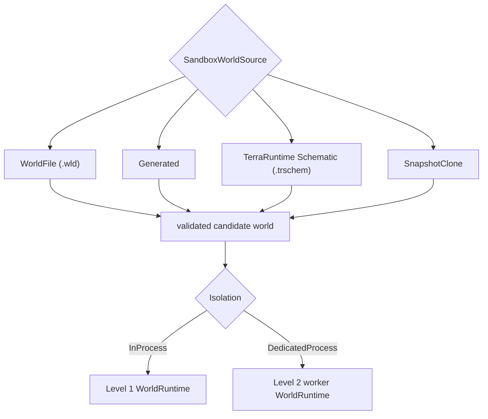
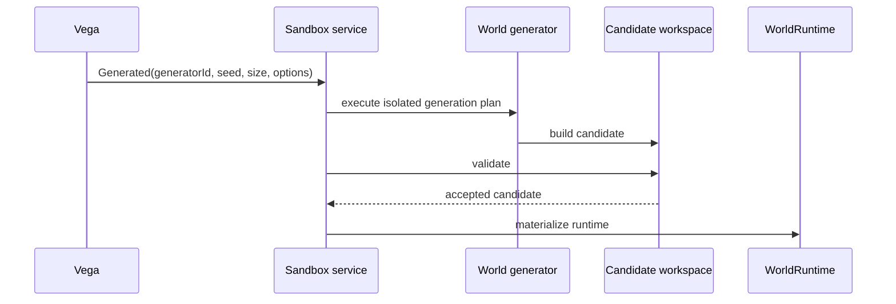
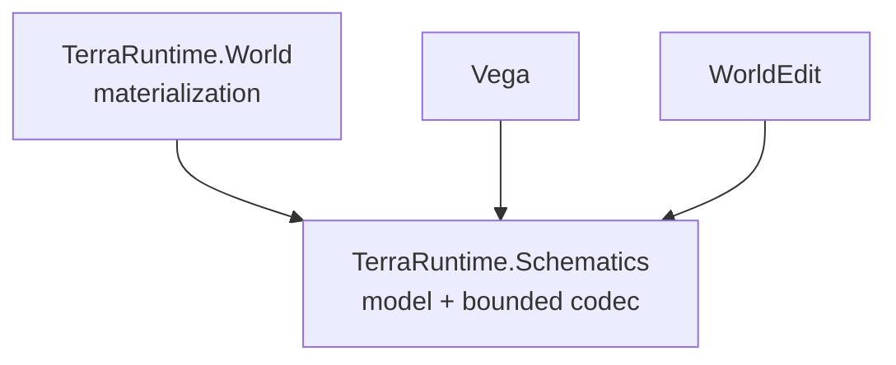
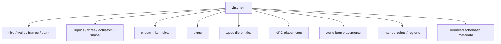
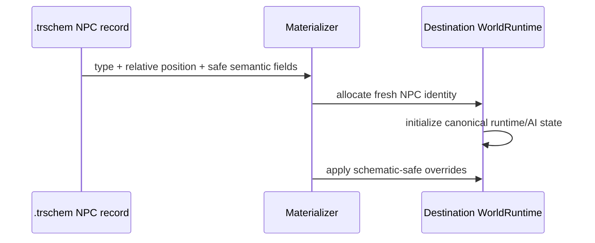
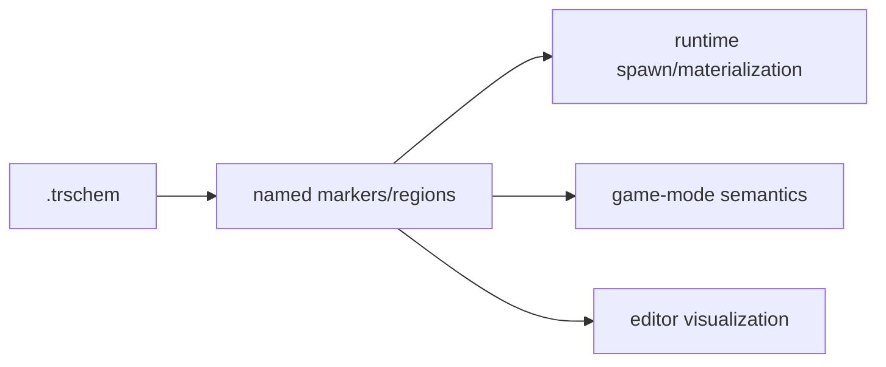
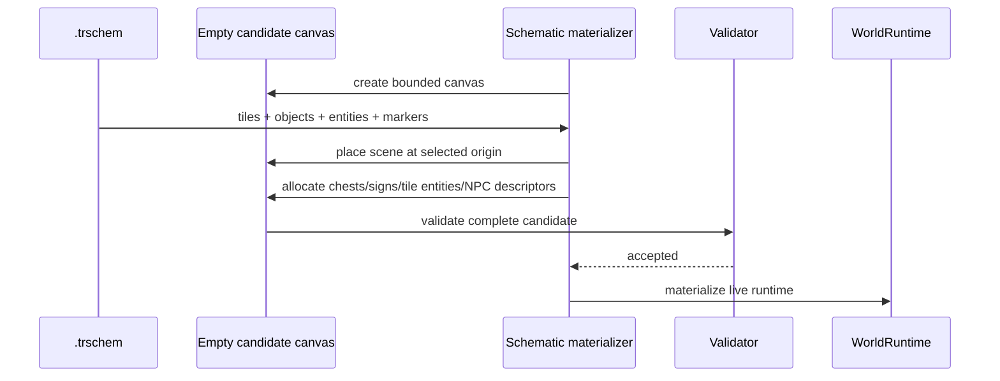

# Sandbox world sources and TerraRuntime Schematic

[Sandbox overview](README.md) · [Русский](../../ru/sandbox/world-sources-schematics.md) · [Roadmap](../../roadmap/sandbox/README.md)

Level 1 and Level 2 use the **same world-source model**. Isolation determines where `WorldRuntime` lives; it must not change how the source world is described.

## Unified `SandboxWorldSource`

The baseline should support at least:

<!-- docs-style: literal-text -->
```text
WorldFile      -> existing .wld
Generated      -> generator id + seed + size + generation options
Schematic      -> TerraRuntime .trschem + canvas/materialization options
SnapshotClone  -> immutable runtime/world snapshot source when implemented
```



The same arena can therefore run as Level 1 or Level 2 without changing its map format.

## Generated source

A generated source does not require a ready `.wld` as an intermediate artifact. It describes a generation request through the existing TerraRuntime world-generation contracts: `WorldGeneratorId`, seed, dimensions and generation options.



Level 2 may execute generation inside the worker. Level 1 executes it in the main process against an isolated candidate workspace. In both cases the authoritative live runtime appears only after successful generation and validation.

## World file source

`WorldFile` uses the existing `.wld` loader and validation rules. The sandbox runtime receives a new `WorldRuntimeIdentity`; the source `.wld` path or identity is not the live runtime identity.

An ephemeral sandbox does not have to overwrite its source file. Persistent mode uses explicit persistence policy and separate publication/save rules.

## TerraRuntime Schematic

TerraRuntime gets its own portable scene/region format: **TerraRuntime Schematic**, with the recommended `.trschem` extension.

This is a native TerraRuntime-ecosystem format. TerraRuntime does not depend on WorldEdit and does not contain a compatibility adapter for an old WorldEdit format. Vega and WorldEdit should use `.trschem` directly through the shared codec/model.

Recommended code boundary:



`TerraRuntime.Schematics` should be a small NativeAOT-safe library with no dependency on `TerraRuntime.Core`, Vega or WorldEdit. That lets editor/plugin code read and write the same file without pulling the server runtime into WorldEdit.

## What `.trschem` represents

A schematic is a **portable scene/region description**, not serialization of a live `WorldRuntime` and not a second `.wld` format.

All coordinates in the file are relative to the schematic bounds. Runtime IDs, player connections, entity slots and process-specific handles are not persisted.



### Tiles

Tile records must cover data already required by runtime/worldgen: tile type, wall, frame, active/inactive state, slope/shape, paint/coating flags, liquid amount/kind, wires and actuator state.

The codec must use a bounded deterministic representation. Palette/RLE and optional per-section compression are acceptable, but the exact encoding needs golden tests and hard limits before untrusted files are accepted.

### Chests

A chest record stores:

- relative tile-coordinate position;
- bounded name;
- up to the vanilla `40` item slots;
- for each slot: item type, stack and prefix.

The runtime chest slot/id is not persisted. Materialization allocates fresh local IDs.

### Signs

A sign record stores relative position and bounded UTF-8 text. Runtime allocates a new local sign identity.

### Tile entities

Tile entities are stored as **typed semantic records**, not opaque dumps of implementation classes. The format version defines supported kinds/payloads. Readers fail closed for malformed or required unsupported payloads.

### NPCs

`.trschem` v1 supports NPC placement records so WorldEdit/Vega can save a scene together with NPCs and materialize fresh NPCs later.

A portable NPC record may contain:

- `NpcTypeId`;
- relative pixel-coordinate position;
- direction/sprite direction where safe for fresh spawn;
- optional bounded custom/town NPC name;
- optional town-NPC home tile and homeless flag;
- optional safe appearance/variant fields when a stable semantic contract exists;
- optional life override only when runtime explicitly supports it as schematic-safe.

The baseline does not persist:

- runtime NPC slot/index;
- source `WorldRuntimeId`/`WorldSessionId`;
- target player slot;
- `realLife`/parent slot references;
- raw `ai[]`/`localAI[]` dumps;
- network generation counters/handles;
- transient pathfinding/combat scheduler state.



Boss types may be represented by an NPC placement record, but materialization creates a **fresh boss instance** rather than resuming a fight from the source world. Game modes should still normally decide when an encounter becomes active.

### World items and other runtime entities

v1 should support dropped/world item placements with item type, stack, prefix and relative position. Runtime IDs and transient pickup/network state are recreated.

Projectiles and other strongly transient simulation entities are not required in the v1 baseline. They can be added as a separate versioned section later only after portable owner/AI/reference semantics are defined. The format must not pretend to be a memory snapshot.

## Named markers and regions

A schematic should store bounded named points and rectangles. They let the map describe semantic places without depending on CTF or WorldEdit code.

Examples:

```text
spawn
team:red:spawn
team:blue:spawn
boss:spawn
lobby
arena:bounds
```

Runtime may understand only a minimal standardized marker such as optional player spawn. Vega/game-mode code and WorldEdit can use the remaining names as metadata.



## Schematic -> complete sandbox world

The schematic remains a region/scene format. To launch a standalone sandbox runtime, its source descriptor adds canvas/materialization policy.

Conceptually:

```text
SchematicWorldSource
  schematic: arena.trschem
  canvasWidth
  canvasHeight
  placementOrigin / placementAnchor
  spawnMarker
  world generation/environment defaults
```

The materializer creates an isolated candidate workspace, places the schematic, restores semantic objects/entities, validates the result and only then creates the `WorldRuntime`.



Placement/collision policy is an operation parameter, not a hidden property of the file. Creating a new sandbox uses deterministic replace into a fresh candidate in the baseline. WorldEdit may later expose `replace`, `only-air` and other editor policies over the same format.

## File format and safety

`.trschem` should be a versioned sectioned binary format. The baseline specification must include:

- fixed magic such as `TRSC`;
- explicit format version;
- source Terraria content version/compatibility marker;
- bounded width/height and section count;
- section directory with kind, stored length, decoded length and flags;
- checksum per section or equivalent corruption detection;
- optional BCL-supported compression applied independently to bounded sections;
- hard limits before allocation/decompression;
- duplicate/overlapping required-section rejection;
- deterministic writer ordering for reproducible files.

Logical v1 sections:

```text
Header / SectionDirectory
Tiles
Chests
Signs
TileEntities
Npcs
WorldItems
Markers
Metadata
```

Unknown optional future sections may be skipped only when explicitly marked optional by the format. Unknown required sections fail closed.

## WorldEdit and Vega

WorldEdit does not require an adapter inside TerraRuntime. It should read, create, edit and save `.trschem` through the same `TerraRuntime.Schematics` model/codec.

Vega may also store arena assets as `.trschem` and pass TerraRuntime a stable source reference/hash. For Level 2 the supervisor/worker exchange the descriptor/source identity over the control plane; continuously serializing the complete schematic through Transport is unnecessary when both processes can access a controlled world/schematic store.

## What `.trschem` is not

- not a `.wld` replacement;
- not a live-process snapshot;
- not serialization of arbitrary plugin objects;
- not a dump of runtime IDs/entity slots;
- not a legacy WorldEdit format;
- not required storage for player accounts/inventories;
- not a mechanism for transferring active TCP connections.

The format is intended for reusable arena/build/scene assets and semantic contents that can be safely materialized into a new `WorldRuntime`.
