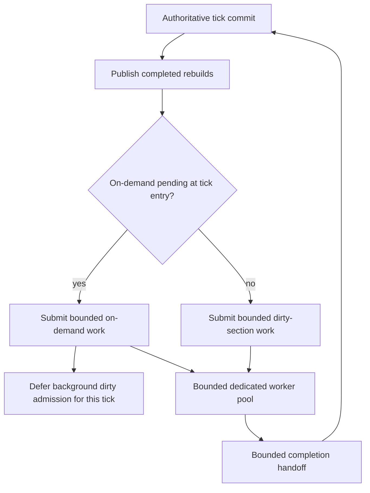

# Section-cache rebuild scheduling

[Русский](../ru/section-cache-scheduling.md) · [Performance](performance-runtime.md) · [Performance roadmap](../roadmap/performance-tick-stability.md)

TerraRuntime rebuilds stale packet-10 section frames outside the authoritative game loop. Two work classes share the bounded worker pool:

- **on-demand** rebuilds requested by a connection waiting for a missing/stale section frame;
- **background dirty** rebuilds created by ordinary live world mutations.

Join-critical work has deterministic tick-level admission priority.

## Why the tick reservation exists

The worker queue is concurrent. Without an explicit scheduling rule, a worker can dequeue the on-demand item between two observations inside the same `Tick()`. `PendingWork` then falls by one and background dirty work can be admitted immediately. The resulting order depends on operating-system scheduling rather than runtime policy.

The runtime therefore snapshots whether on-demand work exists at tick entry. If it does, background dirty admission is skipped for that tick even if a worker consumes the join-critical item immediately. Existing in-flight background work is not cancelled; the rule only controls **new admission**.

This gives a deterministic contract:

\[
Q_{\mathrm{join}}(t)>0 \Longrightarrow A_{\mathrm{dirty}}(t)=0,
\]

where \(Q_{\mathrm{join}}(t)\) is the number of pending on-demand requests at tick entry and \(A_{\mathrm{dirty}}(t)\) is newly admitted background dirty work during that tick.

The worker pool and on-demand request map remain bounded. This change does not claim the full mass-join fairness milestone: global CPU-time budgets, oldest-join age, multi-player fairness and the complete stress matrix remain open performance work.

## Telemetry

`SectionCacheRebuildPipelineSnapshot.DirtyDeferredForOnDemand` counts ticks where dirty-section backlog existed but new dirty work was intentionally deferred because on-demand requests owned that tick's admission priority.

The counter is projected through `RuntimeWorldSnapshot.SectionCacheDirtyDeferredForOnDemand`, so local operations/TUI and future remote operator surfaces can distinguish ordinary dirty backlog from deliberate join-priority deferral.

The existing section-cache telemetry continues to expose dirty backlog, in-flight work, worker pending/active counts, submissions/rejections, cache hits/misses/stale reads, waits/completions/timeouts and bounded on-demand request admission.

## Correctness boundary

Priority changes scheduling only. Section revision validation, immutable snapshot capture, stale-result rejection, single-flight per section, bounded worker/completion queues and cache publication rules are unchanged.

A dirty section that is deferred remains dirty and is eligible on the first later tick that begins without on-demand work. No dirty mutation is discarded merely to improve join latency.
