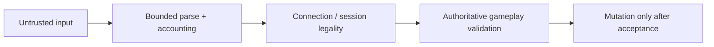
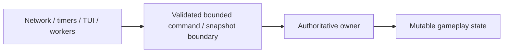
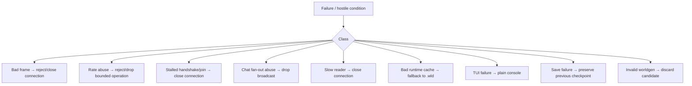

# Security, trust boundaries and failure isolation

[Русский](../ru/security.md) · [Documentation](README.md) · [Networking](networking-protocol.md) · [Roadmap](../roadmap.md)

## 1. Security model

Every client-controlled byte, length, rate, identity claim and gameplay request is untrusted.

Security is not one anti-cheat component. It is a set of boundaries preventing one peer or malformed persisted input from acquiring unbounded CPU, memory, queue growth or direct authoritative access.

## 2. Security versus anti-cheat

Protocol hardening rejects malformed framing, invalid/unsupported handshake, configured rate abuse, capacity exhaustion, illegal connection-state ordering and malformed variable-length payloads.

Gameplay authority may reject syntactically valid actions only when the server can prove they are impossible in current authoritative state. False-positive anti-cheat that breaks legal vanilla behavior is a correctness bug.

## 3. Connection admission

`TerrariaConnectionAdmissionGate` bounds both active capacity and admission-attempt rate. The default rate ceiling is

$$
R_{\mathrm{admission}}=512\ \text{attempts}/\mathrm{s}.
$$

Every attempt consumes rate budget **before** capacity admission so a full server cannot be abused as an unlimited accept/reject churn loop.

Successful admission returns an idempotently releasable lease; double-dispose cannot double-release active capacity.

## 4. Handshake and join deadlines

Current defaults are:

$$
T_{\mathrm{handshake}}=10\,\mathrm{s},
\qquad
T_{\mathrm{join}}=2\,\mathrm{min}.
$$

A valid `Hello` ends the handshake deadline but does not grant an unlimited player-slot lease. Until runtime readiness reaches `Playing`, the join-abuse deadline remains active. After `Playing`, the current normal idle timeout is infinite unless configured otherwise.

`HandshakeTimeout`, `JoinTimeout` and `IdleTimeout` remain distinct telemetry categories.

## 5. Connection and message-rate accounting

Connections use fixed-window accounting for configured frame/byte work. `TerrariaMessageRateAccountant` can apply stricter budgets only to explicitly configured message IDs while all traffic still crosses connection-wide accounting.

Rate ceilings represent abuse bounds, not normal Terraria gameplay cadence; join/section/chest traffic is legitimately bursty and must be measured before tightening.

## 6. Global fan-out budget

Public `Say` chat can turn one legal input into $O(P)$ outbound work, where $P$ is playing peers. It therefore has a server-global pre-fan-out ceiling:

$$
R_{\mathrm{chat}}=256\ \text{broadcasts}/\mathrm{s}.
$$

Over-budget chat broadcasts are dropped and recorded as rate-limited rejection before recipient iteration. This is deliberately loose hard-abuse protection, not a normal chat cadence.

## 7. Framing and hostile sizes

Frame lengths and packet-declared lengths are hostile until validated. Impossible/truncated frames reject deterministically, size ceilings apply before large allocation, client counts cannot directly choose unbounded memory, transient receive buffers do not escape into gameplay state, and parser failure remains bounded to the connection/request scope.

## 8. Session legality and identity

A well-formed packet can still be illegal before handshake, player-slot assignment or world entry. Session state is validated before gameplay mutation. Client-claimed player identity is ignored where the connection already establishes authoritative ownership.

Generation/revision-aware handles also prevent stale commands from mutating a different entity after numeric-slot reuse.

## 9. Bounded queues and authoritative work

Inbound commands, outbound frames, section/compression work and diagnostics retention are bounded.

The authoritative loop combines global capacity, per-tick operation limits, per-source fairness and per-source pending ceilings. Shared work that bypasses the loop but multiplies across recipients requires its own server-global budget before multiplication.

Security budgets are global when work competes for one shared tick/resource; multiplying a full expensive-work allowance by player count merely scales the DoS surface.

## 10. Single-writer containment

Off-thread direct mutation is prohibited. This reduces both race conditions and the number of places hostile input can corrupt shared state.

## 11. World/object safety

World coordinates are validated before array access; future area operations must bound integer overflow, negative dimensions, attacker-controlled rectangles and repeated expensive framing/liquid/placement work.

Chest/object handling validates relevant identity/coordinates and contains malformed input. Strict inventory conservation/anti-dupe rejection must wait for a proven server-owned item model instead of guessing legal vanilla transitions.

## 12. Persistence and cache safety

Canonical `.wld` remains the recovery source. `.runtime-world` is treated as untrusted persisted input and must pass layout/integrity validation or fall back to `.wld`.

Canonical save publication uses detached snapshots, temporary files, durable file flush, atomic replace/move and Linux parent-directory `fsync` where supported. Unknown/newer layouts are not rewritten from guessed offsets.

Malformed network input must not bypass the normal final-save/shutdown path for an otherwise healthy world.

## 13. Host/UI/dependency trust boundaries

Trusted CoreCLR host modules receive narrow `TerraRuntime.HostContracts`, not mutable implementation stores. Ordinary Vega plugins remain behind Vega's Plugin SDK. NativeAOT standalone does not arbitrarily load managed plugin DLLs.

TUI uses bounded read snapshots and controlled operations rather than direct mutation.

Production dependencies must preserve the NativeAOT/trimming contract and pass Linux/Windows native publish/smoke gates where applicable.

## 14. Failure isolation

Ordinary hostile network input should not fail-fast the process. Invariant throws remain appropriate for impossible internal programming states.

## 15. Security telemetry

Security observability distinguishes active/accepted/rejected connections, capacity/rate admission rejects, connection/message/global-fan-out rate limits, typed stop reasons, malformed/protocol failures, slow clients, queue/backlog state, invalid gameplay requests, cache failures and save failures.

Telemetry itself is bounded so reporting cannot become the next attack surface.

## 16. Fuzzing

Permanent deterministic malformed/fuzz regression coverage exists for framing and typed packet decoders, including hostile declared lengths and segmented input. This is a floor, not complete fuzz coverage.

Broader corpora remain required for section/tile data, `.wld` parsing, command/text parsing and future complex variable-length gameplay formats.

A useful adversarial test proves both bounded rejection and subsequent ability to process a valid connection/operation.

## 17. Evidence and current limitations

Evidence includes admission churn/capacity tests, handshake/join/idle deadlines, connection/message/global-fan-out budgets, malformed frame/packet tests, real-socket slow-reader tests, command fairness, world/cache corruption, persistence interruption/atomic publication and live official-client probes.

Remaining work includes broader fuzz corpora, complete subsystem budgets/rate classes, richer rejection telemetry, full authoritative movement/inventory/combat validation, `$24$`-player / `$255$`-connection production-like stress and long-running soak/adversarial scenarios.

## 18. Change checklist

A security change is incomplete unless attacker-controlled sizes are bounded before allocation, expensive work is budgeted, failures are contained, rejection categories remain typed, authoritative state is not mutated off-thread, persistence recovery stays safe, old behavior fails the regression test, diagrams use Mermaid, dimensional values use LaTeX, and this page changes together with `docs/ru/security.md`.
