# Skyblock world generation

[Русский](../ru/skyblock-world-generation.md) · [World generation](world-generation.md) · [Documentation](README.md) · [Progression roadmap](../roadmap/skyblock-progression.md)

## 1. Scope

`terraruntime:skyblock` is a runtime-owned deterministic generator for Terraria-compatible Skyblock worlds. Most of the map remains empty, while progression-relevant terrain, liquids and structures are placed in explicitly reserved regions. The profile is custom and does not claim source-exact output from Terraria's vanilla Skyblock generator.

## 2. Pass graph

```mermaid
flowchart LR
    Layout["layout\nreserve roles + safety envelopes"] --> Islands["islands\nbuild starter + biome/resource islands"]
    Islands --> Resources["resources\nWater/Lava/Honey/Shimmer basins"]
    Resources --> Structures["structures\nAltars + Hellforge + Hive + Temple + micro resources"]
    Structures --> Dungeon["dungeon\nlowered dungeon island"]
    Dungeon --> Chests["chests\npersistent loot"]
    Chests --> Metadata["metadata\nspawn + dungeon + layers"]
    Metadata --> Compose["canonical .wld composition"]
    Compose --> Validate["WorldFileLoader round-trip"]
```

Every pass uses `IsolatedDeterministic` RNG. The stream is derived from the world seed and stable pass ID, so adding an unrelated later pass cannot silently perturb an existing pass's random stream.

## 3. Island layout

The starter island is centered horizontally at approximately `$0.28H$`, where `$H$` is world height. Ordinary worlds target

$$
N=\operatorname{clamp}\left(\left\lfloor\frac{W}{70}\right\rfloor,12,120\right)
$$

additional random islands. Candidates are rejected when their safety envelopes overlap an existing reservation or the lower dungeon envelope.

The documented minimum workspace is `$256\times160$`. Narrow or shallow worlds (`$W<512$` or `$H<220$`) use a compact deterministic layout instead of attempting to pack the normal random field into insufficient space. Compact mode still guarantees Desert, Snow, Jungle, Evil, Cavern and Aether roles in addition to the starter island.

## 4. Biome and liquid roles

| Role | Surface | Body | Guaranteed progression content |
|---|---|---|---|
| Starter / Forest | Dirt | Stone | spawn support |
| Desert | Sand | Sand | desert material |
| Snow | Snow Block | Ice Block | Water reservoir |
| Jungle | Jungle Grass | Mud | Honey reservoir + Hive/Temple anchors |
| Evil | Corruption or Crimson palette | matching evil stone | Demon/Crimson Altar |
| Cavern | Stone | Stone | Lava reservoir + Hellforge |
| Aether | Stone | Stone | Shimmer + Marble/Granite anchors |

The world evil follows `WorldGenerationOptions.Evil`; a Crimson Skyblock does not manufacture Corruption terrain and vice versa.

## 5. Guaranteed liquids

The `resources` pass carves bounded basins into four reserved islands:

- Snow: Water;
- Cavern: Lava;
- Jungle: Honey;
- Aether: Shimmer.

Basin cells are inactive tiles with full liquid amount and an explicit `WorldGenerationLiquidKind`. The surrounding island body retains the liquid, so the generator stays inside the existing normalized tile ABI and canonical `.wld` liquid encoding path.

## 6. Progression structures

The `structures` pass deliberately follows the liquid pass so geometry and liquid ownership remain separate.

### Evil Altar

The first Evil island receives exactly one source-backed `DemonAltar` tile object. It is a `$3\times2$` frame-important object. Corruption uses frame-X columns `$0,18,36$`; Crimson uses the source-shaped style offset and therefore `$54,72,90$`. Both use frame-Y rows `$0,18$`.

### Hellforge

The reserved Lava island receives one `$3\times2$` `Hellforge` placed beside, rather than inside, the lava basin. This preserves both the furnace anchor and the liquid source.

### Hive

The Honey/Jungle island receives a `Hive` shell with `HiveUnsafe` background wall around the Honey basin. This is a world-generation anchor. Larva/Queen Bee interaction remains a separate authoritative-gameplay task and is not falsely claimed as complete merely because Hive geometry exists.

### Lihzahrd chamber

A compact chamber is attached below the Jungle resource island using `LihzahrdBrick` and `LihzahrdBrickUnsafe`. The room contains one `$3\times2$` `LihzahrdAltar` tile object. World generation therefore has a deterministic Golem altar anchor; Power Cell consumption and Golem activation remain runtime gameplay work.

## 7. Micro-resource anchors

The same structure pass creates small deterministic anchors without adding more random layout pressure:

- Mushroom Grass over Mud on the Snow/Water resource island flank;
- Marble and Granite patches in the Aether island body away from the Shimmer basin;
- a SpiderUnsafe wall pocket with Cobweb tiles above the Water-island flank;
- the Water reservoir doubles as the guaranteed fishing-water anchor.

These are progression resources, not claims of source-exact vanilla micro-biome geometry.

## 8. Spawn, layers and dungeon

Spawn points to air immediately above the starter-island center and the tile directly below it is solid. The starter chest is offset from the spawn column.

Skyblock moves ordinary depth classification downward:

$$
\text{worldSurface}\approx0.62H
$$

$$
\text{rockLayer}\approx0.80H
$$

The dungeon anchor is placed on a large lower Stone island near one side of the world at approximately `$0.72H$`. Its enclosed room uses the source-pinned unsafe Blue Dungeon wall identity. It is a Skyblock progression structure, not source-exact vanilla `DungeonPass` output.

## 9. Generated chests

Skyblock uses `IWorldGenerationChestWorkspace`; generator code requests detached chest state and never writes raw `.wld` bytes. Chest coordinates, duplicate anchors, stacks, prefixes and vanilla item ranges are validated before candidate publication.

The starter chest currently contains a Copper Pickaxe, `$100$` Dirt Blocks and `$50$` Gel. Ordinary caches use deterministic Dirt/Gel quantities and the existing rare Slime Staff tier. Richer loot remains blocked on source-backed item identities and progression design.

## 10. Source contracts

Skyblock does not promote raw community-table numbers into runtime identities. `probe_tile_wall_definitions.py` verifies the exact TerrariaServer 1.4.5.8 constants used by the generator against the SHA-256-pinned official server assembly. The progression set currently includes Altar, Hellforge, Hive, Lihzahrd, Mushroom, Marble, Granite, Cobweb and the relevant unsafe walls.

## 11. Acceptance boundary

Focused tests verify:

- deterministic normal and compact layouts;
- Corruption/Crimson palette and Altar frame selection;
- Water/Lava/Honey/Shimmer presence;
- Altar, Hellforge, Hive and Lihzahrd generation anchors;
- Mushroom/Marble/Granite/Spider resource anchors;
- deterministic structure footprints;
- full `.wld` round-trip of liquids, structures, walls, frames and generated chests.

The dedicated Skyblock acceptance additionally creates a canonical Small `$4200\times1200$` world through the normal CLI, reloads it with TerraRuntime's verifier and starts the pinned official TerrariaServer 1.4.5.8 against the result.

Full Skyblock progression still requires runtime gameplay rules and a machine-checkable progression verifier; those tasks are tracked separately in the progression roadmap.
