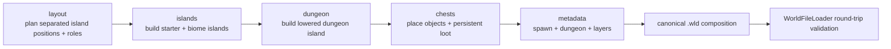
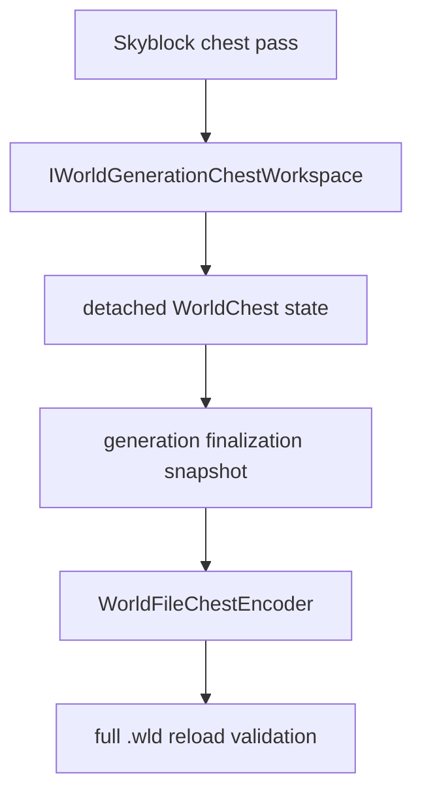

# Skyblock world generation

[Русский](../ru/skyblock-world-generation.md) · [World generation](world-generation.md) · [Documentation](README.md)

## 1. Scope

`terraruntime:skyblock` is a runtime-owned deterministic world generator for Terraria-compatible Skyblock worlds. Unlike the source-parity vanilla effort, this profile is intentionally custom: most of the map remains empty, progression space is distributed across floating islands, spawn is guaranteed to stand on the starter island, vertical underground/cavern layers are moved down, and a dedicated dungeon island is generated in the lower part of the world.

The generator is not a vanilla-secret-seed alias. Selecting `terraruntime:skyblock` always means the TerraRuntime Skyblock profile.

## 2. Pass graph

Every pass uses `IsolatedDeterministic` RNG. Its stream is derived from the world seed and stable pass ID, so unrelated later passes cannot silently perturb the existing island-layout stream.

## 3. Island field

The starter island is centered horizontally at about `$0.28H$`, where `$H$` is world height. It has a dirt surface and stone core.

The layout pass targets

$$
N = \operatorname{clamp}\left(\left\lfloor\frac{W}{70}\right\rfloor, 12, 120\right)
$$

additional islands for world width `$W$`. Candidate islands are rejected when their horizontal and vertical safety envelopes overlap an existing island. The lower dungeon envelope is reserved during layout as well, so ordinary islands cannot later be overwritten by dungeon construction. Generation fails closed if the requested field cannot be placed rather than silently publishing a materially smaller world.

Most islands occupy roughly `$0.14H \ldots 0.56H$`. Every sixth planned island is instead a cavern island drawn from the deeper `$0.66H \ldots 0.86H$` band.

## 4. Biome island roles

Surface islands rotate deterministically through Forest, Desert, Snow, Jungle and Evil roles. Coordinates and dimensions remain seed-driven, but the role cycle guarantees that even the minimum supported field contains progression-relevant terrain variety.

| Role | Surface | Body |
|---|---|---|
| Starter / Forest | Dirt | Stone |
| Desert | Sand | Sand |
| Snow | Snow Block | Ice Block |
| Jungle | Jungle Grass | Mud |
| Evil, Corruption | Corrupt Grass | Ebonstone |
| Evil, Crimson | Crimson Grass | Crimstone |
| Cavern | Stone | Stone |

The Evil role follows `WorldGenerationOptions.Evil`; a Crimson Skyblock does not also manufacture Corruption islands, and vice versa.

These tile identities are not community-table literals. `probe_tile_wall_definitions.py` checks their exact `Terraria.ID.TileID` constants against the pinned official TerrariaServer 1.4.5.8 assembly through the repository's ILSpy source-contract workflow. The source-contract workflow also verifies the canonical managed server SHA-256 before decompilation.

## 5. Spawn

Spawn points to an air tile immediately above the starter island's center, and generation tests require the tile directly below spawn to be solid. The starter chest is offset from the spawn column so the player cannot materialize inside the chest object.

## 6. Lowered underground and cavern layers

Skyblock deliberately postpones ordinary depth classification:

$$
\text{worldSurface} \approx 0.62H
$$

$$
\text{rockLayer} \approx 0.80H
$$

This leaves most of the floating-island field in sky/surface space and moves underground/cavern behavior toward the bottom of the map.

## 7. Dungeon island

The dungeon anchor is placed on a large lower stone island near one side of the world at approximately `$0.72H$`. The island contains an enclosed room backed by the source-pinned unsafe Blue Dungeon wall identity, and the runtime dungeon metadata anchor points to this lower structure.

This is a Skyblock dungeon structure, not a claim of source-exact vanilla `DungeonPass` output.

## 8. Generated chests

Skyblock extends the generation workspace through the optional `IWorldGenerationChestWorkspace` capability. A generator requests detached chests; it does not write raw `.wld` bytes.

Chest coordinates, duplicates, item stacks, prefixes and vanilla item ranges are validated before the chest enters the candidate. Fresh-world composition then writes those chests through the canonical chest encoder and reloads the resulting file before publication.

Current source-pinned loot intentionally uses only item identities already verified in TerraRuntime's TerrariaServer 1.4.5.8 catalog: Copper Pickaxe, Dirt Block, Gel and the rare Slime Staff.

## 9. Loot tiers

The starter chest contains a Copper Pickaxe, `$100$` Dirt Blocks and `$50$` Gel. Ordinary biome caches contain deterministic seed-derived Dirt/Gel quantities. Every seventh non-starter cache receives a Slime Staff. The lower dungeon cache contains a Slime Staff plus larger Dirt/Gel stacks.

Future loot expansion must add named item identities only after source verification. Numeric IDs copied from community tables must not become disguised source-backed constants.

## 10. tModLoader research

The design was informed by public tModLoader world-generation patterns, especially splitting layout, terrain/structure placement and chest population into distinct passes, and retaining important generated coordinates for later passes. No tModLoader or Calamity implementation code is copied into TerraRuntime.

## 11. Acceptance boundary

The dedicated Skyblock acceptance creates a canonical Small `$4200\times1200$` world through the normal TerraRuntime CLI, reloads it with TerraRuntime's world verifier, then starts the pinned official TerrariaServer 1.4.5.8 against that generated `.wld`. Focused generator tests separately verify deterministic layout, biome palettes, spawn support, lowered dungeon/layers, dungeon-reservation clearance and persistent chest round-tripping.

The profile still has deliberate expansion room for richer source-pinned loot, liquids/fishing islands, additional structures and progression-specific resources. Those enhancements do not weaken the existing deterministic world/persistence contract.
