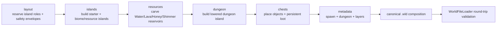
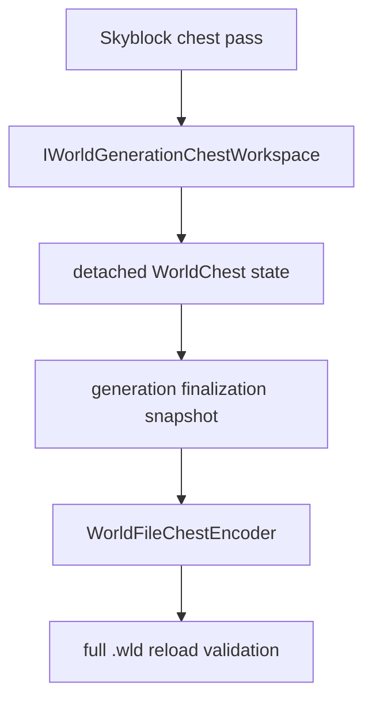
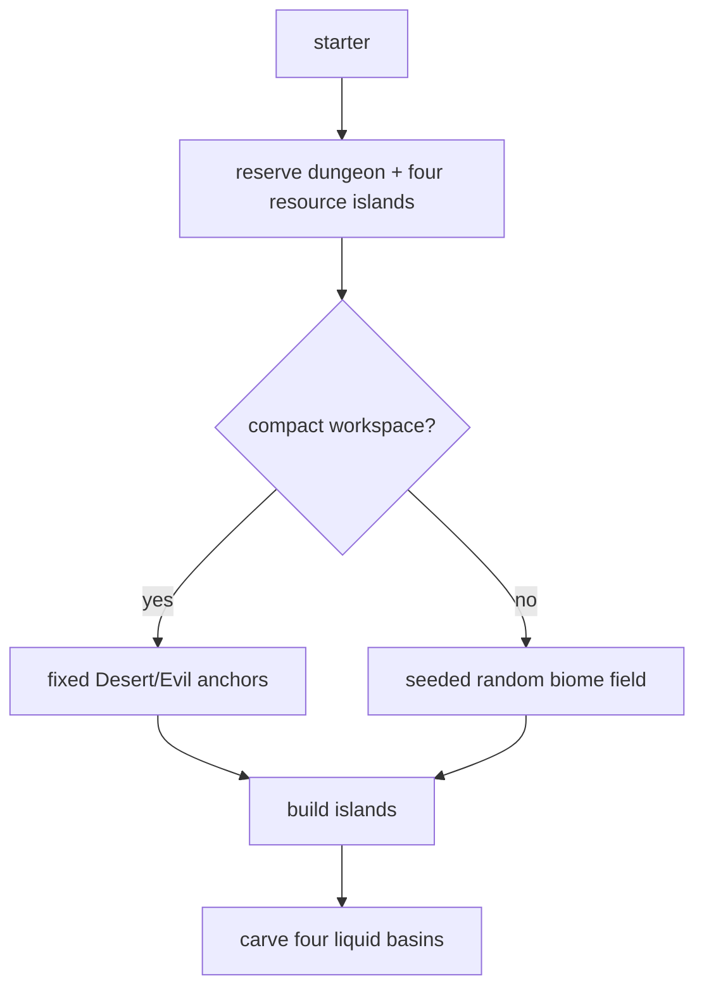

# Skyblock world generation

[Русский](../ru/skyblock-world-generation.md) · [World generation](world-generation.md) · [Documentation](README.md) · [Progression roadmap](../roadmap/skyblock-progression.md)

## 1. Scope

`terraruntime:skyblock` is a runtime-owned deterministic generator for Terraria-compatible Skyblock worlds. Most of the map remains empty, progression space is distributed across floating islands, spawn is guaranteed on a starter island, underground/cavern layers are moved downward, and a dedicated lower dungeon island is generated independently from the ordinary island field.

The profile is intentionally custom. It is not an alias for a vanilla secret seed and it does not claim source-exact output from Terraria's vanilla Skyblock generator.

## 2. Pass graph

Every pass uses `IsolatedDeterministic` RNG. Its stream is derived from the world seed and stable pass ID, so future unrelated passes cannot silently shift an existing pass's random stream.

## 3. Island layout

The starter island is centered horizontally at about `$0.28H$`, where `$H$` is world height. It has a Dirt surface and Stone core.

For ordinary worlds the random island field targets

$$
N = \operatorname{clamp}\left(\left\lfloor\frac{W}{70}\right\rfloor, 12, 120\right),
$$

where `$W$` is world width. Candidate islands are rejected when their safety envelopes intersect an already reserved island or the lower dungeon envelope. Generation fails closed if the requested field cannot be placed.

The generator also supports its documented minimum workspace of `$256\times160$`. Narrow or shallow worlds (`$W<512$` or `$H<220$`) use a compact deterministic layout instead of attempting to pack the normal random field into physically insufficient space. Compact layout still guarantees Forest/starter terrain, Desert, Snow, Jungle, Evil, Cavern and Aether roles.

Most ordinary random islands occupy approximately `$0.14H\ldots0.56H$`; every sixth random island is instead a Cavern island drawn from the deeper `$0.66H\ldots0.86H$` band.

## 4. Biome and resource roles

| Role | Surface | Body | Additional guarantee |
|---|---|---|---|
| Starter / Forest | Dirt | Stone | spawn support |
| Desert | Sand | Sand | guaranteed in compact layout |
| Snow | Snow Block | Ice Block | Water reservoir |
| Jungle | Jungle Grass | Mud | Honey reservoir |
| Evil, Corruption | Corrupt Grass | Ebonstone | follows world evil |
| Evil, Crimson | Crimson Grass | Crimstone | follows world evil |
| Cavern | Stone | Stone | Lava reservoir |
| Aether | Stone | Stone | Shimmer reservoir |

The Evil role follows `WorldGenerationOptions.Evil`; a Crimson Skyblock does not manufacture Corruption terrain and vice versa.

Named tile identities used by these palettes remain source-backed through TerraRuntime's pinned TerrariaServer 1.4.5.8 source-contract workflow. The progression-liquid work deliberately required no new guessed tile IDs.

## 5. Guaranteed progression liquids

The `resources` pass turns four reserved islands into deterministic liquid sources:

- Snow island: Water;
- Cavern island: Lava;
- Jungle island: Honey;
- Aether island: Shimmer.

Each source is a bounded basin carved into the center of its island. Basin cells are inactive tiles with full liquid amount and an explicit `WorldGenerationLiquidKind`; the surrounding island body supplies the retaining floor and walls. The pass therefore stays inside the existing normalized tile ABI and `.wld` liquid encoding path.

The dedicated Aether island is placed opposite the selected dungeon side. Water, Honey and Lava islands are reserved before the random field, so random placement can never consume their safety envelopes.

## 6. Spawn

Spawn points to an air tile immediately above the starter island center. Tests require the tile directly below spawn to be solid. The starter chest is offset from the spawn column so a player cannot materialize inside a multi-tile chest object.

## 7. Lowered underground and cavern layers

Skyblock deliberately postpones ordinary vertical depth classification:

$$
\text{worldSurface}\approx0.62H
$$

$$
\text{rockLayer}\approx0.80H
$$

This leaves most floating islands in sky/surface space and moves underground/cavern behavior toward the lower part of the map.

## 8. Dungeon island

The dungeon anchor is placed on a large Stone island near one side of the world at approximately `$0.72H$`. The island contains an enclosed room backed by the source-pinned unsafe Blue Dungeon wall identity, and runtime metadata points to this lower structure.

This remains a Skyblock progression structure, not source-exact vanilla `DungeonPass` output.

## 9. Generated chests

Skyblock uses the optional `IWorldGenerationChestWorkspace` capability. The generator requests detached chest state and never writes raw `.wld` bytes.

Chest coordinates, duplicate anchors, item stacks, prefixes and vanilla item ranges are validated before candidate publication. The starter chest currently contains a Copper Pickaxe, `$100$` Dirt Blocks and `$50$` Gel. Ordinary caches use deterministic Dirt/Gel quantities with the existing rare Slime Staff tier, and the lower dungeon cache carries an additional reserve.

Richer loot must continue to add named item identities only after source verification.

## 10. Determinism and failure semantics

Resource islands are reserved during layout, before random islands are accepted. The dungeon envelope is reserved at the same stage. This makes the layout dependency explicit:

If a reserved role cannot be placed without violating an envelope, generation fails instead of silently dropping that progression resource. Fixed-seed tests compare the resulting liquid footprint in addition to metadata and chest state.

## 11. tModLoader comparison and remaining progression work

Public Skyblock mods in the tModLoader ecosystem commonly solve more than terrain layout: they add renewable-resource paths, special structures, loot fallbacks, altered drops/events and sometimes separate mining or dungeon spaces. TerraRuntime intentionally keeps world generation and authoritative gameplay rules separate.

The current generator now covers deterministic island geometry plus the four vanilla liquid classes, but full Skyblock progression still needs source-backed structure/resource fallbacks and a runtime gameplay profile. Those tasks are tracked in [the dedicated Skyblock progression roadmap](../roadmap/skyblock-progression.md).

No tModLoader implementation code is copied into TerraRuntime.

## 12. Acceptance boundary

The dedicated Skyblock acceptance creates a canonical Small `$4200\times1200$` world through the normal TerraRuntime CLI, reloads it with TerraRuntime's verifier, then starts the pinned official TerrariaServer 1.4.5.8 against the generated `.wld`.

Focused tests additionally verify biome palettes, deterministic layout, compact minimum-world generation, spawn support, lowered dungeon/layers, dungeon reservation, persistent chest round-trip and persistence of Water/Lava/Honey/Shimmer through the normal world encoder/loader path.
