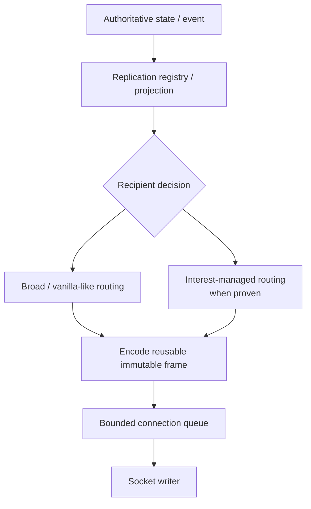
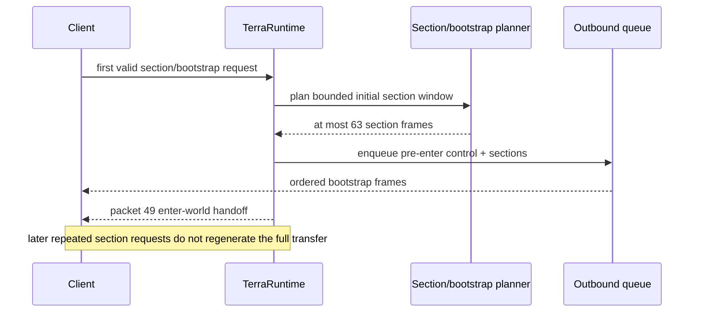
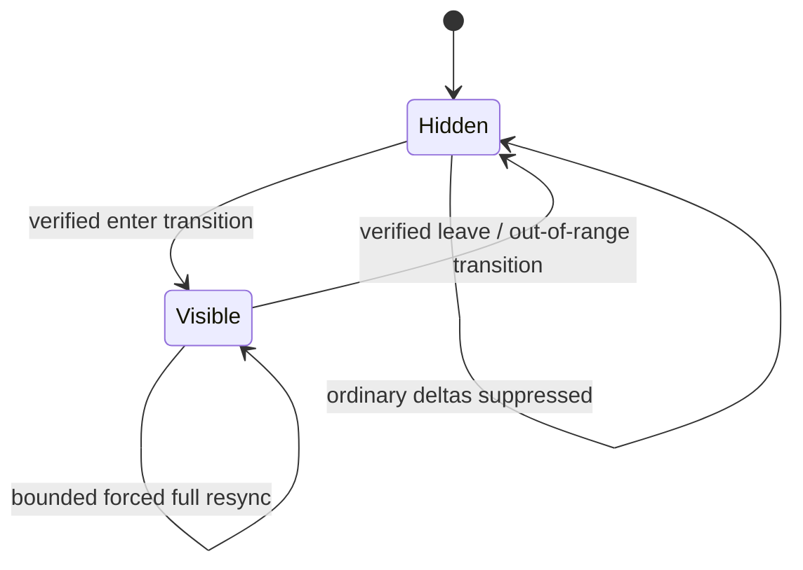
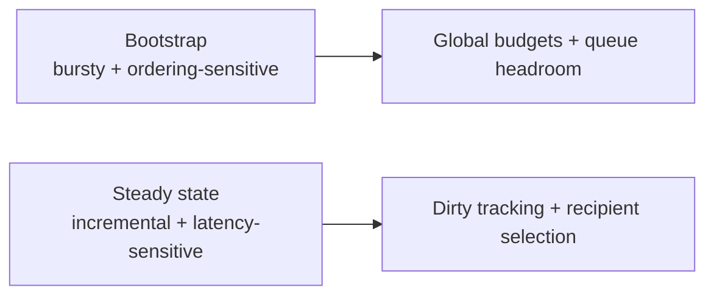

# Synchronization, bootstrap and interest management

[Русский](../ru/synchronization.md) · [Documentation](README.md) · [Architecture](architecture.md) · [Performance roadmap](../roadmap/performance-tick-stability.md)

## 1. Scope

Synchronization projects authoritative runtime state into per-client protocol `326` state. It includes join/bootstrap, sections, player/event fanout, NPC/projectile/world-item/object replication, recipient selection and future interest-management suppression/resync semantics.

Synchronization observes authoritative state/events; it does not own gameplay mutation.

## 2. High-level flow

Recipient selection never mutates the underlying entity merely to simplify replication.

## 3. Initial bootstrap

The exact packet order is protected by live official-world probes rather than frozen as a prose packet recipe.

## 4. Bootstrap frame budget

Current `PlayerBootstrapFrameBudget` proves:

$$
F_{\mathrm{sections,max}}=63,
\qquad
F_{\mathrm{pre49,max}}=65,
\qquad
F_{\mathrm{probe}}=96.
$$

For the default $P=8$ player capacity, `ConnectionOutboundQueueSizing` yields

$$
F_{\mathrm{queue}}(8)=4\,077\ \text{frames}.
$$

Therefore:

$$
65 < 96 < 4\,077.
$$

The historical larger pre-enter budget no longer describes production: runtime entity/global baselines are deliberately outside the final packet-10-to-packet-49 contract.

## 5. Sections

Section work must satisfy correctness, invalidation and bounded-cost constraints. A client must receive required world regions, stale encoded sections must be invalidated after mutation, and generation/compression of uncached sections must not monopolize a tick.

Join work therefore uses global subsystem budgets rather than multiplying a full expensive-work allowance by the number of joining players.

## 6. Replication registries

TerraRuntime separates authoritative storage from transport projection. Dedicated replication state/registries exist for player events/movement, NPCs, projectiles, world items, chests, signs and tile manipulation.

When identical bytes are genuinely recipient-independent, one immutable encoded frame should be shared among recipient queues. Recipient-specific identity, slot remapping or visibility data requires separate projection.

## 7. Interest-management ownership

Interest management belongs to TerraRuntime. External hosts receive only `IInterestManagementControl` with enable/disable control. Spatial layout, radii, hysteresis, transitions, forced resync and entity-specific policy remain internal.

## 8. Current spatial foundation

`RuntimeInterestRouter` owns a section-based player spatial index and visibility tracker when world dimensions are available.

Current default radii are

$$
r_{\mathrm{enter}}=3\ \text{sections},
\qquad
r_{\mathrm{leave}}=4\ \text{sections}.
$$

Because $r_{\mathrm{leave}}>r_{\mathrm{enter}}$, the policy has hysteresis and avoids boundary flicker.

Invalid/non-finite positions must not leave stale membership. Untrustworthy location data fails open.

## 9. Current suppression status

**State tracking exists, but the enabled default policy remains `PassthroughInterestPolicy`.** Enabling interest management therefore maintains ownership/spatial state but does not yet suppress player movement updates.

This is deliberate until enter/leave/full-state-on-entry, teleport/respawn, slot reuse, out-of-range behavior and bounded forced resynchronization are verified.

## 10. Visibility state model

`Hidden -> Visible` must send complete state required to begin observation. `Visible -> Hidden` must use verified Terraria semantics rather than an invented generic despawn.

## 11. Teleports, respawn and slot reuse

Spatial visibility must immediately handle discontinuous moves, respawn, disconnect/slot reuse, invalid-to-valid position changes and server-controlled player creation/despawn.

Generation-safe identities prevent stale visibility state from applying to a new entity that reused a numeric slot.

## 12. Movement scaling

Broad player-to-player movement fanout trends toward

$$
W(P)=\Theta(P^2),
$$

where $P$ is simultaneously active players. This makes movement an important interest-management target, but raw distance suppression is not acceptable without transition/resync proof.

## 13. Other dynamic entities

NPCs, projectiles and world items can use the same broad architecture only after their own first-observation, leave/despawn, re-entry, slot-reuse and global-update semantics are verified. Player visibility policy must not be copied blindly to other entity families.

## 14. Dirty-state replication

The target avoids scanning every entity for every client every tick when revision/event-driven work is possible.

## 15. Bootstrap versus steady state

Queue and budget decisions must be validated against both phases.

## 16. Slow clients

Synchronization ends at a bounded connection queue. A peer unable to drain outbound data becomes a local `SlowClient` problem rather than a reason to block authoritative simulation.

Interest management may reduce future queue pressure, but queue bounds remain mandatory.

## 17. Observability

Useful synchronization telemetry includes connection queue depth/high-water marks, slow-client disconnects, bootstrap frame count, deferred section work, spatial membership changes, invalid-position removals, visibility transitions, suppressed/relayed counts, forced resync and oldest pending synchronization work.

Telemetry remains bounded and avoids per-movement formatted-string churn.

## 18. Evidence

Evidence includes spatial-index/hysteresis tests, interest-control tests, bootstrap budget tests, entity bootstrap tests, replication-registry tests, real-process slow-client tests and live `Vanilla World Load` join/movement probes.

Once real suppression is enabled, live tests must prove both absence of hidden updates and complete correct state restoration on re-entry.

## 19. Current limitations

Still incomplete are production movement suppression, complete enter/leave outbound wiring, full-state-on-entry across entity types, forced-resync policy, generalized NPC/projectile/item routing, measurement-derived final radii/queue sizing and complete section-cache/per-client delivery accounting.

## 20. Change checklist

A synchronization change is incomplete unless authoritative and replication state remain separate, join work/queues are bounded globally, transition/resync behavior is tested before suppression, invalid state fails open, slot reuse cannot inherit stale visibility, protocol-sensitive transitions have live evidence, diagrams use Mermaid, dimensional quantities use LaTeX, and this page changes together with `docs/ru/synchronization.md`.
