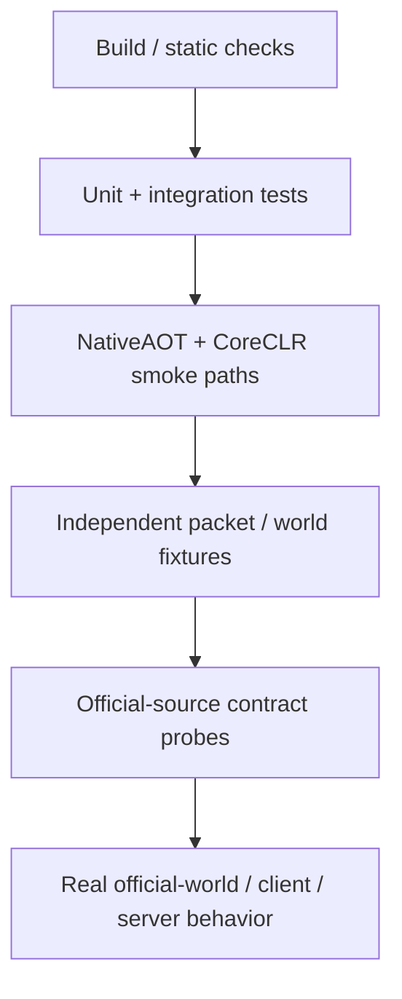
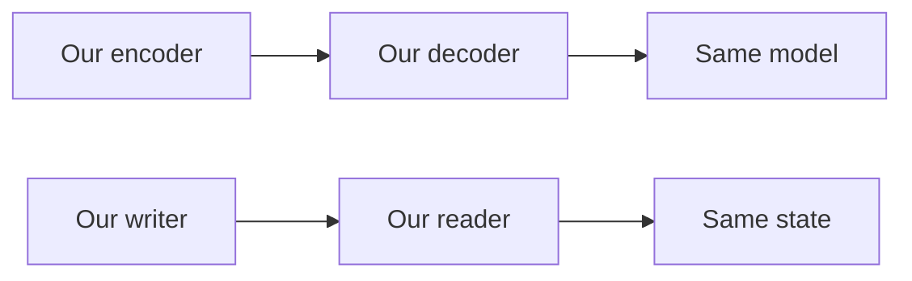
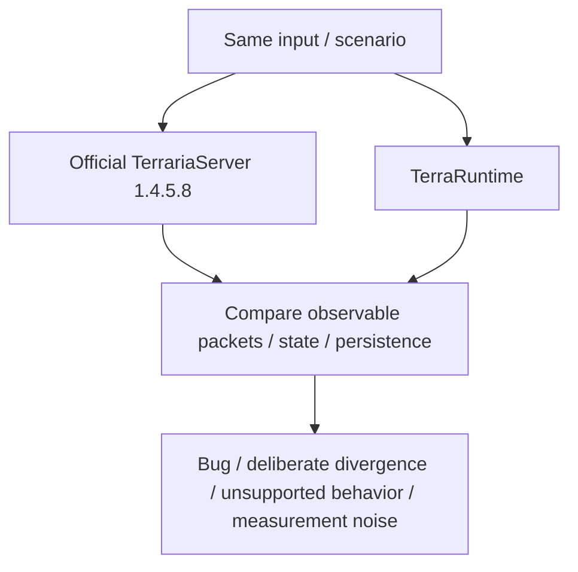

# Testing, verification and evidence

[Русский](../ru/testing-evidence.md) · [Documentation](README.md) · [Reference policy](../reference-policy.md) · [Roadmap](../roadmap.md)

## 1. Why this guide exists

TerraRuntime reconstructs observable TerrariaServer 1.4.5.8 behavior without copying its internal architecture. A green unit-test suite is necessary, but it is not proof of vanilla parity by itself.

Higher evidence layers are required whenever a lower layer can share the same wrong assumption as the implementation under test.

## 2. Source hierarchy

When sources disagree, use this order:

1. locally decompiled official `TerrariaServer.exe` 1.4.5.8 for gameplay behavior, `.wld` layout, ordering, constants and server semantics;
2. `VegaKernel/Multiplicity` 3.0.x for protocol 326 typed wire models;
3. `bybrooklyn/terrustia` as an independent implementation cross-check and source of testing/performance ideas;
4. TShock/OTAPI only for historical compatibility and exploit lessons.

Secondary implementations never override verified current official behavior. Decompiled source remains local reference material and copied method bodies, game assets or game text must not be committed.

## 3. Roadmap checkbox policy

A roadmap `[x]` means the claim is verified on `main` by implementation plus tests/CI or equivalent executable proof.

A type/interface existing, a successful compile, a stub, a self-round-trip, an incomplete architectural layer or code that merely resembles decompiled source is not enough. Foundation-only work remains `[ ]`.

## 4. Build and test baseline

The main CI baseline covers bilingual documentation structure/link validation, .NET 11 restore, Release build/analyzers, `TerraRuntime.Tests`, authoritative loop smoke, protocol smoke, network smoke, world smoke and Terminal UI smoke.

A failure blocks the basic implementation baseline. A pass does not automatically prove vanilla compatibility for behavior-sensitive work.

## 5. Dual-host runtime gates

TerraRuntime verifies both shipping profiles.

**NativeAOT standalone:** Linux x64 and Windows x64 native artifacts are published, validated for the intended runnable layout/native sidecars, then exercised from the published directory through loop/protocol/network/world/TUI smoke paths.

**CoreCLR extensible:** self-contained Linux x64 and Windows x64 hosts are published; a drop-in trusted host-module fixture is installed and exercised through the extensible-host smoke path.

This protects the rule that runtime core remains AOT-compatible while the managed profile can explicitly load trusted host modules.

## 6. Regression tests must detect the regression

A bug-fix test is useful only if it distinguishes broken behavior from fixed behavior. For non-trivial fixes, verify that the test fails when the fix is removed, the old behavior is restored or the wrong constant/order/path is reintroduced.

A test that passes before and after the fix proves almost nothing about the bug.

## 7. Self-round-trip limitation

Protocol and persistence code are especially vulnerable to false confidence from self-round-trips.

Both sides can implement the same wrong layout and still pass. Round-trip tests are useful for internal consistency, while wire/file compatibility requires independent evidence.

## 8. Golden bytes and independent fixtures

Critical packet layouts should be pinned to independently known-good evidence where practical: official client/server captures, official-server `.wld` files, independently derived header/section values and failure artifacts from live workflows.

The expected data must not come from the same code path being tested.

## 9. Official-source contract workflows

Dedicated repository workflows exercise narrow TerrariaServer 1.4.5.8 contracts under the reference policy, including source/reference probes, tile protocol/framing, dirt/stone mutations, projectile/NPC behavior, signs/chests and world generation/load/save slices.

A contract workflow should be narrow enough that failure identifies a concrete rule rather than becoming a long black-box integration mystery.

## 10. Live official-world verification

The `Vanilla World Load` family can generate an official world and exercise TerraRuntime against that artifact. Current end-to-end coverage includes world verification/loading, join/bootstrap, movement relay, selected chest/sign behavior, warm runtime-snapshot startup, canonical checkpoint restore/export and startup/cache evidence.

An official-world artifact is stronger than a synthetic world generated by the implementation under test.

## 11. Differential behavior

When exact output or ordering matters, use the same scenario against both implementations:

Useful targets include packet sequences, world mutations, AI transitions, projectiles, drops and persistence effects.

## 12. Network and process tests

In-process tests can hide OS scheduling, socket backpressure and process-lifecycle behavior. Real process/socket tests are preferred for slow readers, admission churn, join bursts, queue saturation, `SIGTERM`, malformed traffic followed by a valid connection, and save behavior around connection failure.

## 13. Malformed input and fuzzing

Trust-boundary tests should prove bounded failure. Important targets include framing, variable-length packet decoders, section/tile input, `.wld` parsing and command/text parsing.

A strong adversarial test proves both that malformed input cannot crash/create unbounded allocation or work and that the server remains healthy enough to process a valid operation afterward.

The permanent broad fuzz corpus remains incomplete.

## 14. Persistence evidence

Persistence changes may require official `.wld` inputs, preserved-section byte checks, interrupted/failed save recovery, atomic publication checks, runtime-cache corruption fallback, cold/warm startup comparison, live chest/sign/tile persistence and reload verification from the resulting canonical checkpoint.

Unknown/newer layouts fail conservatively instead of receiving green tests through guessed offsets.

## 15. Gameplay and RNG evidence

Gameplay parity is proved subsystem by subsystem with deterministic state-transition tests, verified catalogs/defaults, generation-safe slot-reuse tests, collision/world-query tests, replication tests, official-source AI/default probes and real client/server behavior for ordering-sensitive interactions.

NPC AI, loot and world generation may depend on RNG call order, not merely distributions. Preserve RNG consumption order, avoid parallelism that changes it, use deterministic scenarios and compare against official behavior where possible.

## 16. Performance evidence

Performance claims require before/after measurement on the same hardware/environment, world and workload.

Relevant metrics can include wall/CPU time, allocation rate, GC counts/pauses, queue depth/backlog age, throughput, RSS/working set and latency percentiles such as $p_{50}$, $p_{95}$ and $p_{99}$.

Do not merge an optimization merely because it should be faster.

## 17. CPU time versus wall time

A large wall-time spike with low authoritative-thread CPU can indicate scheduler/OS contention rather than expensive simulation. Timing data from incompatible clocks or workloads is not comparable evidence.

## 18. Production-like scale matrix

Useful connection/player checkpoints include

$$
P\in\{1,8,24,64,128,255\}.
$$

$P=24$ is a realistic optimization baseline; $P=255$ is a stress/scalability target. Neither replaces idle, normal-play, join-burst, slow-reader and persistence workloads.

## 19. Failure artifacts

Live/reference failures should upload small artifacts that answer what happened: packet-sequence summary, expected/observed counters, selected bytes/metadata, startup profile, world/checkpoint identity, typed stop/rejection reason and bounded logs.

Artifacts must not include copied copyrighted decompiled source or unnecessary large game assets.

## 20. CI cancellation and concurrent main work

Main CI uses concurrency cancellation. A run can be `cancelled` because a newer push superseded it; that is not a test failure. Pending/queued is not green either.

Status claims must refer to the workflow run for the exact current SHA.

## 21. Documentation validation

`tools/ci/check_documentation.py` verifies mirrored RU/EN page sets, required baseline pages and valid repository-local relative Markdown links that do not escape the repository root.

It does not prove semantic translation equivalence; factual RU/EN parity still requires review.

## 22. Evidence strength must match the claim

| Claim | Minimum useful evidence |
|---|---|
| Interface exists | code + API tests may be sufficient |
| Packet bytes match Terraria | independent bytes / live reference |
| World saves safely | real world + recovery / reload evidence |
| AI matches vanilla | state tests + official behavior reference |
| Optimization improves performance | reproducible before/after measurement |
| NativeAOT deployable | publish + execute published artifact |

## 23. Change checklist

A test/evidence change is incomplete unless the test can fail on the regression it claims to guard, compatibility expectations are independent where required, the official reference version is pinned, local decompile material is not committed, process/socket risks are tested at the correct layer, performance claims carry reproducible measurements, roadmap checkboxes reflect evidence rather than optimism, diagrams use Mermaid, measured quantities use LaTeX where applicable, and this page changes together with `docs/ru/testing-evidence.md`.
